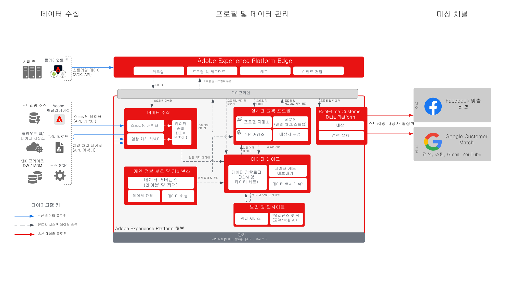

# Social 및 Advertising 대상으로 Audience Activation

>[!TIP]
>이 블루프린트는 Audience Building &amp; Activation에서 [사용 사례 패턴](/help/blueprints/use-case-patterns/audience-building-activation/audience-activation-to-destinations.md)으로도 사용할 수 있습니다.

여러 소스에서 고객 데이터를 수집하여 고객에 대한 단일 프로필 보기를 작성합니다. 이러한 프로필을 마케팅 및 개인화를 위해 구축된 대상자로 세그먼트화하고, 이러한 대상자를 Facebook 및 Google과 같은 광고 네트워크에 공유하여 해당 대상자에 대해 캠페인을 타깃팅 및 개인화할 수 있습니다.

## 사용 사례

* 소셜 및 광고 대상의 알려진 대상자 타겟팅
* 온라인 및 오프라인 속성을 활용한 온라인 개인화

## 애플리케이션

* Real-time Customer Data Platform

## 아키텍처

## 가드레일

[프로필 및 세그멘테이션 보호](https://experienceleague.adobe.com/docs/experience-platform/profile/guardrails.html?lang=ko)

## 관련 설명서

Facebook 맞춤 타겟 활성화 - [대상 구성](https://experienceleague.adobe.com/docs/experience-platform/destinations/catalog/social/facebook.html?lang=ko)

Google Customer Match 활성화 - [대상 구성](https://experienceleague.adobe.com/docs/experience-platform/destinations/catalog/advertising/google-customer-match.html?lang=ko)