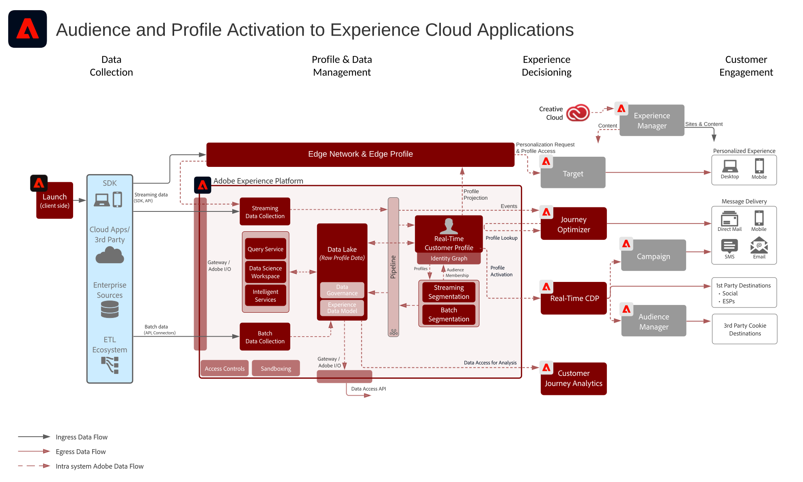

# Experience Cloud 애플리케이션을 사용한 고객 및 프로필 활성화

Experience Platform에서 프로파일과 대상을 관리하고 Experience Cloud 애플리케이션과 공유할 수 있습니다. Experience Platform에서 풍부한 고객 세그먼트와 인사이트를 구축 및 공유하고 Experience Cloud 애플리케이션과 공유할 수 있습니다.

## 사용 사례

* 소셜 및 광고 대상의 알려진 대상자 타겟팅

## 애플리케이션

* Adobe Experience Platform
* [!UICONTROL Real-time Customer Data Platform]
* Experience Platform 활성화
* Experience Cloud 애플리케이션

## 아키텍처

### Experience Cloud 애플리케이션을 사용한 고객 및 프로필 활성화

 

## 가드레일

대상 및 프로필 활성화 개요 페이지에 나와 있는 지침을 참조하십시오. [LINK](overview.md)

## 관련 설명서

* [Real-time Customer Data Platform 제품 설명 ](https://helpx.adobe.com/kr/legal/product-descriptions/real-time-customer-data-platform.html)
* [프로필 및 세그멘테이션 지침](https://experienceleague.adobe.com/docs/experience-platform/profile/guardrails.html?lang=ko)
* [세분화 설명서](https://experienceleague.adobe.com/docs/experience-platform/segmentation/api/streaming-segmentation.html?lang=ko)
* [대상 설명서](https://experienceleague.adobe.com/docs/experience-platform/destinations/catalog/overview.html?lang=ko)

## 관련 비디오 및 튜토리얼

* [Real-time Customer Data Platform 개요 ](https://experienceleague.adobe.com/docs/platform-learn/tutorials/application-services/rtcdp/understanding-the-real-time-customer-data-platform.html?lang=ko)
* [[!UICONTROL Real-time Customer Data Platform 데모]](https://experienceleague.adobe.com/docs/platform-learn/tutorials/application-services/rtcdp/demo.html?lang=ko)
* [세그먼트 만들기](https://experienceleague.adobe.com/docs/platform-learn/tutorials/segments/create-segments.html?lang=ko)
