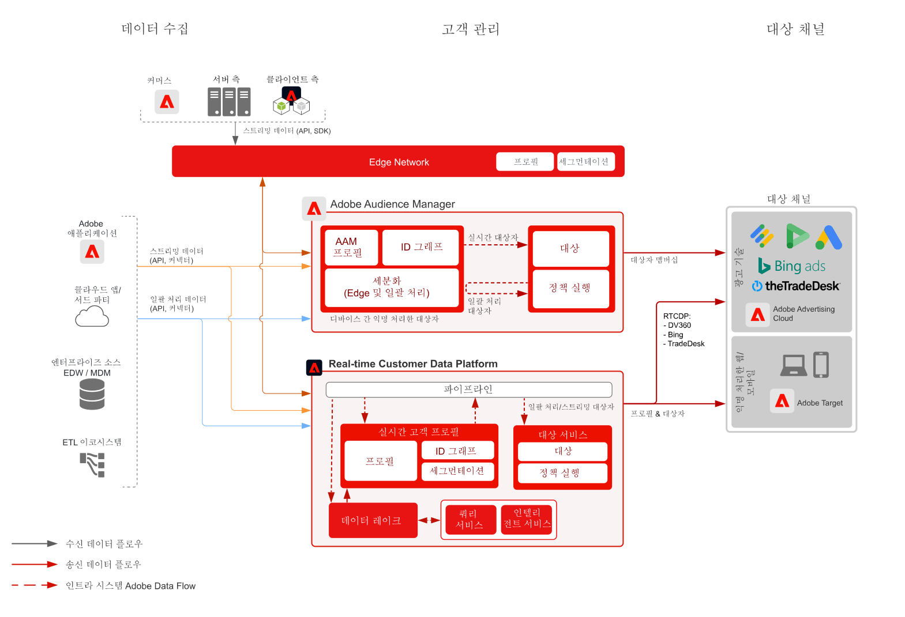

# 익명 대상자 활성화 블루프린트

익명의 대상 활성화는 익명의 장치 및 행동 데이터를 기반으로 웹, 모바일 및 광고 채널을 통해 대상을 타겟팅하고 개인화하는 기능입니다.

## 사용 사례

* 웹 사이트, 모바일 앱 또는 지원되는 광고 채널에서 익명의 디지털 대상자에 대한 타겟팅 및 개인화를 수행합니다.
* 알려진 디바이스 및 행동 특성을 기반으로 랜딩 페이지 및 사전 인증 경험을 최적화합니다.
* Audience Manager 서드파티 데이터 네트워크를 활용하여 타겟팅을 위해 대상자를 개선 및 확장합니다.

## 애플리케이션

* Audience Manager
* Real-time Customer Data Platform   

온사이트 및 광고 대상에 대한 익명 대상자 활성화에는 Audience Manager와 Real-time Customer Data Platform 모두 활용할 수 있습니다. 단, Real-time Customer Data Platform의 경우 광고 대상 중 [대상 설명서](https://experienceleague.adobe.com/docs/experience-platform/destinations/catalog/advertising/overview.html?lang=ko)에서 설명하는 익명 디바이스 식별자가 있는 일부만 지원합니다.

 익명 디바이스 기반 타겟팅을 지원하는 기본 Real-time Customer Data Platform 광고 대상에는 Microsoft Bing, Google DV360, TradeDesk가 있습니다. 이 외에도 Real-time Customer Data Platform은 [대상 설명서](https://experienceleague.adobe.com/docs/experience-platform/destinations/catalog/advertising/overview.html?lang=en)에서 언급하고 [알려진 고객 활성화 블루프린트](https://experienceleague.adobe.com/docs/blueprints-learn/architecture/audience-activation/known-customer-audience-activation/known.html?lang=ko)에서 설명하는 수많은 알려진 고객 기반 대상을 지원합니다.

## 아키텍처

 

## Audience Manager 구현 단계

* Audience Manager 구현에 대한 자세한 내용은 다음 [설명서](https://experienceleague.adobe.com/docs/audience-manager/user-guide/implementation-integration-guides/implement-audience-manager.html?lang=ko)를 참조하세요.

## Real-time Customer Data Platform 구현 단계

* Real-time Customer Data Platform의 구현 단계는 다음 [설명서](https://experienceleague.adobe.com/docs/blueprints-learn/architecture/audience-activation/known-customer-audience-activation/known.html)를 참조하세요.

## 관련 설명서

* [Audience Manager](https://experienceleague.adobe.com/docs/audience-manager.html?lang=ko)
* [Experience Cloud [!UICONTROL 대상]](https://experienceleague.adobe.com/docs/core-services/interface/audiences/audience-library.html?lang=ko)
* [Audience Manager와 Target 통합](https://experienceleague.adobe.com/docs/audience-manager/user-guide/implementation-integration-guides/integration-other-solutions/aam-target-integration.html?lang=ko)
* [Adobe Analytics 세그먼트를 Audience Manager를 통해 공유](https://experienceleague.adobe.com/docs/analytics/components/segmentation/segmentation-workflow/seg-publish.html?lang=ko)
* [알려진 고객 활성화 블루프린트](https://experienceleague.adobe.com/docs/blueprints-learn/architecture/audience-activation/known-customer-audience-activation/known.html).
* [Real-time Customer Data Platform](https://experienceleague.adobe.com/docs/experience-platform/rtcdp/overview.html?lang=ko)
