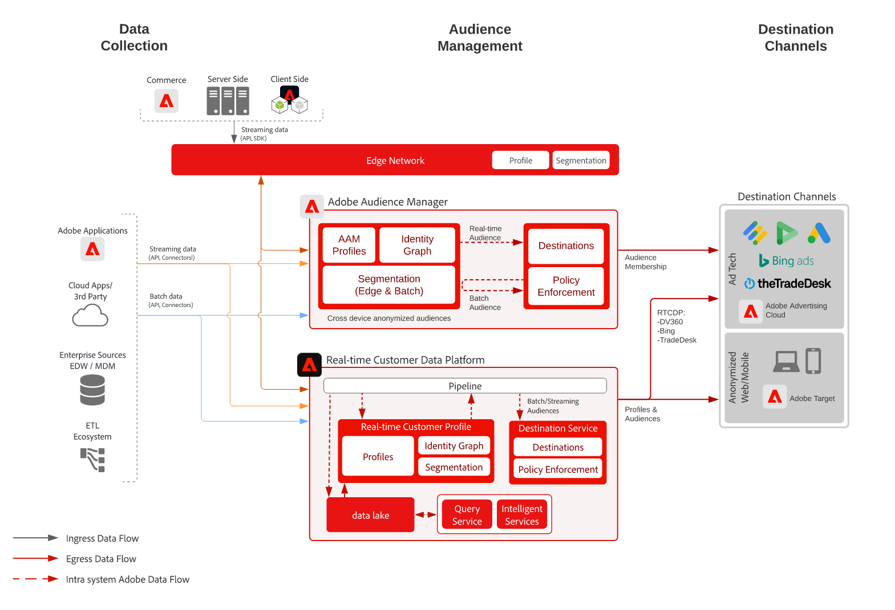

# 장치 기반 - Audience Manager을 사용한 익명 대상 타깃팅

>[!TIP]
>이 블루프린트는 Personalization에서 [사용 사례 패턴](/help/blueprints/use-case-patterns/personalization/anonymous-visitor-web-personalization.md)(으)로도 사용할 수 있습니다.

익명 대상자 활성화는 익명의 디바이스 및 행동 데이터를 기반으로 웹, 모바일, 광고 채널 전반에 걸쳐 대상자를 타겟팅하고 대상자에 맞추어 개인화하는 기능입니다.

## 사용 사례

* 웹 사이트, 모바일 앱 또는 지원되는 광고 채널에서 익명의 디지털 대상자에 대한 타겟팅 및 개인화를 수행합니다.
* 알려진 디바이스 및 행동 특성을 기반으로 랜딩 페이지 및 사전 인증 경험을 최적화합니다.
* Audience Manager 서드파티 데이터 네트워크를 활용하여 타겟팅을 위해 대상자를 개선 및 확장합니다.

## 애플리케이션

* Audience Manager
* Real-time Customer Data Platform

온사이트 및 광고 대상에 대한 익명 대상자 활성화에는 Audience Manager와 Real-time Customer Data Platform 모두 활용할 수 있습니다. 단, Real-time Customer Data Platform의 경우 광고 대상 중 [대상 설명서](https://experienceleague.adobe.com/docs/experience-platform/destinations/catalog/advertising/overview.html?lang=ko)에서 설명하는 익명 디바이스 식별자가 있는 일부만 지원합니다.

## 아키텍처

 

## Audience Manager 구현 단계

* Audience Manager 구현에 대한 자세한 내용은 다음 [설명서](https://experienceleague.adobe.com/docs/audience-manager/user-guide/implementation-integration-guides/implement-audience-manager.html?lang=ko)를 참조하세요.