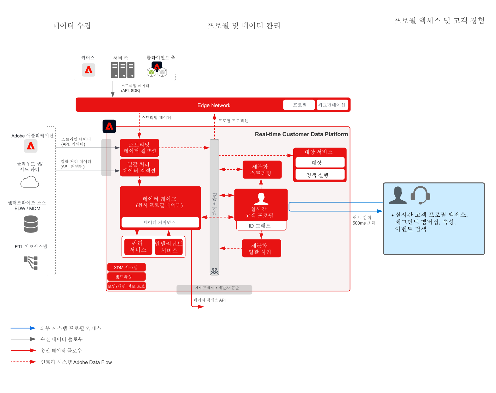

# 고객 활동 허브 블루프린트

고객 활동 허브 블루프린트에서는 외부 애플리케이션에서 Adobe Experience Platform의 [!UICONTROL Real-time Customer Profile]에 액세스하는 방법을 보여 줍니다.

외부 애플리케이션은 API GET 요청을 통해 프로파일에 액세스할 수 있습니다. 이렇게 하면 해당 프로필 내에 저장된 속성, 이벤트, 세그먼트 멤버십 및 모델 기반 특성을 해당 Adobe 외부 애플리케이션에서 사용할 수 있습니다.

이를 통해 고객의 콜센터 문의에 대해 풍부한 맥락을 표면화할 수 있습니다. 예를 들면 지원 담당자가 고객의 생애 가치, 이탈 경향 또는 어떤 마케팅 캠페인에 노출되었는지 등을 확인할 수 있습니다. 영업 담당자도 고객에 대해 맥락 또는 인사이트를 얻어 활용할 수 있습니다.

>[!NOTE]
>
>프로필 확인 API에서 현재 제공하는 대기 시간은 약 500ms이므로, 이 방법은 해당 프로필을 동일 페이지 웹 또는 모바일 개인화 등의 실시간 의사결정 엔진과 통합하기에는 적합하지 않습니다.

## 사용 사례

* 지원 및 영업 경험 등 직원이 관여하는 상호 작용에 대해 보다 자세한 고객의 맥락을 제공합니다. Experience Platform에서 프로필 확인 기능을 사용하면 담당자가 소비자에 대해 실시간 고객 프로필에 저장된 최근 구매, 캠페인 상호 작용, 성향, 대상자 멤버십 및 기타 속성과 인사이트 등 더 많은 맥락을 확인할 수 있습니다.

## 아키텍처

## 가드레일

* [Real-time Customer Profile 데이터에 적용되는 가드레일](https://experienceleague.adobe.com/docs/experience-platform/profile/guardrails.html?lang=ko)

## 구현 단계

1. 데이터 세트 및 스키마를 구성합니다.
1. [!UICONTROL 실시간 고객 프로필] 구성:[!UICONTROL 실시간 고객 프로필]에 대한 스키마 및 데이터 집합을 구성하고 병합 정책 및 ID를 설정합니다.
1. Platform으로 데이터를 수집하여 [!UICONTROL Real-time Customer Profile]로 처리합니다.
1. 항목 API를 사용하여 프로필 속성을 확인합니다. 기록 항목 또는 경험 이벤트 항목에서 가져올 수 있습니다.

## 관련 설명서

* [Adobe Experience Platform Activation 제품 설명](https://helpx.adobe.com/kr/legal/product-descriptions/adobe-experience-platform0.html)
* [Real-time Customer Profile 설명서](https://experienceleague.adobe.com/docs/experience-platform/profile/home.html?lang=ko)
* [프로필 가드레일](https://experienceleague.adobe.com/docs/experience-platform/profile/guardrails.html)
* [프로필 확인 API](https://www.adobe.io/apis/experienceplatform/home/api-reference.html)
