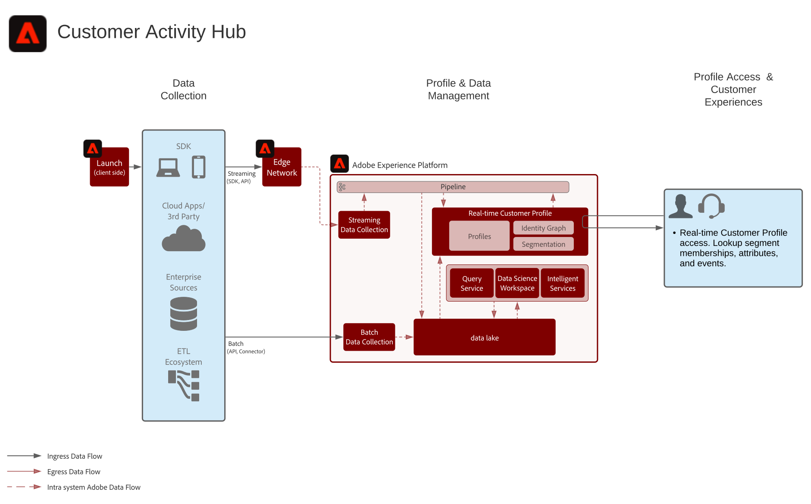

# 고객 활동 허브 블루프린트

고객 활동 허브 블루프린트는 외부 애플리케이션이 Adobe Experience Platform의 실시간 고객 프로파일에 액세스하는 방법을 보여줍니다.

외부 애플리케이션은 API GET 요청을 통해 실시간 고객 프로파일에 액세스할 수 있습니다. 프로필에 저장된 속성, 이벤트, 세그먼트 멤버십 및 모델 기반 기능을 Adobe이 아닌 외부 애플리케이션에서 사용할 수 있습니다.

이 기능을 사용하면 고객이 콜센터에 전화할 때 상황에 맞는 다양한 정보를 제공할 수 있습니다. 예를 들어 지원 담당자는 고객의 라이프타임 가치, 이탈률 또는 마케팅 캠페인에 대한 노출 경향을 파악할 수 있습니다. 또한 세일즈 담당자는 고객에 대한 보다 자세한 상황 또는 통찰력을 얻을 수 있습니다.

>[!NOTE]
>
>프로필 조회 API에서 지원하는 현재 지연은 약 500밀리초이며, 이 접근 방법은 동일한 페이지 웹 또는 모바일 개인화와 같은 실시간 의사 결정 엔진과 프로필을 통합하는 데 적합하지 않습니다.

## 사용 사례

* 지원 및 판매 경험과 같이 에이전트가 지원하는 인터랙션에 보다 심층적인 소비자 컨텍스트를 제공할 수 있습니다. Experience Platform에 대한 프로필 조회를 사용하여 상담원은 최근 구매, 캠페인 상호 작용, 속성, 고객 멤버십 및 실시간 고객 프로필에 저장된 기타 특성과 인사이트와 같은 소비자에 대한 컨텍스트를 받을 수 있습니다.

## 아키텍처

## 가드레일

* [실시간 고객 프로필 데이터 보증](https://experienceleague.adobe.com/docs/experience-platform/profile/guardrails.html)

## 구현 단계

1. 데이터 집합 및 스키마를 구성합니다.
1. [!UICONTROL 실시간 고객 프로필 ] 구성:[!UICONTROL 실시간 고객 프로필]에 대한 스키마 및 데이터 집합을 구성하고 병합 정책 및 ID를 설정합니다.
1. 데이터를 플랫폼에 인제스트하여 [!UICONTROL 실시간 고객 프로필]에 처리합니다.
1. 개체 API를 사용하여 레코드 엔티티 또는 경험 이벤트 엔티티에서 프로필 속성을 조회합니다.

## 관련 설명서

* [Adobe Experience Platform 정품 인증 제품 설명](https://helpx.adobe.com/legal/product-descriptions/adobe-experience-platform0.html)
* [실시간 고객 프로필 설명서](https://experienceleague.adobe.com/docs/experience-platform/profile/home.html?lang=en)
* [프로필 가드레일](https://experienceleague.adobe.com/docs/experience-platform/profile/guardrails.html)
* [프로필 조회 API](https://www.adobe.io/apis/experienceplatform/home/api-reference.html)
