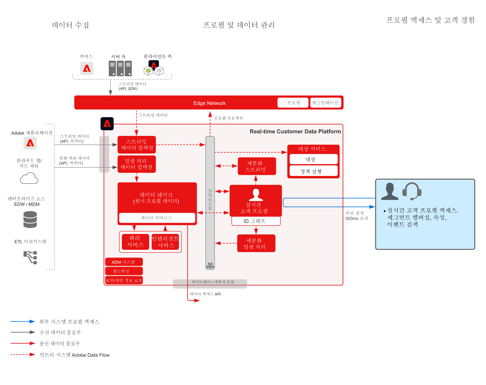

# 지원 및 판매 시나리오를 위한 실시간 프로필 액세스

>[!TIP]
>이 블루프린트는 Audience Building &amp; Activation에서 [사용 사례 패턴](/help/blueprints/use-case-patterns/audience-building-activation/real-time-profile-lookup.md)으로도 사용할 수 있습니다.

지원 및 판매 시나리오를 위한 실시간 프로필 액세스 블루프린트는 외부 애플리케이션이 Adobe Experience Platform의 [!UICONTROL 실시간 고객 프로필]에 액세스하는 방법을 보여 줍니다.

외부 애플리케이션에서는 API GET 요청을 통해 프로필에 액세스할 수 있습니다. 이렇게 하면 해당 프로필 내에 저장된 속성, 이벤트, 세그먼트 멤버십 및 모델 기반 특성을 해당 Adobe 외부 애플리케이션에서 사용할 수 있습니다.

이를 통해 고객의 콜센터 문의에 대해 풍부한 맥락을 표면화할 수 있습니다. 예를 들면 지원 담당자가 고객의 생애 가치, 이탈 경향 또는 어떤 마케팅 캠페인에 노출되었는지 등을 확인할 수 있습니다. 영업 담당자도 고객에 대해 맥락 또는 인사이트를 얻어 활용할 수 있습니다.

>[!NOTE]
>
>허브에서의 프로필 조회는 웹/모바일 인바운드 개인화와 같이 높은 처리량, 짧은 지연 사용 사례를 위한 것이 아닙니다. 허브에 대한 프로필 조회는 에이전트 지원 지원 또는 판매 상호 작용과 같은 지연 시간이 짧은 시나리오를 위한 것입니다. 웹/모바일 개인화 또는 실시간 오퍼 의사 결정과 같이 지연 시간이 짧고 처리량이 많은 시나리오의 경우 Edge 프로필을 활용해야 합니다. Edge 프로필을 사용하면 Real-time Customer Data Platform의 [사용자 지정 Personalization 연결](https://experienceleague.adobe.com/ko/docs/experience-platform/destinations/catalog/personalization/custom-personalization)을 통해 실시간으로 액세스할 수 있습니다.

## 사용 사례

* 지원 및 영업 경험 등 직원이 관여하는 상호 작용에 대해 보다 자세한 고객의 맥락을 제공합니다. Experience Platform에서 프로필 확인 기능을 사용하면 담당자가 소비자에 대해 실시간 고객 프로필에 저장된 최근 구매, 캠페인 상호 작용, 성향, 대상자 멤버십 및 기타 속성과 인사이트 등 더 많은 맥락을 확인할 수 있습니다.

## 아키텍처

## 가드레일

* [[!UICONTROL 실시간 고객 프로필] 데이터의 보호 기능](https://experienceleague.adobe.com/docs/experience-platform/profile/guardrails.html?lang=ko)

## 관련 설명서

* [Adobe Experience Platform Activation 제품 설명](https://helpx.adobe.com/kr/legal/product-descriptions/adobe-experience-platform0.html)
* [[!UICONTROL 실시간 고객 프로필] 설명서](https://experienceleague.adobe.com/docs/experience-platform/profile/home.html?lang=ko)
* [프로필 보호](https://experienceleague.adobe.com/docs/experience-platform/profile/guardrails.html?lang=ko)
* [프로필 조회 API](https://www.adobe.io/apis/experienceplatform/home/api-reference.html)
