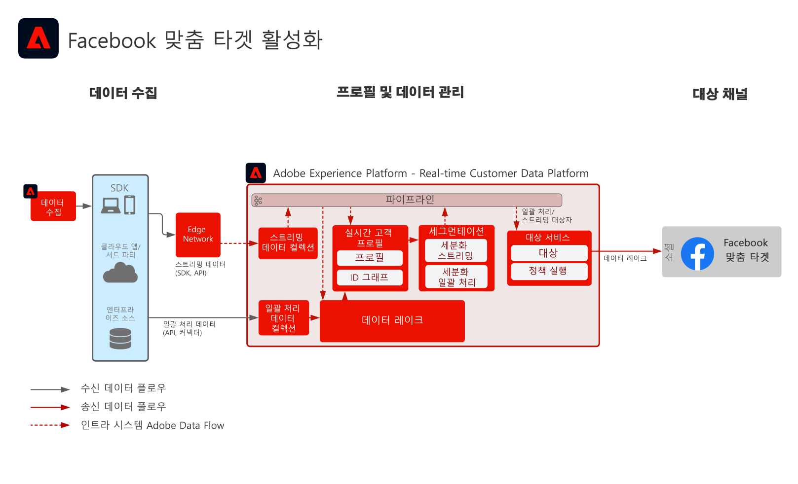

# Facebook 맞춤 타겟 활성화

여러 소스에서 고객 데이터를 수집하여 고객에 대한 단일 프로필 보기를 작성하고, 이 프로필을 세그먼트로 만들어 마케팅과 개인화를 위한 대상자를 작성한 다음, 이 대상자를 Facebook 등 소셜 광고 네트워크에 공유하여 해당 대상자에 대한 타겟팅 및 개인화 캠페인을 수행할 수 있습니다.

## 사용 사례

* 소셜 및 광고 대상의 알려진 대상자 타겟팅
* 온라인 및 오프라인 특성을 활용한 온라인 개인화

## 애플리케이션

* Real-time Customer Data Platform   

## 아키텍처

## 구현 단계

1. [프로필]의 데이터 소스에서 사용할 [ID 네임스페이스]를 구성합니다.
   * 가능한 경우 Email, Email SHA256 Hash 등 기본 제공 네임스페이스를 사용합니다.
   * Facebook에는 지원 ID 목록이 있습니다. Facebook 맞춤 타겟을 활성화하려면 활성화할 프로필에 지원 ID 중 하나가 있어야 합니다.
   * 현재 Facebook에서 지원하는 ID에는 GAID, IDFA, phone_sha256, email_lc_sha256, extern_id가 있습니다.
   * 자세한 내용은 [Facebook 대상 안내서](https://experienceleague.adobe.com/docs/experience-platform/destinations/catalog/social/facebook.html?lang=ko)를 참조하세요.
   * 해당 ID에 기본 제공 네임스페이스를 사용할 수 없는 경우 사용자 정의 네임스페이스를 만듭니다.
1. [프로필]의 데이터 소스 스키마 및 데이터 세트를 구성합니다.
   * 모든 프로필 기록 원본 데이터에 대해 [프로필 기록] 스키마를 만듭니다.
      * 각 스키마에 대해 기본 ID와 보조 ID를 지정합니다.
      * 스키마에 프로필 수집을 활성화합니다.
   * 모든 프로필 기록 소스 데이터에 대한 [프로필 기록] 데이터 세트를 만들고 연결 스키마를 할당합니다.
      * 데이터 세트에 프로필 수집을 활성화합니다.
   * 모든 프로필 시계열 기반 소스 데이터에 대해 [프로필 경험 이벤트] 스키마를 만듭니다.
      * 해당 스키마에 대해 기본 ID와 보조 ID를 지정합니다.
   * 스키마에 프로필 수집을 활성화합니다.
   * 모든 프로필 경험 이벤트 소스 데이터에 대한 [프로필 경험 이벤트] 데이터 세트를 만들고 연결 스키마를 할당합니다.
      * 데이터 세트에 프로필 수집을 활성화합니다.
1. 소스 커넥터를 사용하여 위에서 구성한 연결 데이터 세트에 소스 데이터를 수집합니다.
   * 소스 커넥터 계정에 자격 증명을 입력하여 구성합니다.
   * 소스 파일이나 폴더 위치의 데이터를 지정한 일정에 지정한 데이터 세트로 수집하는 데이터 흐름을 구성합니다.
   * 소스 데이터에 필드가 있다면 모두 대상 스키마에 매핑합니다.
   * 모든 필드를 Experience Platform으로 수집하기에 적합한 포맷으로 변환합니다.
      * 날짜 변환
      * 적절한 경우 소문자로 변환(예: 이메일 주소)
      * 패턴 변형(예: 전화 번호)
      * 소스 데이터에 경험 이벤트 기록에 대한 고유 기록 ID가 없다면 추가합니다.
      * 매핑과 배열 및 맵 모델링이 Experience Platform에서 세분화하기에 적합하도록 배열과 맵 유형 필드를 변환합니다.
1. ID 그래프와 프로필 병합 시 포함할 데이터 세트를 제대로 구성할 수 있도록 [프로필 병합 정책]을 구성합니다.
1. 데이터 흐름 실행 후 프로필 데이터 수집이 오류 없이 성공했는지 확인해야 합니다.
   * 여러 프로필의 ID 그래프를 살펴보며 ID 관계를 정확히 처리했는지 확인합니다.
   * 여러 프로필의 속성과 이벤트를 살펴보며 프로필에 속성과 이벤트를 제대로 수집했는지 확인합니다.
1. 세그먼트를 작성하여 프로필 대상자 만들기
   * 세그먼트 빌더에서 속성 및 이벤트에 대한 규칙을 사용하여 세그먼트를 만듭니다.
   * 세그먼트를 평가할 수 있도록 저장합니다. 세그먼트는 지정한 일정에 따라 하루에 한 번 평가됩니다.
      * 세그먼트 규칙이 세분화 스트리밍을 수행할 수 있는 경우, 프로필에 대해 새 스트리밍 데이터를 수집할 때 세그먼트를 평가합니다. 세분화 스트리밍도 예약한 세분화 일괄 처리 중 하루 한 번 평가됩니다.
1. 세그먼트 결과가 원하는 것과 같은지 확인합니다.
   * 주어진 세그먼트에 대한 세그먼트 결과 수를 검토합니다.
   * 세그먼트에 포함해야 하는 프로필을 살펴보며 세그먼트 멤버십이 프로필의 세그먼트 멤버십 부분에 들어가 있는지 확인합니다.
1. [대상] 구성에서 대상에 대한 대상자 게재를 구성합니다.
   * Facebook 대상 구성에 대한 자세한 내용은 [Facebook 대상 안내서](https://experienceleague.adobe.com/docs/experience-platform/destinations/catalog/social/facebook.html)를 참조하세요.
   * 대상을 구성할 때 해당 대상에 대해 활성화할 대상자를 선택합니다.
   * 대상 데이터 흐름에서 대상자를 대상에 게재할 예약 시작 일자를 결정합니다.
   * 각 대상에는 필수적으로 보내야 하는 속성과 보낼 여부를 선택할 수 있는 속성이 있습니다.
      * Facebook의 경우 필수 ID 중 하나를 포함해야 합니다. 이 필수 ID를 사용하여 Experience Platform 내 대상자의 프로필을 Facebook에서 타겟팅할 수 있는 프로필에 맞추게 됩니다.
   * 또한 각 대상에는 스트리밍 또는 일괄 처리, 파일 기반 또는 JSON 페이로드 등 지정 게재 유형이 있습니다.
      * Facebook의 경우 대상자 멤버십은 스트리밍 방식을 통해 Facebook 종점에 JSON 포맷으로 게재됩니다.
      * 대상자 멤버십을 Experience Platform에서 세분화 스트리밍 또는 일괄 처리 방식으로 평가한 후 스트리밍 방식으로 게재합니다.
1. 대상 흐름이 대상자를 대상에 예상대로 게재했는지 확인합니다.
   * 게재한 대상자 프로필 수가 예상과 같은지 모니터링 인터페이스를 확인합니다. 대상자 크기는 예상한 활성화 프로필 수를 반영해야 합니다. Facebook과 같은 특정 대상에는 이메일 해시 ID 등 특정 필드가 필요하며, 대상자에 포함된 프로필에 해당 필드가 없는 경우 해당 프로필은 대상에서 활성화되지 않습니다.
   * 게재되지 않은 프로필에 프로필 ID나 필수 속성이 누락되어 있는지 확인합니다.
   * 해결해야 할 다른 오류가 있는지 확인합니다.
1. 대상자가 최종 대상에서 예상한 대상자 멤버십 수대로 활성화되었는지 확인합니다.
   * Facebook 맞춤 타겟 포탈에 로그인하여 Real-time Customer Data Platform의 대상자가 게재되었으며 Facebook 내 대상자의 프로필 일치율이 Real-time Customer Data Platform의 대상자 프로필 수와 유사한지 확인합니다.

## 가드레일

[프로필 및 세분화 가드레일](https://experienceleague.adobe.com/docs/experience-platform/profile/guardrails.html?lang=ko)

## 관련 설명서

Facebook 맞춤 타겟 활성화 - [대상 구성](https://experienceleague.adobe.com/docs/experience-platform/destinations/catalog/social/facebook.html)