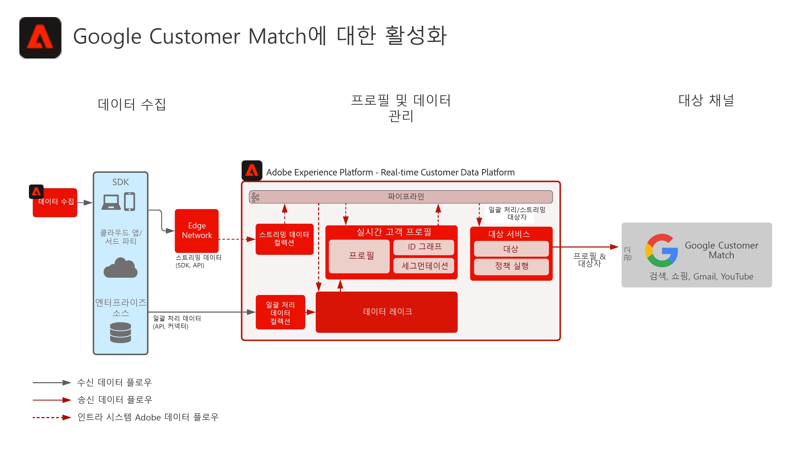

# Google Customer Match 활성화

여러 소스에서 고객 데이터를 수집하여 고객에 대한 단일 프로필 보기를 작성하고, 이러한 프로필을 세그먼트화하여 마케팅 및 개인화를 위한 대상자를 만든 다음 Google Customer Match와 같은 Social Ad Network에 공유하여 해당 대상에 대한 타겟팅 및 개인화 캠페인을 수행할 수 있습니다. Google 고객 일치 기능을 사용하면 온라인 및 오프라인 데이터를 사용하여 다음과 같이 Google이 소유하거나 운영하는 속성에서 고객에게 도달하고 다시 참여하도록 할 수 있습니다. 검색, 쇼핑, Gmail 및 YouTube.

## 사용 사례

* 소셜 및 광고 대상의 알려진 대상자 타겟팅
* 온라인 및 오프라인 특성을 활용한 온라인 개인화

## 애플리케이션

* Real-time Customer Data Platform   

## 아키텍처

## 구현 단계

1. 프로필 데이터 소스에서 사용할 ID 네임스페이스를 구성합니다.
   * 이메일, SHA256 해시(사용 가능한 경우)와 같은 기본 네임스페이스 를 사용하십시오.
   * Google 고객 일치 에는 지원되는 ID 목록이 있습니다. Google Customer Match로 활성화하려면 지원되는 ID 중 하나가 활성화 프로필에 있어야 합니다.
   * Google Customer Match에서 현재 다음 ID를 지원합니다. GAID, IDFA, phone_sha256_e.164, email_lc_sha256, user_id.
   * 자세한 내용은 [Google Customer Match 대상 안내서](https://experienceleague.adobe.com/docs/experience-platform/destinations/catalog/advertising/google-customer-match.html).
   * 적용 가능한 ID에 기본 네임스페이스를 사용할 수 없는 사용자 지정 네임스페이스를 만듭니다.
1. 프로필 데이터 소스 스키마 및 데이터 세트를 구성합니다.
   * 모든 프로필 레코드 원본 데이터에 대해 프로필 레코드 스키마를 만듭니다.
      * 각 스키마에 대한 기본 ID 및 보조 ID를 지정합니다.
      * 프로필 수집을 위한 스키마를 활성화합니다.
   * 모든 프로필 레코드 소스 데이터에 대한 프로필 레코드 데이터 세트를 만들고 관련 스키마를 할당합니다.
      * 프로필 수집을 위해 데이터 세트를 활성화합니다.
   * 모든 프로필 시계열 기반 소스 데이터에 대한 프로필 경험 이벤트 스키마 를 만듭니다.
      * 스키마의 기본 ID 및 보조 ID를 지정합니다.
   * 프로필 수집을 위한 스키마를 활성화합니다.
   * 모든 프로필 경험 이벤트 소스 데이터에 대한 프로필 경험 이벤트 데이터 세트를 만들고 관련 스키마를 할당합니다.
      * 프로필 수집을 위해 데이터 세트를 활성화합니다.
1. 소스 커넥터를 사용하여 소스 데이터를 위에 구성된 관련 데이터 세트에 수집합니다.
   * 자격 증명으로 소스 커넥터 계정을 구성합니다.
   * 지정된 일정에 따라 소스 파일 또는 폴더 위치에서 지정된 데이터 세트에 데이터를 수집하도록 데이터 흐름을 구성합니다.
   * 소스 데이터의 모든 필드를 대상 스키마에 매핑합니다.
   * 모든 필드를 Experience Platform으로 수집하기 위한 올바른 형식으로 변환합니다.
      * 날짜 변환
      * 적절한 경우 소문자로 변환(예: 이메일 주소)
      * 패턴 변형(예: 전화 번호)
      * 소스 데이터에 없는 경우 경험 이벤트 레코드에 대한 고유 레코드 ID를 추가합니다.
      * 어레이와 맵 유형 필드를 변형하여 Experience Platform에서 세그멘테이션을 위한 배열과 맵을 올바르게 매핑하고 모델링할 수 있습니다.
1. 프로필 병합 정책을 구성하여 ID 그래프와 프로필 병합에 포함해야 하는 데이터 세트를 올바르게 구성합니다.
1. 데이터 흐름이 실행된 후 프로필 데이터 수집이 오류 없이 성공했는지 확인하십시오.
   * Inspect은 여러 프로필의 id 그래프로 ID 관계를 정확하게 처리할 수 있습니다.
   * Inspect에 프로필 속성과 이벤트를 매핑하여 속성 및 이벤트를 프로필에 올바르게 수집합니다.
1. 세그먼트를 작성하여 프로필 대상자 만들기
   * 속성 및 이벤트에 대한 규칙을 사용하여 세그먼트 빌더에서 세그먼트를 만듭니다.
   * 평가를 위해 세그먼트를 저장합니다. 세그먼트는 지정된 일정에서 하루에 한 번 평가됩니다.
      * 세그먼트 규칙이 스트리밍 세그먼테이션을 수행할 수 있는 경우, 프로필에 대해 새 스트리밍 데이터를 수집할 때 세그먼트가 평가됩니다. 스트리밍 세그먼트는 예약된 배치 세그먼테이션 중에 하루에 한 번씩 평가됩니다.
1. 세그먼트 결과가 예상대로 표시되는지 확인하십시오.
   * 주어진 세그먼트에 대한 세그먼트 결과 수를 검토합니다.
   * 세그먼트에 포함해야 하는 프로필을 조사하여 세그먼트 멤버십이 프로필의 세그먼트 멤버십 부분에 포함되어 있는지 확인합니다.
1. 대상 구성에서 대상에 대한 대상의 전달을 구성합니다.
   * 자세한 내용은 [Google Customer Match 대상 안내서](https://experienceleague.adobe.com/docs/experience-platform/destinations/catalog/advertising/google-customer-match.html) facebook 대상 구성에 대한 자세한 내용은
   * 대상을 구성할 때 대상에 활성화할 대상을 선택합니다.
   * 대상 데이터 플로우에서 대상을 대상으로 배달할 예약된 시작 날짜를 결정합니다.
   * 각 대상에는 전송될 필수 및 선택적 속성이 있습니다.
      * Google Customer Match의 경우 필수 ID 중 하나를 포함해야 하며 Experience Platform 내의 대상자의 프로필을 Google Customer Match에서 타겟팅할 프로필과 일치시키는 데 사용됩니다.
   * 또한 각 대상에는 스트리밍 또는 배치, 파일 기반 또는 JSON 페이로드 등 지정된 게재 유형이 있습니다.
      * Google Customer Match의 경우 대상 멤버십은 JSON 포맷의 Google Customer Match 종단점에 스트리밍 방식으로 전달됩니다.
      * 대상 멤버십은 Experience Platform에서 스트리밍 또는 배치 세그먼테이션 평가 이후 스트리밍 방식으로 제공됩니다.
1. 대상 흐름이 대상에 예상대로 전달되었는지 확인합니다.
   * 모니터링 인터페이스를 확인하여 예상 프로필 수와 함께 대상이 전달되었는지 확인합니다. 대상 크기는 활성화되는 예상 프로필 수를 반영해야 합니다. Google 고객 일치 등의 특정 대상에는 이메일 해시 ID와 같은 특정 필드가 필요하며, 대상 구성원의 프로필에 없는 경우 대상으로 활성화되지 않습니다.
   * 생략된 프로필에서 프로필 ID가 누락되었거나 필수 속성을 누락했는지 확인합니다.
   * 해결해야 할 다른 오류가 있는지 확인합니다.
1. 예상 대상 멤버십 수로 대상이 최종 대상에 활성화되었는지 확인합니다.
   * 활성화 흐름을 완료한 후 Google Ads 계정으로 전환합니다. 활성화된 세그먼트는 Google 계정에 고객 목록으로 표시됩니다. 세그먼트 크기에 따라 일부 대상은 제공할 활성 사용자가 100명 이상 없는 한 채우지 않습니다.

## 가드레일

[프로필 및 세그멘테이션 보호 기능](https://experienceleague.adobe.com/docs/experience-platform/profile/guardrails.html?lang=ko)

## 관련 설명서

Google 고객 일치 활성화 - [대상 구성](https://experienceleague.adobe.com/docs/experience-platform/destinations/catalog/advertising/google-customer-match.html)