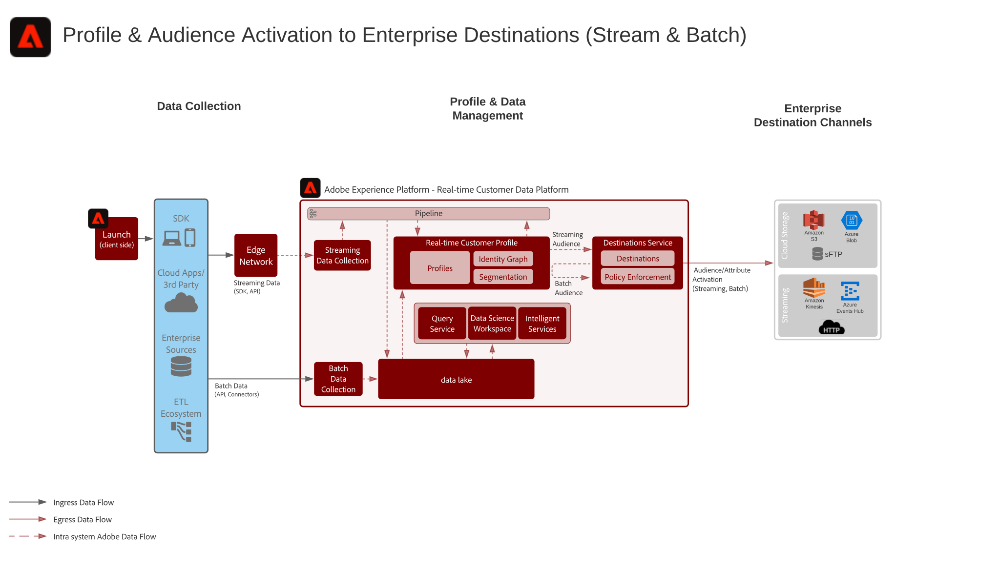

# 엔터프라이즈 대상 블루프린트에 대한 고객 및 프로필 활성화

[!UICONTROL 실시간 고객 데이터 플랫폼]에서 엔터프라이즈 데이터 저장소 및 애플리케이션으로 스트리밍하거나 일괄적으로 프로필 및 대상 변경 사항과 이벤트를 공유할 수 있습니다. 이러한 프로필 및 대상 이벤트를 사용하여 중단된 응용 프로그램 프로세스나 웨비나 등록을 팔로우하는 것과 같은 고객에 대한 판매 또는 지원 작업을 시작하거나 [!UICONTROL 실시간 고객 데이터 플랫폼]에서 최신 고객 속성 및 인텔리전스로 기업 애플리케이션을 업데이트할 수 있습니다.

## 사용 사례

* 고객 데이터와 인사이트의 엔터프라이즈 추적, 스토리지, 분석 및 활성화를 위해 클라우드 스토리지 대상 또는 스트리밍 대상에 대한 프로파일 및 고객 활성화.

## 애플리케이션

* Adobe Experience Platform 활성화

## 아키텍처

## 가드레일

[프로필 및 세분화 지침](https://experienceleague.adobe.com/docs/experience-platform/profile/guardrails.html?lang=ko)

### 세그먼트 평가 및 활성화 보장

| 세그멘테이션 유형 | 빈도 | 처리량 | 지연(세그먼트 평가) | 지연(세그먼트 활성화) | 활성화 페이로드 |
|---|---|---|---|---|---|
| 가장자리 세그멘테이션 | 에지 세그먼테이션은 현재 베타 버전으로 제공되고 있으며, Adobe Target 및 Adobe Journey Optimizer을 통해 실시간으로 동일한 페이지 의사 결정을 위해 Experience Platform 에지 네트워크에서 유효한 실시간 세그먼테이션을 평가할 수 있습니다. |  | ~100ms | Adobe Target의 개인화, 에지 프로필의 프로필 조회 및 쿠키 기반 대상을 통한 활성화를 위해 즉시 사용할 수 있습니다. | 에지 사이트에서 프로필 조회 및 쿠키 기반 대상에 대한 대상 멤버십을 사용할 수 있습니다. 대상 멤버십 및 프로필 속성은 Adobe Target 및 Journey Optimizer에서 사용할 수 있습니다. |
| 세분화 스트리밍 | 새로운 스트리밍 이벤트 또는 레코드를 실시간 고객 프로파일로 인제스트할 때마다 세그먼트 정의가 유효한 스트리밍 세그먼트입니다.  스트리밍 세그먼트  [기준에 ](https://experienceleague.adobe.com/docs/experience-platform/segmentation/api/streaming-segmentation.html?lang=ko) 대한 지침은 세그멘테이션 설명서를 참조하십시오. | 초당 최대 1,500개의 이벤트. | ~ p95 &lt;5분 | 스트리밍 대상:스트리밍 대상 멤버십은 약 10분 이내에 활성화되거나 대상의 요구 사항에 따라 마이크로 일괄적으로 활성화됩니다. 예약된 대상:스트리밍 대상 멤버십은 예약된 대상 배달 시간에 따라 일괄 활성화됩니다. | 스트리밍 대상:대상 멤버십 변경 사항, ID 값 및 프로필 속성. 예약된 대상:대상 멤버십 변경 사항, ID 값 및 프로필 속성. |
| 증분 세그먼테이션 | 마지막 증분 또는 일괄 세그먼트 평가 이후 실시간 고객 프로필로 인제스트된 새 데이터에 대해 시간당 한 번. |  |  | 스트리밍 대상:증분 대상 멤버십은 약 10분 이내에 활성화되거나 대상의 요구 사항에 따라 미시적 일괄 처리됩니다. 예약된 대상:예약된 대상 배달 시간에 따라 증분 대상 멤버십이 일괄적으로 활성화됩니다. | 스트리밍 대상:대상 멤버십 변경 및 ID 값만 가능합니다. 예약된 대상:대상 멤버십 변경 사항, ID 값 및 프로필 속성. |
| 일괄 세그먼테이션 | 미리 결정된 시스템 세트 일정을 기준으로 하루에 한 번 또는 API를 통해 수동으로 시작한 애드혹. |  | 최대 10TB의 프로파일 저장소 크기에 대해 작업당 약 1시간, 10TB에서 100TB까지의 프로파일 저장소 크기에 대해 작업당 2시간. 일괄 세그먼트 작업 성능은 평가 중인 세그먼트 수 프로필, 프로필 크기 및 수에 따라 달라집니다. | 스트리밍 대상:배치 대상 멤버십은 대상의 요구 사항에 따라 세그먼테이션 평가가 약 10일 이내에 활성화되거나 미시적 일괄 처리됩니다. 예약된 대상:예약된 대상 배달 시간에 따라 일괄 대상 멤버십이 활성화됩니다. | 스트리밍 대상:대상 멤버십 변경 및 ID 값만 가능합니다. 예약된 대상:대상 멤버십 변경 사항, ID 값 및 프로필 속성. |

## 구현 단계

1. 인제스트할 데이터에 대한 스키마를 만듭니다.
1. 수집할 데이터를 위한 데이터 세트를 만듭니다.
1. 수집한 데이터를 통합 프로필로 결합할 수 있도록 스키마에 올바른 ID와 ID 네임스페이스를 구성합니다.
1. 프로필 처리를 위해 스키마 및 데이터 세트를 활성화합니다.
1. 데이터 수집에 대한 모든 소스를 구성합니다.
1. Experience Platform에서 세그먼트를 작성하여 일괄 또는 스트리밍으로 평가할 수 있습니다. 세그먼트를 일괄 처리로 평가할지 스트리밍으로 평가할지는 시스템에서 자동으로 결정합니다.
1. 프로필 특성과 대상자 멤버십을 공유할 대상을 원하는 대상으로 구성합니다.

## 구현 시 고려 사항

특성 및 ID 활성화

* [!UICONTROL 실시간 고객 데이터 플랫폼] 은 고객 멤버쉽뿐만 아니라 활성화를 위해 선택한 세그먼트의 구성원인 프로파일에 대한 속성 및 ID 변경을 활성화할 수 있습니다. 특성 또는 ID를 활성화하는 것이 목표인 경우 속성 및 ID 업데이트가 전송되는 모든 프로파일을 포함하는 글로벌 세그먼트를 정의해야 합니다. 이 시점에서 세그먼트 및 원하는 속성을 선택하여 대상 구성의 일부로 활성화할 수 있습니다.
* 배치 대상은 특성 전용 변경 이벤트 활성화를 지원하지 않습니다. 정품 인증을 위해 선택한 속성과 함께 전체 또는 증분 대상 멤버십이 전송될 수 있지만 배치 대상을 통해 속성 전용 변경 이벤트를 활성화할 수 없습니다.

스트리밍 대상에 일괄 세그먼트 활성화

* 스트리밍 대상에 대한 일괄 세그먼트 정품 인증이 지원됩니다. 세그먼트 일괄 처리 작업은 스트리밍 활성화를 위해 세그먼트 작업이 완료된 후 파이프라인에 메시지를 배치합니다.

일괄 처리 대상으로 스트리밍 세그먼트 활성화

* 일괄 처리 대상에 대한 스트리밍 세그먼트 활성화가 지원됩니다. 배치 대상 일정은 배치 대상 일정을 기준으로 프로필 세그먼트 멤버십을 내보냅니다. 여기에는 스트리밍과 일괄 처리 방법을 통해 결정된 세그먼트 멤버십이 모두 포함됩니다.

경험 이벤트 활성화

* 원시 경험 이벤트 활성화는 지원되지 않습니다. 경험 이벤트에 대해 활성화하려면 경험 이벤트 논리를 포함하거나 제외하는 필수 규칙을 사용하여 세그먼트를 만들어야 합니다. 경험 이벤트에 대해 정의된 세그먼트를 만들고, 세그먼트 멤버십을 원시 경험 이벤트를 활성화하기 위한 프록시로 활성화할 수 있습니다. 또한 [!UICONTROL Launch Server Side]을 사용하여 SDK를 통해 수집된 원시 경험 이벤트를 활성화하십시오.

## 관련 설명서

* [대상 설명서](https://experienceleague.adobe.com/docs/experience-platform/destinations/catalog/overview.html?lang=ko)
* [클라우드 스토리지 대상 개요](https://experienceleague.adobe.com/docs/experience-platform/destinations/catalog/cloud-storage/overview.html?lang=en#catalog)
* [HTTP 대상](https://experienceleague.adobe.com/docs/experience-platform/destinations/catalog/http-destination.html?lang=en#overview)
* [Real-time Customer Data Platform 제품 설명 ](https://helpx.adobe.com/kr/legal/product-descriptions/real-time-customer-data-platform.html)
* [프로필 및 세그멘테이션 지침](https://experienceleague.adobe.com/docs/experience-platform/profile/guardrails.html?lang=en)
* [세분화 설명서](https://experienceleague.adobe.com/docs/experience-platform/segmentation/api/streaming-segmentation.html)

## 관련 비디오 및 튜토리얼

* [Real-time Customer Data Platform 개요 ](https://experienceleague.adobe.com/docs/platform-learn/tutorials/application-services/rtcdp/understanding-the-real-time-customer-data-platform.html?lang=ko)
* [[!UICONTROL Real-time Customer Data Platform 데모]](https://experienceleague.adobe.com/docs/platform-learn/tutorials/application-services/rtcdp/demo.html?lang=ko)
* [세그먼트 만들기](https://experienceleague.adobe.com/docs/platform-learn/tutorials/segments/create-segments.html?lang=ko)
