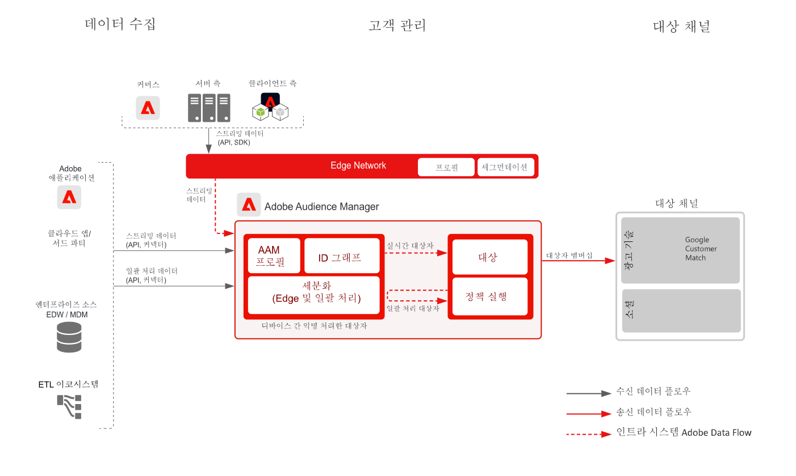

# 알려진 고객 활성화 블루프린트

오프라인 주문, 거래, CRM 또는 충성도 데이터 등 오프라인 특성 및 이벤트와 온라인 행동을 함께 사용하여 온라인 타겟팅과 개인화를 수행합니다.

기본 제공 거버넌스 제어로 확장된 식별자를 통해 알려진 고객과 더 많이 소통할 수 있습니다. 대상자를 이메일 공급자, 소셜 네트워크 및 광고 대상 등 알려진 프로필 기반 대상으로 활성화합니다.

[Experience Cloud 애플리케이션을 사용한 대상자 및 프로필 활성화 블루프린트](platform-and-applications.md)에서 Experience Platform와 Experience Cloud 애플리케이션 간 통합에 대하여 더 자세하게 설명합니다.

## 사용 사례

* 소셜 및 광고 대상의 알려진 대상자 타겟팅
* 온라인 및 오프라인 특성을 활용한 온라인 개인화
* 대상자를 이메일 및 SMS 등 알려진 채널로 활성화합니다.

## 애플리케이션

* [!UICONTROL Real-time Customer Data Platform]
* Audience Manager 사람 기반 대상을 활용하면 Facebook, LinkedIn, Google Customer Match에 대해 사람을 기반으로 활성화할 수도 있습니다.

## 아키텍처

### Real-time Customer Data Platform을 통한 알려진 고객 활성화

 

### Audience Manager 사람 기반 대상을 통한 알려진 고객 활성화

 

## 가드레일

[대상자 및 프로필 활성화 개요 페이지의 가드레일 설명을 참조하세요](https://experienceleague.adobe.com/docs/blueprints-learn/architecture/audience-activation/overview.html?lang=en#guardrails-for-audience-and-profile-activation-blueprints).

## Real-time Customer Data Platform 구현 단계

1. 수집할 데이터를 위한 [스키마를 만듭니다.](https://experienceleague.adobe.com/?recommended=ExperiencePlatform-D-1-2021.1.xdm)
1. 수집할 데이터를 위한 [데이터 세트를 만듭니다.](https://experienceleague.adobe.com/docs/platform-learn/tutorials/data-ingestion/create-datasets-and-ingest-data.html?lang=ko)
1. 수집한 데이터를 통합 프로필로 결합할 수 있도록 스키마에 [올바른 ID와 ID 네임스페이스를 구성합니다](https://experienceleague.adobe.com/docs/platform-learn/tutorials/identities/label-ingest-and-verify-identity-data.html?lang=ko).
1. [프로필에 대해 스키마와 데이터 세트를 활성화합니다](https://experienceleague.adobe.com/docs/platform-learn/tutorials/profiles/bring-data-into-the-real-time-customer-profile.html?lang=ko).
1. 데이터를 Experience Platform으로 [수집합니다.](https://experienceleague.adobe.com/?recommended=ExperiencePlatform-D-1-2020.1.dataingestion&amp;lang=ko)
1. [Experience Platform에서 정의한 대상자를 Audience Manager로 공유할 수 있도록 Experience Platform과 Audience Manager 간 [!UICONTROL Real-time Customer Data Platform] 세그먼트 공유를 제공합니다.](https://www.adobe.com/go/audiences)
1. Experience Platform에서 [세그먼트를 만듭니다](https://experienceleague.adobe.com/docs/platform-learn/tutorials/segments/create-segments.html?lang=ko). 세그먼트를 일괄 처리로 평가할지 스트리밍으로 평가할지는 시스템에서 자동으로 결정합니다.
1. 프로필 특성과 대상자 멤버십을 공유할 대상을 원하는 대상으로 [구성합니다.](https://experienceleague.adobe.com/docs/platform-learn/tutorials/destinations/create-destinations-and-activate-data.html?lang=ko)

## 구현 시 고려 사항

* 대상에 프로필 데이터를 공유하려면 대상 페이로드에 대상이 사용하는 특정 ID 값을 포함해야 합니다. 목표 대상에 필요한 ID는 모두 Platform으로 수집하여 [!UICONTROL Real-time Customer Profile] ID로 구성해야 합니다.

* [Experience Cloud 애플리케이션 블루프린트를 사용한 대상자 및 프로필 활성화](platform-and-applications.md) 페이지에서 Real-time Customer Data Platform에서 Audience Manager, Analytics, Target, Campaign, Journey Optimizer으로 대상을 공유하는 방법에 대해 자세히 살펴볼 수 있습니다.

## Audience Manager 사람 기반 대상 구현 단계

* Audience Manager 구현에 대한 자세한 내용은 다음 [설명서](https://experienceleague.adobe.com/docs/audience-manager/user-guide/implementation-integration-guides/implement-audience-manager.html?lang=ko)를 참조하세요.

* Audience Manager의 사람 기반 대상 구현에 대한 자세한 내용은 다음 [설명서](https://experienceleague.adobe.com/docs/audience-manager/user-guide/faqs/faq-people-based-destinations.html?lang=ko)를 참조하세요.

## 관련 설명서

* [[!UICONTROL Real-time Customer Data Platform] 제품 설명 ](https://helpx.adobe.com/kr/legal/product-descriptions/real-time-customer-data-platform.html)
* [프로필 및 세분화 지침](https://experienceleague.adobe.com/docs/experience-platform/profile/guardrails.html?lang=ko)
* [세분화 설명서](https://experienceleague.adobe.com/docs/experience-platform/segmentation/api/streaming-segmentation.html?lang=ko)
* [대상 설명서](https://experienceleague.adobe.com/docs/experience-platform/destinations/catalog/overview.html?lang=ko)

## 관련 비디오 및 튜토리얼

* [[!UICONTROL Real-time Customer Data Platform] 개요 ](https://experienceleague.adobe.com/docs/platform-learn/tutorials/application-services/rtcdp/understanding-the-real-time-customer-data-platform.html?lang=ko)
* [[!UICONTROL Real-time Customer Data Platform] 데모](https://experienceleague.adobe.com/docs/platform-learn/tutorials/application-services/rtcdp/demo.html?lang=ko)
* [세그먼트 만들기](https://experienceleague.adobe.com/docs/platform-learn/tutorials/segments/create-segments.html)
