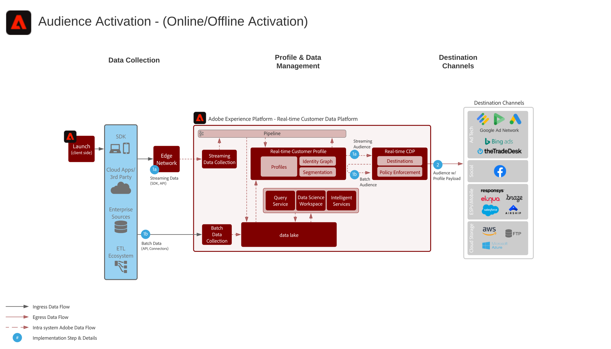

# 온라인/오프라인 Audience Activation 시나리오

온라인 타깃팅 및 개인화를 위한 온라인 행동과 함께 오프라인 주문, 거래, CRM 또는 로열티 데이터와 같은 오프라인 속성 및 이벤트를 사용합니다.

이메일 공급자, 소셜 네트워크 및 광고 대상과 같은 알려진 프로필 기반 대상에 대상을 활성화합니다.

## 사용 사례

* 소셜 및 광고 대상의 알려진 고객을 대상으로 하는 대상 타깃팅입니다.
* 온라인 및 오프라인 속성을 통한 온라인 개인화
* 이메일 및 SMS와 같은 알려진 채널로 대상을 활성화합니다.

## 애플리케이션

* Adobe Experience Platform
* 실시간 고객 데이터 플랫폼

## 아키텍처

## 가드레일

* [프로필 및 세그멘테이션 지침](https://experienceleague.adobe.com/docs/experience-platform/profile/guardrails.html?lang=en)
* 배치 세그먼트 작업은 미리 결정된 일정에 따라 하루에 한 번 실행됩니다. 그런 다음 예약된 대상 배달 전에 세그먼트 내보내기 작업이 실행됩니다. 배치 세그먼트 작업 및 대상 배달 작업은 별도로 실행됩니다. 프로필 수, 프로필 크기 및 평가 중인 세그먼트 수에 따라 일괄 세그먼트 작업 및 내보내기 작업 성능이 달라집니다.
* 스트리밍 세그먼트 작업은 프로필로 전달되는 스트리밍 데이터를 몇 분 단위로 평가하고 세그먼트 멤버십을 프로필에 즉시 작성하여 구독할 애플리케이션을 위한 이벤트를 전송합니다.
* 스트리밍 세그먼트 멤버십은 스트리밍 대상에 대해 즉시 작동하며 대상의 통합 패턴에 따라 단일 세그먼트 멤버십 이벤트 또는 여러 프로파일 이벤트의 마이크로 묶음으로 제공됩니다. 예약된 대상에 따라 예약된 배치 세그먼트 배달을 통해 전달되는 스트리밍에서 평가되는 모든 세그먼트에 대해 배달 전에 프로필에서 세그먼트 내보내기 작업이 시작됩니다.
* RTCDP 세그먼트 멤버십을 Audience Manager에 공유하기 위해 세그먼트 스트리밍을 위해 몇 분 내에 그리고 일괄 세분화를 위한 일괄 세그먼트 평가가 완료된 후 몇 분 이내에 이러한 문제가 발생합니다.
* 스트리밍 또는 일괄 평가 방법을 통해 Experience Platform에서 Audience Manager으로 공유되는 세그먼트는 세그먼트 구현 후 몇 분 이내에 공유됩니다. 세그먼트가 처음 만들어지면 AEP와 AAM 간에 초기 세그먼트 구성 동기화가 실행되며 4시간이 지나면 AEP 세그먼트 멤버십이 AAM 프로필에서 구현될 수 있습니다. Experience Platform 및 Audience Manager 대상 공유 구성 또는 대상 메타 데이터가 Experience Platform에서 Audience Manager으로 동기화되기 전에 또는 &quot;기존&quot; 세그먼트 멤버십이 공유되는 다음 세그먼트 작업이 Audience Manager에서 실현될 때까지 대상 멤버십이 실현되지 않습니다.
* 일괄 세그먼트 작업의 대상 작업을 일괄 처리하거나 스트리밍하면 세그먼트 멤버십과 프로필 속성 업데이트를 공유할 수 있습니다.
* 스트리밍 대상에 대한 세그먼트 스트리밍 작업은 세그먼트 구성원 자격 업데이트만 공유합니다.

## 구현 단계

1. Experience Platform에서 스키마 및 데이터 세트를 구성합니다.
1. 스키마의 올바른 ID 및 ID 네임스페이스를 구성하여 인제스트된 데이터가 통합 프로파일로 연결될 수 있도록 합니다.
1. 프로필에 대한 스키마 및 데이터 세트를 활성화합니다.
1. 데이터를 플랫폼에 인제스트
1. Audience Manager에 공유될 Experience Platform에 정의된 대상을 위해 Audience Manager과 Experience Platform 간에 실시간 고객 데이터 플랫폼 세그먼트 공유를 프로비저닝합니다.
1. Experience Platform에서 세그먼트를 작성하여 일괄 또는 스트리밍으로 평가할 수 있습니다. 시스템에서 자동으로 세그먼트가 일괄 처리로 평가되는지 아니면 스트리밍으로 평가되는지를 결정합니다.
1. 원하는 대상에 프로필 속성 및 대상 멤버십을 공유할 대상을 구성합니다.

## 구현 고려 사항

* 대상에 프로필 데이터를 공유하려면 대상 페이로드에서 대상이 사용하는 특정 ID 값을 포함해야 합니다. 대상 대상에 필요한 모든 ID를 플랫폼으로 인제스트하고 실시간 고객 프로필의 ID로 구성해야 합니다.

* Experience Platform에서 Audience Manager으로 대상을 공유하는 활성화 시나리오의 경우 [!UICONTROL 실시간 고객 프로필]에 포함된 모든 ID가 Audience Manager에 공유됩니다. 필요한 대상 ID가 [!UICONTROL 실시간 고객 프로필]에 포함되어 있거나, [!UICONTROL 실시간 고객 프로필]의 ID가 Audience Manager에 연결되어 있는 필요한 대상 ID와 연결될 수 있는 경우 Experience Platform 대상을 통해 Audience Manager 대상을 공유할 수 있습니다.

## 관련 설명서

* [실시간 고객 데이터 플랫폼 제품 설명](https://helpx.adobe.com/legal/product-descriptions/real-time-customer-data-platform.html)
* [프로필 및 세그멘테이션 지침](https://experienceleague.adobe.com/docs/experience-platform/profile/guardrails.html?lang=en)
* [세분화 설명서](https://experienceleague.adobe.com/docs/experience-platform/segmentation/api/streaming-segmentation.html)
* [대상 설명서](https://experienceleague.adobe.com/docs/experience-platform/destinations/catalog/overview.html)

## 관련 비디오 및 Tutorials

* [실시간 고객 데이터 플랫폼 개요](https://experienceleague.adobe.com/docs/platform-learn/tutorials/application-services/rtcdp/understanding-the-real-time-customer-data-platform.html)
* [실시간 고객 데이터 플랫폼 데모](https://experienceleague.adobe.com/docs/platform-learn/tutorials/application-services/rtcdp/demo.html)
* [세그먼트 만들기](https://experienceleague.adobe.com/docs/platform-learn/tutorials/segments/create-segments.html)