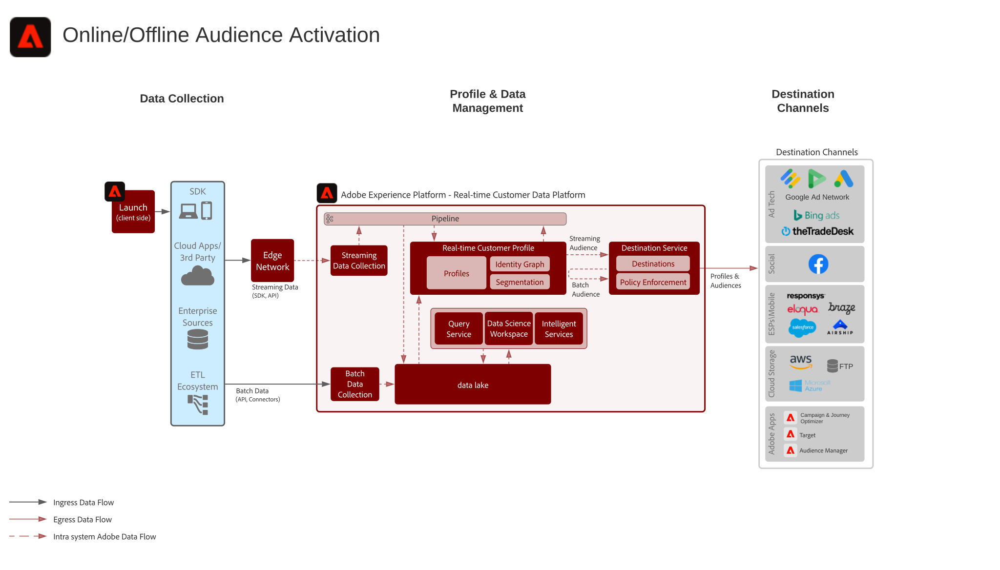

# 온라인/오프라인 Audience Activation 블루프린트

오프라인 주문, 거래, CRM 또는 충성도 데이터 등 오프라인 특성 및 이벤트와 온라인 행동을 함께 사용하여 온라인 타겟팅과 개인화를 수행합니다.

대상자를 이메일 공급자, 소셜 네트워크 및 광고 대상 등 알려진 프로필 기반 대상으로 활성화합니다.

온라인/오프라인 Audience Activation 블루프린트는 [대상 및 프로필 활성화와 Experience Cloud 응용 프로그램 블루프린트](platform-and-applications.md)에 가깝게 정렬됩니다. 추가 세부 사항은 [대상 및 Experience Cloud 응용 프로그램 블루프린트](platform-and-applications.md)의 프로필 활성화에서 제공됩니다.   Experience Platform과 Experience Cloud 애플리케이션 간의 통합에만 해당됩니다.

## 사용 사례

* 소셜 및 광고 대상의 알려진 대상자 타겟팅
* 온라인 및 오프라인 특성을 활용한 온라인 개인화
* 대상자를 이메일 및 SMS 등 알려진 채널로 활성화합니다.

## 애플리케이션

* Adobe Experience Platform
* [!UICONTROL Real-time Customer Data Platform]

## 아키텍처

### 대상이 포함된 온라인/오프라인 Audience Activation

 

## 가드레일

[대상 및 프로필 활성화 개요 페이지에 나와 있는 지침을 참조하십시오.](overview.md)

## 구현 단계

1. [수집할 데이터를 위한 스키마를 만듭니다.](https://experienceleague.adobe.com/docs/platform-learn/tutorials/schemas/create-a-schema.html)
1. [수집할 데이터를 위한 데이터 세트를 만듭니다.](https://experienceleague.adobe.com/docs/platform-learn/tutorials/data-ingestion/create-datasets-and-ingest-data.html)
1. [수집한 데이터를 통합 프로필로 결합할 수 있도록 스키마에 올바른 ID와 ID 네임스페이스를 구성합니다.](https://experienceleague.adobe.com/docs/platform-learn/tutorials/identities/label-ingest-and-verify-identity-data.html)
1. [프로필에 대한 스키마 및 데이터 세트를 활성화합니다](https://experienceleague.adobe.com/docs/platform-learn/tutorials/profiles/bring-data-into-the-real-time-customer-profile.html).
1. [데이터를 Experience Platform으로 수집합니다.](https://experienceleague.adobe.com/?recommended=ExperiencePlatform-D-1-2020.1.dataingestion)
1. [Experience Platform에서 정의한 대상자를 Audience Manager로 공유할 수 있도록 Experience Platform과 Audience Manager 간 [!UICONTROL Real-time Customer Data Platform] 세그먼트 공유를 제공합니다.](https://www.adobe.com/go/audiences)
1. [Experience Platform](https://experienceleague.adobe.com/docs/platform-learn/tutorials/segments/create-segments.html?lang=ko) 에서 세그먼트를 만듭니다. 세그먼트를 일괄 처리로 평가할지 스트리밍으로 평가할지는 시스템에서 자동으로 결정합니다.
1. [프로필 특성과 대상자 멤버십을 공유할 대상을 원하는 대상으로 구성합니다.](https://experienceleague.adobe.com/docs/platform-learn/tutorials/destinations/create-destinations-and-activate-data.html)

## 구현 시 고려 사항

* 대상에 프로필 데이터를 공유하려면 대상 페이로드에 대상이 사용하는 특정 ID 값을 포함해야 합니다. 목표 대상에 필요한 ID는 모두 Platform으로 수집하여 [!UICONTROL Real-time Customer Profile] ID로 구성해야 합니다.

* Experience Platform에서 Audience Manager로 대상자를 공유하는 활성화 시나리오에서는 [!UICONTROL Real-time Customer Profile]에 포함된 ID를 모두 Audience Manager로 공유합니다. Experience Platform의 대상자는 필요한 대상 ID가 [!UICONTROL Real-time Customer Profile]에 포함된 경우 또는 [!UICONTROL Real-time Customer Profile]의 ID가 Audience Manager에서 필요 대상 ID와 연결된 경우에 Audience Manager 대상을 통해 공유할 수 있습니다.

## 관련 설명서

* [[!UICONTROL Real-time Customer Data Platform] 제품 설명 ](https://helpx.adobe.com/kr/legal/product-descriptions/real-time-customer-data-platform.html)
* [프로필 및 세분화 지침](https://experienceleague.adobe.com/docs/experience-platform/profile/guardrails.html?lang=ko)
* [세분화 설명서](https://experienceleague.adobe.com/docs/experience-platform/segmentation/api/streaming-segmentation.html?lang=ko)
* [대상 설명서](https://experienceleague.adobe.com/docs/experience-platform/destinations/catalog/overview.html?lang=ko)

## 관련 비디오 및 튜토리얼

* [[!UICONTROL Real-time Customer Data Platform] 개요 ](https://experienceleague.adobe.com/docs/platform-learn/tutorials/application-services/rtcdp/understanding-the-real-time-customer-data-platform.html?lang=ko)
* [[!UICONTROL Real-time Customer Data Platform] 데모](https://experienceleague.adobe.com/docs/platform-learn/tutorials/application-services/rtcdp/demo.html?lang=ko)
* [세그먼트 만들기](https://experienceleague.adobe.com/docs/platform-learn/tutorials/segments/create-segments.html)
