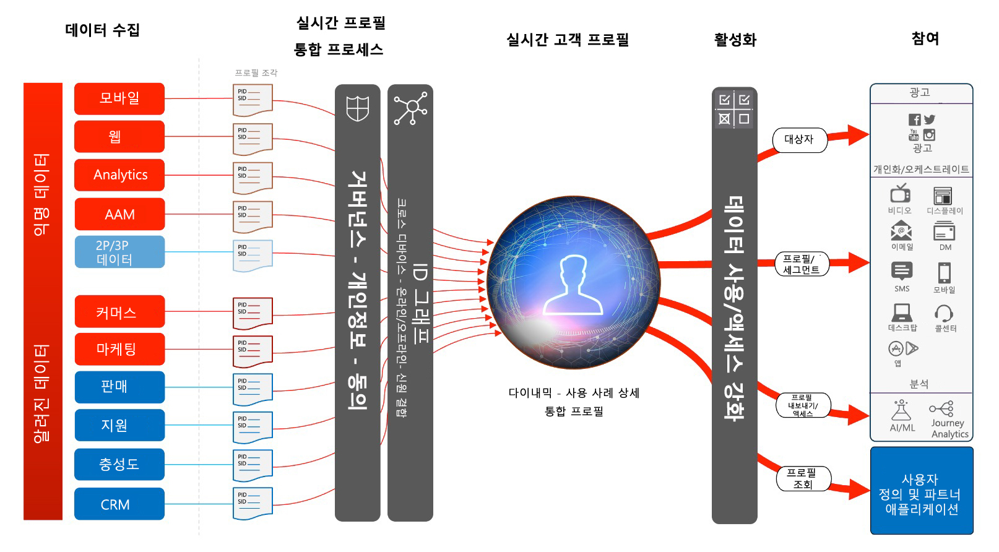
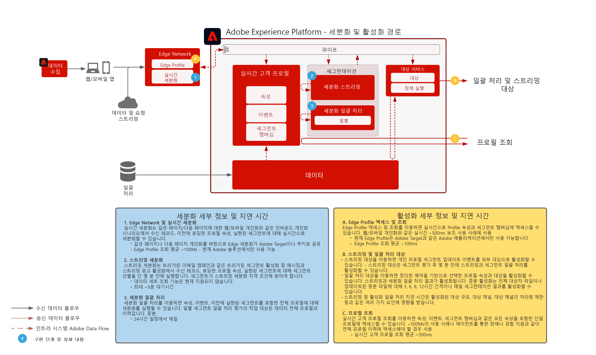

# 대상자 및 프로필 활성화

데이터 기반 마케팅의 세계에서는 대상자와 프로필을 중심으로 활성화해야 성공할 수 있습니다. 그러나 많은 브랜드가 여전히 일관되지 않은 도달 및 개인화 전략으로 채널 중심 활성화에 노력을 기울입니다.

채널 중심 접근 방법에서는 각 채널이 서로 소통하지 않는 사일로 역할을 하므로 개인화 노력 시 해당 채널에서 브랜드와 상호 작용하는 고객만을 타겟팅하게 됩니다. 이 접근은 고객이 여러 다양한 접점을 통해 브랜드와 상호 작용하는 현실을 반영하지 않습니다. 대상자 및 프로필 중심 활성화를 채택하면 브랜드가 여러 채널에 걸쳐 고객 상호 작용을 연결함으로써 중심화된 프로필 대상자 경험을 게재하여 전 채널에서 활성화할 수 있습니다.

| 블루프린트 | 설명 | Experience Cloud 애플리케이션 |
|---|---|---|
| **[익명 대상자 활성화](anonymous.md)** | <ul><li>고객의 익명 행동 데이터를 기반으로 웹 및 광고 채널에 걸쳐 대상자를 타겟팅합니다.</li><li>서드파티 대상자 데이터와 통합하여 개인화를 향상시킬 수 있습니다.</li></ul> | <ul><li>Adobe Audience Manager</li></ul> |
| **[알려진 고객 활성화](known.md)** | <ul><li>이메일 공급자, 소셜 네트워크 및 광고 대상 등 알려진 프로필 기반 대상에 대해 활성화합니다. </li><li>오프라인 주문, 거래, CRM 또는 충성도 데이터 등 오프라인 특성 및 이벤트와 온라인 행동을 함께 사용하여 온라인 타겟팅과 개인화를 수행합니다.</li></ul> | <ul><li>Adobe Experience Platform</li><li> [!UICONTROL Real-time Customer Data Platform]</li><li>Adobe Audience Manager(선택 사항)</li></ul> |
| **[Experience Cloud 애플리케이션을 사용한 대상자 및 프로필 활성화](platform-and-applications.md)** | <ul><li>Experience Platform의 프로필 및 대상자를 관리하고 Experience Cloud 애플리케이션에 공유합니다</li><li>Experience Platform에서 풍부한 고객 세그먼트와 인사이트를 작성 및 공유하고 이를 Experience Cloud 애플리케이션에 공유합니다.</li></ul> | <ul><li>Adobe Experience Platform</li><li>[!UICONTROL Real-time Customer Data Platform]</li><li>Experience Platform Activation</li><li>Experience Cloud 애플리케이션</li></ul> |

## Real-time Customer Profile 아키텍처

아래 그림에서는 Experience Platform의 Real-time Customer Profile의 핵심 구성 요소를 개략적으로 확인할 수 있습니다.

첫 번째 데이터 소스가 Experience Platform으로 수집됩니다. 데이터 소스가 프로필용으로 구성된 경우 이를 처리하면 Real-time Customer Profile로 피드됩니다. 각 데이터 소스용으로 구성된 각 기본 ID 레코드에 대해 하나의 프로필 조각 또는 문서가 만들어집니다. 또한 프로필에 수집한 데이터는 ID 서비스에서도 처리합니다. 스키마에 둘 이상의 ID가 표시되어 있고 이에 해당하는 값이 레코드에 입력된 데이터 소스의 모든 레코드는 ID 서비스 내에서 ID 관계로 처리합니다.

ID가 하나만 있는 레코드는 그래프를 추가로 채울 ID 링크가 없으므로 ID 서비스에서 처리하지 않습니다. 참고: ID 서비스는 기본 ID와 보조 ID를 구분하지 않습니다. 단순히 여러 ID에 걸친 ID 관계를 처리합니다.

ID 그래프가 관련된 다양한 소스 프로필 조각에 대해 ID 관계를 제공할 때 프로필 조각 병합이 발생합니다. 병합 정책에 따라 조각을 병합할 때 사용할 소스 조각과 ID 그래프가 결정됩니다. 프로필이 액세스 중일 때마다 프로필 조각 병합이 발생하여 프로필을 최신 상태로 종합하여 볼 수 있습니다. 거버넌스 및 정책 규칙을 통해 권한이 있는 세그먼트 및 속성만 지정된 대상에 대해 활성화할 수 있습니다.

## 세분화 및 대상 개요

아래 그림에서 다양한 세분화 방법과 프로필 및 대상 활성화 패턴을 볼 수 있습니다.

## 대상자 및 프로필 활성화 블루프린트 가드레일

* [프로필 및 세분화 지침](https://experienceleague.adobe.com/docs/experience-platform/profile/guardrails.html?lang=ko)

### 특성 및 ID 활성화

* [!UICONTROL The Real-time Customer Data Platform]은 활성화하도록 선택한 회원 또는 세그먼트인 프로필에 대해 발생하는 특성 및 ID 변경뿐 아니라 대상자 멤버십도 활성화할 수 있습니다. 특성 또는 ID를 활성화하는 것이 목표인 경우 특성 및 ID 업데이트가 전송되는 모든 프로필을 포함하는 글로벌 세그먼트를 정의해야 합니다. 이 시점에서 세그먼트 및 원하는 특성을 선택하여 대상 구성의 일부로 활성화할 수 있습니다.
* 참고: 대상 일괄 처리는 특성에만 적용되는 변경 이벤트 활성화를 지원하지 않습니다. 활성화를 위해 선택한 속성과 함께 전체나 증분 대상 멤버십을 전송할 수 있습니다.

### 대상 스트리밍에 대한 세그먼트 일괄 처리 활성화

* 대상 스트리밍에 대한 세그먼트 일괄 처리 활성화가 지원됩니다. 프로필이 일괄 처리 세그먼트 작업의 대상 멤버십의 자격이 있어 스트리밍 활성화를 통해 해당 실현을 활성화할 수 있습니다.

### 대상 일괄 처리에 대한 세그먼트 스트리밍 활성화

* 대상 일괄 처리에 대한 세그먼트 스트리밍 활성화가 지원됩니다. 대상 일괄 처리에서는 예약 내용을 기반으로 프로필 세그먼트 멤버십을 내보냅니다. 여기에는 스트리밍을 통한 세그먼트 멤버십과 일괄 처리 방법을 통한 멤버십 둘 다 포함됩니다.

### 경험 이벤트 활성화

* 원시 경험 이벤트 활성화는 지원되지 않습니다. 경험 이벤트를 통한 활성화를 수행하려면 경험 이벤트 논리를 포함하거나 제외하는 필수 규칙을 사용하여 세그먼트를 만들어야 합니다. 이렇게 하면 경험 이벤트를 참조하여 정의된 세그먼트를 만들어 세그먼트 멤버십을 원시 경험 이벤트를 활성화하기 위한 프록시로 활성화할 수 있습니다. 또한 [!UICONTROL Launch 서버측]을 사용하여 SDK를 통해 수집된 원시 경험 이벤트를 활성화하는 방법도 있습니다.

## 관련 블로그 게시물

* [[!DNL Blueprints for Audience Activation in Adobe Experience Platform]](https://medium.com/adobetech/a-blueprint-for-audience-activation-in-adobe-experience-platform-b2b30fae90fd)
* [[!DNL How Adobe Experience Platform Predictive Audiences improves Personalized Experiences]](https://medium.com/adobetech/how-adobe-experience-platform-predictive-audiences-improves-personalized-experiences-1f75a60cb7a3)
* [[!DNL Adobe Experience Platform Web SDK for Audience Management]](https://medium.com/adobetech/adobe-experience-platform-web-sdk-for-audience-management-751fa6d063bc)
