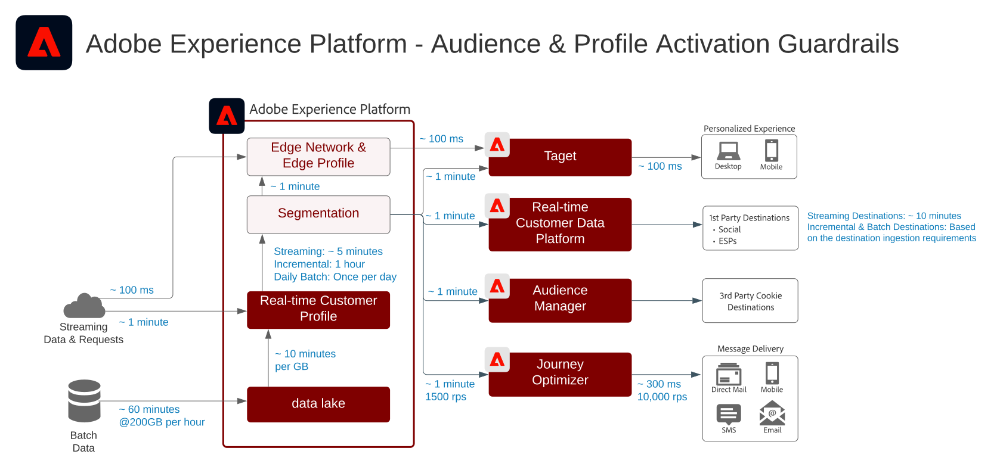

# 대상 및 프로필 활성화

고객 및 프로필 활성화는 데이터 기반의 마케팅 세계에서 성공을 위한 열쇠입니다. 그러나 많은 브랜드가 여전히 일관되지 않은 도달 및 개인화 전략으로 채널 중심 활성화에 노력을 기울입니다.

채널 중심 접근에서는 각 채널이 서로 소통하지 않는 사일로 역할을 하므로 개인화 노력 시 해당 채널에서 브랜드와 상호 작용하는 고객만을 타겟팅하게 됩니다. 이 접근은 고객이 여러 다양한 접점을 통해 브랜드와 상호 작용하는 현실을 반영하지 않습니다. 고객 및 프로필 활성화를 통해 브랜드 기업은 다양한 채널에서 고객 상호 작용을 연결하여 모든 채널에서 활성화할 수 있는 중앙 집중화된 프로파일과 고객을 제공할 수 있습니다.

| 블루프린트 | 설명 | Experience Cloud 애플리케이션 |
|---|---|---|
| **[익명 Audience Activation](anonymous.md)** | <ul><li>고객의 익명 행동 데이터를 기반으로 웹 및 광고 채널에 걸쳐 대상자를 타겟팅합니다.</li><li>서드파티 대상자 데이터와 통합하여 개인화를 향상시킬 수 있습니다.</li></ul> | <ul><li>Adobe Audience Manager</li></ul> |
| **[온라인/오프라인 Audience Activation](online-offline.md)** | <ul><li>이메일 공급자, 소셜 네트워크 및 광고 대상과 같은 알려진 프로필 기반 대상으로 활성화합니다. </li><li>온라인 타깃팅 및 개인화를 위해 오프라인 주문, 거래, CRM 또는 로열티 데이터와 같은 오프라인 속성 및 이벤트를 온라인 행동과 함께 사용할 수 있습니다.</li></ul> | <ul><li>Adobe Experience Platform</li><li> [!UICONTROL Real-time Customer Data Platform]</li><li>Adobe Audience Manager(선택 사항)</li></ul> |
| **[엔터프라이즈 대상 고객 및 프로필 활성화](enterprise-destinations.md)** | <ul><li>기업 데이터 저장소에 대한 프로필 및 대상 변경 사항을 복제 및 업데이트하여 활성화 및 보고 사용 사례를 제공합니다. </li></ul><ul><li>기업 시스템 및 애플리케이션에 대한 [!UICONTROL 실시간 고객 데이터 플랫폼]의 고객 행동에 대한 알림을 통해 고객에게 판매 또는 지원 조치를 시작합니다.</li></ul> | <ul><li>Adobe Experience Platform</li><li>[!UICONTROL 실시간 고객 데이터 플랫폼]</li><li>Experience Platform 활성화</li><li>Adobe Audience Manager(선택 사항)</li></ul> |
| **[고객 활동 허브](customer-activity.md)** | <ul><li>지원 및 영업 경험 등 직원이 관여하는 상호 작용에 대해 보다 자세한 고객의 맥락을 제공합니다. Experience Platform에 대한 프로필 조회를 사용하여 상담원은 최근 구매, 캠페인 상호 작용, 속성, 고객 멤버십 및 실시간 고객 프로필에 저장된 기타 특성과 인사이트와 같은 소비자에 대한 컨텍스트를 받을 수 있습니다.</li></ul> | <ul><li>Adobe Experience Platform</li></ul> |

## 고객 및 프로필 활성화 청사진 보호

### Guardrail 다이어그램

* [프로필 및 세분화 지침](https://experienceleague.adobe.com/docs/experience-platform/profile/guardrails.html?lang=ko)

### 세그먼트 평가 및 활성화 보장

| 세그멘테이션 유형 | 사용 사례 | 빈도 | 처리량 | 지연(세그먼트 평가) | 지연(세그먼트 활성화) | 활성화 페이로드 |
|--------------------------|------------------------------------------------------------|------------------------------------------------------------------------------------------------------------------------------------------------------------------------------------------------------------------------------------------------------------------------------------------------------------------------------------------------------------------------------|-------------------------------|------------------------------------------------------------------------------------------------------------------------------------------------------------------------------------------------------------------------------|------------------------------------------------------------------------------------------------------------------------------------------------------------------------------------------------------------------------------------------------------------------------------------------------------------------|-----------------------------------------------------------------------------------------------------------------------------------------------------------------------------------------------------|
| 가장자리 세그멘테이션 | 웹/모바일 개인화(동일한 페이지/다음 페이지) | 에지 세그먼테이션은 현재 베타 버전이며 아직 일반적으로 사용할 수 없습니다. | - | 약 100밀리초 | Target 및 Journey Optimizer:<ul><li>동일한 개인화 요청에서 즉시 사용할 수 있습니다.</li></ul> 쿠키 기반 대상:<ul><li>다음 페이지 결정에 사용 가능합니다.</li></ul> | 에지 프로필 조회(Target 및 Journey Optimizer):<ul><li>대상 멤버십</li><li>프로필 속성</li></ul> 쿠키 기반 대상:<ul><li>대상 멤버십</li></ul> |
| 세분화 스트리밍 | 트리거 기반 마케팅(스트리밍) | 새로운 스트리밍 이벤트 또는 레코드를 실시간 고객 프로파일로 인제스트할 때마다 세그먼트 정의가 유효한 스트리밍 세그먼트입니다.  스트리밍 세그먼트 기준 세그멘테이션 설명서에 대한 지침은  [세그멘테이션 설명서를 참조하십시오.](https://experienceleague.adobe.com/docs/experience-platform/segmentation/api/streaming-segmentation.html?lang=ko) | 초당 최대 1,500개의 이벤트. | 약 5분, p95 | 스트리밍 대상:<ul><li>Audience Manager 및 Target까지 약 1분</li><li>대상에 따라 외부 대상 또는 마이크로 바팅된 대상에 약 10분 정도 소요됩니다.</li></ul> 예약된 대상:<ul><li>예약된 대상 배달 시간에 따라 일괄적으로 외부 대상에 대해 활성화됩니다.</li></ul> | 스트리밍 대상: <ul><li>대상 멤버십 변경</li><li>ID 값</li><li>프로필 속성</li></ul> 예약된 대상:<ul><li>대상 멤버십 변경</li><li>ID 값</li><li>프로필 속성</li></ul> |
| 증분 세그먼테이션 | <li>일괄 메시징<li>캠페인 및 경험 타깃팅 | 마지막 증분 또는 일괄 세그먼트 평가 이후 실시간 고객 프로필로 인제스트된 새 데이터에 대해 시간당 한 번. | 해당 없음 | 프로필 수, 프로필 크기 및 평가 중인 세그먼트 수에 따라 다릅니다. | 스트리밍 대상:<ul><li>Audience Manager 및 Target까지 약 1분</li><li>대상에 따라 외부 대상 또는 마이크로 바팅된 대상에 약 10분 정도 소요됩니다.</li></ul> 예약된 대상:<ul><li>예약된 대상 배달 시간에 따라 일괄적으로 외부 대상에 대해 활성화됩니다.</li></ul> | 스트리밍 대상: <ul><li>대상 멤버십 변경</li><li>ID 값</li></ul> 예약된 대상:<ul><li>대상 멤버십 변경</li><li>ID 값</li><li>프로필 속성</li></ul> |
| 일괄 세그먼테이션 | <ul><li>일괄 메시징</li><li>캠페인 및 경험 타깃팅</li></ul> | 미리 결정된 시스템 세트 일정을 기준으로 하루에 한 번 또는 API를 통해 수동으로 시작한 애드혹. | 해당 없음 | 프로필 수, 프로필 크기 및 평가 중인 세그먼트 수에 따라 다릅니다.<ul><li>최대 10TB의 프로파일 저장소 크기에 대해 작업당 약 1시간</li><li>10TB에서 100TB까지의 프로파일 저장소 크기에 대해 작업당 2시간.</li></ul> | 스트리밍 대상:<ul><li>Audience Manager 및 Target까지 약 1분</li><li>대상에 따라 외부 대상 또는 마이크로 바팅된 대상에 약 10분 정도 소요됩니다.</li></ul> 예약된 대상:<ul><li>예약된 대상 배달 시간에 따라 일괄적으로 외부 대상에 대해 활성화됩니다.</li></ul> | 스트리밍 대상: <ul><li>대상 멤버십 변경</li><li>ID 값</li></ul> 예약된 대상:<ul><li>대상 멤버십 변경</li><li>ID 값</li><li>프로필 속성</li></ul> |

### 애플리케이션 간 대상 공유를 위한 보장

| 고객 애플리케이션 통합 | 사용 사례 | 빈도 | 처리량/볼륨 | 지연(세그먼트 평가) | 지연(세그먼트 활성화) |
|-|-|-|-|-||
| 실시간 고객 데이터 플랫폼-Audience Manager | 알려진 프로필 고객을 포함한 타사 광고 강화 | 세그멘테이션 유형에 따라 - 위의 세그멘테이션 가리기 테이블을 참조하십시오. | 세그멘테이션 유형에 따라 - 위의 세그멘테이션 가리기 테이블을 참조하십시오. | 세그멘테이션 유형에 따라 - 위의 세그멘테이션 가리기 테이블을 참조하십시오. | <ul><li>세그먼트 평가가 완료된 후 몇 분 이내에</li><li>RTCDP와 AAM 간에 초기 고객 구성을 동기화하려면 약 4시간이 소요됩니다.</li><li>4시간 동안 실현된 모든 고객 멤버십은 후속 일괄 세분화 작업에서 &quot;기존&quot; 대상 멤버십으로 AAM에 기록됩니다.</li></ul> |
| Adobe Analytics에서 Audience Manager으로 | 고객에 기반한 세분화된 행동을 통해 제3자 광고 강화 |  | 기본적으로 각 Adobe Analytics 보고서 세트에 대해 최대 75명의 대상을 공유할 수 있습니다. Audience Manager 라이센스를 사용하는 경우 제한이 없습니다. |  |  |
| Adobe Analytics에서 실시간 고객 데이터 플랫폼으로 | 현재 사용할 수 없습니다. | 현재 사용할 수 없음 | 현재 사용할 수 없음 | 현재 사용할 수 없음 | 현재 사용할 수 없음 |

### 특성 및 ID 활성화

* [!UICONTROL 실시간 고객 데이터 플랫폼] 은 고객 멤버쉽뿐만 아니라 활성화를 위해 선택한 세그먼트의 구성원인 프로파일에 대한 속성 및 ID 변경을 활성화할 수 있습니다. 특성 또는 ID를 활성화하는 것이 목표인 경우 속성 및 ID 업데이트가 전송되는 모든 프로파일을 포함하는 글로벌 세그먼트를 정의해야 합니다. 이 시점에서 세그먼트 및 원하는 속성을 선택하여 대상 구성의 일부로 활성화할 수 있습니다.
* 배치 대상은 특성 전용 변경 이벤트 활성화를 지원하지 않습니다. 정품 인증을 위해 선택한 속성과 함께 전체 또는 증분 대상 멤버십이 전송될 수 있지만 배치 대상을 통해 속성 전용 변경 이벤트를 활성화할 수 없습니다.

### 스트리밍 대상에 일괄 세그먼트 활성화

* 스트리밍 대상에 대한 일괄 세그먼트 정품 인증이 지원됩니다. 세그먼트 일괄 처리 작업은 스트리밍 활성화를 위해 세그먼트 작업이 완료된 후 파이프라인에 메시지를 배치합니다.

### 일괄 처리 대상으로 스트리밍 세그먼트 활성화

* 일괄 처리 대상에 대한 세그먼트 스트리밍이 지원됩니다. 배치 대상 일정은 배치 대상 일정을 기준으로 프로필 세그먼트 멤버십을 내보냅니다. 여기에는 스트리밍과 일괄 처리 방법을 통해 결정된 세그먼트 멤버십이 모두 포함됩니다.

### 경험 이벤트 활성화

* 원시 경험 이벤트 활성화는 지원되지 않습니다. 경험 이벤트에 대해 활성화하려면 경험 이벤트 논리를 포함하거나 제외하는 필수 규칙을 사용하여 세그먼트를 만들어야 합니다. 경험 이벤트에 대해 정의된 세그먼트를 만들고, 세그먼트 멤버십을 원시 경험 이벤트를 활성화하기 위한 프록시로 활성화할 수 있습니다. 또한 [!UICONTROL Launch Server Side]을 사용하여 SDK를 통해 수집된 원시 경험 이벤트를 활성화하십시오.

## 관련 블로그 게시물

* [[!DNL Blueprints for Audience Activation in Adobe Experience Platform]](https://medium.com/adobetech/a-blueprint-for-audience-activation-in-adobe-experience-platform-b2b30fae90fd)
* [[!DNL How Adobe Experience Platform Predictive Audiences improves Personalized Experiences]](https://medium.com/adobetech/how-adobe-experience-platform-predictive-audiences-improves-personalized-experiences-1f75a60cb7a3)
* [[!DNL Adobe Experience Platform Web SDK for Audience Management]](https://medium.com/adobetech/adobe-experience-platform-web-sdk-for-audience-management-751fa6d063bc)
