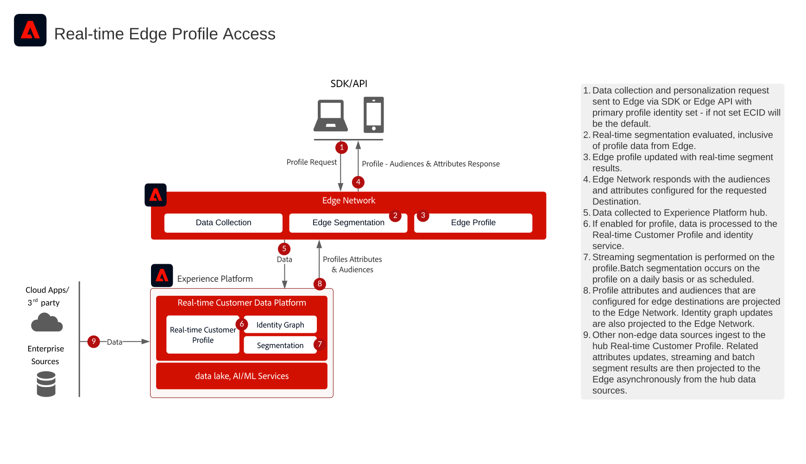

# 웹 및 모바일 Personalization용 실시간 Edge 프로필 액세스

웹 및 모바일 Edge에 대한 실시간 Personalization 프로필 액세스 블루프린트는 웹 및 모바일 애플리케이션이 가장자리에 있는 Adobe Experience Platform의 [!UICONTROL 실시간 고객 프로필]에 액세스하여 처리량이 높고 대기 시간이 짧은 개인화를 수행하는 방법을 보여 줍니다.

애플리케이션은 밀리초 단위의 지연 시간으로 에지(edge)의 실시간 프로필 속성 및 대상자에 액세스할 수 있습니다. 프로필에 속성으로 저장된 속성, 대상자 멤버십 및 모델 기반 기능은 웹 및 모바일 채널에서 동일한 페이지 및 다음 페이지 개인화를 위해 실시간으로 액세스할 수 있습니다.

이 기능을 사용하면 실시간 행동, 실시간 고객 프로필에 수집된 속성 및 계산된 통찰력을 포함하여 실시간 고객 프로필을 기반으로 웹 사이트 및 모바일 애플리케이션에서 고도로 개인화된 경험을 제공할 수 있습니다.

>[!NOTE]
>
>Edge 프로필 액세스는 웹/모바일 인바운드 개인화 및 실시간 오퍼 의사 결정과 같이 높은 처리량, 짧은 지연 시간 사용 사례를 위해 특별히 설계되었습니다. 에이전트 지원 지원 또는 판매 상호 작용과 같은 낮은 처리량 시나리오의 경우 Hub 프로필 조회 API가 더 적절합니다. 허브 기반 프로필 액세스는 [지원 및 판매 시나리오에 대한 실시간 프로필 액세스 블루프린트](customer-activity.md)를 참조하십시오.

## 애플리케이션

* Real-time Customer Data Platform   
* Adobe Experience Platform 데이터 수집 (웹 SDK / 모바일 SDK)
* Edge Network 서버 API

## 사용 사례

* 알려진 고객 경험을 위한 웹 및 모바일 채널에서의 실시간 개인화
* 실시간 프로필 속성 및 대상자를 기반으로 하는 동일 페이지 및 다음 페이지 개인화
* 실시간 행동 데이터, 속성 및 계산된 통찰력을 포함한 고객 프로필을 기반으로 하는 콘텐츠 및 오퍼 개인화
* 실시간 의사 결정을 위한 개인화 엔진, 콘텐츠 관리 시스템 및 외부 애플리케이션과 통합
* 실시간 프로필 컨텍스트를 통한 테스트 및 콘텐츠 최적화

## 필요 조건

이 블루프린트를 사용하려면 스트리밍 데이터를 사용하여 프로필을 실시간으로 업데이트하려는 경우 다음 데이터 수집 방법 중 하나를 사용해야 합니다. Edge 프로필에 직접 데이터를 수집하지 않고도 Edge 프로필에 실시간으로 액세스할 수 있습니다. 허브에도 데이터를 수집하고 Edge 프로필에도 투영할 수 있습니다. 허브에 수집된 후 Edge에 투영되는 데이터에 대한 지연이 추가됩니다.

* 웹 사이트에서 데이터를 수집하려면 [Adobe Experience Platform Web SDK](https://experienceleague.adobe.com/docs/experience-platform/web-sdk/home.html)를 사용하십시오.
* 모바일 애플리케이션에서 데이터를 수집하려면 [Adobe Experience Platform Mobile SDK](https://developer.adobe.com/client-sdks/home/)를 사용하십시오.
* Web SDK 또는 Mobile SDK을 사용하지 않거나 서버 간 직접 연결을 구현하는 경우 [Edge Network 서버 API](https://experienceleague.adobe.com/docs/experience-platform/edge-network-server-api/overview.html?lang=ko)를 사용하십시오.

>[!IMPORTANT]
>
>Edge 개인화를 구현하기 전에 [Edge 개인화 대상에 대상 데이터를 활성화](https://experienceleague.adobe.com/en/docs/experience-platform/destinations/ui/activate/activate-edge-personalization-destinations)하는 방법에 대한 안내서를 읽어 보십시오. 이 안내서는 여러 Experience Platform 구성 요소에서 동일한 페이지 및 다음 페이지 개인화 사용 사례에 필요한 구성 단계를 안내합니다.

## 아키텍처 다이어그램

## 가드레일

* [[!UICONTROL Real-time Customer Profile] 데이터에 적용되는 가드레일](https://experienceleague.adobe.com/docs/experience-platform/profile/guardrails.html?lang=ko)
* [Edge Network 보호](https://experienceleague.adobe.com/docs/experience-platform/edge-network-server-api/guardrails.html)
* Edge 프로필에는 14일 TTL(time-to-live)이 있습니다. 사용자가 14일 동안 에지에서 활성화되지 않은 경우 에지 프로필이 만료되어 허브에서 가져와야 하며, 이는 첫 페이지 개인화에 영향을 줄 수 있습니다.
* Edge 개인화는 에지 세분화 기준을 충족하는 대상에 대해 실시간 대상 멤버십 평가를 지원합니다. 적절한 구성으로 허브에서 대상자 일괄 처리 및 스트리밍을 에지에서 사용할 수도 있습니다.

## 구현 패턴

Edge 개인화는 실시간 고객 데이터 플랫폼의 [사용자 지정 Personalization 연결](https://experienceleague.adobe.com/en/docs/experience-platform/destinations/catalog/personalization/custom-personalization) 대상을 사용하여 구현할 수 있습니다. 이 대상은 사용 사례에 따라 여러 데이터 수집 방법을 지원합니다.

### 패턴 1: 웹 SDK/모바일 SDK을 사용한 대상자 멤버십 기반 개인화

* 대상 멤버십 기반 개인화를 위해 Adobe Experience Platform Web SDK 또는 Mobile SDK을 Edge Network과 함께 사용합니다.
* 이 접근 방식은 대상 멤버십을 기반으로 한 Edge 개인화에 짧은 대기 시간과 최상의 성능을 제공합니다.
* 실시간 에지 세분화를 사용하려면 웹/모바일 SDK 구현이 필요합니다.
* Web SDK 및 Mobile SDK **에서만 대상 멤버십을 기반으로 한 개인화를 지원합니다**.
* SDK 기반 구현은 [Experience Platform 웹 및 모바일 SDK 블루프린트를 참조하십시오](../experience-platform/deployment/websdk.md).
* Mobile SDK 구현의 경우 [Adobe Journey Optimizer - Decisioning 확장](https://developer.adobe.com/client-sdks/edge/adobe-journey-optimizer-decisioning/)이 Mobile SDK에 설치되어 있어야 합니다.

### 패턴 2: Edge Network Server API를 사용한 속성 기반 개인화(프로필 속성에 필요)

>[!IMPORTANT]
>
>**특성 기반 개인화 요구 사항:** 프로필 특성(대상 멤버십뿐만 아니라)을 기반으로 개인화하려면 **인증된 서버측 통합과 함께** Edge Network Server API[를 사용](https://experienceleague.adobe.com/docs/experience-platform/edge-network-server-api/overview.html?lang=ko)해야 합니다. 데이터 수집에 Web SDK 또는 Mobile SDK도 사용하는지 여부에 관계없이.

* 서드파티 개인화 엔진 및 CDN 기반 개인화와의 통합을 활성화합니다.
* 개인화를 위해 프로필 특성을 안전하게 검색하는 Edge Network Server API는 **필수**&#x200B;입니다.
* 웹 또는 모바일 SDK 구현에 이미 사용하고 있는 동일한 데이터 스트림을 활용하는 서버측 통합을 추가하여 Edge Network Server API를 통해 프로필 속성을 검색할 수 있습니다.
* 프로필 속성에 대한 모든 Edge Network Server API 호출은 인증된 컨텍스트에서 수행되어야 중요한 데이터를 보호할 수 있습니다.
* 이 패턴을 통해 대상자 멤버십 기반 개인화와 속성 기반 개인화를 모두 사용할 수 있습니다.
* 프로필 속성 액세스가 필요한 서버측 개인화 사용 사례, API 기반 통합 및 시나리오에 적합합니다.

## 구현 단계

1. 수집할 데이터를 위한 [스키마를 만듭니다.](https://experienceleague.adobe.com/?recommended=ExperiencePlatform-D-1-2021.1.xdm&lang=ko)
1. 수집할 데이터를 위한 [데이터 세트를 만듭니다.](https://experienceleague.adobe.com/docs/platform-learn/tutorials/data-ingestion/create-datasets-and-ingest-data.html?lang=ko)
1. 수집된 데이터를 통합 프로필에 연결할 수 있도록 스키마에서 [올바른 ID 및 ID 네임스페이스를 구성](https://experienceleague.adobe.com/docs/platform-learn/tutorials/identities/label-ingest-and-verify-identity-data.html?lang=ko)합니다.
1. [프로필에 대해 스키마와 데이터 세트를 활성화합니다](https://experienceleague.adobe.com/docs/platform-learn/tutorials/profiles/bring-data-into-the-real-time-customer-profile.html?lang=ko).
1. 데이터를 Experience Platform으로 [수집합니다.](https://experienceleague.adobe.com/?recommended=ExperiencePlatform-D-1-2020.1.dataingestion&lang=ko)
1. 올바른 ID 결합 및 프로필 병합을 위해 [병합 정책을 설정합니다](https://experienceleague.adobe.com/docs/platform-learn/tutorials/profiles/create-merge-policies.html?lang=ko).
1. 대상 구성이 활성화된 Experience Platform 데이터 수집에서 [데이터 스트림을 구성](https://experienceleague.adobe.com/docs/experience-platform/datastreams/configure.html)합니다. 데이터 스트림은 페이지 응답에 대상이 포함될 데이터 수집 데이터 스트림을 결정합니다.
1. 데이터 수집을 위한 웹 및 모바일 속성에서 [Adobe Experience Platform Web SDK](https://experienceleague.adobe.com/docs/experience-platform/web-sdk/home.html) 또는 [Mobile SDK](https://developer.adobe.com/client-sdks/home/)을 구현합니다.
1. 실시간 평가가 필요한 대상에 대해 에지 세분화를 구성합니다. [Edge 세그멘테이션 설명서](https://experienceleague.adobe.com/docs/experience-platform/segmentation/ui/edge-segmentation.html?lang=ko).
1. 대상 카탈로그에서 [사용자 지정 Personalization 연결](https://experienceleague.adobe.com/en/docs/experience-platform/destinations/catalog/personalization/custom-personalization) 대상을 설정합니다.
1. [Edge 개인화 대상에 대상 활성화](https://experienceleague.adobe.com/en/docs/experience-platform/destinations/ui/activate/activate-edge-personalization-destinations). 대상에 활성화할 대상을 선택합니다.
1. (속성 기반 개인화의 경우 선택 사항) 대상 멤버십 외에 프로필 속성을 기반으로 개인화해야 하는 경우 동일한 데이터스트림을 사용하여 인증된 서버측 통합으로 [Edge Network Server API](https://experienceleague.adobe.com/docs/experience-platform/edge-network-server-api/overview.html?lang=ko)를 구현합니다. 프로필 특성에 액세스하는 데 필요한 **필수**&#x200B;입니다.
1. 웹/모바일 애플리케이션에서 개인화 논리를 구현하여 내보낸 대상 데이터 및 프로필 속성을 사용합니다.
   * Adobe Experience Platform의 태그를 사용하는 경우 [이벤트 완료 보내기 기능](https://experienceleague.adobe.com/docs/experience-platform/tags/event-forwarding/overview.html?lang=ko)을 사용하여 내보낸 데이터로 `event.destinations` 변수에 액세스합니다.
   * 태그를 사용하지 않는 경우 [명령 응답](https://experienceleague.adobe.com/docs/experience-platform/web-sdk/commands/command-responses.html)을 사용하여 Adobe Experience Platform의 JSON 응답을 구문 분석하고 대상 ID 및 프로필 속성을 검색합니다.

## 구현 시 고려 사항

### ID 고려 사항

* Edge Network과 함께 웹 SDK 또는 모바일 SDK을 사용할 때 모든 기본 ID를 Edge 개인화에 사용할 수 있습니다.
* 알려진 고객 데이터를 사용하여 처음 로그인하는 경우 개인화 요청은 실시간 고객 데이터 플랫폼의 알려진 고객 ID와 일치하는 기본 ID를 사용해야 합니다. 기본 ID가 ECID나 알려진 고객 프로필과 아직 결합되지 않은 익명 ID로 설정된 경우 ID 결합을 실현하는 데 시간이 걸릴 수 있으며, 이는 개인화를 위한 내역 프로필 데이터의 가용성에 영향을 줄 수 있습니다.
* Edge 프로필을 개인화에 사용하려면 먼저 프로필을 초기화해야 합니다. Edge 프로필이 만료된 최초 방문자 또는 재방문자(14일 TTL)는 Edge 프로필이 완전히 채워질 때까지 제한된 프로필 데이터를 기반으로 초기 개인화를 경험할 수 있습니다.

### 속성 기반 개인화

>[!IMPORTANT]
>
>프로필 속성에 중요한 데이터가 포함될 수 있습니다. 이 데이터를 보호하려면 특성 기반 개인화를 위해 사용자 지정 Personalization 대상을 구성할 때 **반드시**[Edge Network Server API를 사용](https://experienceleague.adobe.com/docs/experience-platform/edge-network-server-api/overview.html?lang=ko)해야 합니다. 모든 Edge Network Server API 호출은 인증된 컨텍스트에서 수행되어야 합니다.

* 프로필 속성을 사용한 속성 기반 개인화의 경우 웹 또는 모바일 SDK 구현에 사용 중인 것과 동일한 데이터 스트림을 활용하는 Edge Network Server API와의 서버측 통합을 추가해야 합니다.
* 사용자 지정 Personalization 연결 대상 구성을 통해 에지 프로젝션에 포함할 프로필 속성을 구성해야 합니다.
* **Web SDK 및 Mobile SDK만 대상 구성원을 기반으로 한 개인화를 지원합니다**. 개인화를 위해 프로필 특성을 안전하게 검색하는 Edge Network Server API는 **필수**&#x200B;입니다.
* 속성 액세스를 위해 Edge Network Server API를 구현하지 않는 경우 개인화는 대상 멤버십만 기반으로 합니다.
* 특성이 있는 사용자 지정 Personalization에 대한 API 응답에는 대상 세그먼트 외에 `attributes` 섹션이 포함됩니다.

### 대상 고려 사항

* 허브에서 스트리밍 또는 배치 세분화를 통해 평가된 대상은 에지에 프로젝션되며 개인화에 사용할 수 있습니다.
* 에지 세분화 기준을 충족하는 대상자는 동일한 페이지 개인화를 위해 에지에서 실시간으로 평가됩니다.
* 실시간 개인화 사용 사례에서의 사용을 기반으로 에지 평가에 적절한 대상을 구성합니다.

## 관련 설명서

### 대상 구성

* [사용자 지정 Personalization 연결](https://experienceleague.adobe.com/en/docs/experience-platform/destinations/catalog/personalization/custom-personalization) - 기본 구현 안내서
* [Personalization 대상 개요](https://experienceleague.adobe.com/en/docs/experience-platform/destinations/catalog/personalization/overview)
* [Edge 개인화 대상에 대상 활성화](https://experienceleague.adobe.com/en/docs/experience-platform/destinations/ui/activate/activate-edge-personalization-destinations)
* [실시간으로 가장자리에서 프로필 특성 조회](https://experienceleague.adobe.com/en/docs/experience-platform/destinations/ui/activate/activate-edge-profile-lookup)

### SDK 설명서

* [Experience Platform Web SDK 설명서](https://experienceleague.adobe.com/docs/experience-platform/web-sdk/home.html)
* [Experience Platform Mobile SDK 설명서](https://developer.adobe.com/client-sdks/home/)
* [Edge Network Server API 설명서](https://experienceleague.adobe.com/docs/experience-platform/edge-network-server-api/overview.html?lang=ko)
* [Experience Platform 태그 설명서](https://experienceleague.adobe.com/docs/experience-platform/tags/home.html?lang=ko)
* [웹 SDK의 명령 응답](https://experienceleague.adobe.com/docs/experience-platform/web-sdk/commands/command-responses.html)

### 프로필 및 세그멘테이션 설명서

* [[!UICONTROL Real-time Customer Profile] 설명서](https://experienceleague.adobe.com/docs/experience-platform/profile/home.html)
* [프로필 가드레일](https://experienceleague.adobe.com/docs/experience-platform/profile/guardrails.html?lang=ko)

### 튜토리얼

* [Real-Time CDP와 Adobe Target을 사용한 다음 방문 개인화](https://experienceleague.adobe.com/docs/platform-learn/tutorials/experience-cloud/next-hit-personalization.html)
* [데이터 스트림 구성](https://experienceleague.adobe.com/docs/experience-platform/datastreams/configure.html)
