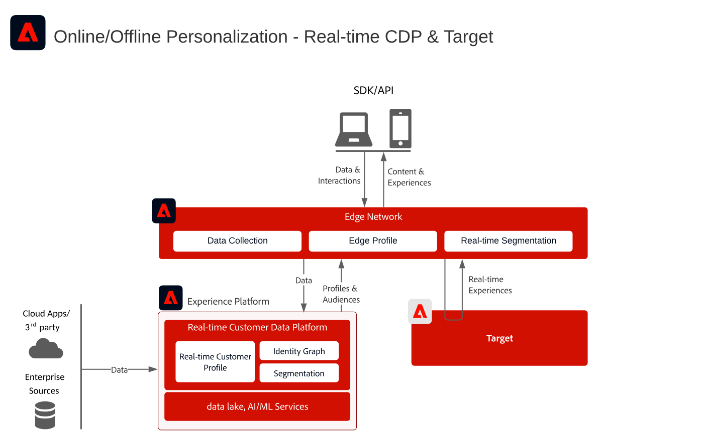
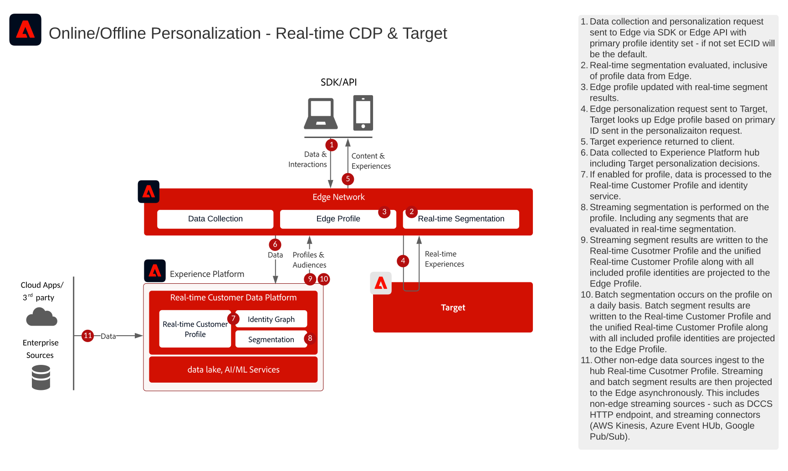

# Adobe Target과 실시간 고객 데이터 플랫폼 통합

## 사용 사례

* 알려진 고객 데이터를 사용한 온라인 개인화
* 랜딩 페이지 최적화
* 이전 제품/콘텐츠 조회, 제품/콘텐츠 관련성, 환경 요인 및 인적 특성과 더불어 거래, 충성도 및 CRM 데이터 등 오프라인 인사이트와 모델에서 도출한 인사이트를 기반으로 한 개인화.
* Adobe Target을 사용하여 웹 사이트 및 모바일 앱에서 실시간 고객 데이터 플랫폼에 정의된 대상을 공유하고 타깃팅할 수 있습니다

## 애플리케이션

* [!UICONTROL Real-time Customer Data Platform]
* Adobe Target

### 참조 설명서

* [Real-time Customer Data Platform용 Adobe Target 연결](https://experienceleague.adobe.com/docs/experience-platform/destinations/catalog/personalization/adobe-target-connection.html)
* [Edge Datastream 구성](https://experienceleague.adobe.com/docs/experience-platform/edge/fundamentals/datastreams.html?lang=ko)

## 통합 패턴

| 통합 패턴 | 기능 | 필요 조건 |
|--------------------|------------|---------------|
| **실시간 고객 데이터 플랫폼에서 Target으로 공유되는 Edge에 대한 실시간 세그먼트 평가** | - Edge에서 동일한 페이지 또는 다음 페이지 개인화에 대해 실시간으로 대상자를 평가합니다.  - 스트리밍 또는 일괄 처리 방식으로 평가된 모든 세그먼트는 에지 세그먼트 평가 및 개인화에 포함되도록 Edge Network에도 투영됩니다. | - 웹/모바일 SDK을 구현하거나 Edge Network Server API를 구현해야 합니다.  - Target 및 Experience Platform 확장이 활성화된 Experience Edge에서 데이터 스트림을 구성해야 합니다.  - Target 대상은 Real-time Customer Data Platform 대상에 구성해야 합니다.  - Target과 통합하려면 Experience Platform 인스턴스와 동일한 IMS 조직이어야 합니다. |
| **Edge 접근 방식을 통해 Real-time Customer Data Platform에서 Target으로 스트리밍 및 일괄 대상자 공유** | - Edge 네트워크를 통해 Real-time Customer Data Platform에서 Target으로 스트리밍 및 일괄 처리 대상자를 공유합니다.  - 실시간으로 평가되는 대상에는 웹 SDK 및 Edge Network 구현이 필요합니다. | - Target의 웹/모바일 SDK 또는 Edge API 구현은 Target에 스트리밍 및 일괄 RTCDP 대상을 공유하는 데 필요하지 않지만 실시간 에지 세그먼트 평가를 활성화하는 데 필요합니다.  - AT.js를 사용하는 경우 ECID ID 네임스페이스에 대한 프로필 통합만 지원합니다.  - Edge에서 사용자 지정 ID 네임스페이스 조회를 수행하려면 웹 SDK/Edge API를 배포해야 하며 각 ID는 ID 맵에서 ID로 설정해야 합니다.  - Target 대상은 Real-time Customer Data Platform 대상에 구성해야 합니다. RTCDP의 기본 프로덕션 샌드박스만 지원됩니다.  - Target과 통합하려면 Experience Platform 인스턴스와 동일한 IMS 조직이어야 합니다. |
| **대상 공유 서비스 접근 방식을 통해 Real-time Customer Data Platform에서 Target 및 Audience Manager으로 대상 공유 스트리밍 및 일괄 처리** | - 이 통합 패턴은 Audience Manager의 서드파티 데이터 및 대상의 추가 보강이 필요한 경우 활용할 수 있습니다. | - 웹/모바일 SDK은 Target에 스트리밍 및 배치 대상을 공유하는 데 필요하지 않지만 실시간 에지 세그먼트 평가를 활성화하는 데 필요합니다.  - AT.js를 사용하는 경우 ECID ID 네임스페이스에 대한 프로필 통합만 지원합니다.  - Edge에서 사용자 지정 ID 네임스페이스 조회를 수행하려면 웹 SDK/Edge API를 배포해야 하며 각 ID는 ID 맵에서 ID로 설정해야 합니다.  - 대상 공유 서비스를 통한 대상 프로젝션을 구축해야 합니다.  - Target과 통합하려면 Experience Platform 인스턴스와 동일한 IMS 조직이 필요합니다.  - 기본 프로덕션 샌드박스의 대상자만 핵심 서비스를 공유하는 대상을 지원합니다. |

## Adobe Target으로 실시간, 스트리밍, 일괄 처리 대상자 공유하기

아키텍처

시퀀스 세부 사항

아키텍처 개요

## 구현 패턴

알려진 고객 개인화는 몇 가지 구현 방법을 통해 지원됩니다.

### 웹/모바일 SDK 또는 [!DNL Edge Network] API를 사용하는 구현 패턴 1 - [!DNL Edge Network]&#x200B;(권장 방법)

* 웹/모바일 SDK에서 [!DNL Edge Network]을(를) 사용 중입니다. 실시간 Edge 세분화를 사용하려면 Web/Mobile SDK 또는 Edge API 구현 방법이 필요합니다.
* SDK 기반 구현은 [Experience Platform 웹 및 모바일 SDK 블루프린트를 참조하십시오](../experience-platform/deployment/websdk.md).
* Mobile SDK에서 사용하려면 [Adobe Journey Optimizer - Decisioning 확장](https://developer.adobe.com/client-sdks/edge/adobe-journey-optimizer-decisioning/)이 설치되어 있어야 합니다.
* [Edge 프로필을 사용한 Adobe Target의 API 기반 구현은  [!DNL Edge Network] Server API](https://experienceleague.adobe.com/docs/experience-platform/edge-network-server-api/overview.html?lang=ko)를 참조하십시오.

### 구현 패턴 2 - 애플리케이션별 SDK

기존 애플리케이션별 SDK를 사용합니다(예: AT.js, AppMeasurement.js). 이 구현 방법은 실시간 Edge 세그먼트 평가를 지원하지 않습니다. 그러나 이 구현 방법은 Experience Platform 허브에서 스트리밍 및 일괄 처리 대상자를 공유하는 작업을 지원합니다.

[Adobe Target 커넥터 설명서를 참조하세요](https://experienceleague.adobe.com/en/docs/experience-platform/destinations/catalog/personalization/adobe-target-connection)
[애플리케이션별 SDK 블루프린트 참조](../experience-platform/deployment/appsdk.md)

## 구현 시 고려 사항

* [!DNL Edge Network] 및 웹 SDK과 함께 위에 요약된 구현 패턴 1을 활용할 때 모든 기본 ID를 활용할 수 있습니다.
* RTCDP에 이전에 수집된 알려진 고객 데이터를 사용하여 첫 번째 로그인을 개인화하려면 개인화 요청에 실시간 고객 데이터 플랫폼의 알려진 고객 ID 그래프와 일치하는 기본 ID가 있어야 합니다. 기본 ID가 ECID 또는 알려진 고객 프로필과 아직 결합되지 않은 ID로 설정된 경우 ID 결합이 에지에서 실현되고 에지 개인화가 이전에 수집된 알려진 고객 데이터를 포함하는 데 몇 분이 소요됩니다.
* Edge 프로필에는 현재 14일 TTL이 있습니다. 따라서 사용자가 에지에서 14일 동안 로그인하지 않았거나 활성 상태였던 경우 에지의 프로필이 만료될 수 있으므로 에지는 허브에서 프로필을 가져와야 이전에 수집된 프로필 속성 및 세그먼트를 포함하는 개인화에 대한 내역 프로필 보기를 사용할 수 있으며, 이렇게 하면 후속 페이지 보기 및 첫 번째 로그인에서 발생하는 프로필 내역 보기에 대한 개인화가 발생합니다.

## 관련 설명서

### SDK 설명서

* [Experience Platform Web SDK 설명서](https://experienceleague.adobe.com/docs/experience-platform/edge/home.html?lang=ko)
* [Experience Platform 태그 설명서](https://experienceleague.adobe.com/docs/experience-platform/tags/home.html?lang=ko)
* [Experience Cloud ID 서비스 설명서](https://experienceleague.adobe.com/docs/id-service/using/home.html?lang=ko)

### 세분화 설명서

* [Experience Platform 세분화 개요](https://experienceleague.adobe.com/docs/experience-platform/segmentation/home.html?lang=ko)
* [실시간 세분화](https://experienceleague.adobe.com/docs/experience-platform/segmentation/ui/edge-segmentation.html?lang=ko)
* [세분화 스트리밍](https://experienceleague.adobe.com/docs/experience-platform/segmentation/api/streaming-segmentation.html?lang=ko)
* [Adobe Analytics 세그먼트를 Adobe Audience Manager를 통해 공유](https://experienceleague.adobe.com/docs/analytics/components/segmentation/segmentation-workflow/seg-publish.html?lang=ko)
* [병합 정책 구성](https://experienceleague.adobe.com/docs/experience-platform/profile/merge-policies/ui-guide.html?lang=ko#create-a-merge-policy)

### 튜토리얼

* [Real-Time CDP와 Adobe Target을 사용한 다음 방문 개인화](https://experienceleague.adobe.com/docs/platform-learn/tutorials/experience-cloud/next-hit-personalization.html?lang=ko)
