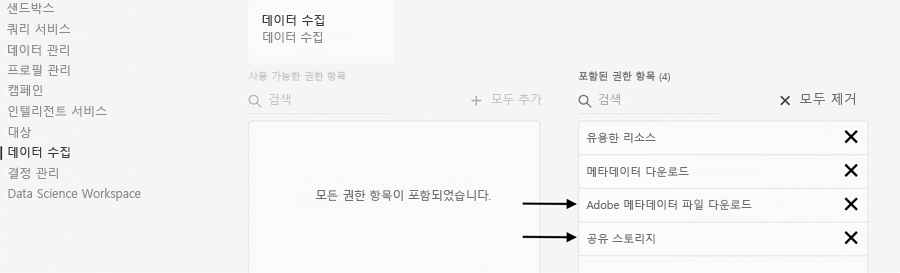
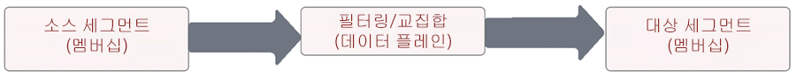
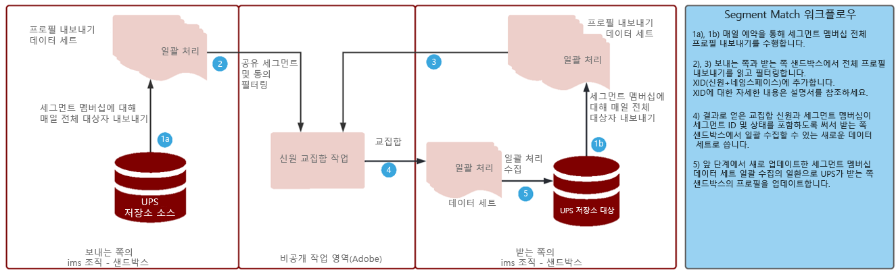

# Segment Match

Segment Match를 통해 파트너 브랜드끼리 각자의 Experience Platform 환경 전반에 걸쳐 대상자를 공유할 수 있습니다. 브랜드의 핵심은 고객과의 직접적인 관계에서 수집한 데이터를 바탕으로 고객과 교류하는 것입니다. 거버넌스, 권한, 환경 설정 관리 시스템이 좋아지면 마케터가 주요 파트너에 대해 퍼스트파티 인증된 대상자의 정밀도를 더욱 향상시킬 수 있습니다.

[!UICONTROL Segment Match]는 AEP(Experience Platform) 고객들(이하 _파트너_)이 업계의 공통 식별자를 기반으로 안전하고 철저히 관리할 수 있으며 개인 정보 보호에 친화적인 방식으로 세그먼트 데이터를 교환할 수 있도록 해 주는 데이터 공동 작업 서비스입니다.

이 서비스를 통해 고객은 전체 데이터베이스를 공개하지 않고도 안전하고 중립적인 방식으로 일치하는 ID를 안전하게 식별할 수 있습니다. 파트너는 범위가 겹치는 ID에 대해 지정한 특성(세그먼트 이름)만 수신하므로 제어할 수 있는 동의 기반 방식으로 빠르고 간단한 공유가 가능합니다.

[!UICONTROL Segment Match]는 AEP 데이터 거버넌스 및 동의 프레임워크를 중추로 사용합니다. 모든 B2C 및 B2P Real-time Customer Data Platform 고객은 이 서비스를 사용할 수 있습니다. [!UICONTROL [!UICONTROL Segment Match]]의 주요 기능:

* 동의한 교집합 고객에 대한 세그먼트 공유
* 교집합 보고서 사전 공유로 예상 일치량 인사이트 제공
* 완전히 통합된 DULE 정책 및 권한 적용
* 데이터 공유 동의 프레임워크 중추
* 데이터 피드를 통한 세그먼트 및 파트너 정리

## 애플리케이션

브랜드-퍼블리셔:

서드파티 쿠키 및 모바일 광고 ID 데이터의 사용이 종료되면서 &#39;퍼블리셔 사용 사례&#39;가 가장 큰 영향을 받게 됩니다. 이 사용 사례는 광고를 판매하는 데 중점을 둔 비즈니스 모델을 사용하는 미디어 및 엔터테인먼트 업계에 큰 영향을 줍니다. [!UICONTROL Segment Match]는 대규모 퍼스트파티 대상자를 갖추고 광고주와 직접 공동 작업하려는 퍼블리셔에게 길을 열어 줍니다. 광고주는 퍼블리셔와 직접 공동 작업하여 퍼블리셔 속성에서 일치하는 대상자에게 광고함으로써 세부적인 타겟팅 또는 예측 캠페인을 진행할 수 있습니다.

### 브랜드-브랜드

소비자 여정은 결코 직선 형태가 아닙니다. 예를 들어 한 고객이 특정 항공사와 특정 신용 카드 회사의 단골일 수 있습니다. 이 항공사와 신용 카드 회사가 [!UICONTROL Segment Match]를 사용하면 데이터 파트너십을 만들어 교집합이 되는 대상자를 파악한 다음 오퍼를 맞춤화하여 각 회사의 단골 소비자에게 개인화된 경험을 제공할 수 있습니다.

### BU-BU

전 세계의 다국적 기업들은 독립적으로 운영하는 BU(사업 부문) 간 데이터 공동 작업에 어려움을 겪고 있습니다. BU마다 다른 개인 정보 보호 정책, 정보 획득 또는 권한 관리 때문에 단일 샌드박스에 데이터를 결합할 수 없을 수도 있습니다.

[!UICONTROL Segment Match]는 대규모 조직의 서로 전혀 다른 마케팅 팀이 독립적으로 운영하면서도 보다 효율적으로 공동 작업을 진행하는 데 도움이 됩니다.

## 아키텍처


[!UICONTROL Segment Match]는 데이터를 구입할 수 있는 데이터 시장이 아닙니다. 선택한 파트너의 퍼스트파티 데이터로 작동하며 개인 정보 보호 및 동의 제어를 사용하여 공동 작업을 돕는 AEP 기능입니다. [!UICONTROL Segment Match]는 고객 관계를 개선하고 브랜드를 성장시키는 데 중점을 둡니다. 기존에 브랜드나 파트너 관계가 존재하는 경우에 유용합니다. [!UICONTROL Segment Match]의 경험은 관리가 쉽고 확장이 가능하며, 관리자가 옵트인 기반의 제어 가능한 방식으로 세그먼트를 공유할 수 있도록 해 줍니다.

[!UICONTROL Segment Match]로 할 수 있는 일:

* 해시 처리한 이메일 또는 전화 번호 등 표준 사용자 수준 식별자를 사용하여 세그먼트 멤버십 데이터를 조직 간에 안전하게 이동
* 대상자 공유 UI 및 알림 워크플로우
* 사전 공유 교집합 예상치
* 직접 진행하는 파트너 설정
* 선택한 표준 네임스페이스(해시 처리한 이메일, 해시 처리한 전화 번호, ECID, IDFA, GAID)의 교집합 확인
* 데이터 공유 동의 적용
* 공유 대상자 수명 주기 관리
* 워크플로우 공유에 DULE 적용
* 매일 일괄 처리 업데이트

[!UICONTROL Segment Match]를 통해 상호 연결된 고객 경험을 만들 수 있습니다. 지원하는 지속 식별자에는 해시 처리한 이메일, 해시 처리한 전화번호와 ECID, IDFA, GAID 등 식별자가 있습니다. 고객은 브랜드 샌드박스 간에 대상자 데이터를 맞추고 이동하는 피드를 작성할 수 있습니다. 이 피드는 강력한 거버넌스, 투명성, 광고 및 마케팅 활성화에 사용할 수 있는 해지 기능을 갖추고 있습니다.

## 필요 조건

[!UICONTROL Segment Match] 사용을 위한 필요 조건:

* RT-CDP 활성 라이선스
* 지원하는 표준 해시 처리 식별자는 SHA256 해시 처리 이메일, 해시 처리 전화번호, ECID, Apple IDFA, GAID
* 개인 정보 보호 프레임워크 및 동의 전략
* 고객 간 데이터 공유 약정 준비 완료

## 보안

### RBAC

[!UICONTROL Segment Match]의 파트너 관리 플로우는 RBAC에 의해 보호됩니다. 권한이 있는 개인만이 파트너를 시작, 수락 또는 관리할 수 있습니다. 이 작업은 [제품 프로필]의 [데이터 수집] 섹션에서 수행할 수 있습니다. 다음 권한이 필요합니다.



| 권한 | 설명 |
|---|---|
| **대상자 공유 연결 관리** | 이 권한이 있으면 두 IMS 조직을 연결하여 [!UICONTROL Segment Match] 플로우를 활성화하기 위한 파트너 약정 프로세스를 완료할 수 있습니다. |
| **대상자 공유 관리** | 이 권한이 있으면 활성 파트너(**대상자 공유 연결** 액세스가 있는 관리자인 사용자가 연결한 파트너)에 대해 피드([!UICONTROL Segment Match]에서 사용하는 데이터 패키지)를 만들고 편집하고 게시할 수 있습니다. |

권한에 대한 자세한 내용은 [공식 설명서](https://experienceleague.adobe.com/docs/experience-platform/segmentation/ui/segment-match/overview.html?lang=ko#understanding-segment-match-permissions)를 참조하세요.

### Connect ID

파트너 연결 프로세스를 관리하는 것은 특정 AEP 샌드박스에 매핑되는 임의 생성 식별자인 **[!UICONTROL Connect ID]**&#x200B;입니다. 파트너 샌드박스를 시작 및 관리하려면 이 Connect ID가 필요합니다. 필요한 경우 Connect ID를 재생성하여 파트너 연결을 다시 구성할 수도 있습니다.

### 거버넌스

*C11* 계약 레이블을 사용하는 모든 데이터 세트 또는 데이터 속성에 대해서는 [!UICONTROL Segment Match] 서비스가 제한됩니다. 해당 속성을 사용하는 세그먼트는 [!UICONTROL Segment Match]에 사용할 수 없습니다. 이는 [!UICONTROL Segment Match]에 사용이 가능/불가능한 세그먼트에 대한 제어를 제공합니다. 또한 만드는 사용자 정의 정책 및 마케팅 작업에도 규정이 적용됩니다. 정책은 기본적으로 비활성화되어 있으며 정책을 적용하려면 활성화해야 합니다. 세그먼트를 공유할 때 선택한 이메일 마케팅 및 온사이트 광고 등의 제한 사항도 파트너에게 전파 및 공유됩니다.

### 동의

[!UICONTROL Segment Match]의 동의 설정을 관리하는 방법:

* 조직 수준에서는 온보딩 시 동의 확인에 대해 옵트아웃 또는 옵트인 설정을 사용합니다.

   이 설정은 사용자 데이터를 공유할 수 있는지 여부를 결정합니다. 기본값은 옵트아웃으로 설정되며, 이는 AEP 고객이 이미 데이터 공유 용도에 대해 필요한 동의 약정을 갖추었다는 가정 하에 사용자 데이터를 공유할 수 있다는 뜻입니다. Adobe 계정 관리자에게 문의하여 이 설정을 옵트인으로 변경하면 AEP 고객이 명시적으로 동의를 추적하도록 하는 추가 확인을 진행할 수 있습니다.

* [동의 및 환경 설정 필드 그룹](https://experienceleague.adobe.com/docs/experience-platform/xdm/field-groups/profile/consents.html?lang=ko)을 사용하여 신원 특정적 속성(idSpecific) 공유를 설정합니다.

   이 필드 그룹은 환경 및 기본 설정 정보를 캡처할 수 있도록 단일 객체 유형 필드인 동의 필드를 제공합니다. [!UICONTROL Segment Match]는 명시적으로 옵트아웃하지 않은 모든 ID를 기본적으로 포함합니다. 예:

   ```
   "share": {
   `                `"val": "n"
   `     `}
   ```

   이 설정은 Adobe 계정 관리자에게 문의하여 명시적으로 옵트인한 ID만 포함하도록 변경할 수 있습니다. 예:

   ```
   "share": {
   `                `"val": "y"
   `     `}
   ```

### 경고

파트너 연결을 시작하거나 세그먼트 피드를 파트너와 공유할 때 경고가 생성됩니다.

## 설정 워크플로우

파트너 연결 설정 워크플로우는 위에서 언급한 대로 RBAC를 통해 관리됩니다. 올바른 권한이 있는 경우 파트너 샌드박스에 연결하려면 파트너 조직 내에 있는 해당 샌드박스/인스턴스의 Connect ID를 공유해야 합니다.

안전한 파트너 설정을 위하여 보내는 파트너가 연결을 요청한 뒤 수신 측에서 승인해야 합니다. 파트너 연결 약정을 하면 두 조직 간에 약정이 존재한다는 것을 확인할 수 있어 Adobe가 조직을 대신하여 [!UICONTROL Segment Match] 프로세스를 활성화할 수 있습니다. 연결의 승인을 완료하여 활성 상태로 만들면 양측에서 세그먼트 공유 프로세스를 시작할 수 있습니다.

### 세그먼트 공유

파트너와의 세그먼트 공유는 선택한 식별자에 일치하는 항목이 있을 때만 발생합니다. 세그먼트를 여러 파트너와 공유하는 일대다 파트너 관계도 만들 수 있습니다.

파트너 연결을 설정한 후에 세그먼트 공유를 시작하려면 보내는 쪽 파트너가 피드를 만들어야 합니다. 그 뒤 지속 식별자와 더불어 세그먼트 데이터를 제외해야 하는 마케팅 사용 사례 또는 작업을 선택합니다. 이렇게 하면 관련 세그먼트를 피드에 추가하여 공유할 수 있습니다.

보내는 쪽 파트너는 이 세그먼트 공유 워크플로우의 일환으로 데이터를 옮기기 전에 예상 교집합을 통해 잠재적 고가치 세그먼트를 찾을 수 있습니다.

전체 프로세스의 플로우는 다음과 같습니다.



이 교집합 예상치를 통해 핵심 인사이트를 확인하고 파트너를 탐색하며 데이터 공동 작업 약정의 원동력이 될 데이터를 얻을 수 있습니다. 이 교집합 예상치 지표를 얻기 위해 고객 또는 세그먼트 데이터를 샌드박스 간에 옮길 필요는 없습니다. 어떤 샌드박스에서든 고객이 선택하고 사전 해시 처리한 적용 가능 신원을 확률론적 데이터에 추가함으로써 Adobe가 해당 신원 집합의 합집합 및 교집합 연산을 처리할 수 있습니다. 이 연산은 [!UICONTROL Segment Match]가 실제 값을 비교할 필요 없이 서로 다른 두 샌드박스에서 가져온 신원으로 구성한 두 데이터 구조에 대해 예상 교집합을 확인하는 데 도움이 됩니다.

신원 교집합 프로세스는 보내는 쪽과 받는 쪽의 샌드박스 양쪽에서 **매일 전체 프로필 내보내기**&#x200B;로 가져온 데이터 세트에 의존하여 공유 세그먼트에 속하는 공통 프로필을 식별합니다. 이 교집합 프로세스의 자세한 프로세스 플로우는 아래와 같습니다.



보내는 파트너의 세그먼트 공유가 완료되면 받는 파트너는 세그먼트 피드 공유에 대한 알림을 받습니다. 세그먼트 멤버십 데이터 플로우를 시작하려면 받는 쪽의 프로필에서 이 세그먼트 피드를 사용하도록 설정해야 합니다. 받는 IMS 조직의 교집합 프로필 조각에서는 세그먼트 멤버십만 수집하며, 그 외에 보내는 쪽에서 받는 쪽으로 전송되는 신원은 없습니다.

공유한 세그먼트는 **[!UICONTROL Segment Builder]**&#x200B;의 **[!UICONTROL 대상자]** 탭에 있는 `AEPSegmentMatch` 섹션에 있으며, 받는 쪽 샌드박스에서 세그먼트를 작성할 때 대상자를 포함 또는 제외하는 데 사용할 수 있습니다.

매일 진행하는 교집합 프로세스를 통해 보내는 쪽과 받는 쪽 간 세그먼트 멤버십의 동기화 상태를 유지합니다. 받는 파트너는 받는 세그먼트 피드에 대해 프로필을 비활성화하여 세그먼트 공유 프로세스를 일시적으로 중단할 수 있습니다.

#### 세그먼트 종료/시작

전체 프로필 내보내기의 일환으로, 프로필에 대한 세그먼트 멤버십 아래에 있는 공유 세그먼트 ID의 상태는 해당하는 값(_실현_, _종료_ 또는 _있음_) 중 하나를 가져 현재 상태를 반영합니다.

일간 신원 교집합 프로세스 중 해당 신원이 받는 쪽 샌드박스에 있는 경우 공유 세그먼트에 대한 이 세그먼트 멤버십 상태를 받는 쪽으로 보내어 수집할 수 있도록 합니다.

#### 세그먼트 해지

보내는 파트너가 세그먼트를 해지/삭제하는 것은 온디맨드 프로세스로 받은 파트너로부터 해지한 세그먼트 ID의 모든 프로필 목록을 받게 됩니다. 해당 신원의 세그먼트 멤버십에서 이 세그먼트 ID를 제거한 뒤 받는 파트너가 다시 수집합니다. 이 작업은 기존 세그먼트 멤버십 조각을 덮어씀으로써 해당 세그먼트의 멤버십을 삭제합니다.

## 추가 정보

* [Segment Match](https://experienceleague.adobe.com/docs/experience-platform/segmentation/ui/segment-match/overview.html?lang=ko#)
* [권한](https://experienceleague.adobe.com/docs/experience-platform/access-control/home.html?lang=ko)
* [문제 해결](https://experienceleague.adobe.com/docs/experience-platform/segmentation/ui/segment-match/troubleshooting.html?lang=ko)
* [XID](https://experienceleague.adobe.com/docs/experience-platform/identity/api/list-native-id.html?lang=ko)
