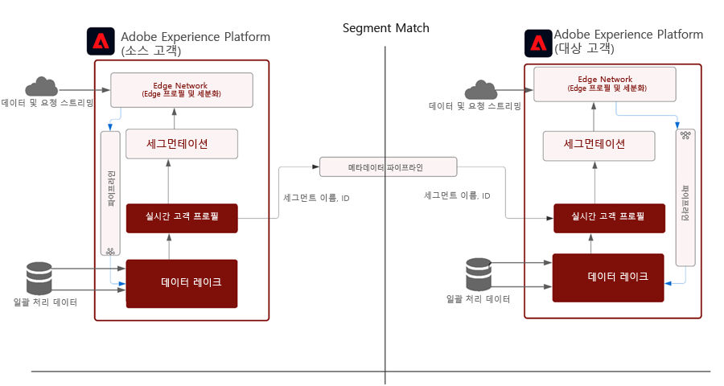

# 세그먼트 일치

세그먼트 일치 기능을 사용하면 파트너 브랜드가 각 Experience Platform 환경에서 대상을 공유할 수 있습니다. 브랜드의 핵심은 고객과의 직접적인 관계에서 수집한 데이터를 바탕으로 고객과 교류하는 것이다. 마케터는 향상된 거버넌스, 권한 및 기본 설정 관리 시스템을 사용하여 주요 파트너와 함께 자사 인증 대상을 더 향상시킬 수 있습니다.

[!UICONTROL 세그먼트 일치] 는 AEP(Experience Platform) 고객(이하 &quot;라고 함)을 허용하는 데이터 공동 작업 서비스입니다 _파트너_)을 사용하여 보안, 제어 및 개인 정보 보호 방식으로 일반적인 업계 식별자를 기반으로 세그먼트 데이터를 교환합니다.

이 서비스를 통해 고객은 전체 데이터베이스를 공개하지 않고도 안전하고 중립적인 방식으로 일치하는 ID를 안전하게 식별할 수 있습니다. 파트너는 지정된 특성(세그먼트 이름)만 겹치는 ID에 대해 수신하므로 제어가능한 동의 제어 방식으로 빠르고 쉽게 공유할 수 있습니다.

[!UICONTROL 세그먼트 일치] 에서는 AEP 데이터 거버넌스 및 동의 프레임워크를 핵심 요소로 사용합니다. 모든 B2C 및 B2P Real-time Customer Data Platform 고객이 사용할 수 있습니다. 의 주요 기능 [!UICONTROL [!UICONTROL 세그먼트 일치]] 포함:

* 동의 고객이 겹치는 세그먼트 공유
* 예상 일치 볼륨에 대한 통찰력을 위한 사전 공유 중복 보고서
* 완벽한 통합 DULE 정책 및 권한 적용
* 데이터 공유 동의 프레임워크 백본
* 세그먼트 및 파트너를 구성하기 위한 데이터 피드

## 애플리케이션

Brand to Publisher:

게시자 사용 사례는 타사 쿠키 및 모바일 광고 ID 데이터의 사용 중단으로 가장 큰 영향을 받습니다. 이 사용 사례는 비즈니스 모델로 광고를 판매하는 데 중점을 둔 미디어 및 엔터테인먼트 업계에 큰 영향을 줍니다. [!UICONTROL 세그먼트 일치] 는 광고주와 직접 공동 작업하려는 대규모 자사 대상이 있는 게시자를 위한 경로입니다. 광고주는 세부적인 타깃팅 또는 예측 캠페인을 위해 게시자 속성에서 일치하는 대상을 광고하기 위해 게시자와 직접 작업할 수 있습니다.

### 브랜드로

소비자 여정은 결코 선형적이지 않습니다. 예를 들어 고객이 항공사 및 신용 카드 회사에 충성할 수 있습니다. 사용 [!UICONTROL 세그먼트 일치]와(과) 항공 및 신용 카드 회사는 데이터 파트너십을 만들어 중복되는 대상을 파악한 다음, 오퍼를 맞춤화하여 각 회사의 단골 소비자에게 경험을 개인화할 수 있습니다.

### 부투 부

전 세계 다국적 기업들은 독립적인 운영 사업부 간에 데이터 협업을 통해 어려움을 겪고 있습니다. 다양한 개인 정보 보호 정책, 획득 또는 BU의 권한 관리 때문에 단일 샌드박스에 데이터를 결합할 수 없습니다.

[!UICONTROL 세그먼트 일치] 은 대규모 조직의 서로 다른 마케팅 팀이 보다 효율적으로 공동으로 작업하면서 독립적으로 작업을 수행할 수 있도록 지원합니다

## 아키텍처



[!UICONTROL 세그먼트 일치] 는 데이터를 구입할 수 있는 데이터 마켓플레이스가 아닙니다. 개인 정보 보호 및 동의 컨트롤을 사용하여 공동 작업을 지원하는 AEP 기능은 일부 파트너와 함께 작동하는 자사 데이터와 함께 작동합니다. [!UICONTROL 세그먼트 일치] 는 고객 관계를 개선하고 브랜드를 성장시키는 데 중점을 둡니다. 기존 브랜드나 파트너 관계가 존재하는 것이 유용합니다. [!UICONTROL 세그먼트 일치] 경험은 쉽게 관리 및 확장되며, 관리자가 옵트인하고 제어할 수 있는 방식으로 세그먼트를 공유할 수 있도록 해줍니다.

[!UICONTROL 세그먼트 일치] 사용:

* 해시된 이메일 또는 전화 번호와 같은 표준 사용자 수준 식별자를 사용하여 조직 간에 안전하게 포팅할 세그먼트 멤버십 데이터
* 알림이 있는 UI 및 워크플로우를 공유하는 대상
* 미리 공유된 겹치기 예상
* 셀프 서비스 파트너 설정
* 일부 표준화된 네임스페이스(해시된 이메일, 해시된 전화, ECID, IDFA, GAID)와 겹칩니다
* 데이터 공유 동의 적용
* 공유 대상 수명 주기 관리
* 워크플로우 공유의 DULE 적용
* 일별 배치 업데이트

[!UICONTROL 세그먼트 일치] 를 통해 상호 연결된 고객 경험을 만들 수 있습니다. 지원되는 내구성 식별자는 해시된 이메일, 해시된 전화번호 및 ECID, IDFA 및 GAID와 같은 식별자입니다. 고객은 광고 및 마케팅 활동에 사용할 수 있는 강력한 거버넌스, 투명성 및 해지 기능을 사용하여 브랜드 샌드박스 간 대상 데이터와 일치하고 이동하는 피드를 작성할 수 있습니다

## 사전 요구 사항

의 사전 요구 사항 [!UICONTROL 세그먼트 일치] 입니다.

* RT-CDP 활성 라이센스 부여
* 지원되는 표준 해시된 식별자는 SHA256 해시된 이메일, 해시된 휴대폰, ECID, Apple IDFA 및 GAID입니다
* 개인 정보 프레임워크 및 동의 전략
* 고객 간의 데이터 공유 계약

## 보안

### RBAC

다음 [!UICONTROL 세그먼트 일치] 파트너를 관리하기 위한 플로우는 RBAC에 의해 보호됩니다. 권한이 있는 개인만 파트너를 시작, 수락 또는 관리할 수 있습니다. 이 작업은 제품 프로필의 데이터 수집 섹션에서 수행할 수 있습니다. 다음 권한이 필요합니다.


| 권한 | 설명 |
|---|---|
| **대상 공유 연결 관리** | 이 권한을 사용하면 두 IMS 조직을 연결하는 파트너 핸드셰이크 프로세스를 완료하여 [!UICONTROL 세그먼트 일치] 흐름. |
| **대상 공유 관리** | 이 권한을 사용하면 피드(에 사용되는 데이터 패키지)를 만들고, 편집하고, 게시할 수 있습니다 [!UICONTROL 세그먼트 일치]) 활성 파트너(관리자 사용자가 **대상 공유 연결** 액세스). |

자세한 내용은 [공식 문서](https://experienceleague.adobe.com/docs/experience-platform/segmentation/ui/segment-match/overview.html?lang=en#understanding-segment-match-permissions) 권한에 대해 자세히 알아보십시오.

### Connect ID

파트너 연결 프로세스는 **[!UICONTROL Connect ID],** 특정 AEP 샌드박스에 매핑되는 임의로 생성된 식별자입니다. 파트너 샌드박스를 시작 및 관리하려면 이 Connect ID가 필요합니다. 필요한 경우 Connect ID를 재생성하여 파트너 연결을 다시 구성할 수도 있습니다.

### 거버넌스

다음을 사용하는 모든 데이터 세트 또는 데이터 속성 *C11* 계약 레이블은 [!UICONTROL 세그먼트 일치] 서비스. 이러한 속성을 사용하는 세그먼트는에 사용할 수 없습니다 [!UICONTROL 세그먼트 일치]. 세그먼트를 사용할 수 있거나 사용할 수 없는 컨트롤을 제공합니다 [!UICONTROL 세그먼트 일치]. 또한 만든 사용자 지정 정책 및 마케팅 작업도 적용됩니다. 기본적으로 정책은 비활성화되며 적용을 위해 활성화되어야 합니다. 세그먼트를 공유하는 동안 선택한 이메일 마케팅 및 온사이트 광고와 같은 제한 사항도 파트너와 전파되고 공유됩니다.

### 동의

에 대한 동의 설정 [!UICONTROL 세그먼트 일치] 는 다음과 같은 방법으로 관리할 수 있습니다.

* 조직 수준에서 온보딩 중에 동의 확인에 옵트아웃 또는 옵트인 설정을 사용합니다.

   이 설정은 사용자 데이터를 공유할 수 있는지 여부를 결정합니다. 기본값은 옵트아웃으로 설정되며, 사용자 데이터를 AEP 고객이 이미 데이터 공유 사용에 대한 필수 동의 계약을 가지고 있다고 가정합니다. 이 설정은 Adobe 계정 관리자에게 연락하여 AEP 고객이 명시적으로 동의를 추적하도록 하기 위해 추가 검사를 수행함으로써 옵트인으로 변경할 수 있습니다.

* ID(idSpecific)에 고유한 공유 속성을 [동의 및 환경설정 필드 그룹](https://experienceleague.adobe.com/docs/experience-platform/xdm/field-groups/profile/consents.html?lang=en).

   이 필드 그룹은 동의 및 기본 설정 정보를 캡처하기 위해 단일 객체 유형 필드인 동의 필드를 제공합니다. [!UICONTROL 세그먼트 일치]기본적으로 은 명시적으로 옵트아웃되지 않은 모든 ID를 포함합니다. 예:

   ```
   "share": {
   `                `"val": "n"
   `     `}
   ```

   이 설정은 명시적 옵트인이 있는 ID만 포함하도록 Adobe 계정 관리자에게 연락하여 변경할 수 있습니다. 예:

   ```
   "share": {
   `                `"val": "y"
   `     `}
   ```

### 경고

경고는 파트너 연결이 시작되거나 세그먼트 피드가 파트너와 공유될 때 생성됩니다.

## 워크플로우 설정

파트너 연결 설정을 위한 워크플로우는 위에서 언급한 대로 RBAC를 통해 관리됩니다. 올바른 권한이 있는 경우 파트너 샌드박스에 연결하려면 파트너 조직 내에서 해당 샌드박스/인스턴스의 연결 ID를 공유해야 합니다.

전송 파트너로부터 연결이 요청되면, 안전하고 안전한 파트너 설정을 위해서는 수신 측에서 승인을 받아야 합니다. 파트너 연결 핸드셰이크는 두 조직 간에 계약이 존재하며 Adobe이 이 작업을 용이하게 할 수 있도록 합니다 [!UICONTROL 세그먼트 일치] 조직을 대신하여 처리. 연결 승인됨 및 활성 상태에서는 양쪽에서 세그먼트 공유 프로세스를 시작할 수 있습니다.

### 세그먼트 공유

파트너와 공유하는 세그먼트 공유는 선택한 식별자에 일치하는 항목이 있을 때만 발생합니다. 일대다 파트너 관계가 있을 수 있으므로 세그먼트는 여러 파트너와 공유할 수 있습니다.

파트너 연결이 설정된 후에 세그먼트 공유를 시작하려면 전송 파트너가 피드를 만들어야 합니다. 그런 다음 내구성이 있는 식별자와 함께 세그먼트 데이터를 제외해야 하는 마케팅 사용 사례 또는 작업을 선택합니다. 그런 다음 공유를 위해 관련 세그먼트를 피드에 추가할 수 있습니다.

이 세그먼트 공유 워크플로우의 일부로서, 전송 파트너는 데이터가 이동되기 전에 예상되는 오버랩을 통해 잠재적 고값 세그먼트를 검색할 수 있습니다.

전체 프로세스 흐름은 다음과 같습니다.


이러한 중복 추정은 주요 통찰력, 파트너 검색 및 데이터를 제공하여 데이터 공동 작업 계약을 가속화합니다. 이러한 겹치기 예상 지표를 얻기 위해 샌드박스 간에 고객 또는 세그먼트 데이터가 이동되지 않습니다. 지정된 샌드박스에서 고객이 선택한 사전 해시된 적용 가능한 ID는 Adobe이 해당 ID 간의 결합 및 교차 작업을 수행할 수 있도록 하는 확률적 데이터 구조에 추가됩니다. 이러한 작업은 [!UICONTROL 세그먼트 일치] 실제 값을 비교할 필요 없이 두 개의 다른 샌드박스에서 id로 구성된 두 데이터 구조의 예상 교차를 가져옵니다

ID 겹치기 프로세스는 **일별 전체 프로필 내보내기** 공유 세그먼트에 속하는 공통 프로필을 식별하기 위해 보낸 사람과 받는 사람 샌드박스의 데이터 집합입니다. 중복 프로세스에 대한 자세한 프로세스 플로우는 다음과 같습니다.


전송 파트너로부터 세그먼트 공유가 완료되면 수신자는 공유된 세그먼트 피드에 대한 알림을 받습니다. 세그먼트 멤버십 데이터 플로우를 시작하려면 수신자의 프로필에서 이 세그먼트 피드를 사용하도록 설정해야 합니다. 세그먼트 멤버십만 수신자 IMS에 수집됩니다. 조직의 겹치는 프로필 조각과 발신자에서 수신자로 추가 ID가 전송되지 않습니다.

공유 세그먼트는 `AEPSegmentMatch` 섹션 **[!UICONTROL 대상]** 탭에서 다음을 수행합니다. **[!UICONTROL 세그먼트 빌더]** 및 는 받는 사람 샌드박스에서 세그먼트를 작성하는 동안 대상을 포함하거나 표시하지 않는 데 사용할 수 있습니다.

일별 겹치기 프로세스는 보낸 사람과 받는 사람 간에 세그먼트 멤버십을 계속 동기화합니다. 받는 사람은 세그먼트 공유 프로세스를 일시 중지하기 위해 받은 세그먼트 피드에 대해 프로필을 비활성화할 수 있습니다.

#### 세그먼트 종료/시작

전체 프로필 내보내기의 일부로, 프로필에 대한 세그먼트 멤버십 아래에 있는 공유 세그먼트-ID의 상태는 해당 값 중 하나를 갖습니다. _실현_, _종료한_, 또는 _기존_ 를 입력하여 현재 상태를 반영합니다.

일별 ID 겹치기 프로세스 중에 해당 ID가 수신자 샌드박스에 있는 경우 공유 세그먼트의 이러한 세그먼트 멤버십 상태가 수신을 위해 수신기로 전송됩니다.

#### 세그먼트 해지

보낸 사람으로부터 세그먼트 해지/삭제는 취소된 세그먼트 ID가 있는 모든 프로필 목록을 받는 온디맨드 프로세스입니다. 세그먼트-ID는 해당 ID의 세그먼트 멤버십에서 제거되고 수신기에서 다시 수집됩니다. 이 작업은 기존 세그먼트 멤버십 조각을 덮어쓰고 해당 세그먼트의 멤버십을 삭제합니다.

## 추가 정보

* [세그먼트 일치](https://experienceleague.adobe.com/docs/experience-platform/segmentation/ui/segment-match/overview.html?lang=en#)
* [권한](https://experienceleague.adobe.com/docs/experience-platform/access-control/home.html?lang=en)
* [문제 해결](https://experienceleague.adobe.com/docs/experience-platform/segmentation/ui/segment-match/troubleshooting.html?lang=en)
* [XID](https://experienceleague.adobe.com/docs/experience-platform/identity/api/list-native-id.html?lang=en)
