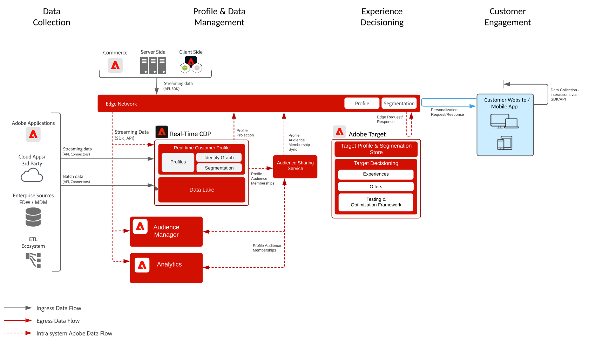

# 행동 기반 웹/모바일 개인화 블루프린트

온라인 행동과 대상자 데이터를 기반으로 개인화를 구현합니다.

## 사용 사례

* 랜딩 페이지 최적화
* 행동 타겟팅
* 이전 제품/콘텐츠 조회, 제품/콘텐츠 관련성, 환경 요인, 서드파티 대상자 데이터 및 인적 특성 기반 개인화

## 애플리케이션

* Adobe Target
* Adobe Analytics(선택 사항)
* Adobe Audience Manager(선택 사항)
* Adobe Real-time Customer Data Platform(선택 사항)

## 아키텍처

## 구현 패턴

웹/모바일 개인화 블루프린트는 다음과 같은 방법을 통해 구현할 수 있습니다(아래에서 설명).

1. [!UICONTROL Platform Web SDK] 또는 [!UICONTROL Platform Mobile SDK]와 [!UICONTROL Edge 네트워크] 사용 [Experience Platform 웹 및 모바일 SDK 블루프린트를 참조하십시오.](../experience-platform/deployment/websdk.md)
1. 기존 애플리케이션별 SDK 사용(예: AppMeasurement.js). [애플리케이션별 SDK 블루프린트 참조](../experience-platform/deployment/appsdk.md)

## 구현 단계

1. 웹 또는 모바일 애플리케이션에 [Adobe Target 구현](https://experienceleague.adobe.com/docs/target/using/implement-target/implementing-target.html?lang=ko)

### 구현 단계 - Audience Manager 또는 Adobe Analytics

1. [Adobe Audience Manager 구현](https://experienceleague.adobe.com/docs/audience-manager/user-guide/implementation-integration-guides/implement-audience-manager.html?lang=ko)
1. [Adobe Analytics 구현](https://experienceleague.adobe.com/docs/analytics/implementation/home.html?lang=ko)
1. [Experience Cloud ID 서비스 구현](https://experienceleague.adobe.com/docs/id-service/using/implementation/implementation-guides.html?lang=ko)

   >[!NOTE]
   >
   >애플리케이션 간에 대상자를 공유하려면 각 애플리케이션이 Experience Cloud ID를 사용해야 하며 동일한 Experience Cloud 조직의 일부여야 합니다.

1. [사람 및 대상자 공유 서비스(공유 대상자) 제공 요청](https://www.adobe.com/go/audiences)
1. [Adobe Analytics](https://experienceleague.adobe.com/docs/analytics/components/segmentation/segmentation-workflow/seg-build.html?lang=ko) 또는 [Adobe Audience Manager](https://experienceleague.adobe.com/docs/audience-manager/user-guide/features/segments/segment-builder.html?lang=ko)에서 세그먼트를 작성하고 [해당 대상자를 Experience Cloud에 공유하도록 구성](https://experienceleague.adobe.com/docs/analytics/components/segmentation/segmentation-workflow/seg-publish.html?lang=ko)(Audience Manager 또는 Adobe Analytics 사용 시)합니다.
1. 대상자가 Adobe Target에서 사용 가능해지면 이를 [Adobe Target을 통한 경험 타겟팅](https://experienceleague.adobe.com/docs/target/using/audiences/target.html?lang=ko)에 사용할 수 있습니다.

### 구현 단계 - Real-time Customer Data Platform

1. 수집할 데이터를 위한 [스키마를 만듭니다.](https://experienceleague.adobe.com/?recommended=ExperiencePlatform-D-1-2021.1.xdm&amp;lang=ko)
1. 수집할 데이터를 위한 [데이터 세트를 만듭니다.](https://experienceleague.adobe.com/docs/platform-learn/tutorials/data-ingestion/create-datasets-and-ingest-data.html?lang=ko)
1. 수집한 데이터를 통합 프로필로 결합할 수 있도록 스키마에 [올바른 ID와 ID 네임스페이스를 구성합니다](https://experienceleague.adobe.com/docs/platform-learn/tutorials/identities/label-ingest-and-verify-identity-data.html?lang=ko).
1. [프로필에 대해 스키마와 데이터 세트를 활성화합니다](https://experienceleague.adobe.com/docs/platform-learn/tutorials/profiles/bring-data-into-the-real-time-customer-profile.html?lang=ko).
1. 데이터를 Experience Platform으로 [수집합니다.](https://experienceleague.adobe.com/?recommended=ExperiencePlatform-D-1-2020.1.dataingestion&amp;lang=ko)
1. [Experience Platform에서 정의한 대상자를 Audience Manager로 공유할 수 있도록 Experience Platform과 Audience Manager 간 [!UICONTROL Real-time Customer Data Platform] 세그먼트 공유를 제공합니다.](https://www.adobe.com/go/audiences)
1. Experience Platform에서 [세그먼트를 만듭니다](https://experienceleague.adobe.com/docs/platform-learn/tutorials/segments/create-segments.html?lang=ko). 세그먼트를 일괄 처리로 평가할지 스트리밍으로 평가할지는 시스템에서 자동으로 결정합니다.
1. 프로필 특성과 대상자 멤버십을 공유할 대상을 원하는 대상으로 [구성합니다.](https://experienceleague.adobe.com/docs/platform-learn/tutorials/destinations/create-destinations-and-activate-data.html?lang=ko)

## 관련 설명서

* [Experience Cloud 대상](https://experienceleague.adobe.com/docs/core-services/interface/audiences/audience-library.html?lang=ko)
* [Audience Manager와 Adobe Target 통합](https://experienceleague.adobe.com/docs/audience-manager/user-guide/implementation-integration-guides/integration-other-solutions/aam-target-integration.html?lang=ko)
* [Adobe Analytics 세그먼트를 Adobe Audience Manager를 통해 공유](https://experienceleague.adobe.com/docs/analytics/components/segmentation/segmentation-workflow/seg-publish.html?lang=ko)
* [[!UICONTROL Real-time Customer Data Platform] 개요 ](https://experienceleague.adobe.com/docs/platform-learn/tutorials/application-services/rtcdp/understanding-the-real-time-customer-data-platform.html?lang=ko)
* [[!UICONTROL Real-time Customer Data Platform] 제품 설명 ](https://helpx.adobe.com/kr/legal/product-descriptions/real-time-customer-data-platform.html)
* [프로필 및 세분화 지침](https://experienceleague.adobe.com/docs/experience-platform/profile/guardrails.html?lang=ko)
* [세분화 설명서](https://experienceleague.adobe.com/docs/experience-platform/segmentation/api/streaming-segmentation.html?lang=ko)
* [대상 설명서](https://experienceleague.adobe.com/docs/experience-platform/destinations/catalog/overview.html?lang=ko)

## 관련 블로그 게시물

* [[!DNL Blueprint for Web Personalization using Adobe Experience Platform Real-Time Customer Profile]](https://medium.com/adobetech/blueprint-for-web-personalization-using-adobe-experience-platform-real-time-customer-profile-fef2ce7a4b2f)
* [[!DNL Integrating Adobe Experience Platform Decisioning Engine with AEM Websites]](https://jaeness.medium.com/integrating-adobe-experience-platform-decisioning-engine-with-aem-websites-9c222acd12e2)
* [[!DNL Adobe Experience Platform Web SDK for Audience Management]](https://medium.com/adobetech/adobe-experience-platform-web-sdk-for-audience-management-751fa6d063bc)
* [[!DNL Implementing Adobe Experience Platform Real-Time Customer Profile through our "Customer Zero" Program]](https://medium.com/adobetech/implementing-adobe-experience-platform-real-time-customer-profile-through-our-customer-zero-32e7cd952896)
* [[!DNL How Adobe Experience Platform Can Help Customers Personalize Their Mobile Messaging in Real-Time with Journey Orchestration Service and a Mobile Messaging Vendor]](https://medium.com/adobetech/how-adobe-experience-platform-helped-a-client-personalize-their-mobile-messaging-in-real-time-with-7d634aefa098)
* [[!DNL Segmentation in Seconds: How Adobe Experience Platform Made Real-time Customer Profiles a Reality]](https://medium.com/adobetech/segmentation-in-seconds-how-adobe-experience-platform-made-real-time-customer-profiles-a-reality-a7a8552b0847)
