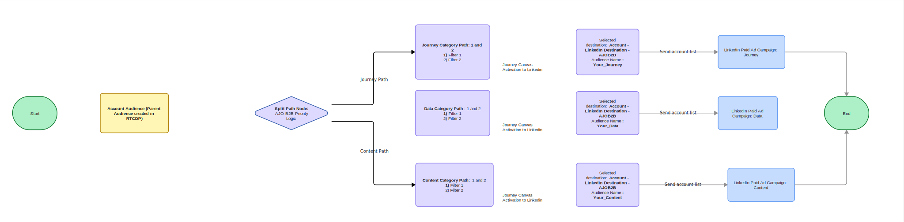

# AJO B2B - 계정 Journey Orchestration - 유료 미디어 컨트롤러

## 개요

대규모로 B2B 유료 미디어를 실행하는 마케팅 팀은 반복되는 문제에 직면합니다. **계정은 한 번에 여러 캠페인으로 끝납니다**(성향, 카테고리 인식, 솔루션 주도, 추구). 이 캠페인으로 인해 메시징이 희석되고, 대상자 피로가 발생하며, LinkedIn 계정 일치(계정 대상)에서 업로드, 제외 및 억제와 같은 수동 목록 작업이 강제로 수행됩니다. **waterfall 우선 순위 지정** 및 **자동화된 캠페인 할당**&#x200B;이 없으면 메시지를 받을 계정을 결정할 수 있는 위치가 없으며 작업이 확장되지 않습니다.

**유료 미디어 컨트롤러**&#x200B;는 이 문제를 해결할 수 있는 완벽한 솔루션입니다. **Adobe Journey Optimizer B2B edition(AJO B2B)** 및 **Adobe Experience Platform(AEP)**&#x200B;을(를) 함께 사용합니다. 하나의 **계정 여정**&#x200B;이(가) Real-Time CDP에서 적격 계정 대상을 읽고, **분할 경로(waterfall) 논리**&#x200B;를 적용하여 각 계정을 정확히 하나의 캠페인 계층에 할당하고, **유료 미디어 대상(예: LinkedIn Matched Audiences**)에 대해 각 경로를 직접 활성화&#x200B;**합니다.** 결과는 정밀 제어, 적은 중복 및 멀티채널 B2B 유료 미디어 오케스트레이션에 대한 반복 가능한 패턴입니다.

## 사용 사례: 마케터의 이야기: 컨트롤러가 중요한 이유

*Maya는 글로벌 B2B 브랜드의 유료 미디어를 이끌고 있습니다. 이 팀은 기초 인지도, 카테고리 의도(여정, 데이터, 컨텐츠), 솔루션 주도 프로그램, 페르소나 캠페인, 필승 추구 등 수십 개의 캠페인을 운영하고 있습니다. 문제가 있습니다.*

**문제:** 동일한 계정이 여러 캠페인에 표시됩니다. 고의적인 여정 계정 또한 광범위한 인지도 목록에 있습니다. 추구 계정은 여전히 사용자 광고를 받습니다. 목록 업로드 및 제외는 수동입니다. 영업 팀이 &quot;필수&quot; 목록 또는 새로운 사용자 캠페인을 시작할 때마다 대상을 다시 내보내고, 스프레드시트에서 조정하고, LinkedIn 및 기타 플랫폼에 다시 업로드합니다. 속도가 느리고 오류가 발생하기 쉬우며 크기가 조절되지 않습니다.

**원하는 항목:** 모든 적격 계정을 한 번 평가하고, 우선 순위 규칙(waterfall)을 사용하여 *가장 관련성이 높은* 캠페인에 할당한 다음, 올바른 유료 미디어 대상으로 자동으로 전송하는 곳입니다. 수동 목록 핸드오프가 없습니다. 데이터나 전략이 변경되면 시스템은 팀이 목록을 터치하지 않고 캠페인 간에 계정을 다시 평가하고 이동합니다.

**Adobe의 답변:** **AJO B2B와 AEP이 함께 작동하는 경우**, Maya는 단일 **유료 미디어 컨트롤러** 여정을 실행할 수 있습니다. AEP과 Real-Time CDP은 데이터와 하나의 마스터 &quot;적격 계정&quot; 대상을 보유하고 있습니다. AJO B2B는 **분할 경로 논리**(waterfall)를 사용하여 각 계정을 올바른 계층(예: 타깃팅된 추구 → 솔루션 주도 → 성향 → 카테고리 인식 → 기본 인식)으로 라우팅하는 계정 여정을 실행합니다. **대상에 대한 활성화**&#x200B;는 각 경로를 올바른 LinkedIn(또는 기타) 캠페인으로 보냅니다. 하나의 여정, 하나의 진실 소스, 수동 목록 내보내기 없음. 이것이 유료 미디어 컨트롤러 패턴입니다. Adobe이 B2B 유료 미디어에 정밀도와 확장성을 제공하는 방법입니다.

## B2B 기업에 중요한 이유:

이 패턴을 채택한 조직은 수동 제외 및 제외 논리를 완전히 제거하고(예: 여정에서 100% 처리된 중복 해결), 단일 컨트롤러를 통해 **수만 개의 계정**&#x200B;으로 확장하고, 해당 계정이 캠페인으로 이동하는 **단일 소스**&#x200B;를 유지할 수 있습니다. 목록을 다시 내보내거나 각 플랫폼에 다시 업로드하지 않고 캠페인 포커스, 대상 및 판매 목표가 변경되면 **시스템이 자동으로 조정**&#x200B;됩니다. 여러 유료 미디어 캠페인을 실행하는 B2B 기업의 경우 유료 미디어 컨트롤러 패턴은 수동 목록 워크플로우로는 수행할 수 없는 명확성, 제어 및 자동화를 제공합니다.

다음 KPI는 성공 측정과 잘 일치합니다.

- **인지도:** 대상 계정이 올바른 광고를 보고 더 높은 비율로 올바른 캠페인으로 이동하고 있습니까?
- **참여:** 겹치는 부분이 제거되면 참여 및 전환이 향상됩니까?
- **효율성:** 수동 목록 작업(업로드, 제외, 제외)이 얼마나 감소했습니까?
- **비용:** 자동화된 오케스트레이션을 통해 획득한 계정당 비용 또는 영업 기회당 비용이 어떻게 변경됩니까?

## 유료 미디어 여정 오케스트레이션

일반적인 사용 사례와 이 블루프린트의 초점은 **B2B 유료 미디어 여정 오케스트레이션**&#x200B;입니다. 모든 적격 계정이 정확히 하나의 캠페인 계층에 할당되고 겹치거나 수동으로 조작하지 않고 올바른 유료 미디어 대상에 활성화되도록 합니다.

→ 컨트롤러 여정은 적격 계정 대상(AEP 데이터에서 Real-Time CDP에 빌드)을 **읽기**&#x200B;하고, 분할 경로(waterfall) 조건(예: 솔루션 주도 → 성향 → 카테고리 의도 → 기본 사항 추구)을 통해 각 계정을 **평가**&#x200B;하며, 해당 대상에 대한 각 경로를 **활성화**&#x200B;합니다(예: 각 캠페인에 대해 LinkedIn이 일치하는 대상).

**계정 중심 솔루션:** 유료 미디어 컨트롤러의 초점은 **계정** 및 **캠페인 할당**&#x200B;입니다. 기술 설정은 성공적인 계정 수준 세분화 및 여정 기반 오케스트레이션에 필요한 적격 계정 및 해당 속성(예: 의도, 세그먼트, 성향)을 나타내는 데이터 및 대상을 지원합니다.

## 요구 사항

계정 중심 솔루션에는 다음과 같은 애플리케이션과 서비스가 필요합니다.

- **Adobe Journey Optimizer B2B edition** — 계정 여정, 분할 경로(waterfall) 논리, 대상에 대한 활성화.
- **Adobe 실시간 고객 데이터 플랫폼(RTCDP) B2B edition** - 계정 프로필, 계정 대상자(예: 유료 미디어에 대한 적격 계정).

## 아키텍처

높은 수준의 플로우:

1. **데이터 및 대상** — AEP은 프로필과 이벤트를 보유하고, Real-Time CDP B2B는 여정 항목 대상으로 사용되는 계정 대상(예: &quot;유료 미디어 적격 계정&quot;)을 빌드합니다.
2. **오케스트레이션** — AJO B2B 계정 여정: **대상 읽기**(적격 계정) → **분할 경로**(waterfall: Pursuit → Solution-Led → Persona → Category → Foundation) → **Activate to Destination**(LinkedIn 또는 기타 유료 미디어의 경로당).
3. **대상** - 유료 미디어 채널(예: LinkedIn Matched Audiences)은 각 여정 경로에서 계정 수준 활성화를 받습니다. 수동 목록 업로드는 없습니다.

## 아키텍처 다이어그램

## B2B AEP의 데이터 모델링

데이터 기반 오케스트레이션을 사용할 때는 스키마 디자인이 중요합니다. AEP/RTCDP의 계정 및 사용자 프로필에는 **분할 경로 조건**&#x200B;에 사용된 특성(예: 추구 플래그, 솔루션 관심 분야, 성향, 의도 범주, 참여 점수)이 포함되어야 합니다. B2B 스키마(XDM 비즈니스 계정, XDM 개인 프로필, 관계형)는 계층 구조 및 데이터 소스를 나타내야 합니다. 자세한 내용은 [RTCDP B2B 스키마](https://experienceleague.adobe.com/en/docs/experience-platform/rtcdp/b2b-overview) 및 [AJO B2B 설명서](https://experienceleague.adobe.com/en/docs/journey-optimizer-b2b/user/home)를 참조하십시오.

**참고:** 여정의 분할 경로 로직은 프로필 및 지원되는 경우 관계형 데이터를 사용합니다. waterfall 논리에 필요한 필드를 여정에서 사용할 수 있는지 확인하십시오.

### 가드레일

- **Journey Optimizer B2B edition** — 여정 제한, 노드 제한 및 대상 지원에 대한 자세한 내용은 [제품 설명](https://helpx.adobe.com/legal/product-descriptions/adobe-journey-optimizer-b2b.html)을 참조하세요.
- **Real-Time CDP** — 세분화 및 활성화 제한에 대해서는 [RTCDP 보호 기능](https://experienceleague.adobe.com/en/docs/experience-platform/rtcdp/guardrails/overview)을 참조하십시오.

## 구현

다음 단계에서는 AJO B2B 및 AEP을 사용하여 유료 미디어 컨트롤러를 구현하기 위한 지침을 제공합니다.

### 사전 요구 사항 단계

1. **Real-Time CDP B2B에서 계정 대상 및 데이터 모델을 정의합니다.**

   컨트롤러 여정을 입력할 **적격 계정 대상자**(예: &quot;유료 미디어 적격 계정&quot;)를 만듭니다. 자격(예: 지역, 세그먼트, MQA 상태)을 정의하는 세그먼트 빌더 및 계정/개인 속성을 사용합니다. 이 대상은 여정의 단일 진입점입니다.

2. **캠페인 계층 구조 및 분할 논리를 정의합니다.**

   폭포 순서(예: Pursuit → Solution-Led → Persona → Category → Foundation) 및 각 경로에 대한 조건(어떤 특성 또는 대상자가 계정을 인증할지)을 문서화합니다. 조건이 **상호 배타적**(하향식)인지 확인합니다. 계정은 true를 평가하는 첫 번째 경로인 최대 하나의 경로와 일치해야 합니다.

3. **대상을 구성합니다.**

   AEP/RTCDP에서 유료 미디어 대상(예: LinkedIn Matched Audiences)을 설정하고 AJO B2B에서 활성화할 수 있는지 확인합니다. 계정 식별자 및 각 대상에 대한 모든 필수 속성을 매핑합니다.

### 유료 미디어 컨트롤러 구성

1. **AJO B2B에서 컨트롤러 여정을 만듭니다.**

   - **대상 읽기:** Real-Time CDP에서 적격 계정 대상을 선택합니다.
   - **분할 경로:** 각 유료 미디어 대상에 대한 경로를 만들고, 경로 1부터 우선 순위로 시작하여 우선 순위로 진행합니다. 각 경로에 대해 특성을 추가하여 자격 기준을 설정합니다(예: &quot;In Pursuit audience&quot;, &quot;solution interest = X&quot;, &quot;persona = Y&quot;, &quot;intent category = Z&quot;). 계정은 분류 방식으로 분할 경로 노드 a를 통해 평가하여 기준을 충족하는 첫 번째 경로에 대해 자격이 부여됩니다.
   - **대상에 활성화:** 각 경로에 대해 올바른 LinkedIn(또는 기타) 캠페인/대상에 [대상에 활성화] 노드를 추가하십시오.

2. **상호 배타성의 유효성을 검사합니다.**

   - 각 계정이 하나의 경로(첫 번째 일치 조건)만 입력하는지 확인합니다.
   - 활성화 확인: 계정이 올바른 대상에 표시되며 의도한 대로 우선순위가 낮은 캠페인에서 제외됩니다.

## 구현 다이어그램

### 대상자 활성화

1. **LinkedIn(및 기타 대상)에 대해 활성화합니다.**

   여정에서 &quot;대상에 활성화&quot;를 사용하여 각 경로를 적합한 유료 미디어 대상자에게 보냅니다. 수동 목록 내보내기 또는 업로드 없음. 여정은 계정이 경로를 통해 흐름에 따라 활성화를 유도합니다.

2. **모니터링 및 조정**

   여정 보고를 사용하여 경로당 볼륨을 모니터링합니다.

## 요약

**유료 미디어 컨트롤러** 블루프린트는 **AJO B2B와 AEP**&#x200B;이(가) 함께 작동하여 B2B 마케터에게 하나의 마스터 대상, 하나의 여정, waterfall split 논리 및 수동 목록 처리 없이 대상에 대한 직접 활성화와 같은 하나의 자동화된 방식으로 계정을 캠페인에 할당하는 방법을 보여줍니다. 멀티채널 B2B 유료 미디어 오케스트레이션에 대한 반복 가능한 패턴을 설정하고 중복을 줄이고 관련성을 개선하며 운영을 확장하는 데 도움이 됩니다.

## 관련 설명서

- [구매 그룹 기반 마케팅 및 여정 관리 블루프린트](https://experienceleague.adobe.com/en/docs/blueprints-learn/architecture/b2b-activation/b2b-buying-group-journeys) - AJO B2B의 여정 및 구매 그룹 블루프린트입니다.
- [Adobe Journey Optimizer B2B edition](https://experienceleague.adobe.com/en/docs/journey-optimizer-b2b) — 제품 설명서입니다.
- [Real-time Customer Data Platform B2B edition](https://experienceleague.adobe.com/en/docs/experience-platform/rtcdp/b2b-overview) - 계정 대상자 및 활성화.
