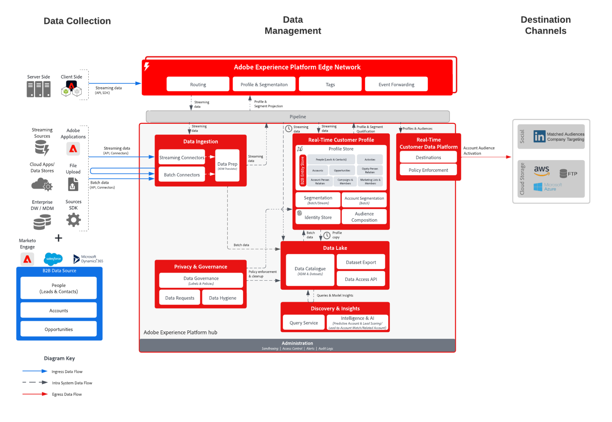

# 광고 대상 및 파일 대상에 대한 B2B 계정 활성화

계정 기반 참여를 통해 B2B 마케터는 계정 대상(즉, 회사 목록)을 만들고 타깃팅 및 판매 전달을 위해 클라우드 스토리지 대상에 회사 목록을 입력 또는 내보내기로 허용하는 LinkedIn과 같은 대상을 통해 해당 회사를 타깃팅할 수 있습니다.

## 사용 사례

마케터는 계정 기반 서비스를 사용하여 세 가지 주요 사용 사례를 잠금 해제할 수 있습니다.

* **구매 그룹 차이를 메웁니다.** 마케터는 CMO 또는 CIO 역할에 대한 연락처가 없는 계정에 광고를 낼 수 있습니다. 먼저 &quot;CMO&quot; 또는 &quot;CIO&quot;라는 제목과의 접촉 없이 계정 대상을 구성한 다음 LinkedIn에서 대상을 활성화할 수 있습니다. 그런 다음, 대상 LinkedIn 내에서 &quot;CMO&quot; 또는 &quot;CIO&quot; 직함을 가진 대상자와 특정 사용자를 대상으로 캠페인을 시작하여 이러한 새로운 담당자에게 연락하고 오퍼링의 이점을 강조할 수 있습니다.
* **기존 고객인 회사의 다른 부서에 상향 판매 또는 교차 판매:** 마케터는 3개월에서 9개월 전에 제품 X를 구매했지만 아직 제품 Y를 소유하지 않은 계정 대상을 구축할 수 있습니다. 그런 다음 를 활성화하여 해당 타겟 대상자에게 제품 Y의 이점을 강조 표시할 수 있습니다.
* **경쟁 제품을 사용하는 대상 회사:** 마케터는 해당 계정에 연락처가 없어도 경쟁사 제품을 대체하기 위해 계정을 마케팅할 수 있습니다. 경쟁업체 제품의 소유권이나 사용을 보여 주는 파트너 데이터를 기반으로 계정 대상을 만든 다음, LinkedIn을 통해 를 활성화하여 확장을 위한 타겟 계정의 소스 연락처를 확보할 수 있습니다.

## 애플리케이션

* Real-time Customer Data Platform B2B 에디션

## 통합 패턴

* B2B 데이터 소스(Marketo, Salesforce 등) -> Real-time Customer Data Platform B2B 에디션 -> 대상.
* 다양한 B2B 데이터 소스를 사용하여 계정, 잠재 고객, 기회 및 사용자 데이터를 Real-time Customer Data Platform의 B2B 에디션에 매핑할 수 있습니다.

## 아키텍처

## 계정 대상자 대상

* (회사) LinkedIn 일치 대상
* 클라우드 스토리지 대상
   * Azure 데이터 레이크
   * 데이터 랜딩 영역
   * SFTP
   * Azure Blob
   * AWS

## 가드레일

* 샌드박스당 50개 계정 세그먼트로 제한됩니다.
* 일괄 처리 세분화 평가.
   * 일괄 대상자 실행 및 프로필 내보내기 작업이 완료된 후 24시간마다 자동으로 평가됩니다.
   * 에지, 스트리밍 또는 임시 평가를 지원하지 않습니다.
* 계정 속성은 내보내기에 사용할 수 있습니다.
* 사람들의 사건.
   * 최대 30일의 이벤트 전환 확인 기간, 이벤트 술어 순서 없음.
   * AND / OR가 지원됩니다(&quot;A와 B가 발생해야 합니다.&quot;라고 할 수 있음).  그러나 &quot;A는 B보다 3일 전에 일어나야 한다&quot;)고 말할 수는 없다.
* 클라우드 스토리지 대상의 경우 내보내기 예약은 &quot;세그먼트 평가 후&quot; 옵션을 지원합니다.
* [B2B 프로필 및 세그멘테이션 보호](https://experienceleague.adobe.com/en/docs/experience-platform/rtcdp/intro/rtcdpb2b-intro/b2b-guardrails).

## Real-time Customer Data Platform B2B 에디션, 계정 대상자 만들기 및 활성화를 위한 구현 단계

* Real-time Customer Data Platform B2B 에디션의 구현 단계는 [Real-time Customer Data Platform B2B 에디션 시작하기](https://experienceleague.adobe.com/en/docs/experience-platform/rtcdp/intro/rtcdpb2b-intro/b2b-tutorial) 설명서를 참조하십시오.
* 계정 대상자 만들기 단계는 [계정 대상자](https://experienceleague.adobe.com/en/docs/experience-platform/segmentation/ui/account-audiences) 설명서를 참조하십시오.
* 계정 Audience Activation 단계는 [계정 대상자 활성화](https://experienceleague.adobe.com/en/docs/experience-platform/destinations/ui/activate/activate-account-audiences) 설명서를 참조하십시오.
   * [(회사) LinkedIn 일치 대상](https://experienceleague.adobe.com/en/docs/experience-platform/destinations/ui/activate/activate-account-audiences#required-mappings)에 대한 필수 매핑입니다.

## 구현 시 고려 사항

LinkedIn과 일치하는 대상에는 일치하는 구성원 300명의 최소 대상 크기를 포함한 몇 가지 요구 사항이 있습니다. 회사의 연결된 일치된 대상 대상에 대해 활성화된 계정 대상이 요구 사항을 충족하지 않는 경우 LinkedIn 캠페인을 시작하려면 대상 크기를 늘리도록 대상 정의를 수정해야 합니다.

## 관련 설명서

* [Real-time Customer Data Platform의 B2B 에디션](https://experienceleague.adobe.com/en/docs/experience-platform/rtcdp/intro/rtcdpb2b-intro/b2b-overview)
* [계정 대상 튜토리얼 비디오 만들기 및 활성화](https://experienceleague.adobe.com/ko/docs/platform-learn/tutorials/audiences/create-audiences-with-b2b-data)
* [계정 대상자 만들기](https://experienceleague.adobe.com/en/docs/experience-platform/segmentation/ui/account-audiences)
* [계정 대상자 활성화](https://experienceleague.adobe.com/en/docs/experience-platform/destinations/ui/activate/activate-account-audiences)
* [Adobe Experience Platform - LinkedIn 대상 커넥터](https://experienceleague.adobe.com/en/docs/experience-platform/destinations/catalog/social/linkedin)
