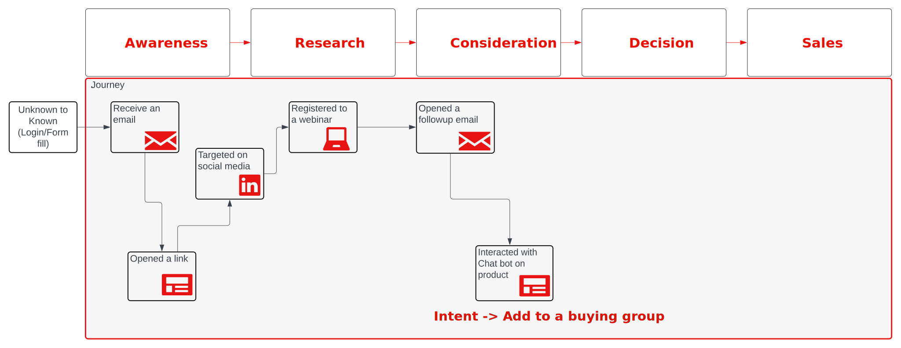

# 그룹 기반 마케팅 및 여정 관리 블루프린트 구매

현재 마케팅 팀은 Sales에게 검증된 잠재 고객을 제공하는 데 많은 어려움을 겪고 있습니다. 이러한 어려움 중 하나는 조직에서 적합한 사람들과 일하는 것이며 일반적으로 노력과 정확성에서 나타납니다. _리드 점수_&#x200B;를 얻으면 그룹이 너무 좁아 팀이 적합한 사람을 놓칠 수 있습니다. _계정 점수_&#x200B;를 얻으면 계정에 대한 광범위한 보기를 통해 적합한 사람을 식별하는 데 더 많은 노력이 필요합니다.

이 문제는 **_그룹 구매_**&#x200B;의 개념을 소개하는 단계입니다. 구매 그룹을 사용하면 마케터가 계정에서 올바른 사용자 그룹을 찾고 잠재 고객을 선별하고 그룹에서 자신의 역할을 식별하는 렌즈를 통해 이러한 개인과 작업할 수 있습니다.

## 구매 그룹을 사용하여 리드 및 계정을 평가하는 방법

구매 그룹을 만들고 완료하기 위해 노력하면 영업 기회 검증을 위한 마케팅 활동의 효과를 높일 수 있습니다. 구매 그룹은 솔루션 의도에 연결된 역할 템플릿으로 이어지도록 일치합니다.

구매 그룹의 예로는 솔루션 관심사가 _AI 기반 시드_&#x200B;인 _Acme Corp 시드 구매 그룹_&#x200B;이 있습니다.

구매 그룹은 솔루션 의도를 통해 솔루션에 관심이 있는 회사의 그룹을 나타냅니다. 그리고 구매 그룹은 둘 이상의 솔루션 관심사에 대해 식별될 수 있고 개인은 하나 이상의 구매 그룹에 나타납니다.

Journey Optimizer B2B edition에서 제공하는 향상된 B2B 능력의 결과로 이제 이러한 문제를 해결할 수 있습니다.

* _고객 우선_ 마케팅 캠페인이 부족합니다.
* MQL(Marketing Qualified Lead)을 SQL(Sales Qualified Lead)로 일관되지 않고 전환하여 MQL을 육성하기 위해 이니셔티브를 매출과 일치시켜야 함
* _경쟁_ 계정을 식별하고 타깃팅하는 판매 가능한 메커니즘이 없습니다.
* 수익 및 파이프라인에 위험 집중

다음 KPI는 사용 사례의 성공 여부를 측정하는 것과 잘 부합합니다.

* **인지도**: 타겟 고객이 광고를 보고 이전보다 더 높은 비율로 광고를 웹 사이트로 유도합니까?
* **참여**: 대상 고객이 웹 사이트로 와서 콘텐츠를 이용하고 있습니까?
* **시간**: 영업 팀이 다양한 도구에서 연락처를 찾아 영업 기회에 추가하는 데 시간이 얼마나 걸립니까?
* **비용**: 각 플랫폼에서 각 리드의 비용은 얼마입니까?

## 계정 기반 마케팅

일반적인 사용 사례이며 이 블루프린트의 초점은 계정 기반 마케팅 이니셔티브입니다. 이 사용 사례에서는 만든 구매 그룹이 역할 및 솔루션 관심사와 연결될 때 리드로 채워지는 지점을 살펴봅니다.

여정을 통해 개인을 리드하면 양식, CRM 동기화 및 LinkedIn 활성화를 통해 리드(구매 그룹 워크플로)에 대한 자세한 정보를 수집합니다.

잠재 고객이 솔루션 관심을 명확하게 보여 주면 비즈니스 렌즈로 정의된 비즈니스 이벤트를 나타냅니다. 이 시점에서 비즈니스는 이 리드가 정말 제품에 관심이 있다고 확신합니다. Journey Optimizer B2B edition에서 잠재 고객은 역할 템플릿(예: 인플루언서, 의사 결정자, 챔피언 및 스폰서)의 해당 솔루션에 대한 구매 그룹과 연결되어 있습니다.

다음 다이어그램에서와 같이 Forms나 LinkedIn 활성화를 통해 세부 정보를 수집하고 채팅 봇과의 상호 작용이 발생한 경우 솔루션 의도를 한정할 수 있습니다.

{zoomable="yes"}

구매 그룹 완료율이 충분히 높으면 SQL 또는 SOL을 통해 영업 팀에 그룹을 공유하여 계정의 가망 고객을 완료된 판매로 변환합니다.

## 계정 중심 솔루션

B2B 리드 관리의 초점은 계정과 해당 리드에 있습니다. 기술 계층은 성공적인 계정 세분화 및 여정 관리의 요건인 이러한 특성을 나타내는 데이터를 지원하도록 설정됩니다.

### 요구 사항

계정 중심 솔루션에는 다음과 같은 애플리케이션과 서비스가 필요합니다.

* Adobe Journey Optimizer B2B edition
* Adobe Real-time Customer Data Platform(RTCDP) B2B edition
* Adobe Marketo Engage

>[!NOTE]
>
>Journey Optimizer B2B edition 라이선스에는 다음 항목이 포함되어야 합니다.
><ul><li>Experience Platform B2B에 연결된 Journey Optimizer B2B edition 인스턴스</li><li>RTCDP에 동기화된 Marketo Engage 인스턴스</li></ul>
>&gt; 
>&gt;기존 Marketo Engage 고객의 경우 기존 인스턴스에 연결하는 것이 좋습니다.
>&gt;  
>&gt;프로필 풍부성을 향상시키는 솔루션에 사용할 수 있는 추가 확장이 있습니다.
>&gt;<ul><li>프로필을 보강하기 위한 RTCDP 추가 소스</li><li>Marketo Engage에 대한 RTCDP 대상</li></ul>

이 솔루션을 구현하려면 _계정_ 및 _구매 그룹_&#x200B;의 개념과 영업 리드 자격을 확대하고 가속화하는 방법에 대한 명확한 이해가 필요합니다. 이러한 이해를 통해 원하는 구매 그룹 완성도 점수도 식별해야 합니다.

### 아키텍처

{zoomable="yes"}

### 데이터 스키마

데이터 기반의 마케팅 자동화를 구현하는 경우 스키마 설계는 구현의 성공에 중요합니다. 스키마를 디자인하기 전에 [B2B 네임스페이스 및 스키마](https://experienceleague.adobe.com/ko/docs/experience-platform/sources/connectors/adobe-applications/marketo/marketo-namespaces)를 검토하고 새 구현 시나리오에서 새 스키마를 생성하는 데 사용할 수 있는 자동 생성 유틸리티를 이해했는지 확인하십시오.

스키마는 프로필의 풍부한 관계를 지원하기 위해 B2B 데이터 요소로 특별히 보강되었으며, 이벤트 및 프로필을 계정 스키마에 연결하기 위해 `sourceKey`을(를) 통한 계정 관점을 포함합니다. 스키마는 조직 요구 사항과 수집 및 프로파일링된 데이터를 나타냅니다. 이러한 요구 사항을 충족하기 위해 B2B 스키마는 유연하며 필수 B2B 요소의 확장입니다.

조직의 데이터 스키마를 디자인할 때는 ERD의 주요 엔터티를 높은 수준의 엔터티로 나타내고 레이블을 지정하는 것이 좋습니다. ([RTCDP B2B 스키마 설명서](https://experienceleague.adobe.com/ko/docs/experience-platform/xdm/tutorials/relationship-b2b)의 첫 번째 다이어그램을 참조하십시오.) 이 프로세스는 각 스키마에서 정의해야 하는 필수 데이터 요소를 이해하는 데 매우 유용합니다.

이 단계에서 경험 이벤트는 아직 여정에 영향을 줄 수 없습니다. 경험 이벤트 스키마 외에도 사용자 활동을 기반으로 주요 결정을 나타내는 속성을 계정에 추가하는 것이 좋습니다. 이러한 속성은 여정 디자이너에서 분할 경로 요소에 사용됩니다.

>[!NOTE]
>
>현재 Journey Optimizer B2B edition에서 지원하는 유일한 관계는 `personComponents[0].sourceAccountKey.sourceKey` 엔터티의 `Person` 특성을 통한 직접적인 관계입니다. 향후 확장은 B2b 스키마의 계정-사용자 관계 개체를 수용하도록 계획되어 있습니다.

### Marketo Engage 소스 커넥터

계정 데이터 요소를 보강하기 위해 Marketo Engage 및 해당 B2B 데이터를 사용하여 RTCDP 및 Journey Optimizer B2B edition 계정 보기를 보강할 수 있습니다. Marketo Engage Source Connector를 설정하고 Marketo Engage 데이터를 RTCDP 스키마 속성에 매핑하면 데이터가 Marketo Engage에서 RTCDP으로 이동하고, 지정된 경우 프로필로 이동할 수 있습니다.

커넥터 구성 및 스키마에 대한 필수 필드 매핑에 대한 자세한 내용은 [Marketo Engage 커넥터 설명서](https://experienceleague.adobe.com/ko/docs/experience-platform/sources/connectors/adobe-applications/marketo/marketo)를 참조하세요.

### 가드레일

Journey Optimizer B2B edition 가드레일은 [제품 설명 페이지](https://helpx.adobe.com/kr/legal/product-descriptions/adobe-journey-optimizer-b2b.html)에 자세히 설명되어 있습니다.

구현 관련 보호

* 모든 B2B 대상 가드레일은 [B2B 대상 및 프로필 활성화 블루프린트](https://experienceleague.adobe.com/ko/docs/blueprints-learn/architecture/b2b-activation/b2bactivation)에 설명되어 있으며 Journey Optimizer B2B edition 성공으로 바로 전환됩니다.
* 계정 여정에서 Marketo Engage 채널을 통해 활성화해야 하거나 계정을 보강하는 데 CRM 동기화를 사용하는 경우 [Marketo Engage 관련 가드레일](https://helpx.adobe.com/kr/legal/product-descriptions/adobe-marketo-engage---product-description.html#performance-guardrails)과 관련이 있습니다.

RTCDP 가드레일에 대한 자세한 내용은 [Real-Time CDP 가드레일 설명서](https://experienceleague.adobe.com/ko/docs/experience-platform/rtcdp/guardrails/overview)를 검토하십시오.

### 프로비저닝

* 모든 인스턴스는 동일한 IMS 조직에 있어야 합니다.
* 하나의 Journey Optimizer B2B edition 인스턴스만 하나의 Experience Platform 샌드박스에 연결할 수 있습니다.
* Real-time Customer Data Platform[에 &#x200B;](https://experienceleague.adobe.com/ko/docs/experience-platform/sources/connectors/adobe-applications/marketo/marketo)Marketo Source 커넥터를 구현하는 것이 좋습니다.

## 구현

다음 단계에서는 구매 그룹 역할 템플릿 누락에 중점을 두고 계정 기반 확장을 지원하는 대상 활성화를 포함하여 Journey Optimizer B2B edition 인스턴스에서 구매 그룹을 활성화하는 지침을 제공합니다.

### 사전 요구 사항 단계

1. 계정 및 리드에 대한 비즈니스 보기를 표시할 XDM 스키마를 정의합니다.

   첫 번째 단계로 B2B 사용 사례 요구 사항에 맞게 디자인되고 데이터 소스를 다루는 경험 스키마를 일괄 처리 및 실시간으로 정의하고 만듭니다. 이 디자인은 비즈니스가 계정 및 개인 엔터티를 생각하는 방식과 지원하려는 사용 사례를 나타내야 합니다. 스키마가 B2B 스키마가 되려면 스키마가 [RTCDP B2B 스키마 설명서](https://experienceleague.adobe.com/ko/docs/experience-platform/xdm/tutorials/relationship-b2b)에서 사용할 수 있는 구조를 따라야 합니다.

   유용한 방법은 다이어그램에서 엔티티 이름을 가져와 동일한 방식으로 레이블을 지정하여 스키마에서 이러한 엔티티를 식별하는 것입니다. 일부 스키마가 RTCDP B2B에서 작동하려면 `sourceKey`과(와) 같은 특정 키가 필요합니다. 단기적으로는 계정 사용자 관계를 통한 계정과 사용자 간의 _다대다_ 관계가 Journey Optimizer B2B에서 지원되지 않습니다. 가장 좋은 시작점에 액셀러레이터 스크립트 사용:

   * [RTCDP B2B 스키마 만들기 스크립트](https://github.com/adobe/experience-platform-postman-samples/tree/master/Postman%20Collections/CDP%20Namespaces%20and%20Schemas%20Utility)를 사용하여 초기 스키마를 생성합니다.
   * 조직 요구 사항에 맞게 스키마를 완료하기 위해 생성된 스키마에 사용 사례별 필드를 추가합니다.

   이 단계에서는 Marketo Engage과 RTCDP을 연결하고 계정 및 개인 데이터를 수락하여 계정 세그먼트의 데이터 세트를 채우는 스키마 구조를 정의합니다. 다음 단계는 RTCDP을 Marketo Engage 및 Journey Optimizer B2B edition과 연결하는 것입니다.

1. XDM 구조에 대한 Marketo Engage 매핑을 포함하여 Marketo Engage 커넥터를 구성합니다.

   XDM 구조 및 필드를 준비한 상태에서 커넥터를 사용하여 Marketo Engage을 RTCDP에 연결 로 진행합니다. 이 커넥터는 데이터 세트에 Marketo Engage 및 Journey Optimizer B2B의 데이터를 제공합니다. Marketo Engage에서 RTCDP 클래스로의 필드에 대한 매핑을 구성하여 시작합니다. [커넥터 설명서](https://experienceleague.adobe.com/ko/docs/experience-platform/sources/connectors/adobe-applications/marketo/marketo#field-mapping-from-marketo-engage-to-xdm)의 정보를 사용하여 Marketo Engage 구현에서 포함할 필드를 식별합니다.

### 구매 그룹 구성

1. Journey Optimizer B2B edition 또는 RTCDP에서 계정 대상자 만들기

   계정 대상을 활성화하려면 고객 대상 → 찾아보기 →에서 모든 대상 예약 옵션을 활성화합니다. (작동하지 않는 경우 계정 대상을 만들 수 있도록 고객 프로필 세그먼트를 만들어야 합니다.)

   세그먼트를 만들려면 [계정 대상 설명서](https://experienceleague.adobe.com/ko/docs/journey-optimizer-b2b/user/account-audiences/account-audience-overview)의 단계를 따르십시오. 계정 대상자의 키로 식별한 데이터 필드와 함께 세그먼트 빌더를 사용하는 것은 대상자를 정의하는 데 있어 핵심 활동입니다.

   이 단계에서 계정은 RTCDP을 통해 주력하고 구매 그룹의 구성 요소에 사용할 수 있도록 합니다.

1. 역할 템플릿을 정의합니다.

   각 구매 그룹에서 해결하려는 그룹에서 개인이 수행하는 역할을 나타내는 역할을 식별합니다. 예를 들어 _의사 결정자_, _영향력 있는 사용자_ 및 _챔피언_&#x200B;을 사용할 수 있습니다. 또한 구매 그룹에서 이 역할에 대한 가중치와 조건을 정의합니다.

   [역할 템플릿 설명서](https://experienceleague.adobe.com/ko/docs/journey-optimizer-b2b/user/buying-groups/buying-groups-role-templates)에서는 이 프로세스와 특수 조건을 정의하는 방법에 대해 설명합니다.

1. 솔루션 관심사를 정의합니다.

   솔루션 관심은 마케팅 활동 및 전략에 대한 구매 그룹의 초점을 나타내는 방법입니다.

   솔루션 관심사를 정의하려면 [솔루션 관심사 설명서](https://experienceleague.adobe.com/ko/docs/journey-optimizer-b2b/user/buying-groups/solution-interests)의 단계를 따르십시오. 구매 그룹을 조직의 판매 이니셔티브와 일치시키는 데 이 필드를 사용한다는 점을 기억하십시오.

1. 구매 그룹을 구성합니다.

   구매 그룹의 빌딩 블록이 준비된 상태에서, 대상의 솔루션 관심사 및 계정 대상자에 대한 구매 그룹을 구성하여 계정의 올바른 구성원과 함께 역할 템플릿을 완료합니다. 이 구성을 사용하여 식별한 역할 템플릿에 솔루션 관심사를 할당하고 각 역할에 해당 특정 제품의 판매 성공에 가중치를 부여합니다.

   구매 그룹을 만들려면 [구매 그룹 설명서](https://experienceleague.adobe.com/ko/docs/journey-optimizer-b2b/user/buying-groups/buying-groups-create)의 단계를 따르십시오.

   이 단계에서는 [여정을 만들고](https://experienceleague.adobe.com/ko/docs/journey-optimizer-b2b/user/account-journeys/journey-overview#get-started-with-a-journey) 계정 대상자와 함께 구매 그룹을 구축하고 솔루션 관심사에 대한 자격을 부여할 준비가 되었습니다.

### 대상자 활성화

대상자 활성화를 통해 구매 그룹 완성도를 높입니다.

1. LinkedIn 광고 일치 계정 대상을 정의합니다.

   이메일 및 양식 채우기 활동 외에도 Journey Optimizer B2B edition은 계정의 폭을 넓히고 계정 리드 범위 확장을 통해 구매 그룹을 완료하고 마케팅 활동의 범위를 늘리는 노력을 지원하는 LinkedIn 광고 기능을 제공합니다.

   구매 그룹이 완료되지 않았거나 충분히 참여하지 않은 계정과 통신하는 데 LinkedIn 유료 미디어를 사용하려면 계정 대상을 확장하거나 참여하려면 [LinkedIn 계정 일치 대상 기능](https://experienceleague.adobe.com/ko/docs/journey-optimizer-b2b/user/account-audiences/linkedin-account-matched-audiences)을 사용하여 계정 일치 대상을 통해 LinkedIn 광고 대상을 생성합니다.

1. 구매 그룹에 대한 대상자를 활성화합니다.

>[!TIP]
>
>성공적인 캠페인에 대한 몇 가지 힌트:
>
>* 캠페인에는 역할이 누락된 구매 그룹에 맞는 역할 필터가 있어야 ROI를 향상시킬 수 있습니다.
>* 잠재 고객을 캡처하려면 잠재 고객이 양식(LinkedIn 또는 Marketo Engage 양식)을 채우고 양식 누락을 재타겟팅하도록 합니다.
