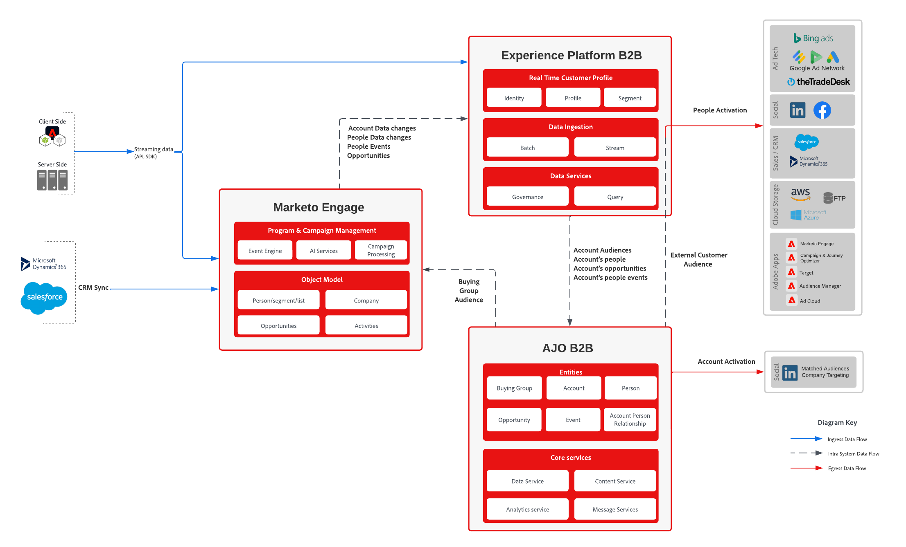

# Marketo 데이터 블루프린트를 사용하는 B2B 여정

이 포괄적인 안내서에서는 Marketo Engage과 Adobe Journey Optimizer B2B edition을 통합하는 프로세스에 대해 간략히 설명합니다. 여기에는 사용자 지정 스키마 구성, 프로필 및 계정 수집, 구매 그룹에 대한 개인화된 여정 오케스트레이션 등이 포함됩니다. 이 블루프린트는 Marketo Engage 데이터를 사용함으로써 여러 채널에서 정확한 타겟팅과 참여를 보장하여 더 적합한 수요를 창출하고 고객 경험을 향상시킵니다.

## 사용 사례

* **구매 그룹 만들기 및 관리**: 생성 AI를 사용하여 대상 계정 내에서 구매 그룹을 조합하고 관리하여 주요 이해 당사자에 대한 포괄적인 적용 범위를 확보합니다.
* **구성원 할당 자동화**: 콘텐츠 사용량 및 CRM 데이터와 같은 정의된 기준에 따라 구성원을 구매 그룹 역할에 자동으로 할당합니다
* **개인화된 여정**: 역할, 계정, 제품 관심 분야 및 라이프사이클 단계에 따라 각 구매 그룹과 구성원에 맞게 구성된 여러 단계 여정을 디자인하고 시각화합니다
* **실시간 자동화**: 실시간 참여 트리거 및 자격 점수를 통해 여정을 통해 계정 및 구매 그룹의 진행률을 자동화합니다
* **Cross-Channel Engagement**: 이메일, SMS, 광고, 채팅, 이벤트, 웨비나 등 여러 채널에서 구매 그룹을 구성하여 수요 생성 및 자격 조건을 간소화합니다
* **AI 기반 인사이트**: AI 기반 인사이트를 사용하여 개별 구매자 및 전체 구매 그룹을 위한 콘텐츠 전달 및 참여 전략을 최적화합니다
* **통합 데이터 활성화**: Adobe Real-Time Customer Data Platform에서 통합 계정 목록을 활성화하여 구매 그룹 생성 및 관리에 필요한 최신 전체 데이터를 제공합니다.
* **향상된 Collaboration**: 더 정확한 판매 기회를 만들고 파이프라인 생성을 가속화하기 위해 마케팅 및 판매 노력을 조정합니다

## 애플리케이션

* Journey Optimizer B2B Edition
* Real-time Customer Data Platform B2B 에디션
* Marketo Engage

## 통합 패턴

| 통합 | 설명 |
| :-- | :--- |
| [Marketo Engage 커넥터](https://experienceleague.adobe.com/en/docs/experience-platform/sources/connectors/adobe-applications/marketo/marketo) | Adobe Experience Platform은 Marketo에서 데이터를 쉽게 수집할 수 있도록 하여 해당 서비스를 사용하여 데이터를 구조화하고 레이블을 지정하고 향상시킬 수 있는 기능을 제공합니다. |
| [Journey Optimizer B2B edition - Marketo Engage 작업](https://experienceleague.adobe.com/en/docs/journey-optimizer-b2b/user/account-journeys/journey-nodes/action-nodes#marketo-engage-actions) | 목록 멤버십, 사용자 파티션 및 요청 캠페인을 관리하기 위해 사용자 기반 작업을 사용하여 Journey Optimizer B2B edition의 Account-Based Marketing과 Marketo Engage의 리드 기반 작업을 동기화합니다. |
| [Journey Optimizer B2B edition - Marketo Engage 자산](https://experienceleague.adobe.com/en/docs/journey-optimizer-b2b/user/content-management/assets/marketo-engage-dam/marketo-engage-design-studio) | Marketo Engage Design Studio는 Journey Optimizer B2B edition의 기본 에셋 소스로서, 계정 여정에게 간편한 에셋 관리를 가능하게 합니다. |

## 아키텍처

{zoomable="yes"}

## 구현 단계

* 아래 옵션 중 하나를 사용하여 B2B 스키마 및 네임스페이스 설치
   * [Postman 컬렉션](https://github.com/adobe/experience-platform-postman-samples/tree/master/Postman%20Collections/CDP%20Namespaces%20and%20Schemas%20Utility) 사용 중
   * 플랫폼 UI에서 [템플릿](https://experienceleague.adobe.com/en/docs/experience-platform/sources/ui-tutorials/templates) 사용
* Marketo 필드와 Experience Platform XDM 스키마 간의 매핑을 정의하는 데이터 사전 구축
   * [Marketo 개체 메타데이터](https://experienceleague.adobe.com/en/docs/marketo/using/product-docs/administration/field-management/export-all-object-metadata)를 시작점으로 사용
   * 사용자 지정 필드를 포함하도록 [XDM 스키마를 사용자 지정](https://experienceleague.adobe.com/en/docs/experience-platform/xdm/ui/fields/overview)
   * Journey Optimizer B2B edition에서 지원하는 표준 [XDM 필드](https://experienceleague.adobe.com/en/docs/journey-optimizer-b2b/user/accounts/field-mapping)를 검토하십시오. 추가 필드가 필요한 경우 지원 티켓을 열어 구성하십시오
      * **workEmail.address**&#x200B;은(는) 개인 데이터 집합에 필요합니다.
      * **accountName**&#x200B;은(는) 계정 데이터 집합에 필요합니다.
   * 내보낸 Marketo 메타데이터 스프레드시트에 새 XDM 필드 열을 추가하여 의도한 매핑을 기록합니다
* [Marketo Engage 소스 커넥터 구성](https://experienceleague.adobe.com/en/docs/experience-platform/sources/connectors/adobe-applications/marketo/marketo)
   * 위에 정의된 데이터 사전을 사용하여 원본 커넥터에 대한 [가져오기 매핑](https://experienceleague.adobe.com/en/docs/experience-platform/data-prep/ui/mapping#import-mapping)을(를) 정의합니다.
   * [구현 고려 사항](#implementation-considerations)을 고려하기 전에 프로필을 활성화하지 않는 것이 좋습니다.
   * 사용자, 회사, 기회 및 활동을 이러한 객체로 최소한 수집하도록 권장하는 사항은 계정 대상을 생성할 때 가장 유용합니다
* 사람에 대한 [ID 그래프 연결 규칙](https://experienceleague.adobe.com/en/docs/experience-platform/identity/features/identity-graph-linking-rules/overview) 구현:
   * ID 네임스페이스(예: 이메일, b2b_person)를 사용하여 개인 레코드가 연결되는 방법을 정의합니다.
   * AEP에서 ID 네임스페이스 및 ID 결합 규칙을 구성합니다.
   * 샘플 개인 데이터 및 미리보기 도구를 사용하여 연결의 유효성을 검사합니다.
* [프로필](https://experienceleague.adobe.com/en/docs/experience-platform/catalog/datasets/user-guide#enable-profile)에 대해 개인, 회사, 기회 및 활동 데이터 집합을 사용하도록 설정합니다.
* 처음 [계정 대상자 정의](https://experienceleague.adobe.com/en/docs/journey-optimizer-b2b/user/accounts/account-audience-overview)
* 계정 대상을 사용하여 [구매 여정](https://experienceleague.adobe.com/en/docs/journey-optimizer-b2b/user/accounts/buying-groups/buying-groups-overview) 또는 [계정 그룹](https://experienceleague.adobe.com/en/docs/journey-optimizer-b2b/user/account-journeys/journey-overview)을(를) 정의합니다.
   * 구매 그룹 작업은 매일 실행되며, 계정 대상자 또는 새로 연결된 사람으로 자격이 되는 새 계정을 처리합니다
   * 매수 그룹 정비는 매주 금요일 자정 CT에 진행되기 때문에 구성원을 없애거나 신규 자격을 갖춘 구성원을 추가하는 작업은 금요일에만 발생한다

## 권장 설정

구현을 간소화하고 Adobe Journey Optimizer B2B edition과의 호환성을 보장하려면 다음 설정을 권장합니다.

* **기본 ID 필드 사용:**
   * _전자 메일_ 및 _b2b_person_&#x200B;은(는) ID 결합 및 대상 활성화를 지원하기 위해 개인 스키마에서 ID 필드로 유지되어야 합니다.
* **Marketo Source 커넥터에 대한 기본 매핑을 사용합니다.**
   * Adobe에서 제공하는 기본 필드 매핑을 활용하여 데이터 수집을 단순화하고 구성 오버헤드를 줄일 수 있습니다.
* **AJO B2B에 대한 기본 매핑 사용:**
   * Journey Optimizer B2B edition용 [표준 필드 매핑](https://experienceleague.adobe.com/en/docs/journey-optimizer-b2b/user/accounts/field-mapping)을(를) 채택하여 구매 그룹 논리 및 여정 오케스트레이션과의 호환성을 보장합니다.
* **전자 메일을 제외한 모든 필드의 필드 업데이트 차단:**
   * Marketo Engage에서 [전자 메일](https://experienceleague.adobe.com/en/docs/marketo/using/product-docs/administration/field-management/block-updates-to-a-field)을 제외한 모든 필드에 대해 Adobe Experience Platform에서 _업데이트 차단_&#x200B;하도록 필드 관리를 구성하십시오. 이렇게 하면 ID 확인을 계속 활성화하면서 데이터 무결성을 유지하는 데 도움이 됩니다.
* **전자 메일을 고유한 ID 네임스페이스로 사용하여 ID 연결 규칙을 구현합니다**
   * [전자 메일](https://experienceleague.adobe.com/en/docs/experience-platform/identity/features/identity-graph-linking-rules/overview)을(를) 고유한 ID 네임스페이스로 명시적으로 사용하도록 Adobe Experience Platform에서 _ID 그래프 연결 규칙_&#x200B;을(를) 구성하십시오. 이러한 규칙을 사용하면 _전자 메일_이 있는 데이터 원본에서 프로필이 정확하게 결합되어 강력한 ID 확인을 사용할 수 있습니다. Adobe의 모범 사례에 따라 이메일의 우선 순위를 일관되고 개인정보 보호 규정을 준수하는 ID 그래프를 유지하기 위한 안정적이고 포괄적인 고유 식별자로 지정하는 연결 규칙을 정의합니다.
이 설정은 배포의 용이성과 데이터 거버넌스 간의 균형을 제공하여 B2B 여정을 오케스트레이션하기 위한 안정적인 기반을 보장합니다.

## 구현 시 고려 사항

Adobe Journey Optimizer B2B edition을 구현할 때 실시간 고객 데이터 플랫폼에서 제공하는 ID 결합 기능을 이해하는 것이 중요합니다. 이 플랫폼은 개인 및 계정 수준 모두에서 ID 결합을 수행하여 고객 데이터를 통합적으로 볼 수 있도록 합니다.

### 주요 사항

* **ID 결합**: 플랫폼은 Marketo ID, CRM ID 및 이메일과 같은 기본 식별자를 사용하여 ID를 결합합니다. 이렇게 하면 다른 소스의 데이터를 병합하여 포괄적인 프로필을 만드는 데 도움이 됩니다.
* **잠재적 위험**: 전자 메일을 결합에 대한 식별자로 사용하면 의도하지 않은 ID가 축소될 수 있습니다. 즉, 동일한 이메일 주소를 공유하는 서로 다른 개인이 단일 프로필로 잘못 병합될 수 있습니다. 이 ID 붕괴는 CRM 데이터의 정확성에 부정적인 영향을 주고 무결성을 손상시킬 수 있습니다.
* **병합 전략**: B2B CDP는 특정 프로필 특성에 대해 가장 최근 lastUpdatedDate가 사용되는 시간 기반 병합 전략을 사용합니다. 이 전략은 최신 데이터가 프로필에 반영되도록 합니다.
* **이메일에 대한 고려 사항**: 프로필 조각을 병합하기 위한 식별자로 이메일을 사용하는 것을 철저히 평가하는 것이 중요합니다. 유익할 수 있지만, 정체성 붕괴의 위험은 장점과 비교하여 신중하게 고려되어야 한다. 한 가지 단점은 식별자로 이메일이 없으면 AJO B2B에서 만든 외부 대상 멤버십이 기존 프로필에 통합되지 않는다는 것입니다.
* **Marketo 사용자 통합**: AJO B2B는 여러 Marketo 레코드가 단일 프로필로 병합될 때 리드 ID가 가장 낮은 Marketo 사용자를 사용합니다.

이러한 점을 염두에 두면 Adobe Journey Optimizer B2B edition에서 ID 결합을 구성하는 방법에 대해 정보에 입각한 결정을 내릴 수 있으므로 정확하고 신뢰할 수 있는 고객 프로필을 확보할 수 있습니다.

### ID 결합 결과 평가

쿼리 서비스를 사용하여 프로필이 아닌 사용 데이터 세트에서 ID 결합의 영향을 확인할 수 있습니다. 다음 쿼리를 사용하여 평가를 수행할 수 있습니다

#### 수집된 레코드 수

이 쿼리는 개인 프로필 데이터 세트에 수집된 총 레코드 수를 반환합니다

```sql
select
    count(distinct b2b.personKey.sourceKey)
from
    marketo_person_ajo_b2b
```

#### 이메일 복제

이 쿼리는 플랫폼의 ID 결합의 일부로 병합될 개인 레코드 수를 반환합니다

```sql
select
    SUM(personCount)
from
    (
        select
            emailAddress,
            count(*) as personCount
        from
            (
                select
                    MAX(workemail.address) as emailAddress
                from
                    marketo_person_ajo_b2b
                where
                    workemail.address IS NOT NULL
                group by
                    b2b.personKey.sourceKey
            )
        group by
            emailAddress
        having
            count(*) > 1
    )
```

#### 중복 레코드가 있는 이메일 주소

이 쿼리는 데이터 세트에서 가장 중복 레코드가 있는 이메일을 반환합니다.  이 목록은 ID 연결이 Marketo 및 CRM에 미치는 영향을 더 잘 파악하기 위해 이러한 레코드 중 일부를 확인하는 데 사용할 수 있습니다.  ID 연결 작동 방식에 대한 자세한 내용은 [ID 서비스 개요](https://experienceleague.adobe.com/en/docs/experience-platform/identity/home)를 참조하십시오.

```sql
select
    *
from
    (
        select
            emailAddress,
            MAX(personId) as personId,
            count(*) as personCount
        from
            (
                select
                    b2b.personKey.sourceKey,
                    MAX(workemail.address) as emailAddress,
                    MAX(b2b.personKey.sourceId) as personId
                from
                    marketo_person_ajo_b2b
                where
                    workemail.address IS NOT NULL
                group by
                    b2b.personKey.sourceKey
            )
        group by
            emailAddress
        having
            count(*) > 1
    )
order by
    personCount desc
```

### 옵션

#### ID로 이메일 제거

분석 후 전자 메일이 ID 필드로 사용할 수 있는 올바른 필드가 아니라고 판단되면 개인 스키마를 [ID 필드로 전자 메일을 제거](https://experienceleague.adobe.com/en/docs/experience-platform/xdm/ui/fields/identity)하도록 수정할 수 있습니다.

#### Adobe Experience Platform 업데이트 차단

이메일을 ID 필드로 유지하는 것이 사용 사례에 가장 적합한 경우 AJO B2B에서 제공되는 [필드 업데이트를 차단](https://experienceleague.adobe.com/en/docs/marketo/using/product-docs/administration/field-management/block-updates-to-a-field)하는 옵션이 있으며, 이를 통해 AJO B2B가 주로 Marketo 데이터에서 실행될 수 있습니다.

## 가드레일

Marketo Engage을 사용하는 B2B 여정에 적용되는 가드레일에 대한 포괄적인 이해는 다음 공식 설명서를 참조하십시오.

* [Adobe Journey Optimizer B2B edition - 제품 설명](https://helpx.adobe.com/legal/product-descriptions/adobe-journey-optimizer-b2b.html)
Journey Optimizer B2B edition에 대한 특정 보호 및 사용 매개 변수를 포함합니다.
* [Adobe Experience Platform 배포 가드레일](https://experienceleague.adobe.com/en/docs/blueprints-learn/architecture/architecture-overview/deployment/guardrails?lang=en)
Adobe Experience Platform 솔루션 전반의 일반적인 아키텍처 및 배포 가드레일을 다룹니다.
* [Adobe Marketo Engage - 제품 설명](https://helpx.adobe.com/legal/product-descriptions/adobe-marketo-engage---product-description.html#performance-guardrails)
활성화 및 CRM 동기화 고려 사항을 포함하여 Marketo Engage의 성능 및 사용 가드레일에 대해 자세히 설명합니다.
* [Real-Time CDP 보호](https://experienceleague.adobe.com/en/docs/experience-platform/rtcdp/guardrails/overview?lang=en)
Real-Time Customer Data Platform 내의 데이터 수집, 세그먼테이션 및 활성화 제한에 대한 지침을 제공합니다.

## 관련 설명서

* [Real-time Customer Data Platform의 B2B 에디션](https://experienceleague.adobe.com/en/docs/experience-platform/rtcdp/intro/rtcdpb2b-intro/b2b-overview)
* [Real-time Customer Data Platform B2B edition 시작하기](https://experienceleague.adobe.com/en/docs/experience-platform/rtcdp/intro/rtcdpb2b-intro/b2b-tutorial)
* [실시간 고객 데이터 플랫폼 B2B edition의 보호 기능](https://experienceleague.adobe.com/en/docs/experience-platform/rtcdp/intro/rtcdpb2b-intro/b2b-guardrails)
* [Adobe Experience Platform](https://experienceleague.adobe.com/en/docs/experience-platform)
* [Adobe Experience Platform Identity 서비스](https://experienceleague.adobe.com/en/docs/experience-platform/identity/home)
* [Marketo Engage](https://experienceleague.adobe.com/en/docs/marketo/using/home)
* [Adobe Experience Platform - Marketo 소스 커넥터](https://experienceleague.adobe.com/en/docs/experience-platform/sources/connectors/adobe-applications/marketo/marketo)
* [Adobe Journey Optimizer B2B edition 설명서](https://experienceleague.adobe.com/en/docs/journey-optimizer-b2b/user/guide-overview)
