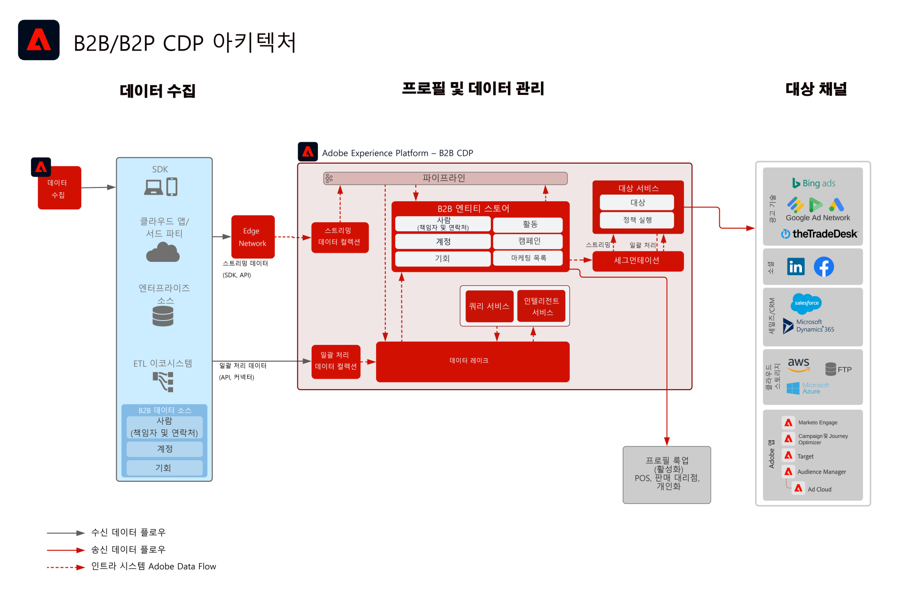

# B2B 대상자 및 프로필 활성화 블루프린트

개별 고객과 연결된 계정, 기회 및 리드 정보를 사용하여 실행 가능한 B2B 프로필을 만들어 여러 채널에서의 개인화 및 타겟팅을 개선합니다.

## 사용 사례

* 계정, 기회 및 리드를 포함한 B2B 데이터에 대해 채널 간에 타겟팅 및 개인화를 위한 대상자 그룹을 만듭니다.
* 타겟팅 및 개인화를 위해 모든 Experience Platform 대상에 대상자를 활성화합니다.

## 애플리케이션

* Real-time Customer Data Platform B2B 에디션

## 통합 패턴

* B2B 데이터 소스(Marketo, Salesforce 등) -> Real-time Customer Data Platform B2B Edition -> 대상 다양한 B2B 데이터 소스를 사용하여 계정, 리드, 기회 및 사람 데이터를 Real-time Customer Data Platform B2B Edition에 매핑할 수 있습니다.

## 아키텍처

 

## 가드레일

* Marketo Engage 관련 가드 레일 및 구현 단계는 Marketo Engage이 소스 및/또는 대상으로 사용되는 경우에만 관련이 있습니다.

* 엔드 투 엔드 지연 시간에 대한 자세한 정보와 가드레일에 대해서는 [배포 가드레일 문서](../experience-platform/deployment/guardrails.md)를 참조하세요.

### 다중 인스턴스 및 IMS 조직 지원:

다음은 매핑 Experience Platform 및 Marketo Engage 인스턴스의 지원되는 패턴을 간략하게 설명합니다.

#### Marketo을 Experience Platform의 데이터 소스로 사용:

* 단일 Experience Platform 인스턴스에 대한 다중 Marketo Engage 인스턴스가 지원됩니다.
* 다중 Experience Platform 인스턴스에 대한 다중 Marketo Engage 인스턴스가 지원되지 않습니다.
* 다중 Experience Platform 인스턴스에 대한 단일 Marketo Engage 인스턴스는 지원되지 않습니다.
* 단일 Experience Platform 인스턴스와 다중 샌드박스에 대한 단일 Marketo Engage 인스턴스가 지원됩니다.

#### Marketo을 Experience Platform 대상으로 사용:

* 다중 Marketo Engage 인스턴스에 대한 Experience Platform이 지원됩니다
* 단일 Marketo Engage 인스턴스에 대한 다중 Experience Platform 인스턴스가 지원됩니다

#### Experience Platform 프로필 및 세분화 가드 레일:

* Experience Platform에 대한 프로필 및 세분화 가드레일 살펴보기 - [프로필 및 세분화 가드레일](https://experienceleague.adobe.com/docs/experience-platform/profile/guardrails.html?lang=ko)
* 계정, 리드, 기회를 포함하는 B2B 세그먼트는 다중 엔터티 관계를 사용하므로 세그먼트 평가가 일괄 처리됩니다. 스트리밍 세분화는 사용자 및 이벤트로 제한된 세그먼트에 대해 지원됩니다.

#### Experience Platform - Marketo Engage 소스 커넥터:

* 데이터 양에 따라 기록 채우기를 완료하는 데 최대 7일이 걸릴 수 있습니다.
* Marketo에서 진행 중인 데이터 업데이트 및 변경 사항은 프로필로 최대 5분 정도 지연 될 수 있는 스트리밍 API를 통해 Experience Platform으로 전송되고, 양에 따라 약 15분 동안 데이터 레이크로 전송됩니다.

#### Experience Platform - Marketo 대상 커넥터:

* Real-time Customer Data Platform에서 Marketo Engage으로 세그먼트 공유를 하는 데 최대 5분이 소요될 수 있습니다.
* 일괄 처리 세분화는 Experience Platform 세분화 일정을 기반으로 하루에 한 번 공유됩니다. 계정, 리드, 기회를 포함하는 B2B 세그먼트는 다중 엔터티 관계를 사용하여 세그먼트를 일괄 처리합니다.

#### Marketo Engage 가드 레일:

* Marketo Engage 연락처 및 리드에 맞추기 위해 Real-time Customer Data Platform 대상자가 Marketo Engage에서 직접 연락처와 리드를 수집하고 정의해야 합니다.

#### 대상 가드 레일

* 대상에 대한 특정 지침은 대상 설명서를 참조하십시오. [대상 가드 레일](https://experienceleague.adobe.com/docs/experience-platform/destinations/guardrails.html?lang=ko)

## 구현 단계

Real-time Customer Data Platform의 B2B 버전을 구현하고 구성하는 방법에 대한 지침은 Real-time Customer Data Platform 설명서의 B2B 버전을 참조하십시오. [Real-time Customer Data Platform B2B 에디션](https://experienceleague.adobe.com/docs/experience-platform/rtcdp/b2b-overview.html?lang=ko)

두 가지의 가능한 구현 패턴이 있습니다. Marketo Engage에서 B2B 데이터 및 프로필을 수집하는 기능 또는 다른 CRM 데이터 소스에서 B2B 데이터를 수집하는 기능 모두가 있습니다.

## 구현 시 고려 사항

블루프린트의 주요 고려 사항 및 구성에 대한 지침입니다.

* Marketo과 CRM 통합 및 비통합:
구현에서 Marketo Engage을 소스로 사용하고 Marketo Engage이 CRM에 연결되어 있는 경우 Experience Platform의 Marketo 소스 커넥터를 사용하여 CRM 데이터를 Experience Platform에 수집합니다. 추가 테이블을 수집해야 하는 경우 Experience Platform 소스 커넥터를 사용합니다. 구현에서 Marketo Engage을 소스로 사용하지 않는 경우 CRM 소스 Experience Platform 커넥터를 사용하여 CRM 소스를 AEP에 직접 연결합니다.
* Real-time Customer Data Platform B2B Edition에서만 리드 시작 및 양성은 권장되지 않습니다. 이 사용 사례에는 Marketo Engage와 같은 리드 육성 도구을 사용하는 것이 좋습니다.
* 대상자를 활성화를 위한 Marketo Engage으로 푸시하는 AEP용 Marketo Engage 대상 커넥터는 이메일 주소 및 ECID만 푸시합니다. 연락처가 아직 존재하지 않는 경우 새 리드를 만들지 않으므로 프로필 및 리드 데이터를 Marketo Engage에 수집해야 합니다.

## 관련 설명서

* [Real-time Customer Data Platform B2B 에디션](https://experienceleague.adobe.com/docs/experience-platform/rtcdp/b2b-overview.html?lang=ko)
* [Adobe Experience Platform](https://experienceleague.adobe.com/docs/experience-platform.html?lang=ko)
* [Marketo Engage](https://experienceleague.adobe.com/docs/marketo/using/home.html?lang=ko)
* [Adobe Experience Platform - Marketo 소스 커넥터](https://experienceleague.adobe.com/docs/experience-platform/sources/connectors/adobe-applications/marketo/marketo.html?lang=ko)
* [Adobe Experience Platform - Marketo 대상 커넥터](https://experienceleague.adobe.com/docs/marketo/using/product-docs/core-marketo-concepts/smart-lists-and-static-lists/static-lists/push-an-adobe-experience-cloud-segment-to-a-marketo-static-list.html?lang=ko)
