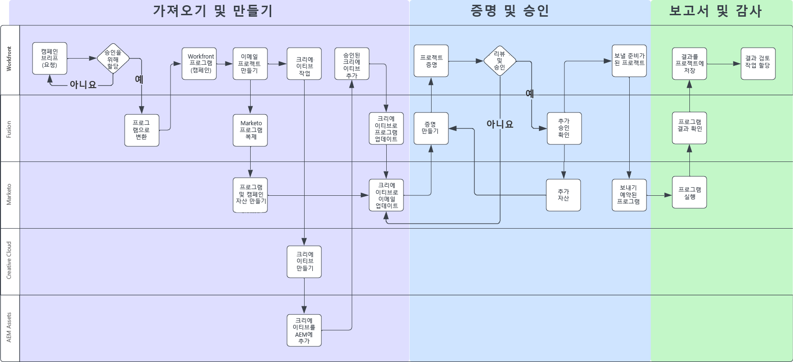
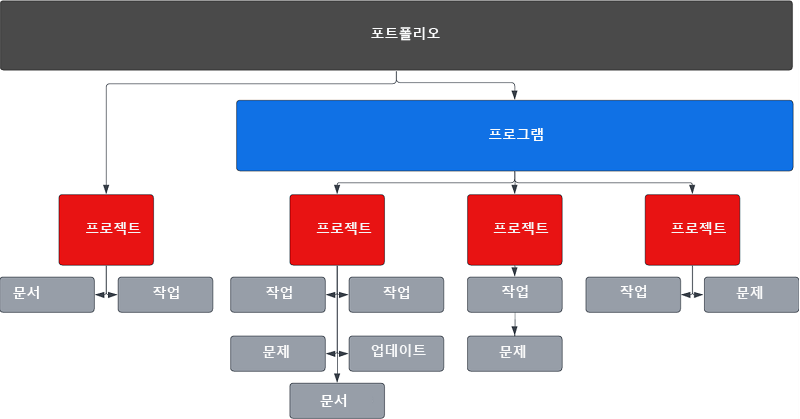
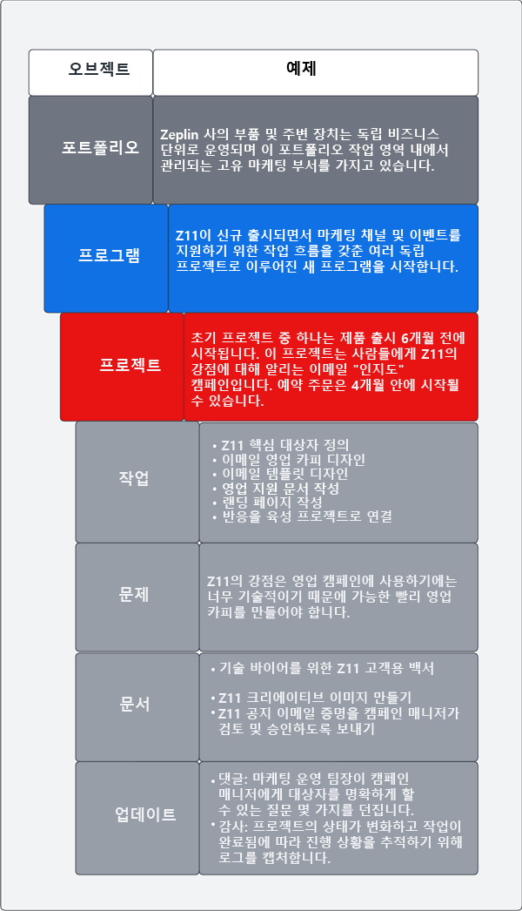
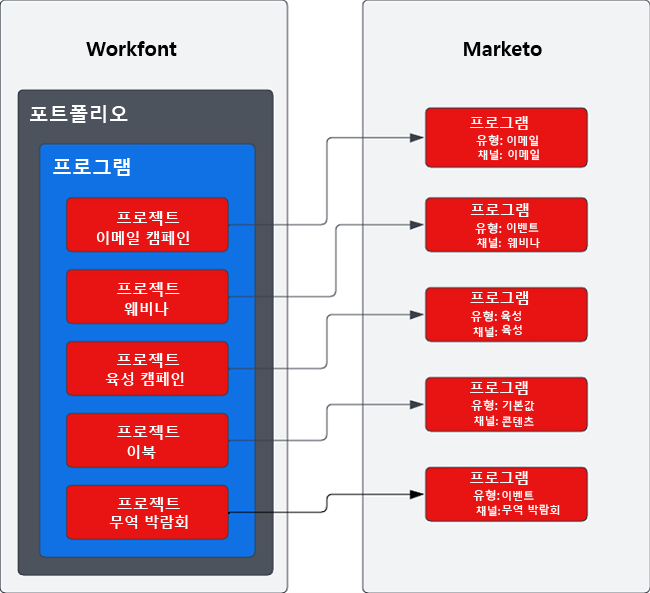

# Marketo와 Workfront를 사용하는 캠페인 공급망 블루프린트 {#overview}

## 최적화된 캠페인 공급망을 통해 시장 출시 시간 단축 {#achieving-faster-time-to-market-with-optimized-campaign-supply-chain}

하루가 다르게 새로운 채널이 나타나고 커뮤니케이션 개인화 수단이 많아지면서 마케팅이 할 일이 계속 늘어나고 있습니다. 전 세계의 변화하는 마케팅 수요를 지원하기 위해 마케팅 팀은 자동화와 진화를 지속할 방법을 찾아야 합니다.

**&quot;언제나 ROI가 진정한 목표입니다. 수익도 중요하지만 결코 목표라 할 수는 없죠. 특히 오늘날에는 더욱 그렇습니다.&quot; - CMO, 비즈니스 서비스 업계**

수익을 늘리면서 보다 높은 ROI를 달성하는 조직은 캠페인 개발 과정을 간소화하고 캠페인 실행 속도를 최적화하며 전체 마케팅 기능에 대한 관리를 개선함으로써 성과를 냅니다.

이 문서는 아래와 같은 목표를 성취하려는 조직에 유용합니다.

* 캠페인 운영을 확장하여 다기능 마케팅 팀 지원
* 간소화된 캠페인 요청 프로세스로 시장 출시 기간 단축
* 기록 시스템을 구축하여 캠페인 이해 관계자 전반의 가시성 향상
* 캠페인 자산(이미지, 이미지 카피) 검토 및 승인

캠페인 운영 팀에는 마케팅 캠페인을 효율적이고 효과적으로 계획 및 실행할 수 있는 시스템이 필요합니다. 이메일이든, 웨비나, 이벤트, 유료 미디어, 육성 또는 콘텐츠 배포든, 마케팅 팀에는 캠페인 기여자, 게재물, 실행을 정리할 중앙 솔루션이 필요합니다.

멀티채널 마케팅 활성화 시스텀(Marketo Engage)과 마케팅 기획 및 기록 시스템(Workfront)을 통합하면 캠페인 속도를 높이고 이해 관계자에게 보다 나은 가시성을 제공할 수 있습니다.

마케팅 운영 팀은 Workfront Fusion을 사용하여 마케팅 브리프를 캠페인으로 변환할 때 직접 손으로 해야 하고 오류가 발생하기 쉬운 단계를 크게 줄일 수 있습니다. Workfront Fusion은 바로 사용할 수 있는 Workfront과 Marketo Engage 간 통합 레이어를 제공하여 시스템 간 워크플로우 개발에 유연성과 효율성을 더합니다. 통합을 설정하는 방법과 워크플로우를 자동화하기 위해 할 수 있는 작업에 대해 [여기](https://experienceleague.adobe.com/docs/workfront/using/adobe-workfront-fusion/fusion-apps-and-modules/marketo-modules.html?lang=ko){target="_blank"}에서 자세히 알아볼 수 있습니다.

## Campaign 계획-실행 - 자동화 사용 사례 {#campaign-planning-to-execution-automation-use-cases}

* Workfront의 가져오기 요청을 통해 Marketo Engage에서 캠페인 만들기를 자동화하여 마케팅 운영 팀 지원
* Marketo Engage에서 만든 이메일 및 랜딩 페이지의 초안을 Workfront에 공유하여 기능 간 이해 관계자의 최종 검토 및 승인 받기
* Marketo Engage의 캠페인 결과를 Workfront에 공유하여 캠페인 지표 액세스 민주화

아래에서 대량 이메일 전송 요청 사례에 대한 캠페인 개발 과정 워크플로우 다이어그램을 확인할 수 있습니다. 또한 Workfront Fusion이 어떻게 Workfront과 Marketo Engage 사이에서 캠페인 개발 주기 전반에 걸쳐 워크플로우와 프로세스 자동화를 유도하는 역할을 하는지도 살펴볼 수 있습니다.

{zoomable=&quot;yes&quot;}

캠페인 개발 프로세스의 여러 단계에 주목하세요.

1. 가져오기 및 만들기: 캠페인에 대한 요청을 만들고 프로그래밍 방식으로 캠페인 자산을 모읍니다.

1. 증명 및 승인: 캠페인을 조직한 뒤 이해 관계자가 이메일, 랜딩 페이지 등 캠페인 자산을 검토 및 승인합니다.

1. 보고서 및 감사: 캠페인 결과를 Workfront에 공유하여 여러 직능에 걸친 이해 관계자에게 보다 나은 가시성을 제공합니다.

>[!NOTE]
>
>위의 예에서는 Workfront가 Marketo Engage 프로그램의 수명 주기 전반에 걸친 작업 활동을 관리하고 계획합니다. 즉, Workfront의 유연성을 확장하여 전체 마케팅 팀의 노력을 관리할 수 있습니다. 여기에는 계정 기반 마케팅, 마케팅 콘텐츠 공급망, 에이전시 관리, 디지털 및 소셜 캠페인 관리, 영업 지원 프로그램 등이 있습니다.

## Workfront에서 마케팅 이니셔티브가 표시되는 방식 이해 {#understanding-how-marketing-initiatives-are-represented-in-workfront}

Adobe Workfront는 조직이 작업을 관리하여 캠페인을 보다 효율적으로 실행할 수 있게 해 줍니다. Workfront 내에는 기획, 리소스 관리, 다양한 팀에 걸친 공동 작업을 관리하는 프레임워크 역할을 하는 오브젝트 계층 구조가 있습니다.

이 오브젝트에 비즈니스 프로세스를 매핑하는 방법을 이해하는 것은 Workfront과 Marketo Engage 간의 관계를 이해하는 데 중요합니다.

{zoomable=&quot;yes&quot;}

### 정의된 Portfolio 계층 {#portfolio-hierarchy-defined}

<table> 
  <tr> 
   <td><b>오브젝트</b></td>
   <td><b>정의</b></td>
  </tr>
  <tr> 
   <td>포트폴리오</td>
   <td>Workfront의 [포트폴리오] 및 [프로그램]을 사용하여 [프로젝트]를 구성할 수 있습니다. [프로젝트] 구성을 통해 유사한 [프로젝트]를 비교하여 리소스를 제일 잘 사용할 수 있는 곳을 정할 수 있습니다.  
   (예: 서비스 및/또는 제품 판매에 주력하는 회사 내의 비즈니스 단위마다 [포트폴리오]를 하나씩 만듭니다.)</td>
  </tr>
  <tr>
   <td>프로그램</td>
   <td>Workfront의 [프로그램]을 사용하여 [프로젝트]를 구성할 수 있습니다. [프로젝트] 구성을 통해 유사한 [프로젝트]를 비교하여 리소스를 제일 잘 사용할 수 있는 곳을 정할 수 있습니다.  
   (예: 새 제품 출시에 대한 인지도 향상 및 수요 창출 등 높은 수준의 목표를 가진 마케팅 전략.)</td>
  </tr>
  <tr>
   <td>프로젝트</td>
   <td>Workfront의 [프로젝트]는 특정 목표, 게재물, 제품 등을 달성하기 위해 완료해야 하는 작업 항목 모음입니다.  
   (예: 대량 이메일 전송, 육성 캠페인, 웨비나 또는 대면 이벤트 등 마케팅 전술. 단일 [프로젝트]에 이메일, 디스플레이 광고, 랜딩 페이지, 다운로드 가능한 백서 등 동일한 성과를 창출하기 위한 여러 전술을 포괄하여 보다 복잡하게 만들 수도 있습니다.)</td>
  </tr>
  <tr>
   <td>작업</td>
   <td>Workfront의 [작업]은 계획된 작업 항목으로, [프로젝트]나 이니셔티브의 일부일 수 있습니다. [작업]은 사용자 또는 팀에서 완료하도록 할당됩니다.  
   (예: 대상자 세그먼트를 작성하거나 이메일 초안을 만드는 작업은 Marketo Engage 이메일 프로그램을 개발하기 위한 [프로젝트]와 연결될 수 있습니다.)</td>
  </tr>
  <tr>
   <td>문제</td>
   <td>문제는 Workfront의 계획되지 않은 작업 항목입니다. [프로젝트] 중에 발생한 문제나 요청 대기열을 통해 제출된 요청일 수 있습니다.  
   (예: 이메일 배너 이미지의 차원이 잘못되어 문제가 발생합니다.)</td>
  </tr>
  <tr>
   <td>문서</td>
   <td>문서는 워드 문서나 프레젠테이션 등 기존 방식의 문서일 수 있습니다. 이미지 파일일 수도 있습니다. Workfront에서는 문서 및 이미지에 댓글 및 주석을 달아 자산을 교정하는 방식으로 팀 간 공동 작업을 수행할 수 있습니다.  
   (예: 검토해야 하는 이메일 헤더 이미지.)</td>
  </tr>
  <tr>
   <td>업데이트</td>
   <td>작업을 추적하고 Workfront 내 공동 작업을 용이하게 하는 댓글 및 감사 로그 등입니다.  
   (예: 새 이미지 버전의 감사 로그.)</td>
  </tr>
  </tbody>
</table>

## 마케팅 이니셔티브 작업 관리 예제 {#marketing-initiative-work-management-example}

실제 예제를 통해 Workfront 포트폴리오 계층 구조가 어떻게 작용하는지 살펴보겠습니다.

Zeplin 사는 기존의 Z10 모델보다 높은 내구성과 자유로운 맞춤형 조정으로 뛰어난 성능을 제공하는 Z11이라는 소형 유틸리티 트랙터 부속 장치를 출시했습니다. 그래서 회사의 트랙터 부문에서 새로 나온 이 상품의 수요를 창출하고 인지도를 높이기 위해 마케팅 전략을 기획, 개발, 실행해야 합니다. 새로운 고객 인식과 기존 Z10 고객 모두의 인지도를 높이려면 이 마케팅 전략에 다양한 마케팅 전술을 포함해야 합니다.

아래 계층 구조는 이 마케팅 캠페인에서 전략, 전술, 작업, 자산이 Workfront에 어떻게 매핑되는지 보여 줍니다.

{zoomable=&quot;yes&quot;}

## Workfront를 Marketo에 매핑하기 {#mapping-workfront-to-marketo}

Workfront를 마케팅 기획 및 [프로젝트] 조직을 위한 업스트림 시스템으로 사용하려면 Marketo Engage과 Workfront 간에 정보를 공유하는 방법을 이해하는 것이 중요합니다.

새로운 마케팅 이니셔티브를 개발할 때 이 두 시스템이 함께 작동하도록 하려면 Workfront의 다양한 기록 유형이 Marketo Engage의 기록 유형에 어떻게 매핑되는지 이해하는 것이 중요합니다.

### Workfront 프로젝트를 Marketo Engage 프로그램에 매핑 {#mapping-workfront-projects-to-marketo-engage-programs}

Workfront Fusion을 통합 레이어로 사용하면 Workfront의 프로젝트를 Marketo Engage의 프로그램에 매핑할 수 있습니다. 예를 들어 위의 예제에서 Zeplin은 새로운 Zeplin 모델의 인지도를 높이고자 합니다. 이를 위해 이들은 Workfront 내에 새로운 [프로그램]을 만들며, 이 [프로그램]에는 [프로젝트]로 표시되는 여러 마케팅 전술이 들어 있습니다. 한 가지 전술은 Z10 모델의 기존 고객에게 새로운 Z11 모델에 대해 알리는 홍보 이메일입니다. Workfront에는 이 이메일 전술을 나타내기 위해 만든 [프로젝트]가 있고, 여기에 대상자 만들기, 이메일 이미지 크리에이티브 만들기, Marketo Engage에서 이메일 조합하기 등 여러 작업이 연결될 것입니다. Workfront의 [프로젝트]는 시스템 간에 정보를 동기화할 수 있도록 Marketo Engage의 [이메일 프로그램]에 매핑됩니다.

아래에서는 한 [프로그램]에 여러 프로젝트를 포함하고 그 Workfront [프로젝트]를 Marketo Engage의 [프로그램]에 매핑하는 방법의 예시를 볼 수 있습니다.

{zoomable=&quot;yes&quot;}

Workfront의 한 [프로그램]에 여러 Workfront [프로젝트]를 넣어야 하는 대규모 마케팅 이니셔티브를 시작할 수도 있고, 웨비나나 이메일에 대한 일회성 요청에 대응하기 위해 단일 Workfront [프로젝트]만 필요할 수도 있습니다. 무엇이 필요하든 Workfront, Workfront Fusion, Marketo Engage는 캠페인 개발 프로젝트를 기획부터 실행까지 원활하게 통합할 수 있는 유연성을 제공합니다.

### Workfront 작업을 Marketo Engage 자산에 매핑 {#mapping-workfront-tasks-to-marketo-engage-assets}

Workfront에서 캠페인 개발 프로세스 매핑을 시작할 때 어떤 작업이 Marketo Engage에서 수행할 업무와 매핑되며 Workfront에서 정보를 캡처하고 캠페인 개발 공급망의 일관성, 효율성, 정확성을 높일 방법은 무엇인지에 대해서도 생각할 수 있습니다.

Workfront [프로젝트]를 템플릿화하여 특정 마케팅 전술을 실행할 때마다 프로세스를 명확하게 정의할 수 있습니다. 예를 들어 이메일 캠페인을 실행할 때에는 조직에서 완료해야 하는 표준 작업 집합이 있을 것입니다. 예를 들어 이해 관계자와의 킥오프 회의, 크리에이티브 자산 모으기, 크리에이티브 승인, 타겟 대상자 작성, 이메일 작성, 이메일 번역, 이메일 승인, 이해 관계자에게 이메일 캠페인 결과 공유 등의 작업이 필요할 수 있습니다.

이 작업 중 일부는 Marketo Engage에서 수행할 업무에 직접 매핑할 수 있습니다. 예를 들어 Workfront에서 이메일 작성 작업을 사용자 정의할 때 Marketo Engage로 정보를 전달하여 이메일 조합을 자동화하는 필드를 포함할 수 있습니다. 여기에는 제목, 카피, 이메일 내 이미지 등이 포함될 수 있습니다.

## 다음 단계 {#next-steps}

이제 Workfront와 Marketo Engage가 어떻게 캠페인 개발 공급망에 새로운 효율성을 가져다 줄 수 있는지에 대해 기본적인 이해를 마쳤으니 다음 문서 및 리소스에서 Workfront Fusion을 사용하여 Marketo Engage와 Workfront 간 워크플로우 및 프로세스를 자동화하는 방법에 대해 알아보세요.

### Workfront Fusion, Workfront 및 Marketo Engage 통합 시작하기 {#getting-started-with-workfront-fusion}

* [가져오기 및 만들기](/help/blueprints/b2b/campaign-supply-chain/intake-and-create.md){target="_blank"} - Marketo Engage와 Workfront를 사용한 캠페인 개발 자동화

* 증명 및 승인(준비 중)

* 보고서 및 감사(준비 중)

### Marketo Engage 캠페인 이름 및 관련 URL 관리 {#managing-marketo-engage-campaign-names}

캠페인 및 URL의 이름 지정 규칙을 표준화하는 것은 Marketo Engage에서 프로그램을 정확하게 관리하고 캠페인 공급망 전반에 걸쳐 보다 일관된 프로세스를 구현하는 데 도움이 되는 중요한 토대입니다. 여기에 도움이 되는 도구를 찾고 있다면 Marketo Engage 캠페인과 그 연결 URL을 만들고 관리하기 위한 일관적인 접근법을 만들게 해 주는 [Adobe Success Services](https://main--marketo-campaign-tools--dr-adobe.hlx.live/){target="_blank"}의 무료 오픈 소스 도구 몇 가지를 확인해 보시기를 추천합니다.

### 리소스 {#resources}

* [Marketo Engage용 Workfront Fusion](https://experienceleague.adobe.com/docs/workfront/using/adobe-workfront-fusion/fusion-apps-and-modules/marketo-modules.html?lang=ko){target="_blank"}

* [Workfront용 Workfront Fusion](https://experienceleague.adobe.com/docs/workfront/using/adobe-workfront-fusion/fusion-apps-and-modules/workfront-modules.html?lang=ko){target="_blank"}
