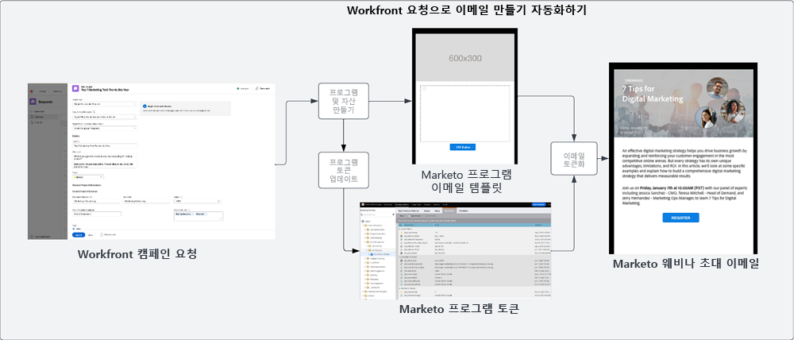

# 가져오기 및 만들기 블루프린트 {#intake-and-create}

새로운 캠페인을 실행하기 위해 마케팅 운영 팀에 들어오는 마케팅 요청의 수가 너무 많으면 높은 기능을 발휘하던 팀이 반복 작업의 회전문으로 변해 번아웃을 일으키고 혁신을 침체시킬 수 있습니다.

캠페인 요청 제출 프로세스를 설정하고 요청이 많은 마케팅 캠페인 만들기를 자동화함으로써 캠페인 속도를 높이고, 오류를 줄이고, 마케팅 운영 팀의 적합한 구성원에게 요청을 할당하고, 리소스 사용률의 균형을 맞추고 개선하며, 마케팅 운영 팀의 구성원 중 많은 수를 보다 전략적인 작업에 집중할 수 있습니다.

Workfront와 Marketo Engage를 사용하면 시스템 간 연결을 통해 [Workfront 요청 양식](https://experienceleague.adobe.com/docs/workfront/using/administration-and-setup/customize/custom-forms/create-or-edit-a-custom-form.html?lang=ko){target="_blank"}의 세부 정보를 사용하여 Marketo Engage의 프로그램을 만든 다음 제목, 이메일 카피, 이미지, 날짜, 시간, 이벤트 정보 등 핵심 변수를 채울 수 있습니다.

이 통합을 구성하려면 Workfront와 다른 시스템 간의 워크플로우를 자동화할 수 있는 작업 자동화 레이어인 Workfront Fusion을 사용합니다.

아래 워크플로우는 캠페인 관리자가 Workfront 요청 양식을 사용하여 웨비나 요청을 만드는 과정을 보여 줍니다. 요청에서 제출한 세부 정보는 Marketo Engage 내에서 웨비나에 필요한 프로그램과 이메일이 만들어지도록 트리거합니다. 또한 요청 양식에서 세부 정보를 가져와 이메일의 콘텐츠를 채웁니다.

{zoomable=&quot;yes&quot;}

>[!TIP]
>
>마케팅 캠페인 작업을 구성하는 데 사용되는 Workfront의 다양한 오브젝트 유형과 이 오브젝트가 Marketo Engage 프로그램에 어떻게 매핑되는지에 대한 자세한 내용은 [Marketo와 Workfront 개요](/help/blueprints/b2b/marketo-engage-and-workfront-integration-blueprint/overview.md){target="_blank"}를 참조하세요.

## 자동화에 대비하여 캠페인 개발 프로세스 정비하기 {#prepare-your-campaign-development-process-for-automation}

모든 뛰어난 워크플로우 자동화 뒤에는 팀과 이해 관계자가 자동화를 최대한 활용할 수 있도록 해 주는 정의된 프로세스가 있습니다.

**어떤 유형의 마케팅 요청을 받게 되나요?**

어떤 유형의 마케팅 전술을 실행하게 될지 생각해 보세요. 이메일, 육성, 자사 웨비나, 이벤트 중 무엇을 실행하나요? 서드파티 웨비나나 디스플레이 광고도 실행하나요? 이러한 요청 각각에 대하여 요청 양식에 특정 입력 필드가 필요하며, 서로 다른 유형의 요청은 Marketo Engage 내 다른 프로그램 템플릿에 매핑되어 복제되므로 각 요청에 대해 고려해야 합니다.

여러 지역에서 캠페인을 실행하게 될지도 알아 두어야 합니다. 이 경우 Workfront에서 단일 [프로젝트]로 처리하되 Marketo Engage에서 여러 프로그램을 만들 수 있으며 각 프로그램이 서로 다른 언어 지원을 나타냅니다.

받게 될 마케팅 요청의 유형이 무엇인지 미리 알아 두는 것이 중요합니다. 그래야 요청을 자동화 방식으로 처리할 수 있습니다.

**캠페인 요청에서 캡처해야 하는 정보는 무엇인가요?**

실행하는 각 전술에 대해 요청 양식에서 캡처해야 하는 주요 정보를 생각해 보세요. 다음은 Workfront 양식에서 캡처하면 캠페인 개발을 자동화하는 데 도움이 되는 정보의 몇 가지 예입니다.

<table> 
  <tr> 
   <td><b>마케팅 전술</b></td>
   <td><b>캡처할 정보</b></td>
  </tr>
  <tr> 
   <td>대량 이메일 보내기</td>
   <td>・ 이메일 제목 
・ 예약 날짜 
・ 이메일 카피 
・ 콜 투 액션 
・ 이미지 - Marketo에서 사용할 AEM Assets URL을 직접 참조할 수 있음 
・ 대상자 자격 기준</td>
  </tr>
  <tr>
   <td>웨비나/이벤트</td>
   <td>・ 이벤트 이름 
・ 이벤트 날짜 
・ 이벤트 시간 
・ 이벤트 도시 
・ 이벤트 설명 
・ 웨비나 녹화 페이지 - 온디맨드 페이지 URL 
・ 발제자 이름 
・ 발제 제목 
・ 발제자 이미지 
・ 필요한 이메일(초대, 확인, 다시 알림, 후속 작업) 
・ 이메일 헤더 이미지 
・ 대상자 자격 기준</td>
  </tr>
  <tr>
   <td>육성</td>
   <td>・ 이메일 수 
・ 이메일 카피 
・ 이메일 헤더 
・ 콜 투 액션 
・ 대상자 자격 기준</td>
  </tr>
  </tbody>
</table>

>[!NOTE]
>
>현재 스마트 목록에서 토큰이 지원되지 않는 관계로 Marketo Engage에서 자동화를 통해 프로그래밍 방식으로 대상자를 작성하는 것은 제한되어 있습니다. 즉, 사용자가 Marketo Engage에서 대상자를 만들거나 지속적으로 소통하는 미리 설정된 대상자가 있어 프로그램 템플릿의 일부로 구성된 스마트 목록 포함할 수 있어야 합니다. 이 목록은 자동화 프로세스에서 복제됩니다.

### 최상위 센터 구축 {#establish-your-center-of-excellence}

프로그램 만들기를 자동화하려면 Marketo Engage 내에 최상위 센터가 있어야 합니다. 최상위 센터에는 템플릿화한 프로그램 및 자산이 있어 캠페인 개발 프로세스를 가속화, 표준화하는 데 도움이 됩니다. 예를 들어 이메일, 육성, 대면 이벤트, 웨비나 등 다양한 캠페인 수요에 대한 프로그램 템플릿이 있을 수 있습니다. 또한 다양한 지역 또는 다양한 유형의 이메일 공지에 사용하는 여러 이메일 프로그램 템플릿이 있을 수도 있습니다.

Marketo Engage의 프로그램 템플릿으로 최상위 센터를 구축하는 것은 캠페인 실행에 보다 프로그램적인 접근 방식을 갖추기 위한 첫 단계의 일환이며 캠페인 요청을 자동화하기 위한 토대 역할을 합니다.

재사용 가능한 프로그램 템플릿 세트를 갖춘 다음에는 이 블루프린트에서 설명하는 자동화를 사용하여 캠페인 개발의 속도를 더욱 높이는 방향으로 노력을 확장할 수 있습니다.

자신만의 최상위 센터를 만드는 방법을 자세히 알아보려면 [Marketo 커뮤니티](https://nation.marketo.com/t5/product-blogs/marketo-master-class-center-of-excellence-with-chelsea-kiko/ba-p/243221){target="_blank"}의 우수 사례를 살펴보세요.

### 토큰을 사용하여 콘텐츠 채우기 {#use-tokens-to-populate-content}

Marketo Engage에서는 토큰을 사용하여 캠페인 자산에 콘텐츠를 채울 수 있습니다. 예를 들어 최상위 센터에서 이메일 템플릿을 복제한 뒤 Workfront Fusion에서 Workfront의 캠페인 요청에 있는 세부 정보를 가져다 Marketo Engage 프로그램의 [내 토큰]으로 전달할 수 있습니다. 그런 다음에는 토큰 값을 이메일에 직접 상속하여 이메일을 작성할 수 있습니다.

{zoomable=&quot;yes&quot;}

### AEM Assets에서 가져온 이미지 채우기 {#populate-images-from-aem-assets}

Marketo Engage의 토큰을 AEM Assets의 자산으로 가는 링크와 함께 활용하여 이메일 및 랜딩 페이지 개발을 더욱 자동화할 수 있습니다. 캠페인 요청자는 요청 프로세스의 일환으로 AEM Assets에서 게시한 이미지 링크를 제출할 수 있습니다. 그 다음 Workfront Fusion에서 Marketo Engage 토큰을 사용하여 이 링크를 이메일 HTML에 포함할 수 있습니다.

Fusion이 Workfront에 제출된 정보로 토큰 값을 업데이트할 수 있도록 하려면 Marketo Engage에서 [프로그램] 및 [프로그램 템플릿]이 [내 토큰]을 활용하도록 작성해야 합니다.

>[!NOTE]
>
>AEM Assets은 이 워크플로우를 지원하기 위한 필수 사항은 아니지만 캠페인 개발 공급망 전반에 걸쳐 캠페인 자산을 관리하는 프로세스를 보다 능률적으로 만들 수 있게 해 줍니다.

### 모든 프로그램 요청 유형에 대한 검색 라이브러리 조합하기 {#assemble-a-lookup-library-for-all-program-request-types}

Workfront 요청으로 새 Marketo Engage 프로그램을 만드는 과정을 자동화할 때에는 Workfront 요청에서 정보를 가져와 Marketo Engage에서 복제할 프로그램 템플릿을 올바르게 검색할 수 있는 단계를 Workfront Fusion 자동화에 포함하는 것이 중요합니다.

이렇게 하기 위해 Marketo Engage 최상위 센터에 있는 프로그램 템플릿 전체의 목록을 포함하는 데이터 세트를 Workfront Fusion으로 가져올 수 있습니다.

[프로그램 템플릿 검색] 라이브러리에 포함할 몇 가지 기본 정보는 다음과 같습니다.

<table> 
  <tr> 
   <td><b>열</b></td>
   <td><b>설명</b></td>
  </tr>
  <tr> 
   <td>캠페인 유형</td>
   <td>이메일, 웨비나, 육성, 이벤트, 타사 웨비나, 목록 가져오기 등이 있습니다. [캠페인 유형]은 요청 내용에 대해 읽을 수 있는 설명 역할을 합니다.</td>
  </tr>
  <tr> 
   <td>Workfront 요청 유형</td>
   <td>Workfront 양식에서 선택한 요청 유형으로, 이메일, 웨비나, 육성 또는 이벤트 등 캠페인 유형과 같을 수 있습니다. Workfront 양식에서 선택한 입력 사항을 Marketo의 [프로그램 템플릿]에 매핑하는 데 사용됩니다.</td>
  </tr>
  <tr> 
   <td>Workfront 양식 ID</td>
   <td>사용하는 Workfront 요청 양식의 고유 ID로 쓰는 요청이 Marketo Engage [프로그램 템플릿]에 매핑되고 있는지 확인하는 용도로 쓰입니다.</td>
  </tr>
  <tr> 
   <td>Marketo 프로그램 ID</td>
   <td>만드는 요청에 매핑되는 Marketo Engage 내 프로그램 템플릿의 ID입니다. Workfront Fusion에서 이 정보를 바로 사용할 수 있도록 하면 Fusion에서 Marketo Engage로 요청을 보내어 정확히 어떤 프로그램을 복제해야 하는지 확인할 수 있습니다.</td>
  </tr>
  </tbody>
</table>

## 가져오기 및 만들기 자동화 흐름 {#intake-and-create-automation-flow}

미리 작성된 [Workfront](https://experienceleague.adobe.com/docs/workfront/using/adobe-workfront-fusion/fusion-apps-and-modules/workfront-modules.html?lang=ko){target="_blank"} and [Marketo Engage](https://experienceleague.adobe.com/docs/workfront/using/adobe-workfront-fusion/fusion-apps-and-modules/marketo-modules.html?lang=ko){target="_blank"} 모듈을 사용하여 Fusion에서 워크플로우 논리를 조합함으로써 자동화를 더 빠르게 제공하는 방법의 예시입니다.

토큰을 사용하여 콘텐츠 채우기

## 리소스 {#resources}

* [Adobe Marketo Engage 모듈](https://experienceleague.adobe.com/docs/workfront/using/adobe-workfront-fusion/fusion-apps-and-modules/marketo-modules.html?lang=ko){target="_blank"}

* [Adobe Workfront 모듈](https://experienceleague.adobe.com/docs/workfront/using/adobe-workfront-fusion/fusion-apps-and-modules/workfront-modules.html?lang=ko){target="_blank"}

* [Marketo 및 Workfront 개요](/help/blueprints/b2b/marketo-engage-and-workfront-integration-blueprint/overview.md){target="_blank"}
