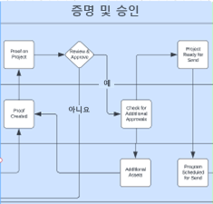

# 검토 및 승인 블루프린트 {#review-and-approve-blueprint}

마케팅 자산과 캠페인이 비즈니스의 기대와 표준을 충족하는지 확인하는 것은 올바른 대상자에게 올바른 콘텐츠와 메시지를 전달하는 것 이상입니다. 또한 조직은 새로운 마케팅 이니셔티브에 착수할 때 내부 정책, 업계 규정 및 법적 사전 요건까지 준수해야 하는 책임을 집니다. 마케팅 팀은 캠페인 개발 프로세스에 검토 및 승인 단계를 통합함으로써 콘텐츠와 메시징이 정확하고 업계 표준(특히 금융, 의료 및 제약 등의 산업 표준)을 준수하는지 확인할 수 있습니다.

Workfront와 Marketo Engage를 통해 마케팅 팀은 정확하고 규정을 준수하는 메시지와 함께 긴밀하게 연결된 시스템을 마케팅에 활용할 수 있습니다.

## Workfront를 사용하여 Marketo Engage에 대한 증명 및 고급 승인 수행 {#unlock-proofing-and-advanced-approvals}

마케팅 캠페인 구축에 대해 생각할 때 계획, 구축, 검토, 피드백, 승인 및 실행을 포함하여 여러 시스템이 관련된 다양한 단계를 지원함을 고려해야 합니다. 팀은 Workfront와 Marketo Engage를 통해 새로운 마케팅 캠페인을 계획하고 시작하는 전체 프로세스를 완료하는 데 필요한 모든 도구를 갖추고 있습니다. 또한 팀은 검토 및 승인 프로세스를 더욱 간소화하여 캠페인 개발 속도를 높이고 정확성과 규정 준수를 최고 수준으로 유지할 수 있습니다.

### Marketo Engage 및 Workfront으로 잠금 해제된 사용 사례 검토 및 승인 {#review-and-approve-use-cases-unlocked-with-marketo-engage-and-workfront}

* Marketo Engage 자산에 대한 Workfront의 주석 및 댓글 달기 기능을 활용하여 중앙 집중식 환경에서 서로 다른 피드백을 제거하고 공동 작업을 강화합니다.

* Workfront 승인 워크플로우의 Marketo Engage에서 승인을 트리거하여 승인을 중앙 집중화합니다.

* Workfront의 고급 승인 기능을 Marketo Engage 자산과 함께 활용하여 마케팅 자산의 복잡한 승인 워크플로우를 지원하고 간소화합니다.

* Marketo 자산을 프로그래밍 방식으로 Workfront로 가져와 여러 이해 당사자가 검토할 수 있도록 함으로써 마케팅 초안의 액세스 권한을 민주화합니다.

* Workfront의 Marketo Engage 자산에 대한 모든 검토 및 증명 작업을 중앙 집중화하여 변경 사항을 추적하고 문서 추적을 만듭니다.

## 증명 및 승인 워크플로우 계획 {#planning-your-proof-and-approval-workflow}

Marketo Engage와 Workfront 간의 증명 및 승인 통합을 설정하기 전에 다음 측면을 고려하십시오.

* 검토 및 승인해야 하는 자산은 무엇입니까?
* 승인자는 누구여야 합니까?
* 마케팅 자산을 활성화하려면 승인자가 여러 명 있어야 합니까?
* 캠페인 개발 프로세스의 어느 시점에서 마케팅 자산을 조직하고 검토할 준비가 됩니까?

이러한 질문에 답하면 승인 흐름이 어떤 모양인지 그리고 Workfront 인스턴스 구성에 대해 생각하는 방법의 기준을 얻는 데 도움이 됩니다.

## Marketo Engage와 Workfront 간 증명 및 승인 워크플로우 구축 {#building-a-proof-and-approval-workflow}

Workfront와 Marketo Engage 간의 증명 및 승인 프로세스를 간소화하기 위해 Workfront Fusion을 사용하여 두 솔루션을 통합할 수 있습니다. Workfront Fusion은 작업을 트리거하고 Workfront와 Marketo Engage 인스턴스 간에 정보를 전달하는 워크플로우 인터페이스를 제공합니다.

이렇게 하려면 아래 단계를 통합 검토 및 승인 경험을 위한 프로세스의 일부로 고려하십시오.

1. 검토 준비 완료 작업으로 Workfront 프로젝트를 구성합니다.
1. 작업 상태 변경과 함께 Workfront에 동기화하도록 Marketo Engage 이메일을 트리거합니다.
1. Marketo Engage 이메일 파일을 Workfront에서 검토 가능한 증명으로 변환합니다.
1. Workfront 교정을 사용하여 주석 및 주석을 통해 공동 작업을 수행할 수 있습니다.
1. Workfront 증명을 승인하여 Marketo Engage에서 자산 승인을 트리거한 다음 작업을 완료로 표시합니다.

### 검토 준비 완료 작업으로 Workfront 프로젝트 구성 {#configure-a-workfront-project-with-a-ready-for-review-task}

[프로젝트 템플릿](https://experienceleague.adobe.com/docs/workfront/using/manage-work/projects/create-and-manage-project-templates/project-template-overview.html?lang=ko){target="_blank"}을 사용하여 조직의 프로젝트와 연결된 대부분의 반복 가능한 프로세스, 정보 및 설정을 캡처합니다. 작업을 정의하고, 주제를 대기열에 추가하며, 사용자 정의 양식을 만들고, 템플릿에 문서를 첨부할 수 있습니다.

Workfront의 프로젝트 템플릿에 마케팅 캠페인의 일부인 자산을 검토하는 작업을 포함합니다. 또한 승인 프로세스를 추가하여 단일 승인 또는 더 복잡한 다중 레벨 승인을 처리할 수 있습니다.

새 이메일 캠페인을 시작하려는 경우, 이메일을 검토하는 작업과 이메일을 보내기 전에 올바른 이해 당사자가 승인했는지 확인하는 승인 프로세스를 포함하는 프로젝트 템플릿이 있어야 합니다.

{zoomable="yes"}

### 작업 상태 변경과 함께 Workfront에 동기화하도록 Marketo Engage 이메일 트리거 {#trigger-your-marketo-engage-email-to-sync-to-workfront}

마케팅 팀에서 검토할 준비가 되면 검토 프로세스의 일부로 이메일을 Workfront 프로젝트에 동기화할 수 있습니다. 이 작업을 수행하려면 이메일을 검토할 준비가 되었음을 나타내는 [작업 상태](https://experienceleague.adobe.com/docs/workfront/using/manage-work/projects/update-work-on-a-project/update-task-status.html?lang=ko){target="_blank"}로 검토 준비 완료 작업을 설정하는 것이 좋습니다. 이 예에서는 이해 당사자가 이메일 초안을 검토할 준비가 되면 선택할 수 있는 Marketo 이메일 검토 상태를 작업에 추가했습니다.

이 상태가 Workfront 프로젝트에 적절히 준비되면 &quot;Marketo 이메일 검토&quot;로 업데이트하기 위해 검토 준비 완료 작업을 수신하도록 Workfront Fusion 시나리오를 구성할 수 있습니다. 시나리오가 업데이트되면 Marketo Engage 이메일을 HTML 파일로 가져와 압축한 다음 검토할 Workfront 프로젝트 문서에 해당 이메일의 사본을 저장할 수 있습니다.

{zoomable="yes"}

### Workfront에서 Marketo Engage 이메일을 검토 가능한 증명으로 변환 {#convert-your-marketo-engage-email-to-reviewable-proof-in-workfront}

검토 준비 완료 작업을 &quot;Marketo 이메일 검토&quot; 상태로 이동하고 Marketo Engage 이메일을 Workfront에 저장하면 이메일을 Workfront 증명으로 전환하도록 Workfront Fusion 시나리오를 구성할 수 있습니다.

### Workfront 교정을 사용하여 주석 및 주석을 통해 공동 작업 {#use-workfront-proofing-to-collaborate}

[Workfront의 증명](https://experienceleague.adobe.com/docs/workfront/using/review-and-approve-work/proofing/proofing-overview/proofing-basics.html?lang=ko){target="_blank"} 기능을 사용하면 마케팅 팀이 이미지 또는 전자 메일과 같은 새 자산을 가져와서 주석 및 주석을 통해 공동 작업할 수 있습니다. 증명을 실행할 준비가 되면 의사 결정권자가 증명 도구에서 에셋을 승인할 수 있습니다.

{zoomable="yes"}

### Marketo Engage에서 Workfront Proof을 승인하고 에셋 승인을 트리거하고 작업을 완료로 표시 {#approve-workfront-proof-and-trigger-asset-approval-in-marketo-engage}

Workfront Fusion은 이해 관계자가 이메일을 승인한 시점을 감지하고 Marketo 내에서 이메일을 승인하도록 Marketo Engage에 요청을 보낼 수 있습니다.

적절한 팀원이 검토한/승인한 이메일을 통해 Marketo Engage에서 라이브로 전환할 수 있습니다.

## Fusion 시나리오 템플릿 {#fusion-scenario-templates}

자체 Workfront 및 Marketo Engage 인스턴스에서 검토 및 승인 워크플로우의 개발을 간소화할 수 있도록 통합을 시작하는 데 도움이 되는 Fusion 템플릿을 구축했습니다. Fusion의 공용 템플릿 섹션에서 &quot;Marketo&quot;를 검색하여 인스턴스에 다운로드하면 이러한 템플릿을 활용할 수 있습니다.

### Workfront에서 Marketo Engage 이메일 초안의 이메일 증명 검토 {#review-an-email-proof-of-your-marketo-engage-email-draft-in-workfront}

아래 Fusion 시나리오는 검토 및 승인 흐름의 전반부를 안내합니다. 여기서 이메일 초안을 Marketo Engage에서 가져와 증명으로 Workfront에 저장할 수 있습니다. Workfront 프로젝트 문서에 증명으로 저장되면 마케팅 이해 당사자가 검토 프로세스의 일부로 해당 문서를 검토하고, 댓글을 달고, 주석을 추가할 수 있습니다.

{zoomable="yes"}

### Marketo Engage의 자산 승인을 트리거하는 Workfront에서 이메일 승인 {#approve-an-email-in-workfront-that-triggers-approval}

아래 Fusion 시나리오를 사용하여 Workfront에서 증명이 승인된 시기를 감지하고 해당 승인을 Marketo Engage로 전달하여 Marketo Engage 프로그램에서 활성화하고 사용할 수 있도록 이메일 초안을 업데이트할 수 있습니다.

{zoomable="yes"}

이러한 두 시나리오를 함께 사용하면 마케팅 자산을 Marketo Engage에서 Workfront의 강력한 검토 및 승인 워크플로우로 가져오고 승인을 Workfront에서 Marketo Engage로 다시 푸시하기 위한 양방향 경로를 만들 수 있습니다.
