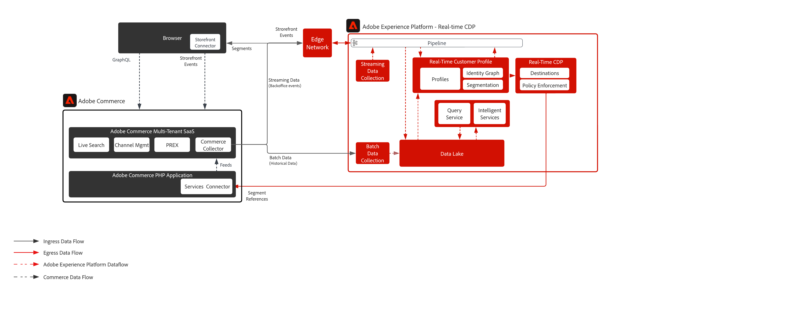

# Adobe Commerce 및 RTCDP

이러한 통합 경험은 Adobe Commerce 고객이 Adobe Experience Platform과 원활하게 통합하여 고객 프로필을 강화하고 디지털 상점 및 기타 채널에서 경험을 개인화할 수 있도록 지원합니다.

## 기술 기능 활성화됨

* Storefront 데이터(클라이언트측)가 수집되어 Adobe Experience Cloud 제품으로 전송됩니다. (장바구니에 추가, 장바구니 포기 등)
* 모든 Adobe Experience Cloud 제품에 대한 백오피스 주문 상태
* 백오피스 내역 주문을 Adobe Experience Platform으로 전송할 수 있습니다.
* Adobe Commerce에 RTCDP 대상 공유 및 개인화

## 필요 조건

Experience Platform 커넥터를 사용하려면 다음 사항이 있어야 합니다.

* Adobe Commerce 2.4.4 이상
* Adobe ID 및 조직 ID
* Adobe Experience Platform/RTCDP
* [Adobe 클라이언트 데이터 레이어(ACDL)](https://experienceleague.adobe.com/docs/experience-platform/tags/extensions/client/client-data-layer/overview.html?lang=en). ACDL은 상점 이벤트 데이터를 수집하는 데 필요합니다.

## 온보딩 단계

### Adobe Commerce에서 Adobe Experience Platform으로 데이터 수집

* [설치](https://experienceleague.adobe.com/docs/commerce-merchant-services/experience-platform-connector/fundamentals/install.html?lang=en) Experience Platform 커넥터 확장.
* [로그인](https://helpx.adobe.com/manage-account/using/access-adobe-id-account.html) 을 Adobe 계정과 조회하여 조직 ID를 확인합니다. 조직 ID 는 공급된 Experience Cloud 회사와 연결된 ID입니다. 이 ID는 24자의 영숫자 문자열과 @AdobeOrg(포함 필수)로 구성됩니다.
* [만들기 또는 업데이트](https://experienceleague.adobe.com/docs/commerce-merchant-services/experience-platform-connector/fundamentals/update-xdm.html?lang=en) 상거래 관련 필드 그룹이 있는 XDM 스키마.
* [데이터 세트 만들기](https://experienceleague.adobe.com/docs/platform-learn/implement-mobile-sdk/experience-cloud/platform.html?lang=en#create-a-dataset) 생성 또는 업데이트한 스키마를 기반으로 합니다. 이 데이터 세트에는 전송하는 상거래 데이터가 포함됩니다.
* [데이터 스트림 만들기](https://experienceleague.adobe.com/docs/experience-platform/edge/datastreams/overview.html?lang=en) 상거래 관련 필드 그룹을 포함하는 XDM 스키마를 선택합니다.
* [상거래 서비스에 연결](https://experienceleague.adobe.com/docs/commerce-merchant-services/user-guides/integration-services/saas.html?lang=en).
* [Adobe Experience Platform에 연결](https://experienceleague.adobe.com/docs/commerce-merchant-services/experience-platform-connector/fundamentals/connect-data.html?lang=en).

### 대상 공유를 위해 Adobe Experience Platform에서 상거래 대상에 연결

Adobe Commerce 대상에 연결하려면 다음 작업을 수행하십시오.

* 다음에서 [Adobe Experience Platform 인터페이스](https://experience.adobe.com/platform/)를 클릭하고 대상 > 카탈로그로 이동합니다.
* 개인화를 선택합니다.
* Adobe Commerce 대상을 선택하여 강조 표시한 다음 설정을 선택합니다.
* 다음에 설명된 단계를 수행합니다. [대상 구성 자습서](https://experienceleague.adobe.com/docs/experience-platform/destinations/ui/connect-destination.html?lang=en).

## 기본 데이터

* Storefront(브라우저/앱) 이벤트
* 백오피스 이벤트
* 이전 순서 데이터

지원되는 전체 이벤트 목록은 다음을 참조하십시오. [상거래 이벤트](https://experienceleague.adobe.com/docs/commerce-merchant-services/experience-platform-connector/event-forwarding/events.html?lang=en)

## 아키텍처

## 관련 구현 안내서

| 안내서  | 링크 |
|:----|:----|
| 플랫폼 커넥터 | [Adobe Commerce Experience Platform 커넥터 개요](https://experienceleague.adobe.com/docs/commerce-merchant-services/experience-platform-connector/overview.html?lang=en) |
| 상거래 대상 | [RTCDP의 Adobe Commerce 연결](https://experienceleague.adobe.com/docs/experience-platform/destinations/catalog/personalization/adobe-commerce.html?lang=en) |
| Edge Personalization | [Edge 개인화 대상에 대한 대상자 활성화](https://experienceleague.adobe.com/docs/experience-platform/destinations/ui/activate/activate-edge-personalization-destinations.html?lang=en) | |
