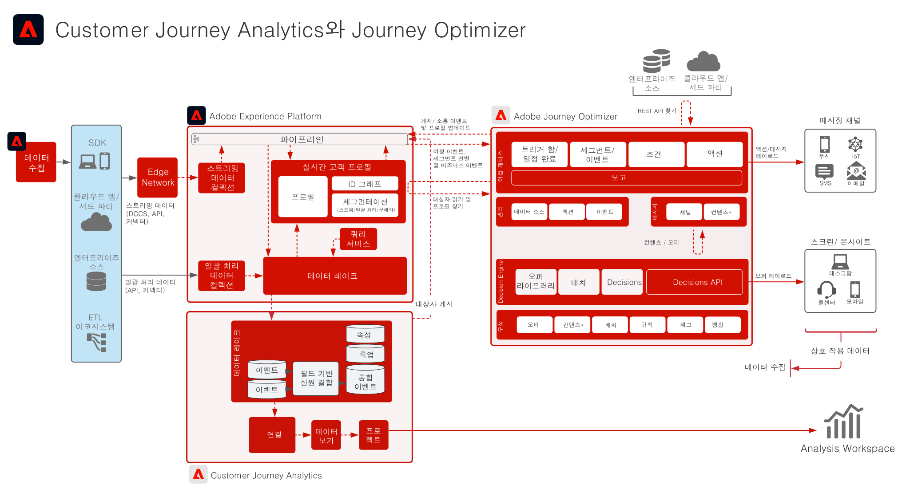

# Customer Journey Analytics와 Journey Optimizer

Journey Optimizer의 데이터는 Experience Platform의 데이터 레이크로 공유되어 Customer Journey Analytics 내 수집, 분석, 보고에 사용할 수 있습니다. Customer Journey Analytics 내에서 여정의 게재, 상호 작용, 효율성을 분석 및 보고할 수 있습니다.

또한 Customer Journey Analytics에서 작성한 대상자는 Experience Platform Real-time Customer Profile에 게시할 수 있으며 Journey Optimizer에서 여정 실행에 사용할 수 있습니다.

## Implementation 안내서

Customer Journey Analytics 내 Journey Optimizer 데이터 구현 및 구성에 대한 지침은 다음 설명서를 참조하세요. [사용자 가이드](https://experienceleague.adobe.com/docs/journey-optimizer/using/reporting/reports/sharing-overview.html?lang=ko)

## Customer Journey Analytics와 Journey Optimizer 아키텍처

