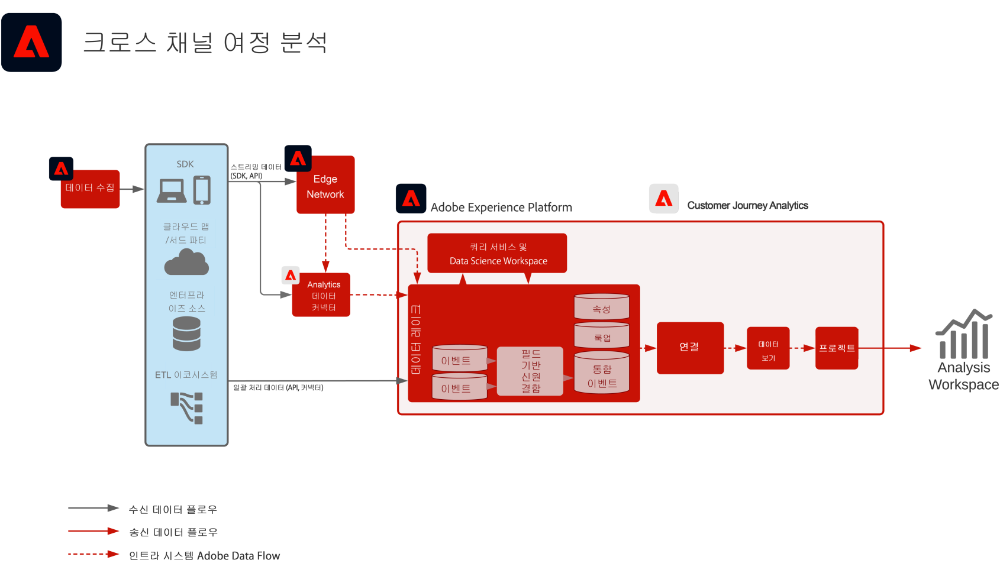

# Real-time Customer Data Platform 블루프린트가 포함된 Customer Journey Analytics

고객 타겟팅 및 개인화를 위해 CJA(Customer Journey Analytics)에서 식별한 대상자를 만들어 Adobe Experience Platform의 실시간 고객 프로필에 게시합니다. 내역 데이터를 사용하여 대상자를 만들거나 Customer Journey Analytics의 세분화된 필터링 및 계산된 필드로 보다 정교한 대상자를 만드는 데 적합합니다.

## Customer Journey Analytics 대상자 게시 안내서

Customer Journey Analytics에서 Real-time Customer Data Platform으로 대상자를 게시하기 위한 구현 및 구성에 대한 지침은 다음 설명서를 참조하십시오. [사용자 가이드](https://experienceleague.adobe.com/docs/analytics-platform/using/cja-components/audiences/publish.html?lang=ko)

## Customer Journey Analytics 블루프린트의 아키텍처

{zoomable="yes"}

## Customer Journey Analytics 블루프린트의 가드레일 다이어그램

* 자세한 가드레일 및 엔드 투 엔드 지연 시간에 대해서는 [배포 가드레일 문서](../experience-platform/guardrails.md)를 참조하십시오.