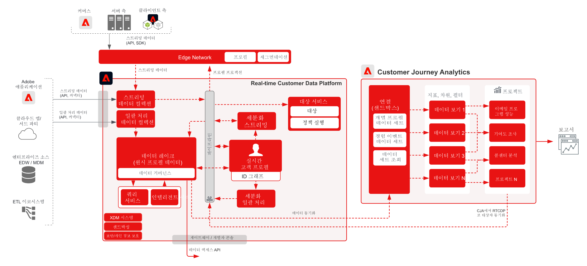

# Customer Journey Analytics와 Real-time Customer Data Platform

고객 타겟팅 및 개인화를 위해 CJA(Customer Journey Analytics)에서 식별한 대상자를 만들어 Adobe Experience Platform의 실시간 고객 프로필에 게시합니다. 내역 데이터를 사용하여 대상자를 만들거나 Customer Journey Analytics의 세분화된 필터링 및 계산된 필드로 보다 정교한 대상자를 만드는 데 적합합니다.

## Customer Journey Analytics 대상자 게시 안내서

Customer Journey Analytics에서 Real-time Customer Data Platform으로 대상자를 게시하기 위한 구현 및 구성에 대한 지침은 다음 설명서를 참조하세요. [사용자 가이드](https://experienceleague.adobe.com/docs/analytics-platform/using/cja-components/audiences/publish.html?lang=ko)

## Customer Journey Analytics 블루프린트의 아키텍처

## Customer Journey Analytics 블루프린트의 가드레일 다이어그램

## 관련 블로그 게시물

* [[!DNL Blueprint for Multi-Channel Orchestration in Adobe Experience Platform]](https://medium.com/adobetech/blueprint-for-multi-channel-orchestration-in-adobe-experience-platform-c68317e94184)
* [[!DNL Leveraging External Data Platforms in Adobe Experience Platform Journey Orchestration]](https://medium.com/adobetech/leveraging-external-data-platforms-in-adobe-experience-platform-journey-orchestration-54fc6134fe17)
* [[!DNL Event-Based Triggering on Adobe Experience Platform Orchestration Service using Apache Airflow]](https://medium.com/adobetech/event-based-triggering-on-adobe-experience-platform-orchestration-service-using-apache-airflow-8607b28251f1)
* [[!DNL Adobe Campaign Classic Integration with Journey Orchestration]](https://medium.com/adobetech/adobe-campaign-classic-integration-with-journey-orchestration-ae577653281)
* [[!DNL Demonstrating the Power of Adobe’s New Journey Orchestration Service to Build Personalized Omnichannel Experiences in Real-Time]](https://medium.com/adobetech/demonstrating-the-power-of-adobes-new-journey-orchestration-service-to-build-personalized-aa60d88cd34)
* [[!DNL Journey Orchestration in an Omnichannel World]](https://medium.com/adobetech/journey-orchestration-in-an-omnichannel-world-3a2d32d556d9)
