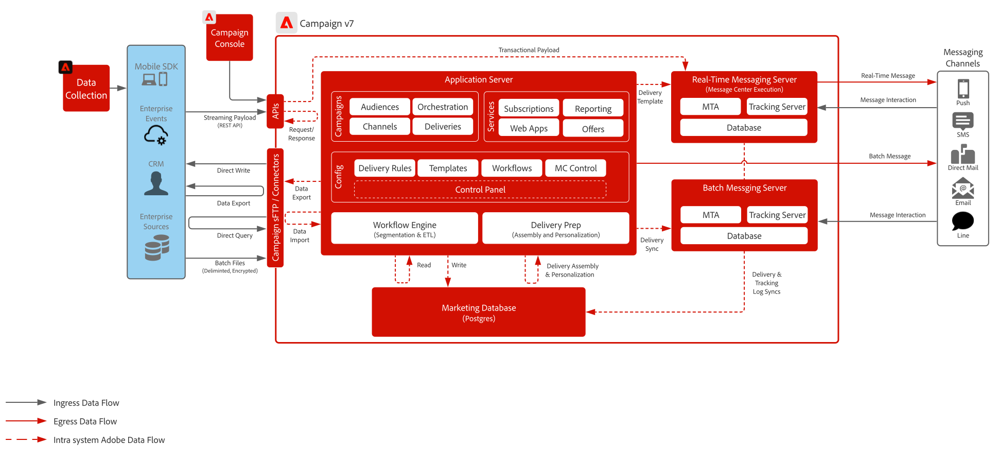

# Campaign v7 블루프린트

>[!IMPORTANT]
>
> Adobe Campaign v7용 이 블루프린트는 더 이상 사용되지 않으며 더 이상 지원되지 않습니다. 최신 지침, 아키텍처 및 모범 사례는 Adobe Campaign v8의 블루프린트를 참조하십시오.
> 
> 👉 [Adobe [!DNL Campaign] v8 블루프린트](../campaign-v8/campaign-v8-overview.md) 보기

 

## 아키텍처

 

## 관련 설명서

* [Campaign v7 설명서](https://experienceleague.adobe.com/docs/campaign-classic.html?lang=ko)
* [Campaign v7 제품 설명](https://helpx.adobe.com/kr/legal/product-descriptions/adobe-campaign-managed-cloud-services.html)
* [Experience Platform 태그 설명서](https://experienceleague.adobe.com/docs/launch.html?lang=ko)
* [Experience Platform Mobile SDK 설명서](https://experienceleague.adobe.com/docs/mobile.html?lang=ko)
