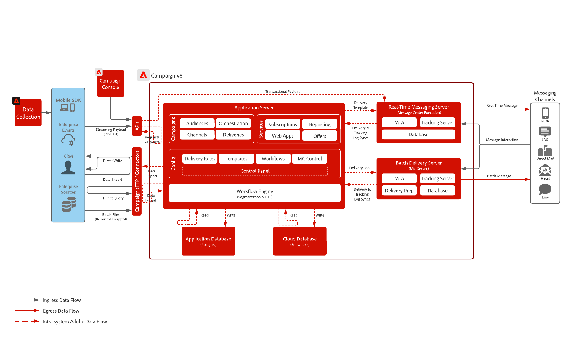

# Campaign v8 블루프린트

Adobe Campaign v8은 이메일, DM 등 기존 마케팅 채널용 차세대 캠페인 도구입니다. 완벽한 캠페인을 만들고 다듬을 수 있도록 강력한 ETL 및 데이터 관리 기능을 제공합니다. 오케스트레이션 엔진은 배치 기반 여정에 중점을 둔 풍부한 멀티 터치 마케팅 프로그램을 제공합니다.

또한 확장 가능한 실시간 메시지 서버와 함께 제공되므로 마케팅 팀이 암호 재설정, 주문 확인, 전자 영수증 등에 대해 어떤 IT 시스템에서든 모든 것을 포괄하는 페이로드를 기반으로 사전 정의된 메시지를 보낼 수 있습니다.

## 사용 사례

* 매우 복잡한 일괄 처리 기반 메시징 프로그램.
* 캠페인 시작 및 재실행.
* DM 광고, 브로셔, 매거진 캠페인
* 간단한 트랜잭션 메시지(암호 재설정, 이메일 수신, 주문 확인 등).
* 분석 및 프로필 구축을 위해 Adobe Experience Platform에 캠페인 데이터 통합.
* Campaign에 Real-time Customer Data Platform 대상자를 공유합니다.

## 아키텍처 다이어그램

[Campaign v8 배포 모델](https://experienceleague.adobe.com/docs/campaign/campaign-v8/config/architecture/architecture.html?lang=ko#ac-deployment){target="_blank"}에 대해 자세히 알아보세요.

### Campaign Enterprise(FFDA) 배포

### Campaign v8 FDA 배포

## 통합 패턴

| 시나리오 | 설명 | 기능 |
| :-- | :--- | :--- |
| [[!DNL Real-time Customer Data Platform] Adobe 사용 [!DNL Campaign]](rtcdp-and-campaign-v8.md) | Adobe Experience Platform 및 실시간 고객 프로필, 중앙 집중식 세분화 도구를 Adobe [!DNL Campaign]과(와) 함께 사용하여 개인 맞춤화된 대화를 제공하는 방법을 소개합니다 | <ul><li>클라우드 저장소 파일 교환 및 Adobe [!DNL Campaign] 수집 워크플로우를 사용하여 [!DNL Real-Time CDP]에서 Adobe [!DNL Campaign]&#x200B;(으)로 프로필 및 대상자 공유 </li><li>고객 대화의 게재 및 상호 작용 데이터를 Adobe [!DNL Campaign]의 [!DNL Real-Time CDP]&#x200B;(으)로 쉽게 공유하여 실시간 고객 프로필을 개선하고 메시징 캠페인에 대한 크로스 채널 보고를 제공합니다</li></ul> |
| [[!DNL Journey Optimizer] Adobe 사용 [!DNL Campaign]](ajo-and-campaign.md) | Adobe Journey Optimizer을 사용하여 실시간 고객 프로필을 활용하여 1:1 경험을 조정하고 기본 Adobe [!DNL Campaign] 트랜잭션 메시지 시스템을 활용하여 메시지를 보내는 방법을 보여 줍니다 | [!DNL Journey Optimizer]의 실시간 고객 프로필과 기능을 활용하여 최신 경험을 조율하고 Adobe [!DNL Campaign]의 기본 실시간 메시징 기능을 활용하여 최후의 통신 수행  고려 사항: <ul><li>[실시간 메시지] 서버를 통해 시간당 최대 100만 개의 메시지를 전송할 수 있습니다.<li>[!DNL Journey Optimizer]에서 제한이 수행되지 않으므로 Pre-Sales Enterprise Architect의 기술 검사를 확인하십시오.</li><li>Campaign v8로 가는 페이로드에는 의사 결정 관리를 지원하지 않습니다.</li></ul> |

## 필요 조건

이 블루프린트에 대한 다음 사전 요구 사항이 있습니다.

### 애플리케이션 서버 및 실시간 메시지 서버

* [!DNL Campaign] v8 소프트웨어를 상호 작용하고 사용하려면 Adobe [!DNL Campaign] 클라이언트 콘솔이 필요합니다. Windows 기반 클라이언트이며 표준 인터넷 프로토콜(SOAP, HTTP 등)을 사용합니다 소프트웨어를 배포, 설치, 실행하기 위해 조직에서 필요한 권한을 사용하도록 설정해야 합니다.

* IP 주소 허용 목록:
   * 모든 사용자가 클라이언트 콘솔에 액세스하는 동안 활용하는 IP 범위를 식별합니다.
   * Real-Time 메시징 서버와 통신할 수 있는 엔터프라이즈 시스템을 식별하고 허용 목록에 추가할 수 있는 정적으로 할당된 IP 또는 범위를 확보합니다.
   * Campaign 컨트롤 패널을 통해 설정하고 제어할 수 있습니다.
* sFTP 키 관리:
   * Campaign에서 제공하는 sFTP에 사용할 수 있는 SSH 공개 키가 있어야 합니다. Campaign 컨트롤 패널을 통해 설정하고 제어할 수 있습니다.

### 이메일

* 메시지 전송에 사용할 하위 도메인이 준비되었습니다.
* 하위 도메인을 Adobe에 완전히 위임(권장)하거나 CNAME을 사용하여 Adobe 관련 DNS 서버(사용자 지정)를 지정할 수 있습니다.
* 전달성을 높이려면 각 하위 도메인에 Google TXT 레코드가 필요합니다.

### 모바일 푸시

* 모바일 앱을 배포, 구성 및 빌드하는 데 모바일 개발자를 사용할 수 있습니다.
* Adobe는 FCM(Android) 및 APNS(iOS)에서 필요한 정보를 수집하여 메시지 페이로드를 해당 서버에 전송하는 SDK만 제공합니다. 모바일 앱을 코딩, 배포, 관리 및 디버깅하는 방법은 고객의 책임입니다.

### 웹 앱(선택 사항)

* Campaign 호스팅 구독 취소 및 랜딩 페이지에 대한 추가 하위 도메인을 위임할 수 있습니다.
* SSL 인증서가 권장됩니다.

## 가드레일

보호 기능은 아래에 설명되어 있습니다.

### 애플리케이션 서버 크기 조정

* 스토리지는 최대 200만 개의 프로필로 확장할 수 있으며 최대 1B 프로필까지 확장할 수 있습니다.
* Adobe [!DNL Admin Console]을(를) 통해 사용자 액세스를 설정하고 제어합니다.
* [!DNL Campaign]&#x200B;(으)로 데이터를 로드하려면 배치 파일을 사용해야 합니다.
   * API 데이터 로드 지원은 주로 데이터베이스 내의 프로필 또는 단순 개체(예: 만들기 및 업데이트)를 관리하는 용도입니다. 대량의 데이터나 일괄 처리에 가까운 작업 로드에 사용하도록 설계한 기능이 아닙니다.
   * 사용자 정의 애플리케이션 관련 목적의 API 데이터 읽기는 지원하지 않습니다.
   * API를 통해 로드한 데이터는 애플리케이션 데이터베이스에서 준비된 다음 매시간마다 클라우드 데이터베이스에 복제됩니다.
* API 호출에 대한 제한이 적용됩니다. 자세한 내용은 [Adobe Campaign 제품 설명](https://helpx.adobe.com/kr/legal/product-descriptions/adobe-campaign-managed-cloud-services.html){target="_blank"}을 참조하세요.

### 메시지 일괄 전송 서버 크기 조정

* 메시지를 시간당 최대 2천만 개까지 처리하도록 확장할 수 있습니다.

### 실시간 메시지 서버 크기 조정

* 메시지를 시간당 최대 100만 개까지 보낼 수 있습니다.
* 기본적으로 실시간 메시지 서버 두 개가 제공됩니다. 실시간 메시지 서버를 최대 8개까지 확장할 수 있습니다.

### SMS 구성

* Campaign은 SMS 공급 시스템과 통합할 수 있습니다. 공급업체는 고객이 조달하고 SMS 기반 메시지 전송 캠페인과 통합됩니다.
* 지원은 SMPP 프로토콜을 통해 이루어집니다.
* SMS에는 세 가지 유형이 있으며, Adobe는 이 세 가지를 모두 지원합니다.
   * SMS MT(모바일 착신): Adobe [!DNL Campaign]에서 SMPP 공급자를 통해 휴대폰으로 보내는 SMS입니다.
   * SMS MO(Mobile Originated): 모바일에서 SMPP 공급자를 통해 Adobe [!DNL Campaign]&#x200B;(으)로 전송하는 SMS입니다.
   * SMS SR(상태 보고서) 또는 DR 또는 DLR(배달 확인): SMPP 공급자를 통해 모바일이 Adobe [!DNL Campaign]에 SMS가 성공적으로 수신되었음을 나타내는 반환 확인 메일입니다. Adobe [!DNL Campaign]은(는) 종종 오류에 대한 설명과 함께 메시지를 배달할 수 없음을 나타내는 SR을 받을 수도 있습니다.

## 구현 단계

[Adobe Campaign v8 구현](https://experienceleague.adobe.com/docs/campaign/campaign-v8/implement/implement.html?lang=ko) 시작 안내서를 참조하세요.

## 관련 설명서

* [Campaign v8 설명서](https://experienceleague.adobe.com/docs/campaign-v8.html?lang=ko)
* [Campaign v8 제품 설명](https://helpx.adobe.com/kr/legal/product-descriptions/adobe-campaign-managed-cloud-services.html)
* [Experience Platform 태그 설명서](https://experienceleague.adobe.com/docs/launch.html?lang=ko)
* [Experience Platform Mobile SDK 설명서](https://experienceleague.adobe.com/docs/mobile.html?lang=ko)
