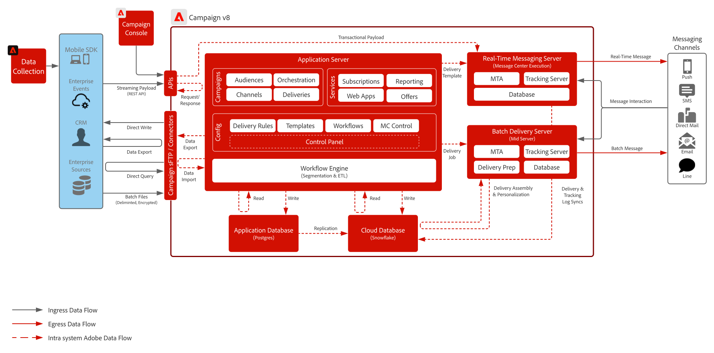

# Campaign v8 블루프린트

Adobe Campaign v8은 이메일, DM 등 기존 마케팅 채널용 차세대 캠페인 도구입니다. 완벽한 캠페인을 만들고 다듬을 수 있도록 강력한 ETL 및 데이터 관리 기능을 제공합니다. Campaign v8의 오케스트레이션 엔진은 배치 기반 여정에 핵심 초점을 둔 풍부한 멀티 터치 마케팅 프로그램을 제공합니다.  또한 확장 가능한 실시간 메시지 서버와 함께 제공되므로 마케팅 팀이 암호 재설정, 주문 확인, 전자 영수증 등에 대해 어떤 IT 시스템에서든 모든 것을 포괄하는 페이로드를 기반으로 사전 정의된 메시지를 보낼 수 있습니다.

 

## 사용 사례

* 고도로 복잡한 일괄 처리 기반 메시지 프로그램
* 캠페인 시작 및 재실행
* DM 광고, 브로셔, 매거진 캠페인
* 단순 트랜잭션 메시지(예: 암호 재설정, 이메일 영수증, 주문 확인 등)
* 분석 및 프로필 작성을 위해 Campaign 데이터를 Adobe Experience Platform에 통합하기
* Campaign에 Real-time Customer Data Platform 대상자를 공유합니다.

 

## 아키텍처

 

## 통합 패턴

| 시나리오 | 설명 | 기능 |
| :-- | :--- | :--- |
| [Real-time Customer Data Platform과 Adobe Campaign](rtcdp-and-campaign-v8.md) | Adobe Experience Platform의 [실시간 고객 프로필]과 그 중앙 집중식 세분화 도구를 Adobe Campaign과 함께 활용하여 개인화된 대화를 게재하는 방법을 소개합니다 | <ul><li>클라우드 스토리지 파일 교환과 Adobe Campaign 수집 워크플로우를 사용하여 Real-Time CDP에서 Adobe Campaign으로 프로필 및 대상자를 공유합니다. </li><li>고객 대화의 게재 및 상호 작용 데이터를 Adobe Campaign에서 Real-Time CDP으로 쉽게 공유하여 실시간 고객 프로필을 향상시키고 메시징 캠페인에 대한 크로스 채널 보고를 제공합니다</li></ul> |
| [Journey Optimizer와 Adobe Campaign](ajo-and-campaign.md) | Adobe Journey Optimizer를 통해 [실시간 고객 프로필]을 활용하여 1:1 경험을 오케스트레이션하고 Adobe Campaign의 기본 제공 트랜잭션 메시지 시스템을 활용하여 메시지를 보내는 방법을 보여 줍니다. | [실시간 고객 프로필]과 Journey Optimizer의 기능을 활용하여 실시간 경험을 오케스트레이션하는 한편 Adobe Campaign의 기본 제공 실시간 메시지 기능을 사용하여 라스트 마일 커뮤니케이션을 수행합니다.  고려 사항: <ul><li>[실시간 메시지] 서버를 통해 시간당 최대 100만 개의 메시지를 전송할 수 있습니다.<li>Journey Optimizer에서는 스로틀링을 수행하지 않으므로 영업 전 단계 기업 아키텍트가 기술 점검을 수행해야 합니다.</li><li>Campaign v8로 가는 페이로드에는 의사 결정 관리를 지원하지 않습니다.</li></ul> |

 

## 필요 조건

### 애플리케이션 서버 및 실시간 메시지 서버

* 상호 작용하고 Campaign v8 소프트웨어를 사용하기 위해 Adobe Campaign 클라이언트 콘솔이 필요합니다. Windows 기반 클라이언트이며 표준 인터넷 프로토콜(SOAP, HTTP 등)을 사용합니다 소프트웨어를 배포, 설치, 실행하기 위해 조직에서 필요한 권한을 사용하도록 설정해야 합니다.

* IP 주소를 허용 목록에 추가
   * 모든 사용자가 클라이언트 콘솔에 액세스할 때 활용할 IP 범위를 확인합니다.
   * 실시간 메시지 서버에 연결할 수 있는 기업 시스템을 확인하고, 해당 시스템에 허용 목록에 추가할 수 있는 고정 할당 IP나 범위가 있는지 확인합니다.
   * Campaign 컨트롤 패널을 통해 설정하고 제어할 수 있습니다.
* sFTP 키 관리
   * Campaign에서 제공하는 sFTP에 사용할 수 있는 SSH 공개 키가 있어야 합니다. Campaign 컨트롤 패널을 통해 설정하고 제어할 수 있습니다.

### 이메일

* 메시지 보내기에 사용할 하위 도메인이 있어야 합니다.
* 하위 도메인을 Adobe에 완전히 위임하거나(권장) CNAME을 사용하여 Adobe 전용 DNS 서버(사용자 정의)를 가리킬 수 있습니다.
* 전달성 보장을 위해 각 하위 도메인에 대해 Google TXT 기록이 있어야 합니다.

### 모바일 푸시

* 모바일 앱을 배포, 구성, 구축할 수 있는 모바일 개발자가 있어야 합니다.
* Adobe는 FCM(Android) 및 APNS(iOS)에서 필요한 정보를 수집하여 메시지 페이로드를 해당 서버에 전송하는 SDK만 제공합니다. 모바일 앱 코딩, 배포, 관리, 디버깅은 고객의 책임입니다.

### 웹 앱(선택 사항)

* Campaign에서 호스팅하는 구독 취소 및 랜딩 페이지에 대한 추가 하위 도메인을 위임할 수 있습니다.
* SSL 인증서를 적극 권장합니다.

 

## 가드레일

### 애플리케이션 서버 크기 조정

* 스토리지는 최대 프로필 2억 개까지 확장할 수 있으며, 경우에 따라 프로필 10억 개까지 확장할 수도 있습니다.
* Adobe Admin Console을 통한 사용자 액세스 설정 및 제어
* Campaign에 데이터를 로드할 때는 일괄 처리 파일을 통해 작업하도록 설계되어 있습니다.
   * API 데이터 로드 지원은 주로 데이터베이스 내의 프로필 또는 단순 개체(예: 만들기 및 업데이트)를 관리하는 용도입니다. 대량의 데이터나 일괄 처리에 가까운 작업 로드에 사용하도록 설계한 기능이 아닙니다.
   * 사용자 정의 애플리케이션 관련 목적의 API 데이터 읽기는 지원하지 않습니다.
   * API를 통해 로드한 데이터는 애플리케이션 데이터베이스에서 준비된 다음 매시간마다 클라우드 데이터베이스에 복제됩니다.
* API 호출은 초당 15개 또는 하루 15만 개로 제한됩니다.

### 메시지 일괄 전송 서버 크기 조정

* 메시지를 시간당 최대 2천만 개까지 처리하도록 확장할 수 있습니다.

### 실시간 메시지 서버 크기 조정

* 메시지를 시간당 최대 100만 개까지 보낼 수 있습니다.
* 기본적으로 실시간 메시지 서버 두 개가 제공됩니다. 실시간 메시지 서버를 최대 8개까지 확장할 수 있습니다.

### SMS 구성

* Campaign은 SMS 공급 시스템과 통합할 수 있습니다. 공급 시스템은 고객이 확보한 뒤 캠페인과 통합하여 SMS 기반 메시지를 보낼 수 있습니다.
* SMPP 프로토콜을 통해 지원합니다.
* SMS에는 세 가지 유형이 있으며, Adobe는 이 세 가지를 모두 지원합니다.
   * SMS MT(모바일 종점): SMPP 공급 시스템을 통해 Adobe Campaign에서 휴대폰으로 내보내는 SMS입니다.
   * SMS MO(모바일 시작): SMPP 공급 시스템을 통해 모바일에서 Adobe Campaign으로 보내는 SMS입니다.
   * SMS SR(상태 보고서) 또는 DR 또는 DLR(게재 확인): SMPP 공급 시스템을 통해 모바일에서 Adobe Campaign으로 보내는, SMS가 성공적으로 수신되었다는 알림입니다. Adobe Campaign에서 메시지 게재 실패를 알리는 SR을 받을 수도 있으며, 이 경우 보통 오류에 대한 설명도 제공됩니다.

### 모바일 푸시 구성

* Campaign v8에는 Campaign SDK만 지원됩니다. Adobe 고객 지원 센터에 문의하여 액세스를 요청하세요.
* SDK를 설치하고 구성하는 방법은 [Campaign SDK 설명서](https://experienceleague.adobe.com/docs/campaign-classic/using/sending-messages/sending-push-notifications/integrating-campaign-sdk-into-the-mobile-application.html?lang=ko)를 참조하세요.

   >[!IMPORTANT]
   >다른 Experience Cloud 애플리케이션을 사용하는 경우 데이터 수집을 위해 Experience Platform Mobile SDK를 사용해야 합니다. 이는 다른 SDK이므로 Campaign SDK와 별도로 설치해야 합니다.

 

## 구현 단계

[Adobe Campaign v8 구현](https://experienceleague.adobe.com/docs/campaign/campaign-v8/implement/implement.html?lang=ko) 시작 안내서를 참조하세요.

## 관련 설명서

* [Campaign v8 설명서](https://experienceleague.adobe.com/docs/campaign-v8.html?lang=ko)
* [Campaign v8 제품 설명](https://helpx.adobe.com/kr/legal/product-descriptions/adobe-campaign-managed-cloud-services.html)
* [Experience Platform 태그 설명서](https://experienceleague.adobe.com/docs/launch.html?lang=ko)
* [Experience Platform Mobile SDK 설명서](https://experienceleague.adobe.com/docs/mobile.html?lang=ko)
