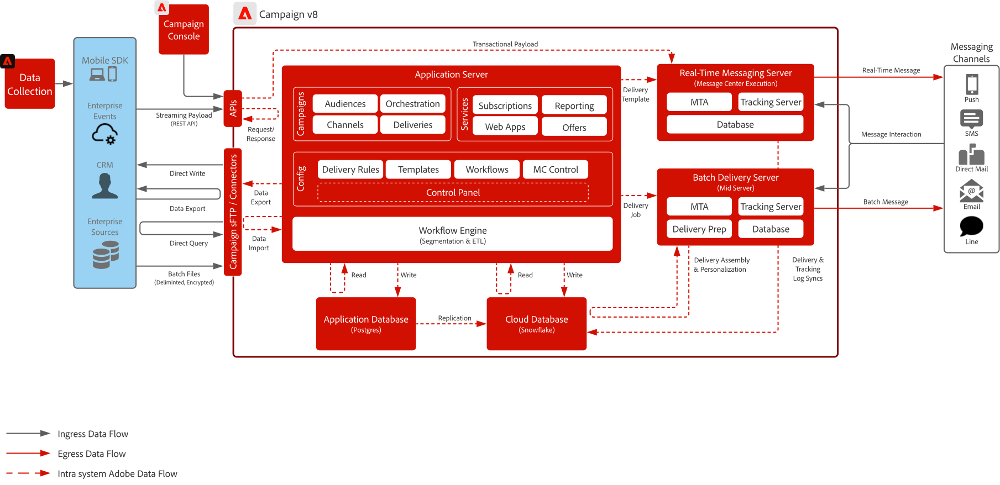
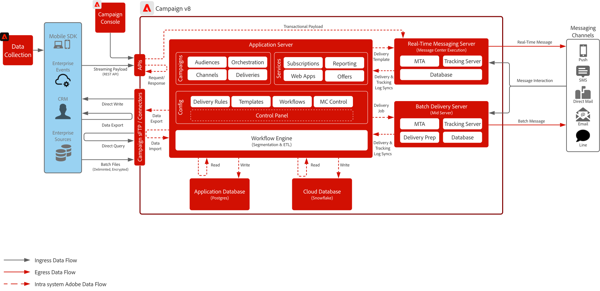

# Campaign v8 블루프린트

Adobe Campaign v8은 이메일 및 DM(Direct Mail)과 같은 기존 마케팅 채널을 위해 설계된 차세대 캠페인 관리 플랫폼입니다. 멀티 터치, 일괄 처리 방식 마케팅 프로그램을 구축하기 위한 강력한 오케스트레이션 엔진과 함께 복잡한 세분화 및 대상 타깃팅을 지원하는 강력한 ETL 및 데이터 관리 기능을 제공합니다.

또한 확장성이 뛰어난 실시간 메시징 서버가 포함되어 있어 즉시 전송할 수 있도록 외부 시스템에서 전체 페이로드를 허용하여 암호 재설정, 주문 확인, 전자 수신 등의 트랜잭션 통신을 수행할 수 있습니다.

## 사용 사례

>[!BEGINTABS]

>[!TAB 일괄 캠페인 실행]

- 이메일, SMS 및 DM 전반에 걸쳐 대규모의 예약된 마케팅 캠페인을 디자인하고 제공합니다.
- 복잡한 세그멘테이션 및 타깃팅을 사용하는 홍보 블로그, 뉴스레터 및 시즌 오퍼에 이상적입니다.

>[!TAB 멀티 터치 오케스트레이션]

- 사전 정의된 마케팅 여정 과정을 고객에게 안내하는 여러 단계의 다중 채널 프로그램을 빌드합니다.
- 대상자 재입력, 조건부 논리 및 시간 기반 전환을 지원합니다.

>[!TAB 데이터 관리 및 ETL]

- 다양한 소스의 고객 데이터를 수집, 변환 및 관리하여 정확한 타겟팅을 지원합니다.
- 사용자 지정 스키마, 계산된 필드 및 대상 정의를 만들 수 있습니다.

>[!TAB 트랜잭션 메시지]

- 외부 시스템에 의해 트리거되는 미리 정의된 실시간 메시지를 보냅니다(예: 암호 재설정, 주문 확인, 전자 수신).
- 즉시 전송할 수 있도록 IT 시스템의 전체 페이로드를 허용하는 확장 가능한 메시징 서버를 사용합니다.

>[!ENDTABS]

 

## 아키텍처 다이어그램

[Campaign v8 배포 모델](https://experienceleague.adobe.com/docs/campaign/campaign-v8/config/architecture/architecture.html#ac-deployment){target="_blank"}에 대해 자세히 알아보세요.

### Campaign Enterprise(FFDA) 배포

 

### Campaign v8 FDA 배포

 

## 통합 패턴

| 시나리오 | 설명 | 기술 고려 사항 |
| :-- | :--- | :--- |
| [[!DNL Real-time Customer Data Platform] Adobe 사용 [!DNL Campaign]](rtcdp-and-campaign-v8.md) | Adobe Experience Platform 및 실시간 고객 프로필, 중앙 집중식 세분화 도구를 Adobe [!DNL Campaign]과(와) 함께 사용하여 개인 맞춤화된 대화를 제공하는 방법을 소개합니다 | <ul><li>클라우드 저장소 파일 교환 및 Adobe [!DNL Real-Time CDP] 수집 워크플로우를 사용하여 [!DNL Campaign]에서 Adobe [!DNL Campaign]&#x200B;(으)로 프로필 및 대상자 공유 </li><li>고객 대화의 게재 및 상호 작용 데이터를 Adobe [!DNL Real-Time CDP]의 [!DNL Campaign]&#x200B;(으)로 쉽게 공유하여 실시간 고객 프로필을 개선하고 메시징 캠페인에 대한 크로스 채널 보고를 제공합니다</li></ul> |
| [[!DNL Journey Optimizer] Adobe 사용 [!DNL Campaign]](ajo-and-campaign-v8.md) | Adobe Journey Optimizer을 사용하여 실시간 고객 프로필을 활용하여 1:1 경험을 조정하고 기본 Adobe [!DNL Campaign] 트랜잭션 메시지 시스템을 활용하여 메시지를 보내는 방법을 보여 줍니다 | <ul><li>[실시간 메시지] 서버를 통해 시간당 최대 100만 개의 메시지를 전송할 수 있습니다.<li>[!DNL Journey Optimizer]에서 제한이 수행되지 않으므로 Pre-Sales Enterprise Architect의 기술 검사를 확인하십시오.</li><li>Campaign v8로 가는 페이로드에는 의사 결정 관리를 지원하지 않습니다.</li></ul> |

 

## 필요 조건

이 블루프린트에 대한 다음 사전 요구 사항이 있습니다.

### 애플리케이션 서버 및 실시간 메시지 서버

- [!DNL Campaign] v8 소프트웨어를 상호 작용하고 사용하려면 Adobe [!DNL Campaign] 클라이언트 콘솔이 필요합니다. Windows 기반 클라이언트이며 표준 인터넷 프로토콜(SOAP, HTTP 등)을 사용합니다 소프트웨어를 배포, 설치, 실행하기 위해 조직에서 필요한 권한을 사용하도록 설정해야 합니다.

- IP 주소 허용 목록:
   - 모든 사용자가 클라이언트 콘솔에 액세스하는 동안 활용하는 IP 범위를 식별합니다.
   - Real-Time 메시징 서버와 통신할 수 있는 엔터프라이즈 시스템을 식별하고 허용 목록에 추가할 수 있는 정적으로 할당된 IP 또는 범위를 확보합니다.
   - Campaign 컨트롤 패널을 통해 설정하고 제어할 수 있습니다.
- sFTP 키 관리:
   - Campaign에서 제공하는 sFTP에 사용할 수 있는 SSH 공개 키가 있어야 합니다. Campaign 컨트롤 패널을 통해 설정하고 제어할 수 있습니다.

### 이메일

- 메시지 전송에 사용할 하위 도메인이 준비되었습니다.
- 하위 도메인을 Adobe에 완전히 위임(권장)하거나 CNAME을 사용하여 Adobe 관련 DNS 서버(사용자 지정)를 지정할 수 있습니다.
- 전달성을 높이려면 각 하위 도메인에 Google TXT 레코드가 필요합니다.

### 모바일 푸시

- 모바일 앱을 배포, 구성 및 빌드하는 데 모바일 개발자를 사용할 수 있습니다.
- Adobe는 FCM(Android) 및 APNS(iOS)에서 필요한 정보를 수집하여 메시지 페이로드를 해당 서버에 전송하는 SDK만 제공합니다. 모바일 앱을 코딩, 배포, 관리 및 디버깅하는 방법은 고객의 책임입니다.

### 웹 앱(선택 사항)

- Campaign 호스팅 구독 취소 및 랜딩 페이지에 대한 추가 하위 도메인을 위임할 수 있습니다.
- SSL 인증서가 권장됩니다.

 

## 가드레일

### 애플리케이션 서버 크기 조정

- 스토리지는 최대 200만 개의 프로필로 확장할 수 있으며 최대 1B 프로필까지 확장할 수 있습니다.
- Adobe [!DNL Admin Console]을(를) 통해 사용자 액세스를 설정하고 제어합니다.
- [!DNL Campaign]&#x200B;(으)로 데이터를 로드하려면 배치 파일을 사용해야 합니다.
   - API 데이터 로드 지원은 주로 데이터베이스 내의 프로필 또는 단순 개체(예: 만들기 및 업데이트)를 관리하는 용도입니다. 대량의 데이터나 일괄 처리에 가까운 작업 로드에 사용하도록 설계한 기능이 아닙니다.
   - 사용자 정의 애플리케이션 관련 목적의 API 데이터 읽기는 지원하지 않습니다.
   - API를 통해 로드한 데이터는 애플리케이션 데이터베이스에서 준비된 다음 매시간마다 클라우드 데이터베이스에 복제됩니다.
- API 호출에 대한 제한이 적용됩니다. [Adobe Campaign 제품 설명](https://helpx.adobe.com/kr/legal/product-descriptions/adobe-campaign-managed-cloud-services.html){target="_blank"}에서 자세히 알아보세요.

### 메시지 일괄 전송 서버 크기 조정

- 메시지를 시간당 최대 2천만 개까지 처리하도록 확장할 수 있습니다.

### 실시간 메시지 서버 크기 조정

- 메시지를 시간당 최대 100만 개까지 보낼 수 있습니다.
- 기본적으로 실시간 메시지 서버 두 개가 제공됩니다. 실시간 메시지 서버를 최대 8개까지 확장할 수 있습니다.

### SMS 구성

- Campaign은 SMS 공급 시스템과 통합할 수 있습니다. 공급업체는 고객이 조달하고 SMS 기반 메시지 전송 캠페인과 통합됩니다.
- 지원은 SMPP 프로토콜을 통해 이루어집니다.
- SMS에는 세 가지 유형이 있으며, Adobe는 이 세 가지를 모두 지원합니다.
   - SMS MT(모바일 착신): Adobe [!DNL Campaign]에서 SMPP 공급자를 통해 휴대폰으로 보내는 SMS입니다.
   - SMS MO(Mobile Originated): 모바일에서 SMPP 공급자를 통해 Adobe [!DNL Campaign]&#x200B;(으)로 전송하는 SMS입니다.
   - SMS SR(상태 보고서) 또는 DR 또는 DLR(배달 확인): SMPP 공급자를 통해 모바일이 Adobe [!DNL Campaign]에 SMS가 성공적으로 수신되었음을 나타내는 반환 확인 메일입니다. Adobe [!DNL Campaign]은(는) 종종 오류에 대한 설명과 함께 메시지를 배달할 수 없음을 나타내는 SR을 받을 수도 있습니다.

 

## 구현 단계

[Adobe Campaign v8 구현](https://experienceleague.adobe.com/docs/campaign/campaign-v8/implement/implement.html) 시작 안내서를 참조하세요.

## 관련 설명서

- [Campaign v8 설명서](https://experienceleague.adobe.com/docs/campaign-v8.html)
- [Campaign v8 제품 설명](https://helpx.adobe.com/kr/legal/product-descriptions/adobe-campaign-managed-cloud-services.html)
- [Experience Platform 태그 설명서](https://experienceleague.adobe.com/docs/launch.html)
- [Experience Platform Mobile SDK 설명서](https://experienceleague.adobe.com/docs/mobile.html)