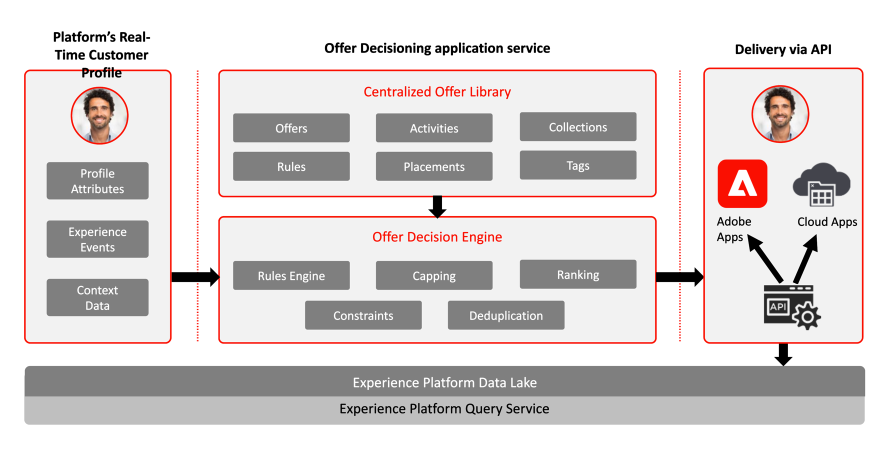

# Journey Optimizer - 의사 결정 관리 블루프린트

[의사 결정 관리](https://experienceleague.adobe.com/docs/journey-optimizer/using/offer-decisioniong/get-started-decision/starting-offer-decisioning.html?lang=ko)에 대한 다음 설명서를 참조하세요.

[의사 결정 관리]와 관련된 보호 기능은 다음 설명서를 참조하십시오. [의사 결정 관리 보호](https://experienceleague.adobe.com/en/docs/journey-optimizer/using/get-started/guardrails#decision-management.html)

Adobe 의사 결정 관리는 Adobe Journey Optimizer의 일부로 제공되는 서비스입니다. 이 블루프린트에서는 애플리케이션의 사용 사례 및 기술적 기능을 간략하게 훑어보고 의사 결정 관리의 다양한 아키텍처 구성 요소와 고려할 사항을 자세히 설명합니다.

Journey Optimizer는 모든 접점에서 적시에 고객에게 최상의 오퍼와 경험을 게재하는 데 사용됩니다. 의사 결정 관리를 사용하면 마케팅 오퍼의 중앙 라이브러리와 Adobe Experience Platform에서 만든 실시간 프로필에 규칙 및 제한을 적용하는 의사 결정 엔진을 통해 손쉽게 개인화할 수 있습니다. 이렇게 하면 고객에게 적절한 시간에 적절한 오퍼를 쉽게 보낼 수 있습니다.

의사 결정 관리 기능은 다음 두 가지 주요 구성 요소로 구성됩니다.

* 하나는 오퍼를 구성하는 여러 요소를 만들고 관리하며 규칙과 제한을 정의하는 인터페이스인 중앙 오퍼 라이브러리이고,
* 또 하나는 Adobe Experience Platform 데이터 및 실시간 고객 프로필을 오퍼 라이브러리와 함께 활용하여 오퍼를 게재하기에 적절한 시점, 고객, 채널을 선택하는 오퍼 결정 엔진입니다.

의사 결정 관리는 두 가지 방법(Edge 또는 허브) 중 하나로 배포할 수 있습니다. 아래에서 인용한 두 배포 방법 각각의 블루프린트에서 설명하는 바와 같이, 사용하는 방법에 따라 서비스 운영에 사용하는 인터페이스 및 프로토콜이 다릅니다. 더 자세한 내용을 [의사 결정 관리 설명서](https://experienceleague.adobe.com/docs/journey-optimizer/using/offer-decisioniong/api-reference/offer-delivery-api/decisioning-vs-edge-apis.html?lang=ko)에서도 확인할 수 있습니다.

## 허브의 의사 결정 관리

첫 번째 방법은 중앙 데이터 센터 아키텍처인 Adobe Experience Platform 허브를 통해 배포하는 것입니다. 허브 아키텍처는 짧은 지연 시간과 높은 처리량을 필요로 하지 않지만 고객 프로필을 완전히 파악해야 하는 고객 경험에 가장 적합합니다. 이러한 고객 경험에는 콜 센터나 개인 상호 작용과 같은 키오스크 또는 에이전트 지원 경험에 대해 제공되는 오퍼 의사 결정이 포함됩니다. 이메일, SMS 메시지 또는 푸시 알림과 기타 아웃바운드 캠페인에 삽입할 오퍼도 허브 접근 방식으로 제공됩니다. 허브의 의사 결정 관리에 대한 자세한 내용은 [허브의 의사 결정 관리](decision-management-hub.md) 블루프린트를 참조하세요.

* 오퍼 자격은 모든 속성 및 경험 이벤트를 포함하여 실시간 고객 프로필 전체에 적용됩니다.

### 허브의 의사 결정 관리 사용 사례

* 키오스크 및 매장 경험의 개인화 오퍼.
* 콜센터나 세일즈 상호 작용 등 상담원 지원 경험의 개인화 오퍼.
* 이메일, SMS 또는 기타 아웃바운드 상호 작용에 포함된 오퍼.
* 크로스 채널 여정 실행 - Adobe Journey Optimizer를 통한 웹, 모바일, 이메일, 기타 상호 작용 채널 간 오퍼 일관성.

### 허브의 의사 결정 관리 기술 고려 사항

* 대상자 멤버십, 속성, 경험 이벤트 등 전체 실시간 고객 프로필 액세스.

## Edge의 의사 결정 관리   

두 번째 방법은 빠르게 1초 미만 및 밀리초 단위의 경험을 제공하기 위해 전역적으로 분산된 지리적으로 위치한 인프라인 경험 [!DNL Edge Network]을(를) 사용하는 것입니다. 지연을 최소화하기 위하여 최종 소비자 경험은 소비자의 지리적 위치에서 가장 가까운 Edge 인프라에 의해 실행됩니다. Edge의 의사 결정 관리는 웹 또는 모바일 인바운드 개인화 요청과 같은 실시간 고객 경험을 제공하는 용도로 설계되었습니다. Edge의 의사 결정 관리에 대한 자세한 내용은 [Edge의 의사 결정 관리](decision-management-edge.md) 블루프린트를 참조하세요.

### Edge의 의사 결정 관리 사용 사례

* 웹 또는 모바일 인바운드 경험을 통한 온라인 개인화.
* 크로스 채널 여정 실행 - Adobe Journey Optimizer를 통한 웹, 모바일, 이메일, 기타 상호 작용 채널 간 오퍼 일관성.

### Edge 의사 결정 관리 기술 고려 사항

* Edge 실시간 프로필 액세스. Edge로 투영한 대상자 및 프로필 속성만 프로필에서 사용할 수 있습니다.

## 관련 설명서

* [Adobe Experience Platform](https://experienceleague.adobe.com/docs/experience-platform.html?lang=ko)
* [Adobe Journey Optimizer](https://experienceleague.adobe.com/docs/journey-optimizer.html?lang=ko)
* [Adobe Journey Optimizer 의사 결정 관리](https://experienceleague.adobe.com/docs/journey-optimizer/using/offer-decisioniong/get-started-decision/starting-offer-decisioning.html?lang=ko)
* [ Adobe Journey Optimizer 제품 설명](https://helpx.adobe.com/kr/legal/product-descriptions/adobe-journey-optimizer.html)
* [Adobe 의사 결정 관리 제품 설명](https://helpx.adobe.com/kr/legal/product-descriptions/offer-decisioning-app-service.html)
