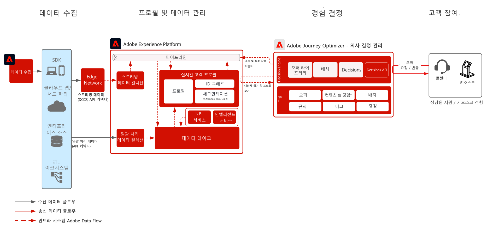

# 허브의 의사 결정 관리 블루프린트

의사 결정 관리에 대한 자세한 내용은 [여기](https://experienceleague.adobe.com/docs/journey-optimizer/using/offer-decisioniong/get-started-decision/starting-offer-decisioning.html?lang=ko)에 있는 제품 설명서와 [여기](https://experienceleague.adobe.com/docs/blueprints-learn/architecture/customer-journeys/journey-optimizer/decision-management/decision-management-overview.html?lang=ko)에 있는 의사 결정 관리 개요를 참조하세요.

Adobe 의사 결정 관리는 Adobe Journey Optimizer의 일부로 제공되는 서비스입니다. 이 블루프린트에서는 애플리케이션의 사용 사례 및 기술적 기능을 간략하게 훑어보고 의사 결정 관리의 다양한 아키텍처 구성 요소와 고려할 사항을 자세히 설명합니다.

Journey Optimizer는 모든 접점에서 적시에 고객에게 최상의 오퍼와 경험을 게재하는 데 사용됩니다. 의사 결정 관리는 Adobe Experience Platform에서 만든 풍부한 실시간 프로필에 규칙과 제한을 적용하는 결정 엔진 및 마케팅 오퍼가 모인 중앙 라이브러리를 통해 개인화를 보다 쉽게 만들어 고객에게 적시에 적절한 오퍼를 보내는 데 유용합니다.

의사 결정 관리는 두 가지 방법 중 하나로 배포할 수 있습니다. 첫 번째 방법은 중앙 데이터 센터 아키텍처인 Adobe Experience Platform 허브를 통해 배포하는 것입니다. [허브] 접근 방식에서는 오퍼를 실행, 개인화하여 500ms 이상의 지연 시간을 두고 게재합니다. 따라서 허브 아키텍처는 지연 시간이 초 미만 단위일 필요가 없는 고객 경험에 가장 적합합니다. 예를 들면 콜센터 또는 대면 상호 작용 등의 상담원 지원 경험이나 키오스크에서 제공하는 오퍼 의사 결정이 있습니다. 이메일 및 아웃바운드 캠페인에 삽입할 오퍼도 허브 접근 방식으로 제공됩니다.

두 번째 방법은 빠르게 초당 밀리초 및 밀리초 단위의 경험을 제공하기 위해 전역적으로 분산된 지리적으로 위치한 인프라인 경험 [!DNL [!DNL Edge Network]]을(를) 사용하는 것입니다. 지연을 최소화하기 위하여 최종 소비자 경험은 소비자의 지리적 위치에서 가장 가까운 Edge 인프라에 의해 실행됩니다. Edge의 의사 결정 관리는 웹 또는 모바일 인바운드 개인화 요청과 같은 실시간 고객 경험을 제공하는 용도로 설계되었습니다.

이 블루프린트에서는 허브에서의 의사 결정 관리에 대해 구체적인 정보를 다룹니다.

Edge의 의사 결정 관리에 대한 자세한 내용은 [Edge의 의사 결정 관리](https://experienceleague.adobe.com/docs/blueprints-learn/architecture/customer-journeys/journey-optimizer/decision-management/decision-management-edge.html?lang=ko) 블루프린트를 참조하세요.

## 허브의 의사 결정 관리 사용 사례

* 프로필 컨텍스트 지연 시간이 15분 이상 정도로 엄격하지 않은 스트리밍 사용 사례입니다.
* 키오스크 및 매장 경험의 개인화 오퍼.
* 콜센터나 세일즈 상호 작용 등 상담원 지원 경험의 개인화 오퍼.
* 이메일, SMS, 모바일 푸시 알림 또는 기타 아웃바운드 상호 작용에 포함된 오퍼.
* 외부 ESP 및 메시지 시스템에 게재할 오퍼를 제공합니다.
* 크로스 채널 여정 실행 - Adobe Journey Optimizer를 통한 웹, 모바일, 이메일, 기타 상호 작용 채널 간 오퍼 일관성.

>[!IMPORTANT]
>
>추가 정보 및 컨텍스트를 위해 프로필에 액세스해야 하는 오퍼 및 여정 사용 사례의 경우. 결정 시간에 사용할 수 있도록 허브에서 프로필로 데이터 수집을 지연하는 것과 관련된 사항을 고려하는 것이 중요합니다. 컨텍스트가 프로필로 스트리밍 또는 수집되고 오퍼 또는 여정이 오퍼 결정 후 몇 초 또는 몇 분 내에 해당 컨텍스트를 사용할 수 있어야 하는 시나리오의 경우 이러한 시나리오는 Edge의 의사 결정 관리에서 가장 잘 제공됩니다.

## 아키텍처

## 가드레일

* Journey Optimizer의 가드레일에 대해서는 다음의 [Journey Optimizer 가드레일](https://experienceleague.adobe.com/docs/journey-optimizer/using/get-started/limitations.html?lang=ko)을 참조하세요.
* 의사 결정 관리의 가드레일은 다음 [의사 결정 관리 제품 설명](https://helpx.adobe.com/kr/legal/product-descriptions/offer-decisioning-app-service.html)을 참조하세요.

[보호 기능 및 전체 지연 지침](https://experienceleague.adobe.com/docs/blueprints-learn/architecture/architecture-overview/deployment/guardrails.html?lang=ko)

## 구현 패턴

* [Adobe Journey Optimizer](https://experienceleague.adobe.com/docs/journey-optimizer/using/offer-decisioniong/get-started-decision/offers-e2e.html?lang=ko)를 사용한 직접 통합으로 이메일, SMS, 아웃바운드 채널에 구현합니다.
* 서버 API를 기반으로 의사 결정 관리를 구현하려는 경우 [Decisioning API](https://experienceleague.adobe.com/docs/journey-optimizer/using/offer-decisioniong/api-reference/offer-delivery/decisioning-vs-edge-apis.html?lang=ko)를 활용합니다.
* 오퍼를 대량으로 메시지 게재 애플리케이션에 전달하는 일괄 처리 기반 의사 결정을 구현하려는 경우 [Batch Decisioning API](https://experienceleague.adobe.com/docs/journey-optimizer/using/offer-decisioniong/api-reference/offer-delivery/batch-decisioning-api.html?lang=ko)를 사용합니다.
* Edge 기반 실시간 경험에는 [Edge의 의사 결정 관리 블루프린트](https://experienceleague.adobe.com/docs/blueprints-learn/architecture/customer-journeys/journey-optimizer/decision-management/decision-management-edge.html?lang=ko)에서 설명하는 것과 같이 Web/Mobile SDK 또는 Edge Decisioning API를 사용합니다.

## 관련 설명서

* [Adobe Experience Platform](https://experienceleague.adobe.com/docs/experience-platform.html?lang=ko)
* [Adobe Journey Optimizer](https://experienceleague.adobe.com/docs/journey-optimizer.html?lang=ko)
* [Adobe Journey Optimizer 의사 결정 관리](https://experienceleague.adobe.com/docs/journey-optimizer/using/offer-decisioniong/get-started-decision/starting-offer-decisioning.html?lang=ko)
* [ Adobe Journey Optimizer 제품 설명](https://helpx.adobe.com/kr/legal/product-descriptions/adobe-journey-optimizer.html)
* [Adobe 의사 결정 관리 제품 설명](https://helpx.adobe.com/kr/legal/product-descriptions/offer-decisioning-app-service.html)
