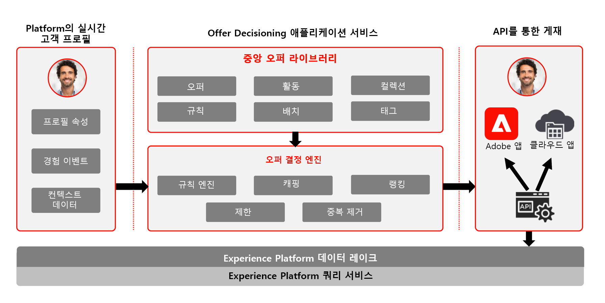

# Journey Optimizer - 의사 결정 관리 블루프린트

의사 결정 관리에 대한 자세한 내용은 [제품 설명서](https://experienceleague.adobe.com/docs/journey-optimizer/using/offer-decisioniong/get-started-decision/starting-offer-decisioning.html?lang=ko)를 참조하세요.

Adobe 의사 결정 관리는 Adobe Journey Optimizer의 일부로 제공되는 서비스입니다. 이 블루프린트에서는 애플리케이션의 사용 사례 및 기술적 기능을 간략하게 훑어보고 의사 결정 관리의 다양한 아키텍처 구성 요소와 고려할 사항을 자세히 설명합니다.

Journey Optimizer는 모든 접점에서 적시에 고객에게 최상의 오퍼와 경험을 게재하는 데 사용됩니다. 의사 결정 관리는 Adobe Experience Platform에서 만든 풍부한 실시간 프로필에 규칙과 제한을 적용하는 결정 엔진 및 마케팅 오퍼가 모인 중앙 라이브러리를 통해 개인화를 보다 쉽게 만들어 고객에게 적시에 적절한 오퍼를 보내는 데 유용합니다.

의사 결정 관리 기능은 다음 두 가지 주요 구성 요소로 구성됩니다.

* 하나는 오퍼를 구성하는 여러 요소를 만들고 관리하며 규칙과 제한을 정의하는 인터페이스인 중앙 오퍼 라이브러리이고,
* 또 하나는 Adobe Experience Platform 데이터 및 실시간 고객 프로필을 오퍼 라이브러리와 함께 활용하여 오퍼를 게재하기에 적절한 시점, 고객, 채널을 선택하는 오퍼 결정 엔진입니다.

의사 결정 관리는 두 가지 방법(Edge 또는 허브) 중 하나로 배포할 수 있습니다. 아래에서 인용한 두 배포 방법 각각의 블루프린트에서 설명하는 바와 같이, 사용하는 방법에 따라 서비스 운영에 사용하는 인터페이스 및 프로토콜이 다릅니다. 더 자세한 내용을 [의사 결정 관리 설명서](https://experienceleague.adobe.com/docs/journey-optimizer/using/offer-decisioniong/api-reference/offer-delivery-api/decisioning-vs-edge-apis.html?lang=ko)에서도 확인할 수 있습니다.

## 허브의 의사 결정 관리

첫 번째 방법은 중앙 데이터 센터 아키텍처인 Adobe Experience Platform 허브를 통해 배포하는 것입니다. [허브] 접근 방식에서는 오퍼를 실행, 개인화하여 500ms 이상의 지연 시간을 두고 게재합니다. 따라서 허브 아키텍처는 지연 시간이 초 미만 단위일 필요가 없는 고객 경험에 가장 적합합니다. 예를 들면 콜센터 또는 대면 상호 작용 등의 상담원 지원 경험이나 키오스크에서 제공하는 오퍼 의사 결정이 있습니다. 이메일, SMS 메시지 또는 푸시 알림과 기타 아웃바운드 캠페인에 삽입할 오퍼도 허브 접근 방식으로 제공됩니다. 허브의 의사 결정 관리에 대한 자세한 내용은 [허브의 의사 결정 관리](https://experienceleague.adobe.com/docs/blueprints-learn/architecture/customer-journeys/journey-optimizer/decision-management/decision-management-hub.html?lang=ko) 블루프린트를 참조하세요.

* 오퍼 자격은 모든 속성 및 경험 이벤트를 포함하여 실시간 고객 프로필 전체에 적용됩니다.

### 허브의 의사 결정 관리 사용 사례

* 키오스크 및 매장 경험의 개인화 오퍼.
* 콜센터나 세일즈 상호 작용 등 상담원 지원 경험의 개인화 오퍼.
* 이메일, SMS 또는 기타 아웃바운드 상호 작용에 포함된 오퍼.
* 크로스 채널 여정 실행 - Adobe Journey Optimizer를 통한 웹, 모바일, 이메일, 기타 상호 작용 채널 간 오퍼 일관성.

### 허브의 의사 결정 관리 기술 고려 사항

* 초당 요청 수: 2000.
* 응답 지연 시간: 500ms 미만.
* 대상자 멤버십, 속성, 경험 이벤트 등 전체 실시간 고객 프로필 액세스.

## Edge의 의사 결정 관리

두 번째 방법은 Experience Edge Network를 통한 것입니다. Experience Edge Network는 1초 미만, 밀리초 단위의 빠른 경험을 제공하기 위해 지리적 위치를 전 세계에 분산시킨 인프라입니다. 지연을 최소화하기 위하여 최종 소비자 경험은 소비자의 지리적 위치에서 가장 가까운 Edge 인프라에 의해 실행됩니다. Edge의 의사 결정 관리는 웹 또는 모바일 인바운드 개인화 요청과 같은 실시간 고객 경험을 제공하는 용도로 설계되었습니다. Edge의 의사 결정 관리에 대한 자세한 내용은 [Edge의 의사 결정 관리](https://experienceleague.adobe.com/docs/blueprints-learn/architecture/customer-journeys/journey-optimizer/decision-management/decision-management-edge.html?lang=ko) 블루프린트를 참조하세요.

### Edge의 의사 결정 관리 사용 사례

* 웹 또는 모바일 인바운드 경험을 통한 온라인 개인화.
* 크로스 채널 여정 실행 - Adobe Journey Optimizer를 통한 웹, 모바일, 이메일, 기타 상호 작용 채널 간 오퍼 일관성.

### Edge의 의사 결정 관리    기술 고려 사항

* 초당 요청 수: 5000.
* 응답 지연 시간: 250ms 미만.
* Edge 실시간 프로필 액세스. Edge로 투영한 대상자 및 프로필 속성만 프로필에서 사용할 수 있습니다.
* 첫 경험에서부터 개인화가 필요한 경우 프로필 전체를 사용할 수 있는 허브가 적합합니다. 처음부터 Edge 경험을 제공하려면 Edge 프로필을 허브와 동기화해야 합니다. 즉 Edge를 통한 제일 처음 경험에는 이전에 허브에 업로드한 프로필 데이터가 포함되지 않습니다.

## 관련 설명서

* [Adobe Experience Platform](https://experienceleague.adobe.com/docs/experience-platform.html?lang=ko)
* [Adobe Journey Optimizer](https://experienceleague.adobe.com/docs/journey-optimizer.html?lang=ko)
* [Adobe Journey Optimizer 의사 결정 관리](https://experienceleague.adobe.com/docs/journey-optimizer/using/offer-decisioniong/get-started-decision/starting-offer-decisioning.html?lang=ko)
* [ Adobe Journey Optimizer 제품 설명](https://helpx.adobe.com/kr/legal/product-descriptions/adobe-journey-optimizer.html)
* [Adobe 의사 결정 관리 제품 설명](https://helpx.adobe.com/kr/legal/product-descriptions/offer-decisioning-app-service.html)
