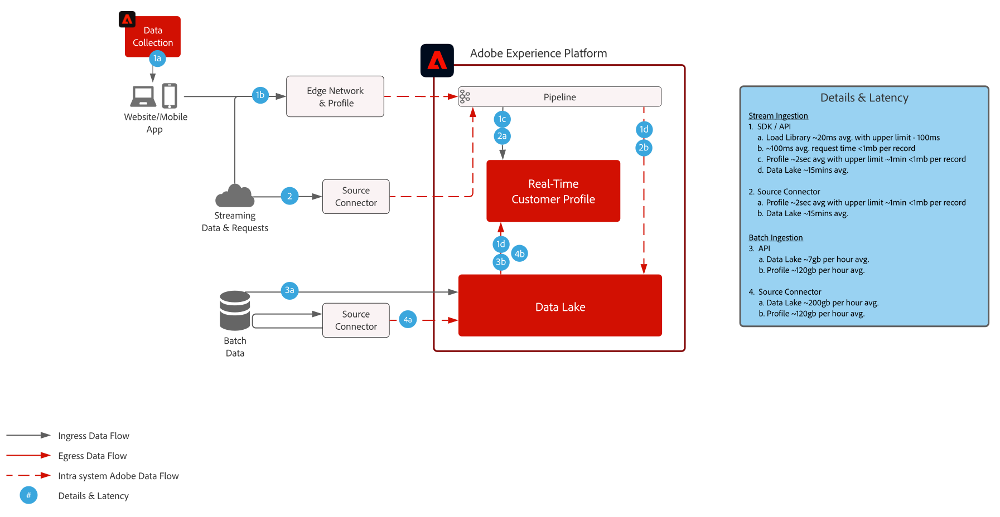

# Journey Optimizer

Adobe Journey Optimizer는 고객 행동에 실시간으로 반응하여 즉각적인 고객 만족을 이끌어 낼 수 있도록 고안된 시스템입니다. 데이터 관리 기능이 Adobe Experience Platform으로 이동하여 마케팅 팀은 중요한 업무에 집중할 수 있습니다. 바로 세계 최고 수준의 고객 여정과 개인화된 소통을 이끌어 내는 데에 초점을 맞출 수 있습니다.  이 블루프린트는 애플리케이션의 기술 기능을 간략하게 설명하고 Adobe Journey Optimizer을 구성하는 다양한 아키텍처 구성 요소에 대해 자세히 살펴봅니다.

 

## 사용 사례

* 트리거 메시지
* 시작 및 등록 확인
* 장바구니 및 애플리케이션 양식 버리기
* 장소 트리거 메시지
* 운동 경기장 내 경험
* 여행 및 숙박업의 도착 전 및 숙박 시 경험

 

## 아키텍처

 

## 블루프린트 시나리오

| 시나리오 | 설명 | 기능 |
| :-- | :--- | :--- |
| [서드파티 메시지](3rd-party-messaging.md) | Adobe Journey Optimizer를 서드파티 메시지 시스템과 함께 사용하여 개인화된 메시지를 오케스트레이션하고 보내는 방법을 설명합니다. | 고객이 브랜드나 회사와 상호 작용할 때 1:1로 즉각적인 개인화 커뮤니케이션을 제공합니다.  고려 사항: <ul><li>인증을 위해 서드파티 시스템이 베어러 토큰을 지원해야 합니다.</li><li>멀티테넌트 아키텍처로 인해 고정 IP를 지원하지 않습니다.</li><li>서드파티 시스템의 아키텍처에 따른 초당 API 호출 제한을 알고 있어야 합니다.  Journey Optimizer에서 보내는 데이터의 양을 지원하기 위해 고객이 서드파티 공급업체로부터 추가 용량을 구매해야 할 수도 있습니다.</li><li>메시지나 페이로드에 의사 결정 관리를 지원하지 않습니다.</li></ul> |

 

## 통합 패턴

| 통합 | 설명 | 기능 |
| :-- | :--- | :--- |
| [Journey Optimizer와 Adobe Campaign](ajo-and-campaign.md) | Adobe Journey Optimizer를 통해 [실시간 고객 프로필]을 활용하여 1:1 경험을 오케스트레이션하고 Adobe Campaign의 기본 제공 트랜잭션 메시지 시스템을 활용하여 메시지를 보내는 방법을 보여 줍니다. | [실시간 고객 프로필]과 Journey Optimizer의 기능을 활용하여 실시간 경험을 오케스트레이션하는 한편 Adobe Campaign의 기본 제공 실시간 메시지 기능을 사용하여 라스트 마일 커뮤니케이션을 수행합니다.  고려 사항: <ul><li>Campaign 애플리케이션이 v7 빌드 21.1 이후 또는 v8 버전이어야 합니다.</li><li>메시지 처리량</li><ul><li>Campaign v7 - 시간당 최대 5만</li><li>Campaign v8 - 시간당 최대 100만</li><li>Campaign Standard - 시간당 최대 5만</li></ul><li>스로틀링을 수행하지 않으므로 사용 사례에 대해 기업 아키텍트의 기술 점검을 받아야 합니다.</li><li>Campaign에서 보내는 메시지에 대한 의사 결정 관리 활용은 지원하지 않습니다.</li></ul> |

 

## 필요 조건

Adobe Experience Platform

* Journey Optimizer 데이터 소스를 구성하려면 먼저 시스템에서 스키마와 데이터 세트를 구성해야 합니다.
* [경험 이벤트] 클래스 기반 스키마의 경우 규칙 기반 이벤트가 아닌 이벤트를 트리거하려면 [Orchestration eventID 필드 그룹]을 추가해야 합니다.
* [개별 프로필] 클래스 기반 스키마의 경우 Journey Optimizer에서 사용할 테스트 프로필을 로드할 수 있도록 하려면 [프로필 테스트 세부 정보] 필드 그룹을 추가해야 합니다.

이메일

* 메시지 보내기에 사용할 하위 도메인이 있어야 합니다.
* 하위 도메인을 Adobe에 완전히 위임하거나(권장) CNAME을 사용하여 Adobe 전용 DNS 서버(사용자 정의)를 가리킬 수 있습니다.
* 전달성 보장을 위해 각 하위 도메인에 대해 Google TXT 기록이 있어야 합니다.

모바일 푸시

* 고객은 앱을 빌드할 수 있는 모바일 개발자가 있어야 합니다.
* Adobe Experience Platform Mobile SDK

 

## 가드레일

[Journey Optimizer 가드레일 제품 링크](https://experienceleague.adobe.com/docs/journeys/using/starting-with-journeys/limitations.html?lang=ko)

위 링크의 목록에 없는 다음 사항에 유의하세요.

* 세그먼트 일괄 처리: 인증 사용자의 일별 볼륨을 이해해야 하며, 대상 시스템이 각 여정 및 모든 여정의 발생 처리량을 처리할 수 있어야 합니다.
* 세그먼트 스트리밍: 프로필 인증 첫 발생을 각 여정 및 모든 여정에 대한 일별 스트리밍 인증 볼륨과 함께 처리할 수 있어야 합니다.
* 메시지에만 의사 결정 관리를 기본 지원합니다(사용자 정의 작업 불가).
* 지원 메시지 유형:
   * 이메일
   * 푸시(FCM/APNS)
   * 사용자 정의 작업(Rest API 사용)
* 서드파티 시스템으로의 아웃바운드 통합
   * 멀티 테넌트 인프라를 사용하므로 단일 고정 IP를 지원하지 않습니다(모든 데이터 센터의 IP를 허용 목록에 추가해야 함).
   * 사용자 정의 작업에는 POST 및 PUT 메서드만 지원됩니다.
   * 사용자/암호 또는 인증 토큰을 통한 인증
* 다양한 샌드박스 간에 Adobe Experience Platform 또는 Journey Optimizer의 개별 구성 요소를 패키징하여 이동할 수 없습니다. 새로운 환경에서는 다시 구현해야 합니다.

### 데이터 수집 가드레일

 

### 활성화 가드레일

 

## 구현 단계

### Adobe Experience Platform

#### 스키마/데이터 세트

1. 고객 제공 데이터를 기반으로 Experience Platform에서 [개인 프로필, 경험 이벤트 및 다중 항목 스키마를 구성합니다.](https://experienceleague.adobe.com/?recommended=ExperiencePlatform-D-1-2021.1.xdm)
1. Experience Platform에서 수집할 데이터를 위한 [데이터 세트를 만듭니다.](https://experienceleague.adobe.com/docs/platform-learn/tutorials/data-ingestion/create-datasets-and-ingest-data.html?lang=ko)
1. 거버넌스를 위해 Experience Platform에서 데이터 세트에 [데이터 사용 레이블을 추가](https://experienceleague.adobe.com/docs/platform-learn/tutorials/data-governance/classify-data-using-governance-labels.html?lang=ko)합니다.
1. 대상 관리 [정책을 만듭니다.](https://experienceleague.adobe.com/docs/platform-learn/tutorials/data-governance/create-data-usage-policies.html?lang=ko)

#### 프로필/ID

1. [고객용 네임스페이스를 만듭니다](https://experienceleague.adobe.com/docs/platform-learn/tutorials/identities/label-ingest-and-verify-identity-data.html?lang=ko).
1. [스키마에 ID를 추가합니다](https://experienceleague.adobe.com/docs/platform-learn/tutorials/identities/label-ingest-and-verify-identity-data.html).
1. [프로필에 대해 스키마와 데이터 세트를 활성화합니다](https://experienceleague.adobe.com/docs/platform-learn/tutorials/profiles/bring-data-into-the-real-time-customer-profile.html?lang=ko).
1. [!UICONTROL Real-time Customer Profile]의 서로 다른 보기에 대한 [병합 규칙](https://experienceleague.adobe.com/docs/platform-learn/tutorials/profiles/create-merge-policies.html?lang=ko)을 만듭니다(선택 사항).
1. Journey에서 사용할 세그먼트를 만듭니다.

#### 소스/대상

1. 스트리밍 API 및 소스 커넥터를 사용하여 [Experience Platform으로 데이터를 수집해 옵니다.](https://experienceleague.adobe.com/?recommended=ExperiencePlatform-D-1-2020.1.dataingestion&amp;lang=ko)

### Journey Optimizer

1. Experience Platform 데이터 소스를 구성하고 프로필의 일부로 캐시할 필드를 정합니다. 고객 여정을 시작하는 데 사용할 스트리밍 데이터는 먼저 Journey Optimizer 내에서 구성하여 오케스트레이션 ID를 설정해야 합니다. 이 오케스트레이션 ID는 데이터 수집에 사용할 수 있도록 개발자에게 제공됩니다
1. 외부 데이터 소스를 구성합니다.
1. 사용자 정의 행동을 구성합니다.

### 모바일 푸시 구성

1. Experience Platform Mobile SDK를 구현하여 푸시 토큰 및 로그인 정보를 수집하고 이를 알려진 고객 프로필에 다시 연결합니다.
1. 다음 확장을 사용하여 Adobe 태그를 활용하고 모바일 속성을 만들 수 있습니다.
1. Adobe Journey Optimizer
1. Adobe Experience Platform Edge Network
1. ID     Edge 네트워크의 경우
1. Mobile Core
1. 모바일 앱 배포와 웹 배포 각각에 대해 전용 데이터 스트림이 있는지 확인합니다.
1. 자세한 내용은 [Adobe Journey Optimizer Mobile 안내서](https://aep-sdks.gitbook.io/docs/using-mobile-extensions/adobe-journey-optimizer)를 참조하세요.

## 관련 설명서

* [Experience Platform 설명서](https://experienceleague.adobe.com/docs/experience-platform.html?lang=ko)
* [Experience Platform 태그 설명서](https://experienceleague.adobe.com/docs/experience-platform/tags/home.html?lang=ko)
* [Experience Platform Mobile SDK 설명서](https://experienceleague.adobe.com/docs/mobile.html?lang=ko)
* [Journey Optimizer 설명서](https://experienceleague.adobe.com/docs/journey-optimizer/using/ajo-home.html?lang=ko)
* [Journey Optimizer 제품 설명](https://helpx.adobe.com/kr/legal/product-descriptions/adobe-journey-optimizer.html)
