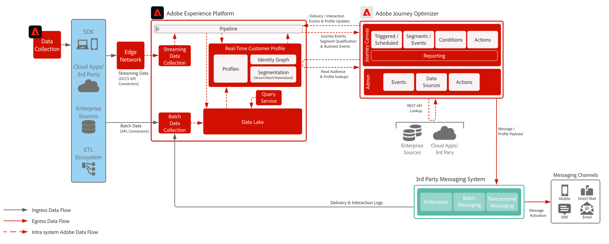

# 서드파티 메시지 블루프린트

Adobe Journey Optimizer을 서드파티 메시징 시스템과 함께 사용하여 개인화된 통신을 전송하는 방법을 보여 줍니다.

 

## 아키텍처

 

## 필요 조건

**Adobe Experience Platform**

* Journey Optimizer 데이터 소스를 구성하려면 먼저 시스템에서 스키마와 데이터 세트를 구성해야 합니다.
* 경험 이벤트 클래스 기반 스키마의 경우 규칙 기반 이벤트가 아닌 이벤트를 트리거하려면 &#39;Orchestration eventID 필드 그룹을 추가합니다.
* 개별 프로필 클래스 기반 스키마의 경우 Journey Optimizer에 사용할 테스트 프로필을 로드할 수 있도록 &#39;프로필 테스트 세부 정보&#39; 필드 그룹을 추가하십시오

**타사 메시징 응용 프로그램**

* 트랜잭션 페이로드를 보내기 위해 REST API 호출을 지원해야 합니다.

 

## 가드레일

[Journey Optimizer 가드레일 제품 링크](https://experienceleague.adobe.com/docs/journeys/using/starting-with-journeys/limitations.html)

[보호 기능 및 전체 지연 지침](https://experienceleague.adobe.com/docs/blueprints-learn/architecture/architecture-overview/guardrails.html)

 

## 구현 단계

### Adobe Experience Platform  

#### 스키마/데이터 세트

1. 고객이 제공한 데이터를 기반으로 하여 Experience Platform에서 [스키마를 구성](https://experienceleague.adobe.com/?recommended=ExperiencePlatform-D-1-2021.1.xdm&lang=ko)합니다.
1. Experience Platform에서 수집할 데이터를 위한 [데이터 세트를 만듭니다.](https://experienceleague.adobe.com/docs/platform-learn/tutorials/data-ingestion/create-datasets-and-ingest-data.html?lang=ko)
1. 거버넌스를 위해 Experience Platform에서 데이터 세트에 [데이터 사용 레이블을 추가](https://experienceleague.adobe.com/docs/platform-learn/tutorials/data-governance/classify-data-using-governance-labels.html?lang=ko)합니다.
1. 대상 관리 [정책을 만듭니다.](https://experienceleague.adobe.com/docs/platform-learn/tutorials/data-governance/create-data-usage-policies.html?lang=ko)

#### 프로필/신원

1. [고객용 네임스페이스를 만듭니다](https://experienceleague.adobe.com/docs/platform-learn/tutorials/identities/label-ingest-and-verify-identity-data.html?lang=ko).
1. [스키마에 신원을 추가합니다](https://experienceleague.adobe.com/docs/platform-learn/tutorials/identities/label-ingest-and-verify-identity-data.html?lang=ko).
1. [프로필에 대해 스키마와 데이터 세트를 활성화합니다](https://experienceleague.adobe.com/ko/docs/platform-learn/tutorials/profiles/bring-data-into-the-real-time-customer-profile).
1. [!UICONTROL Real-time Customer Profile]의 서로 다른 보기에 대한 [병합 규칙](https://experienceleague.adobe.com/docs/platform-learn/tutorials/profiles/create-merge-policies.html?lang=ko)을 만듭니다(선택 사항).
1. Journey에서 사용할 세그먼트를 만듭니다.

#### 소스/대상

1. 스트리밍 API 및 소스 커넥터를 사용하여 [Experience Platform으로 데이터를 수집해 옵니다.](https://experienceleague.adobe.com/?recommended=ExperiencePlatform-D-1-2020.1.dataingestion&lang=ko)

### Journey Optimizer

1. Experience Platform 데이터 소스를 구성하고 여정의 일부로 캐시할 필드를 결정합니다
1. 고객 여정을 시작하는 데 사용되는 스트리밍 데이터를 오케스트레이션 ID를 가져오도록 먼저 구성해야 합니다. 그런 다음 이 오케스트레이션 ID는 수집 중에 사용할 개발자에게 제공됩니다
1. 외부 데이터 소스를 구성합니다
1. 서드파티 애플리케이션에 대한 사용자 정의 작업 구성

### 모바일 푸시 구성(선택 사항. 서드파티에서 토큰을 수집할 수 있음)

1. Experience Platform Mobile SDK를 구현하여 푸시 토큰 및 로그인 정보를 수집하고 이를 알려진 고객 프로필에 다시 연결합니다.
1. 다음 확장을 사용하여 Adobe 태그를 활용하고 모바일 속성을 만들 수 있습니다.
   * Adobe Journey Optimizer
   * Adobe Experience Platform Edge Network
   * [!DNL Edge Network]에 대한 ID
   * Mobile Core
1. 모바일 앱 배포와 웹 배포 각각에 대해 전용 데이터 스트림이 있는지 확인합니다.
1. 자세한 내용은 [Adobe Journey Optimizer Mobile 안내서](https://developer.adobe.com/client-sdks/documentation/adobe-journey-optimizer/)를 참조하세요.

 

## 관련 설명서

* [Experience Platform 설명서](https://experienceleague.adobe.com/docs/experience-platform.html?lang=ko)
* [Experience Platform 태그 설명서](https://experienceleague.adobe.com/docs/experience-platform/tags/home.html?lang=ko)
* [Experience Platform Mobile SDK 설명서](https://experienceleague.adobe.com/docs/mobile.html)
* [Journey Optimizer 설명서](https://experienceleague.adobe.com/docs/journey-optimizer/using/ajo-home.html)
* [Journey Optimizer 제품 설명](https://helpx.adobe.com/kr/legal/product-descriptions/adobe-journey-optimizer.html)
