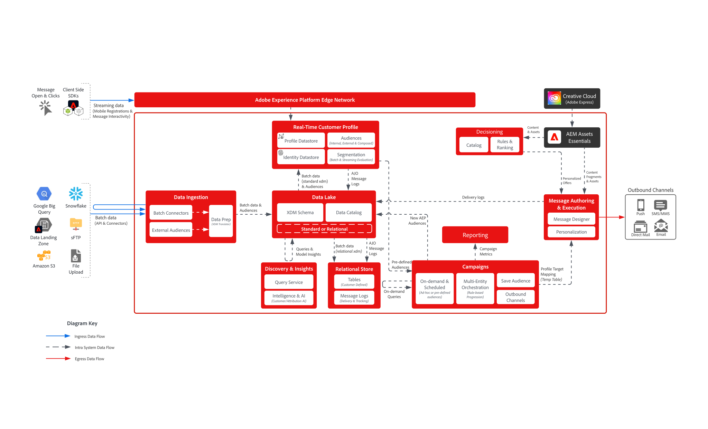
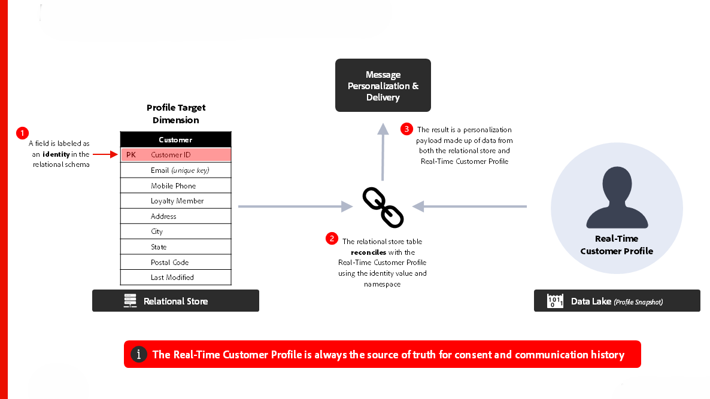
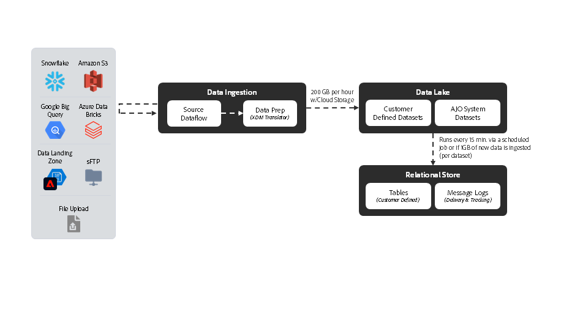

# [!DNL Journey Optimizer] - Campaign 오케스트레이션 블루프린트

AJO Campaign Orchestration을 통해 마케터는 이메일, SMS, 푸시 및 DM과 같은 아웃바운드 채널 전반에서 예약된 대상 기반, 다단계 커뮤니케이션을 디자인하고 실행할 수 있습니다. 실시간 고객 프로필의 실시간 데이터를 사용하여 개별 고객 행동에 반응하는 AJO 여정과 달리, 캠페인은 계획된 간격으로 대상을 타깃팅하는 마케팅 작업이 조정됩니다. 캠페인과 여정은 상호 보완적인 접근 방식을 제공합니다. 캠페인은 브랜드 참여 전략을 추진하는 반면 여정은 개인화되고 반응형 경험을 제공합니다.

 

## 아키텍처

 

### 메시지 실행 아키텍처

 

### 관계형 저장소 - 데이터 수집 지연

 

## 여정에 대한 아키텍처 고려 사항

- **데이터 아키텍처**: AJO Campaign Orchestration은 대상 구축 및 오케스트레이션을 위해 아래의 관계형 데이터베이스를 사용합니다.
- **대상자 포털 통합**: 실시간 고객 프로필 내의 대상자 포털과 기본적으로 통합되어 기존 대상자를 읽고 캠페인을 구축할 때 새 대상자를 저장할 수 있습니다.
- **온디맨드 대상 만들기**: 긴급 마케팅 사용 사례에 대해 대상을 즉시 빌드하고, 평가하고, 실행합니다.
- **실시간 고객 프로필 통합:** 동의 및 커뮤니케이션 내역에 대한 신뢰할 수 있는 원본, 개인화를 위한 &#39;스키니 프로필&#39; 디자인 지원
- **다중 엔터티 메시지 보내기:** 프로필당 여러 메시지를 한 번의 배달로 보낼 수 있습니다(예: 예약당 하나의 메시지를 고객 전자 메일 주소로 보내기).
- **다중 엔터티 세분화**: 관계형 저장소 내의 엔터티(예: 제품, 인벤토리, 계획 등)에서 대상자 빌드를 시작합니다.

 

## 가드레일

[오케스트레이션된 캠페인 제품 링크](https://experienceleague.adobe.com/ko/docs/journey-optimizer/using/campaigns/orchestrated-campaigns/guardrails)

[보호 기능 및 전체 지연 지침](https://experienceleague.adobe.com/docs/blueprints-learn/architecture/architecture-overview/deployment/guardrails)

 

## 관련 설명서

- [[!DNL Journey Optimizer] 오케스트레이션된 캠페인](https://experienceleague.adobe.com/en/docs/journey-optimizer/using/campaigns/orchestrated-campaigns/orchestrated-campaigns-landing-page.html)
- [[!DNL Experience Platform] 설명서](https://experienceleague.adobe.com/docs/experience-platform.html?lang=ko)
- [[!DNL Experience Platform] 태그 설명서](https://experienceleague.adobe.com/docs/experience-platform/tags/home.html?lang=ko)
- [[!DNL Experience Platform Mobile SDK] 설명서](https://experienceleague.adobe.com/docs/mobile.html?lang=ko)
- [[!DNL Journey Optimizer] 설명서](https://experienceleague.adobe.com/docs/journey-optimizer/using/ajo-home.html?lang=ko)
- [[!DNL Journey Optimizer] 제품 설명](https://helpx.adobe.com/kr/legal/product-descriptions/adobe-journey-optimizer.html)