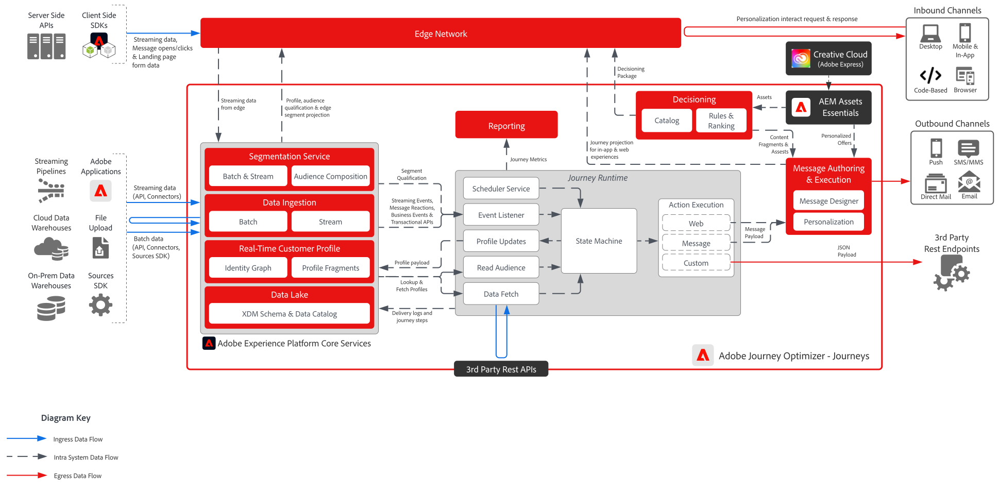

# [!DNL Journey Optimizer] - 여정 블루프린트

Adobe Journey Optimizer 여정은 개별 고객 행동을 기반으로 개인화된 여러 단계 경험을 제공하는 실시간 이벤트 기반 워크플로우입니다. 또한 이메일, SMS, 푸시 알림, 인앱 메시지, 코드 기반 경험, 사용자 정의 API 기반 통합 등 다양한 채널을 지원하여 브랜드가 선호하는 터치포인트에서 고객의 참여를 컨텍스트에 맞게 수행할 수 있습니다.

 

## 아키텍처

 

## 여정에 대한 아키텍처 고려 사항

- **프로필 새로 고침**: AJO 여정은 고객 프로필에 대한 실시간 업데이트를 사용합니다. Adobe Experience Platform(AEP)로 공급되는 데이터 소스가 프로필 정확도를 유지하기 위해 짧은 지연 시간 수집을 위해 구성되었는지 확인합니다.
- **확장 가능한 이벤트 처리:** 인프라에서 대량의 여정 트리거 및 메시지 전달을 처리할 수 있는지 확인하십시오.
- **모듈식 통합:** 동적 개인화를 위해 AJO을 외부 시스템과 연결하기 위한 디자인 API 및 사용자 지정 작업.
- **ID 확인**: 장치 및 채널 간에 고객 ID를 정확하게 연결하는 것이 중요합니다. ID가 잘못 정렬되면 여정이 손상되거나 잘못 지정될 수 있습니다.
- **세그먼트 선별 시간**: 대상 기반 여정은 세그먼트 멤버십에 따라 다릅니다. 세그먼트가 평가되는 빈도와 해당 타이밍이 여정 입력 및 개인화에 미치는 영향을 파악합니다.
- **여정 시작 조건**: 프로필이 여정을 입력하려면 특정 조건을 충족해야 합니다. 이러한 조건은 의도하지 않은 제외 또는 중복을 피하도록 신중하게 디자인되어야 합니다.
- **대상 평가 및 지연**: 대상 읽기 단계는 Adobe Experience Platform 내의 세그먼트 평가에 따라 다르며 실시간으로 발생하지 않을 수 있습니다. 평가 빈도 및 지연 시간에 대한 인식을 사용하여 여정을 설계하여 대상 자격이 지연되는 것을 방지하고 적시에 개인화할 수 있습니다.

 

## 가드레일

[[!DNL Journey Optimizer] 보호 기능 제품 링크](https://experienceleague.adobe.com/en/docs/journey-optimizer/using/get-started/guardrails.html)

[보호 기능 및 전체 지연 지침](https://experienceleague.adobe.com/docs/blueprints-learn/architecture/architecture-overview/deployment/guardrails.html?lang=ko)

 

## 관련 설명서

- [[!DNL Experience Platform] 설명서](https://experienceleague.adobe.com/docs/experience-platform.html?lang=ko)
- [[!DNL Experience Platform] 태그 설명서](https://experienceleague.adobe.com/docs/experience-platform/tags/home.html?lang=ko)
- [[!DNL Experience Platform Mobile SDK] 설명서](https://experienceleague.adobe.com/docs/mobile.html?lang=ko)
- [[!DNL Journey Optimizer] 설명서](https://experienceleague.adobe.com/docs/journey-optimizer/using/ajo-home.html?lang=ko)
- [[!DNL Journey Optimizer] 제품 설명](https://helpx.adobe.com/kr/legal/product-descriptions/adobe-journey-optimizer.html)