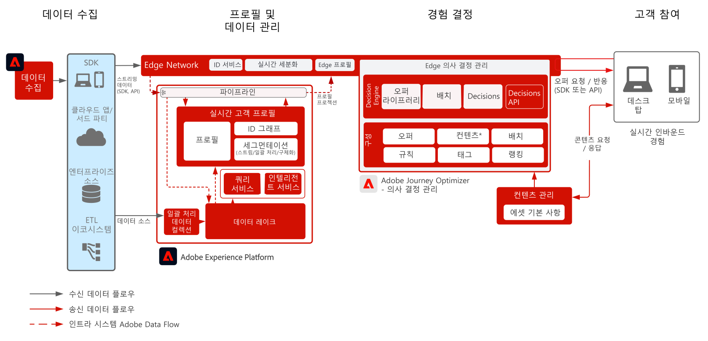

# Journey Optimizer - Edge의 Offer Decisioning

의사 결정 관리에 대한 자세한 내용은 제품 설명서를 참조하십시오 [여기](https://experienceleague.adobe.com/docs/journey-optimizer/using/offer-decisioniong/get-started-decision/starting-offer-decisioning.html?lang=ko) 및 Offer decisioning 개요 [여기](https://experienceleague.adobe.com/docs/blueprints-learn/architecture/customer-journeys/journey-optimizer/offer-decisioning/offers-overview.html)

Adobe 의사 결정 관리는 Adobe Journey Optimizer의 일부로 제공되는 서비스입니다. 이 블루프린트에서는 애플리케이션의 사용 사례 및 기술적 기능을 간략하게 설명하고 Offer Decisioning의 다양한 아키텍처 구성 요소와 고려할 사항을 자세히 설명합니다.

의사 결정 관리는 두 가지 방법 중 하나로 배포할 수 있습니다. 첫 번째 방법은 단일 데이터 센터 아키텍처인 Adobe Experience Platform 허브를 통해 배포하는 것입니다. [허브] 접근 방식에서는 오퍼를 실행, 개인화하여 초 단위의 지연 시간을 두고 게재합니다 따라서 허브 아키텍처는 지연 시간이 초 미만 단위일 필요가 없는 고객 경험에 가장 적합합니다. 예를 들면 콜센터 또는 대면 상호 작용 등의 상담원 지원 경험이나 키오스크에서 제공하는 오퍼 의사 결정이 있습니다.

두 번째 방법은 Experience Edge Network를 통한 것입니다. Experience Edge Network는 1초 미만, 밀리초 단위의 빠른 경험을 제공하기 위해 지리적 위치를 전 세계에 분산시킨 인프라입니다. 지연을 최소화하기 위하여 최종 소비자 경험은 소비자의 지리적 위치에서 가장 가까운 Edge 인프라에 의해 실행됩니다. Edge의 의사 결정 관리는 실시간 고객 경험을 제공하기 위해 설계되었습니다. 여기에는 웹 또는 모바일 인바운드 개인화 요청 등의 경험이 포함됩니다.

이 블루프린트는 Edge에서의 의사 결정 관리에 대해 구체적인 정보를 다룹니다.

허브의 의사 결정 관리에 대한 자세한 내용은 [허브의 의사 결정 관리](https://experienceleague.adobe.com/docs/blueprints-learn/architecture/customer-journeys/journey-optimizer/offer-decisioning/offers-hub.html) 블루프린트를 참조하세요.

## 에지에서 의사 결정 관리에 사용 사례

* 웹 또는 모바일 인바운드 경험을 통한 온라인 개인화.
* 크로스 채널 여정 실행 - Adobe Journey Optimizer를 통한 웹, 모바일, 이메일, 기타 상호 작용 채널 간 오퍼 일관성.

 

## 아키텍처

 

## 통합 패턴

| 통합 | 설명 |
| :-- | :--- |
| [Offer Decisioning과 Adobe Target](https://experienceleague.adobe.com/docs/target/using/integrate/ajo/offer-decision.html?lang=ko) | Offer Decisioning을 Adobe Target과 통합하여 오퍼를 테스트하고 Target 경험으로 게재할 수 있습니다. |

## 필요 조건

Adobe Experience Platform

* Journey Optimizer 데이터 소스를 구성하려면 먼저 시스템에서 스키마와 데이터 세트를 구성해야 합니다.
* [경험 이벤트] 클래스 기반 스키마의 경우 규칙 기반 이벤트가 아닌 이벤트를 트리거하려면 [Orchestration eventID 필드 그룹]을 추가해야 합니다.
* [개별 프로필] 클래스 기반 스키마의 경우 Journey Optimizer에서 사용할 테스트 프로필을 로드할 수 있도록 하려면 [프로필 테스트 세부 정보] 필드 그룹을 추가해야 합니다.

 

## 가드레일

* Journey Optimizer의 가드레일에 대해서는 다음의 [Journey Optimizer 가드레일](https://experienceleague.adobe.com/docs/journey-optimizer/using/get-started/limitations.html?lang=ko)을 참조하세요.
* Offer Decisioning의 가드레일에 대해서는 다음의 [Offer Decisioning 제품 설명](https://helpx.adobe.com/kr/legal/product-descriptions/offer-decisioning-app-service.html)을 참조하세요.
* 초당 요청 수 = 5000입니다.
* 응답 지연 시간이 250ms 미만입니다.
* Edge 실시간 프로필에 대한 액세스. 에지 예상 대상 및 프로필 속성만 프로필에서 사용할 수 있습니다.
* 처음 경험에서 개인화가 필요한 경우 전체 프로필을 사용할 수 있으므로 허브가 이상적입니다. Edge 프로필은 처음 Edge 경험을 위해 허브에서 동기화되어야 합니다. 따라서 Edge의 첫 번째 경험에는 이전에 업로드된 프로필 데이터가 허브에 포함되지 않습니다.

### 데이터 수집 가드레일

 

### 활성화 가드레일

 

## 구현 패턴

* 웹사이트 및 모바일 애플리케이션에서 배포하려는 경우 Web 또는 Mobile SDK를 사용하여 SDK를 배포할 곳에 Offer Decisioning을 구현합니다.
   * [Web/Mobile SDK 블루프린트](https://experienceleague.adobe.com/docs/blueprints-learn/architecture/data-ingestion/websdk.html?lang=ko)
   * [WebSDK](https://experienceleague.adobe.com/docs/experience-platform/edge/personalization/offer-decisioning/offer-decisioning-overview.html?lang=ko)
   * [MobileSDK](https://aep-sdks.gitbook.io/docs/)

또는

* API 서버 간 기반 구현의 경우 Edge Network Service API를 사용하여 서버 간에 직접 Offer Decisioning을 구현합니다.
   * [Edge Network Server API](https://experienceleague.adobe.com/docs/journey-optimizer/using/offer-decisioniong/api-reference/offer-delivery/deliver-offers.html?lang=ko)

 

## 구현 단계

### Adobe Experience Platform

#### 스키마/데이터 세트

1. 고객 제공 데이터를 기반으로 Experience Platform에서 [개인 프로필, 경험 이벤트 및 다중 항목 스키마를 구성합니다.](https://experienceleague.adobe.com/?recommended=ExperiencePlatform-D-1-2021.1.xdm)
1. Experience Platform에서 수집할 데이터를 위한 [데이터 세트를 만듭니다.](https://experienceleague.adobe.com/docs/platform-learn/tutorials/data-ingestion/create-datasets-and-ingest-data.html?lang=ko)
1. 거버넌스를 위해 Experience Platform에서 데이터 세트에 [데이터 사용 레이블을 추가](https://experienceleague.adobe.com/docs/platform-learn/tutorials/data-governance/classify-data-using-governance-labels.html?lang=ko)합니다.
1. 대상 관리 [정책을 만듭니다.](https://experienceleague.adobe.com/docs/platform-learn/tutorials/data-governance/create-data-usage-policies.html?lang=ko)

#### 프로필/ID

1. [고객용 네임스페이스를 만듭니다](https://experienceleague.adobe.com/docs/platform-learn/tutorials/identities/label-ingest-and-verify-identity-data.html?lang=ko).
1. [스키마에 ID를 추가합니다](https://experienceleague.adobe.com/docs/platform-learn/tutorials/identities/label-ingest-and-verify-identity-data.html).
1. [프로필에 대해 스키마와 데이터 세트를 활성화합니다](https://experienceleague.adobe.com/docs/platform-learn/tutorials/profiles/bring-data-into-the-real-time-customer-profile.html?lang=ko).
1. [!UICONTROL Real-time Customer Profile]의 서로 다른 보기에 대한 [병합 규칙](https://experienceleague.adobe.com/docs/platform-learn/tutorials/profiles/create-merge-policies.html?lang=ko)을 만듭니다(선택 사항).
1. Journey에서 사용할 세그먼트를 만듭니다.

#### 소스/대상

1. 스트리밍 API 및 소스 커넥터를 사용하여 [Experience Platform으로 데이터를 수집해 옵니다.](https://experienceleague.adobe.com/?recommended=ExperiencePlatform-D-1-2020.1.dataingestion&amp;lang=ko)

## 관련 설명서

* [Adobe Experience Platform](https://experienceleague.adobe.com/docs/experience-platform.html?lang=ko)
* [Adobe Journey Optimizer](https://experienceleague.adobe.com/docs/journey-optimizer.html?lang=ko)
* [Adobe Journey Optimizer 의사 결정 관리](https://experienceleague.adobe.com/docs/journey-optimizer/using/offer-decisioniong/get-started-decision/starting-offer-decisioning.html)
* [ Adobe Journey Optimizer 제품 설명](https://helpx.adobe.com/kr/legal/product-descriptions/adobe-journey-optimizer.html)
* [Adobe Offer Decisioning 제품 설명](https://helpx.adobe.com/legal/product-descriptions/offer-decisioning-app-service.html)
