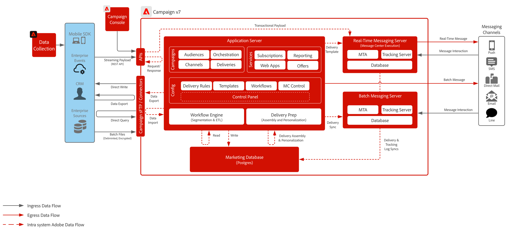

# 고객 여정 블루프린트

고객 여정은 이메일, SMS, 모바일 경고와 같은 채널을 통해 브랜드가 고객을 적극적으로 참여시키고 소통하는 기능을 합니다. 오케스트레이션 도구를 다른 소통 채널과 통합(예: 인바운드 채널과 통합)하여 다른 채널의 의사 결정 엔진과 대상자의 상태를 공유함으로써 웹 및 모바일 개인화를 실행할 수 있습니다. 고객 여정에 사용하는 애플리케이션 및 배포 옵션에 대해서는 여러 가지 요소가 있지만, 두 가지 접근 방식으로 요약할 수 있습니다. 고객이 참여할 때(트리거될 때) 반응하는 것과 고객 그룹이 참여할 때(예약됨) 대응하는 것입니다.

현재 Adobe는 고객 여정 솔루션을 원하는 고객에게 두 가지 선택지를 제공합니다.

<ul><li>Adobe Campaign Managed Cloud Services</li><li>Adobe Journey Optimizer</li></ul>

| 블루프린트 | 설명 | 아키텍처 |
|---|---|---|
| **[Journey Optimizer](journey-optimizer.md)** | 기본적으로 Experience Platform 실시간 고객 프로필을 기반으로 구축되어 마케팅 팀이 실시간 대응을 통해 고객 행동을 변화시키고 언제 어느 채널에서든 고객을 만날 수 있습니다. |  |
| **[Adobe Campaign v8](campaign-v8.md)** | 고도로 복잡한 데이터 관리 및 캠페인 프로세스에 최적화된 차세대 캠페인 도구입니다. 고객이 풍부한 마케팅 캠페인 커뮤니케이션을 찾아내고 만들 수 있도록 지원합니다. |  |
| **[Adobe Campaign v7](campaign-v7.md)** | 이메일, SMS, DM 등 다양한 채널에서의 배치 기반 마케팅 캠페인을 위해 개발된 기존 캠페인 도구입니다. 고객이 다양한 고객 커뮤니케이션을 한 곳에서 오케스트레이션 및 관리할 수 있도록 지원합니다. |  |
