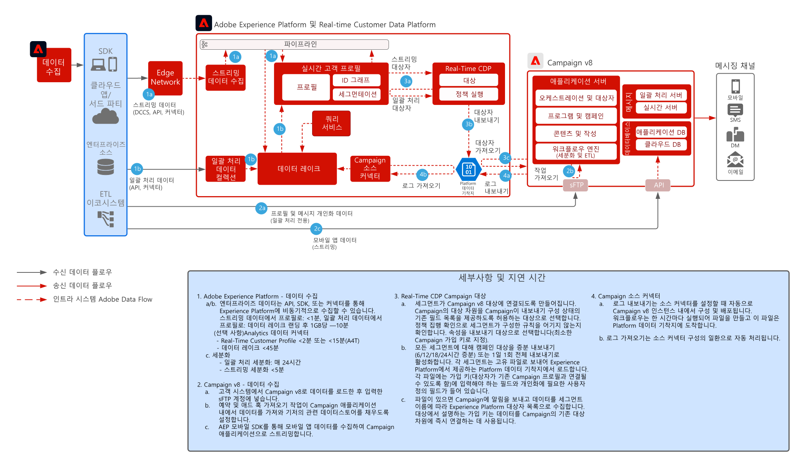

# [!DNL Real-Time CDP] (Adobe [!DNL Campaign] v8 통합 패턴 포함)

[!DNL Experience Platform] Adobe과 실시간 고객 프로필 및 중앙 집중식 세분화 도구를 Adobe Campaign과 함께 사용하여 개인 맞춤화된 대화를 제공하는 방법을 소개합니다.

## 애플리케이션

* Adobe [!DNL Experience Platform Real-Time CDP]
* Adobe [!DNL Campaign] v8

## 아키텍처

 

## 필요 조건

* 고객은 유효한 IMS 조직이 있는 Experience Cloud에 프로비전되어야 합니다.
* Adobe Experience Platform 및 [!DNL Campaign]은(는) 단일 로그인 URL에 대해 동일한 IMS 조직에서 프로비저닝되는 것이 좋습니다
* 고객은 [!DNL Campaign]의 V8 인스턴스를 프로비저닝해야 합니다.
* 고객에게 RTCDP, 소스, 대상에 대한 액세스 권한이 있어야 합니다.
* Adobe [!DNL Campaign] 제품 컨텍스트가 있어야 합니다.
 

## 구현 단계

Adobe Experience Platform으로 연결되는 Campaign v8 소스 커넥터를 구성하고 Campaign v8로 연결되는 Real-time Customer Data Platform 대상 커넥터를 구성하는 방법에 대한 다음 설명서를 참조하세요.
[Campaign과 AEP 커넥터](https://experienceleague.adobe.com/docs/campaign/campaign-v8/connect/ac-aep.html?lang=ko)

## 가드레일

### Adobe Campaign

* Campaign 소스 커넥터 설명서를 참조하세요. [Campaign 소스 커넥터](https://experienceleague.adobe.com/docs/experience-platform/sources/ui-tutorials/create/adobe-applications/campaign.html?lang=ko)
* Adobe Campaign 단일 조직 유닛 배포만 지원

### Experience Platform Real-time Customer Data Platform 세그먼트 공유

* RTCDP Campaign 대상 커넥터를 참조하세요. [RTCDP Campaign 연결](https://experienceleague.adobe.com/docs/experience-platform/destinations/catalog/email-marketing/adobe-campaign-managed-services.html?lang=ko)

* AEP의 프로필 및 데이터 수집 가드레일을 참조하세요. [링크](https://experienceleague.adobe.com/docs/experience-platform/profile/guardrails.html?lang=ko)
