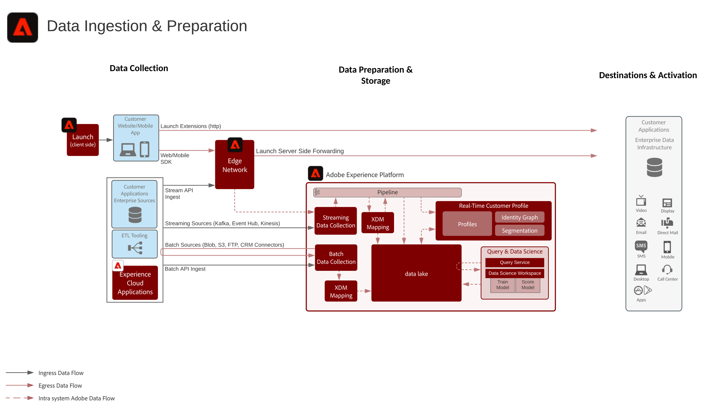

# 데이터 준비 및 통합 청사진

데이터 준비 및 통합 청사진에는 데이터를 준비하고 Adobe Experience Platform으로 인제스트할 수 있는 모든 방법이 포함되어 있습니다.

데이터 준비에는 XDM(Experience Data Model) 스키마에 대한 매핑 소스 데이터가 포함됩니다. 날짜 서식, 필드 분할/연결/변환, 레코드 참여/병합/다시 키잉 등 데이터 변형의 수행도 포함됩니다. 데이터 준비를 통해 고객 데이터를 통합하여 고객 프로파일 취합/데이터 과학/활성화를 위한 보고 또는 데이터 준비 등 종합적/필터링된 분석을 제공할 수 있습니다.

## 아키텍처

## 데이터 통합 방법

| 섭취 방법 | 설명 |
|------------------------------|-----------------------------------------------------------------------------------------------------------------------------------------------------------------------------------------------------------------------------------------------------------------------------------------------------------------------------------------------------------------------------------------------------------------------------------------|
| 웹/모바일 SDK | 지연:<ul><li>실시간 - Edge Network에 동일한 페이지 컬렉션</li><li>프로필로 스트리밍 통합 1분</li><li>데이터 레이크에 대한 스트리밍 통합(마이크로 일괄 처리 ~15분)</ul>설명서: <ul><li>[웹 SDK](https://experienceleague.corp.adobe.com/docs/web-sdk.html)</li><li>[모바일 SDK](https://experienceleague.adobe.com/docs/mobile.html?lang=en)</li></ul> |
| 스트리밍 소스 | 지연:<ul><li>실시간 - Edge Network에 동일한 페이지 컬렉션</li><li>프로필로 스트리밍 통합 1분</li><li>데이터 레이크에 대한 스트리밍 통합(마이크로 일괄 처리 ~15분)</li></ul>[설명서](https://experienceleague.adobe.com/docs/experience-platform/sources/home.html?lang=en#connectors) |
| 스트리밍 API | 지연:<ul><li>실시간 - Edge Network에 동일한 페이지 컬렉션</li><li>프로필로 스트리밍 통합 1분</li><li>데이터 레이크에 대한 스트리밍 통합(마이크로 일괄 처리 ~15분)</li><li>시간당 7GB</li></ul>[설명서](https://experienceleague.adobe.com/docs/experience-platform/ingestion/streaming/overview.html?lang=en#what-can-you-do-with-streaming-ingestion%3F) |
| ETL 도구 | ETL 툴을 사용하여 Experience Platform에 수집하기 전에 엔터프라이즈 데이터를 수정 및 변형할 수 있습니다.  지연:<ul><li>외부 ETL 도구 예약에 따라 타이밍을 설정하면 표준 섭취 가드레일이 섭리에 사용되는 방법에 따라 적용됩니다.</li></ul> |
| 일괄 처리 소스 | 소스 지연에서 예약된 가져오기:~ 200GB/시간  [설명서](https://experienceleague.adobe.com/docs/experience-platform/sources/home.html?lang=en#connectors) [비디오 Tutorials](https://experienceleague.adobe.com/docs/platform-learn/tutorials/sources/overview.html) |
| 일괄 처리 API | 지연:<ul><li>크기 및 트래픽 로드에 따라 프로필에 일괄 인제스트 ~45분</li><li>크기 및 트래픽 로드에 따라 데이터 레이크에 일괄 통합</li></ul>[설명서](https://experienceleague.adobe.com/docs/experience-platform/ingestion/batch/overview.html?lang=en#batch) |
| Adobe 응용 프로그램 커넥터 | Adobe Experience Cloud 애플리케이션에서 가져온 데이터를 자동으로 인제스트<ul><li>Adobe Analytics:[설명서](https://experienceleague.adobe.com/docs/experience-platform/sources/connectors/adobe-applications/analytics.html?lang=en#connectors) 및 [비디오 자습서](https://experienceleague.adobe.com/docs/platform-learn/tutorials/sources/ingest-data-from-adobe-analytics.html)</li><li>Audience Manager:[설명서](https://experienceleague.adobe.com/docs/experience-platform/sources/connectors/adobe-applications/audience-manager.html?lang=en#connectors) 및 [비디오 자습서](https://experienceleague.adobe.com/docs/platform-learn/tutorials/sources/ingest-data-from-aam.html)</li></ul> |

## 데이터 준비 방법

| 데이터 준비 방법 | 설명 |
|------------------------------------------------------------|------------------------------------------------------------------------------------------------------------------------------------------------------------------------------------------------------------------------------------------------------------------------------------------------|
| 데이터 과학 작업 공간 - 데이터 준비 | 모델 기반의 변형, 스크립트 변형 [설명서](https://experienceleague.adobe.com/docs/experience-platform/data-science-workspace/home.html?lang=en) |
>[!NOTE]
>
>| 외부 ETL 도구([!DNL Snaplogic], [!DNL Mulesoft], [!DNL Informatica] 등) | ETL 툴에서 복잡한 변형을 수행하고 표준 Experience Platform 소스 API 또는 커넥터를 사용하여 결과 데이터를 인제스트합니다.                                                                                                                                                               |

| 쿼리 서비스 - 데이터 준비                                  | 데이터를 새 데이터 세트에 연결, 분할, 병합, 변형, 쿼리 및 필터링합니다. 테이블을 선택(CTAS)  [설명서](https://experienceleague.adobe.com/docs/experience-platform/query/home.html?lang=en#sql)로 만들기 사용                                                                       |
| XDM 매퍼 및 데이터 준비 함수(스트리밍 및 일괄 처리)     | Experience Platform 수집 중 CSV 또는 JSON 형식의 소스 특성을 XDM 특성에 매핑합니다. 데이터 수집 시 계산 함수즉, 데이터 서식, 분할, 연결 등이 있습니다. [설명서](https://experienceleague.adobe.com/docs/experience-platform/data-prep/home.html?lang=en) |

## 관련 블로그 게시물

* [Adobe Experience Platform Journey Orchestration의 외부 데이터 플랫폼 활용](https://medium.com/adobetech/leveraging-external-data-platforms-in-adobe-experience-platform-journey-orchestration-54fc6134fe17?source=your_stories_page-------------------------------------)
* [빙산에 대한 높은 처리량 섭취](https://medium.com/adobetech/high-throughput-ingestion-with-iceberg-ccf7877a413f?source=your_stories_page-------------------------------------)
* [Adobe Experience Platform의 쿼리 서비스 트릭(쿼리 작성 및 파생된 데이터 집합 저장)](https://medium.com/adobetech/query-service-tricks-in-adobe-experience-platform-writing-queries-and-storing-derived-datasets-eaee0d6d683e?source=your_stories_page-------------------------------------)
* [Adobe Experience Platform 경험 데이터 모델을 심층 분석하여 실시간 고객 프로필의 파워를 보다 완벽하게 파악할 수 있습니다.](https://medium.com/adobetech/digging-into-adobe-experience-platforms-experience-data-model-to-more-fully-understand-the-power-3e109271e04f?source=your_stories_page-------------------------------------)
* [Adobe Experience Platform에 대한 예비 데이터 분석 소개](https://medium.com/adobetech/an-introductory-look-at-exploratory-data-analysis-on-adobe-experience-platform-1bfce7501d9a?source=your_stories_page-------------------------------------)
* [Adobe Experience Platform의 규모에 따른 데이터과학에 대한 XDM 데이터 모델링](https://medium.com/adobetech/modeling-xdm-data-for-data-science-at-scale-on-adobe-experience-platform-222bb2a6dbf7?source=your_stories_page-------------------------------------)
