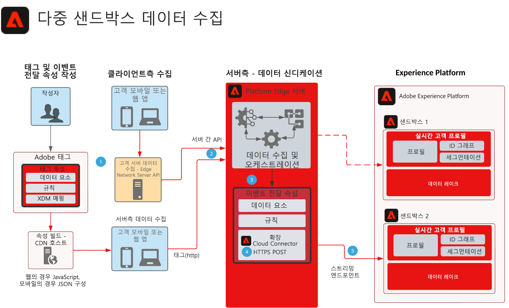

# 다중 샌드박스 이벤트 전달 데이터 수집 블루프린트

이 블루프린트는 Experience Platform 웹 및 Mobile SDK로 수집된 데이터를 단일 이벤트를 수집하고 여러 AEP 샌드박스로 전달하도록 구성하는 방법을 보여 줍니다. 이 블루프린트는 이 목표를 달성하기 위해 이벤트 전달을 사용하는 다중 샌드박스 데이터 수집에 대한 특정 사용 사례입니다.

이벤트 전달 기능을 사용하여 이벤트를 복제할 수 있을 뿐만 아니라 다른 샌드박스에 대한 요구 사항을 충족하는 원래 수집된 데이터에 를 추가, 필터링 또는 조작할 수 있습니다.

이벤트 전달에서는 데이터 요구 사항에 필요한 데이터 요소, 규칙 및 확장이 포함된 별도의 속성을 사용합니다. 수신 이벤트를 사용하면 이벤트 전달 속성이 데이터를 수집하고 전달하기 전에 필요에 따라 관리할 수 있습니다.

대상 샌드박스를 사용하려면 Adobe 클라우드 커넥터 확장에서 사용하는 HTTP 스트리밍 끝점 이 구성되어 있어야 합니다.

## 사용 사례

* 전역 데이터 보고 - 여러 샌드박스를 사용하여 운영 환경을 분리하고 있으며 여러 샌드박스에 걸친 보고를 위해 데이터 수집을 단일 샌드박스로 통합해야 하는 경우. 이벤트 전달을 통해 Experience Edge 이벤트를 보고 샌드박스로 라우팅하면 각 샌드박스 운영 환경에서 데이터가 실시간으로 수집될 때 보고 샌드박스로 전송할 수 있습니다
* 각 샌드박스 운영 환경에 대한 다양한 데이터 규칙을 기반으로 샌드박스 간 데이터 수집을 관리합니다.

## 애플리케이션

* Adobe Experience Platform 데이터 수집
* 이벤트 전달
* AEP 확장
* Cloud Connector 확장

## 고려할 사항

여러 샌드박스에 데이터를 전송하는 접근 방식으로 이벤트 전달을 사용하면 솔루션 아키텍처에서 고려해야 할 사항이 있습니다.

### HIPAA 데이터 없음

이벤트 전달은 HIPAA 준비로 간주되지 않으며 HIPAA 데이터가 수집되는 HIPAA 사용 사례에서 사용되어서는 안 됩니다. 그러나 이벤트 전달에 사용되는 인프라는 HIPAA가 준비된 것으로 간주되며 오로지 고객의 재량에 따라 결정됩니다. 이벤트 전달 태그 속성이 이벤트 전달 시스템에 있는 동안 수집된 전체 데이터 페이로드는 처리를 위해 이벤트 전달 시스템으로 전송됩니다. HIPAA 사용 사례에 대한 이벤트 전달을 만드는 이 프로세스입니다. 전체 페이로드가 이벤트 전달 시스템으로 전송되면 여기에는 HIPAA 값이 포함됩니다. 이벤트 전달 규칙은 해당 데이터를 대상으로 보내기 전에 필터링하지만 해당 HIPAA 데이터는 여전히 비 HIPAA 준비 인프라에 제공됩니다. 그러나 페이로드 데이터는 저장되지 않으며 단순한 패스스루입니다.

### 다양한 데이터스트림 및 스트리밍 끝점

데이터가 Platform Edge Network의 데이터스트림을 통해 흐르기 때문에 다른 AEP 샌드박스로 이벤트 전달을 사용할 때 HARD 요구 사항은 원래 컬렉션을 만드는 데이터스트림과 동일한 데이터스트림 또는 스트리밍 종단점을 절대 사용하지 않는 것입니다. 이는 AEP 인스턴스를 손상시킬 수 있으며 DoS 상황을 잠재적으로 트리거할 수 있습니다.

### 예상 트래픽 볼륨

각 사용 사례를 검토하려면 트래픽 볼륨이 필요합니다. 볼륨이 높으면 조절 상황이 발생할 수 있고 이 경우 고객에게 알림이 전송되므로 이 작업이 중요합니다.

## 아키텍처

1. 이벤트 전달을 사용하려면 Platform Edge Network에 이벤트 데이터를 수집하고 전송해야 합니다. 고객은 서버간 데이터 수집을 위해 클라이언트측 또는 Platform Edge Network Server API에 Adobe 태그를 사용할 수 있습니다. Platform Edge Network API는 서버 간 수집 기능을 제공할 수 있습니다. 그러나 이를 구현하려면 다른 프로그래밍 모델이 필요합니다. 을(를) 참조하십시오 [Edge Network Server API 개요](https://experienceleague.adobe.com/docs/experience-platform/edge-network-server-api/overview.html?lang=en)

1. 수집된 페이로드는 태그 구현에서 Platform Edge Network로 이벤트 전달 서비스로 전송되고 자체 데이터 요소, 규칙 및 작업에 의해 처리됩니다. 의 차이점에 대해 자세히 읽어볼 수 있습니다. [태그 및 이벤트 전달](https://experienceleague.adobe.com/docs/experience-platform/tags/event-forwarding/overview.html?lang=en#differences-from-tags).

1. Platform Edge Network에서 수집된 이벤트 데이터를 수신하려면 이벤트 전달 속성도 필요합니다. 이벤트 데이터가 배포된 태그 구현 또는 서버 간 컬렉션에 의해 Platform Edge Network로 전송되었는지 여부입니다. 작성자는 두 번째 샌드박스로 전달하기 전에 이벤트 데이터를 보강하는 데 사용되는 데이터 요소, 규칙 및 작업을 정의합니다. 샌드박스 수집을 위한 데이터를 구조화하는 데 도움이 되도록 사용자 지정 코드 JavaScript 데이터 요소 사용을 고려해 보십시오. AEP 데이터 준비 기능과 함께 데이터 구조를 관리하는 몇 가지 옵션이 있습니다.

1. 현재 이벤트 전달 속성 내에서 Adobe Cloud 커넥터 확장 기능을 사용해야 합니다. POST이 이벤트 데이터를 처리하거나 보강하면 페이로드를 두 번째 샌드박스로 전송하는 규칙에 대해 구성된 가져오기 호출 내에서 Cloud Connector가 사용됩니다

1. 두 번째 샌드박스에 데이터 수집을 위한 스트리밍 끝점이 필요합니다. XDM에 대한 이벤트 전달 페이로드의 수집 및 매핑에 도움이 되도록 AEP의 데이터 준비 기능을 고려할 수도 있습니다. AEP 설명서 만들기 를 참조하십시오. [UI를 사용하는 HTTP API 스트리밍 연결](https://experienceleague.adobe.com/docs/experience-platform/sources/ui-tutorials/create/streaming/http.html?lang=ko)
