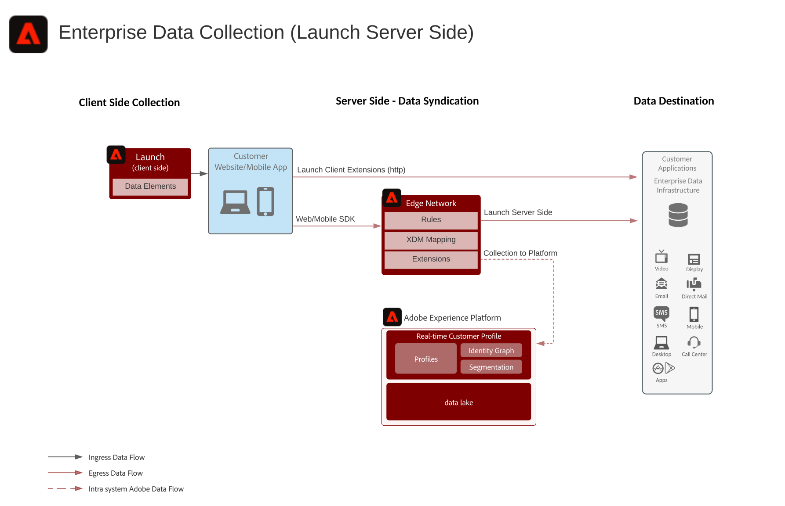

# 서버측 엔터프라이즈 데이터 수집 블루프린트

서버측 엔터프라이즈 데이터 수집 블루프린트는 Adobe Experience Platform 웹 및 모바일 SDK로 수집한 데이터를 Experience Platform 에지 네트워크에서 원하는 대상으로 전송하는 방법을 보여줍니다. Experience Platform Launch에 구성된 이벤트 및 규칙에 따라 SDK에서 수집된 모든 원시 데이터 또는 특정 데이터를 전송할 수 있습니다.

## 사용 사례

* 단일 컬렉션 태그를 사용하여 웹 또는 모바일에서 데이터를 수집하고 클라이언트 브라우저 및 앱에서 코드 가중치를 줄입니다. 데이터 수집의 단일 원본에 대해 수집한 데이터를 다양한 끝점에 전파합니다.
* 수집된 데이터에 대해 인사이트와 애플리케이션을 구축하기 위해 수집된 데이터를 파트너 애플리케이션 또는 데이터 스토리지 위치로 전송할 수 있습니다.

## 애플리케이션

* Adobe Experience Platform Collection

## 아키텍처

## 관련 설명서

[Experience Platform Launch 서버 측 설명서](https://experienceleague.adobe.com/docs/launch/using/server-side-info/server-side-overview.html?lang=en#server-side-info)

## 관련 블로그 게시물

* [Adobe Experience Platform 웹 SDK 및 Edge 네트워크를 통한 웹 사이트 성능 향상](https://medium.com/adobetech/boosting-website-performance-with-adobe-experience-platform-web-sdk-and-edge-network-329fcf70fdf9)
* [Adobe Experience Platform 웹 SDK 및 Edge 네트워크를 통한 구현 문제 해결](https://medium.com/adobetech/solving-implementation-pain-points-with-adobe-experience-platform-web-sdk-and-edge-network-880b635e6819)
* [고객 관리를 위한 Adobe Experience Platform 웹 SDK](https://medium.com/adobetech/adobe-experience-platform-web-sdk-for-audience-management-751fa6d063bc)
* [Adobe Experience Platform 웹 SDK — Adobe Target](https://medium.com/adobetech/adobe-experience-platform-web-sdk-adobe-target-9b9f621d271)
* [Adobe Analytics용 Adobe Experience Platform Web SDK 마이그레이션 시나리오](https://medium.com/adobetech/adobe-experience-platform-web-sdk-migration-scenarios-for-adobe-analytics-91c255ec82b0)
* [Adobe Experience Platform 웹 SDK와 Adobe Experience Platform 서비스 통합](https://medium.com/adobetech/unify-your-adobe-experience-platform-services-with-adobe-experience-platform-web-sdk-75cf6851a9fc)
* [Adobe Experience Platform Mobile SDK 및 Launch를 사용하여 모바일 애플리케이션 개발 시간 단축](https://medium.com/adobetech/accelerate-your-mobile-application-development-with-adobe-experience-platform-mobile-sdk-and-launch-ed023536d611)
* [Adobe Experience Platform Web SDK를 사용하여 고객 워크플로우 간소화](https://medium.com/adobetech/simplifying-customer-workflows-with-adobe-experience-platform-web-sdk-4e54fe134f4a)
