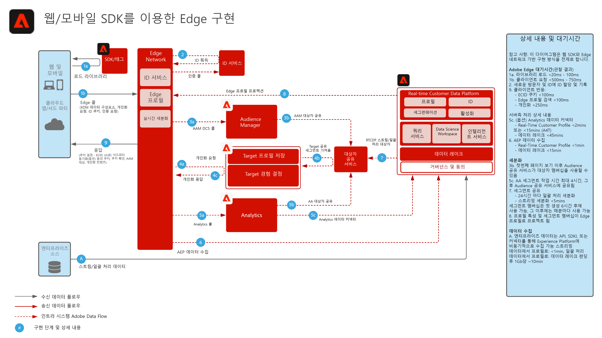

# Experience Platform 웹/모바일 SDK 데이터 수집

아래 아키텍처 다이어그램은 Experience Platform Web SDK를 활용하는 통합 경로 및 데이터 수집을 보여줍니다.

## 참조 설명서

[Experience Platform 웹/모바일 SDK 개요](https://experienceleague.adobe.com/docs/experience-platform/edge/home.html?lang=ko)
